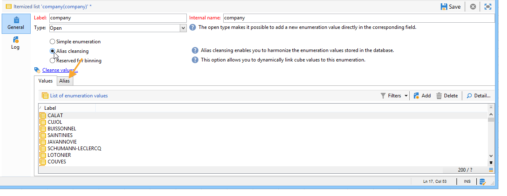

# Opsommingen beheren{#managing-enumerations}

## Informatie over opsommingen {#about-enumerations}

Een opsomming (ook wel &#39;gespecificeerde lijst&#39; genoemd) is een lijst met waarden die door het systeem worden voorgesteld om bepaalde velden te vullen. Met opsommingen kunt u de waarden van deze velden standaardiseren en informatie invoeren of gebruiken binnen query&#39;s.

De lijst met waarden wordt weergegeven als een vervolgkeuzelijst waaruit u de waarde kunt selecteren die in het veld moet worden ingevoerd. De vervolgkeuzelijst maakt ook voorspellende invoer mogelijk, waarbij de operator de eerste paar letters invoert en de toepassing de rest invult.

Sommige consolevelden zijn gedefinieerd met dit type opsommingen. Opsommingen worden &quot;open&quot; genoemd als u waarden kunt toevoegen door de gegevens rechtstreeks in het desbetreffende veld in te voeren.

## Toegang tot waarden {#access-to-values}

De waarden voor dit type veld worden gedefinieerd en het algemene beheer van deze velden (het toevoegen/verwijderen van een waarde) wordt uitgevoerd via het knooppunt **[!UICONTROL Administration > Platform > Enumerations]** van de structuur.

* De bovenste sectie bevat een lijst met velden waarvoor een gespecificeerde lijst is gedefinieerd.
* In de onderste sectie worden de voorgestelde waarden weergegeven. Deze waarden worden herhaald in de editors die dit veld gebruiken.

   

   Als u een nieuwe opsommingswaarde wilt maken, klikt u op **[!UICONTROL Add]**.

   

   Als de optie **[!UICONTROL Open]** is geselecteerd, kan de gebruiker een nieuwe gespecificeerde lijstwaarde direct op het overeenkomstige gebied toevoegen. Met een bevestigingsbericht kunt u deze waarde maken.

   

* Als de optie **[!UICONTROL Closed]** is geselecteerd, kunnen gebruikers geen nieuwe waarden maken, maar alleen een keuze maken uit de beschikbare waarden.

## Gegevens {#standardizing-data} standaardiseren

### Informatie over het opschonen van alias {#about-alias-cleansing}

In de gespecificeerde lijstgebieden, kunt u waarden buiten opsommingswaarden ingaan. Deze kunnen worden opgeslagen zoals ze zijn of worden gereinigd.

>[!CAUTION]
>
>Het zuiveren van gegevens is een kritiek proces dat de gegevens in het gegevensbestand beïnvloedt. Adobe Campaign voert massagegevensupdates uit, wat ertoe kan leiden dat sommige waarden worden verwijderd. Deze bewerking is daarom voorbehouden aan professionele gebruikers.

De ingevoerde waarde is dan:

* Toegevoegd aan de gespecificeerde lijstwaarden: in dat geval moet de optie **[!UICONTROL Open]** zijn geselecteerd,
* of automatisch vervangen door de overeenkomstige alias: In dit geval moet dit geval worden gedefinieerd op het tabblad **[!UICONTROL Alias]** van de gespecificeerde lijst,
* of is opgeslagen in de lijst met aliassen: er wordt later een alias aan toegewezen.

   >[!NOTE]
   >
   >Als u mogelijkheden voor gegevenszuivering moet gebruiken, selecteert u de optie **[!UICONTROL Alias cleansing]** in de gespecificeerde lijst.

### Aliassen {#using-aliases} gebruiken

Met de optie **[!UICONTROL Alias cleansing]** kunt u aliassen gebruiken voor de geselecteerde gespecificeerde lijst. Als deze optie is geselecteerd, wordt de tab **[!UICONTROL Alias]** onder in het venster weergegeven.

#### Een alias {#creating-an-alias} maken

Klik op **[!UICONTROL Add]** om een alias te maken.

Voer de alias die u wilt omzetten en de waarde die u wilt toepassen in en klik op **[!UICONTROL Ok]**.

Controleer parameters voordat u deze bewerking bevestigt.

>[!CAUTION]
>
>Zodra dit stadium is bevestigd, kunnen de eerder ingevoerde waarden niet worden teruggevorderd: zij zijn vervangen.

Wanneer een gebruiker de waarde **NEILSEN** invoert in een veld &quot;company&quot; (in de Adobe Campaign-console of in een formulier), wordt deze automatisch vervangen door de waarde **NIELSEN Ltd**. De vervanging van de waarde wordt uitgevoerd door **Alias het zuiveren** werkschema. Zie [Gegevens opschonen](#running-data-cleansing) uitvoeren.

#### Waarden omzetten in aliassen {#converting-values-into-aliases}

Als u een opsommingswaarde wilt omzetten in een alias, klikt u met de rechtermuisknop in de lijst met waarden en kiest u **[!UICONTROL Convert values into aliases...]**.

Kies de waarden die u wilt omzetten en klik op **[!UICONTROL Next]**.

Klik op **[!UICONTROL Start]** om de conversie uit te voeren.

Zodra de uitvoering is voltooid, wordt de alias toegevoegd aan de lijst met aliassen.

#### Aliashits {#retrieving-alias-hits} ophalen

De waarden die door de gebruikers worden ingevoerd, kunnen in aliassen worden omgezet. Als de gebruiker een waarde invoert die niet is opgenomen in de gespecificeerde lijst, wordt de waarde opgeslagen op het tabblad **[!UICONTROL Alias]**.

De **technische workflow voor Alias-zuivering** herstelt deze waarden elke avond om de gespecificeerde lijst bij te werken. Zie [Gegevensverwijdering uitvoeren](#running-data-cleansing)

Indien nodig kan in de kolom **[!UICONTROL Hits]** het aantal keren worden weergegeven dat deze waarde is ingevoerd. Het berekenen van deze waarde kan tijd en geheugen vergen. Raadpleeg [Invoerinstanties berekenen](#calculating-entry-occurrences) voor meer informatie hierover.

### Gegevens opschonen {#running-data-cleansing} uitvoeren

De gegevens worden schoongemaakt door het **[!UICONTROL Alias cleansing]** technische werkschema. De configuraties die voor opsommingen worden gedefinieerd, worden tijdens de uitvoering toegepast. Raadpleeg [Workflow voor Aliasreiniging](#alias-cleansing-workflow).

Reiniging kan worden geactiveerd via de koppeling **[!UICONTROL Cleanse values...]**.

Met de koppeling **[!UICONTROL Advanced parameters...]** kunt u de datum instellen vanaf welke verzamelde waarden in aanmerking worden genomen.

Klik op de knop **[!UICONTROL Start]** om gegevens te wissen.

#### Voorvallen van item berekenen {#calculating-entry-occurrences}

Het **[!UICONTROL Alias]** subtabblad van een gespecificeerde lijst kan het aantal exemplaren van een alias onder alle ingevoerde waarden tonen. Deze informatie is een schatting en wordt weergegeven in de kolom **[!UICONTROL Hits]**.

>[!CAUTION]
>
>Het berekenen van voorvallen van aliasinggegevens kan lang duren. Daarom is voorzichtigheid geboden wanneer het gebruiken van deze functie.

U kunt aanraakberekening handmatig uitvoeren via de koppeling **[!UICONTROL Cleanse values...]**. Klik hiertoe op de koppeling **[!UICONTROL Advanced parameters...]** en selecteer de gewenste optie(s).

* **[!UICONTROL Update the number of alias hits]**: hiermee kunt u resultaten bijwerken die al zijn berekend op basis van de ingevoerde datum.
* **[!UICONTROL Recalculate the number of alias hits from the start]**: Hiermee kunt u berekeningen uitvoeren op het hele Adobe Campaign-platform.

U kunt ook een specifieke workflow maken, zodat de berekening automatisch gedurende een bepaalde periode wordt uitgevoerd, bijvoorbeeld eenmaal per week.

Hiertoe maakt u een kopie van de **[!UICONTROL Alias cleansing]**-workflow, wijzigt u de planner en gebruikt u de volgende instellingen in de **[!UICONTROL Enumeration value cleansing]**-activiteit:

* **-** updateHitsto het aantal aliashits bij te werken,
* **-updateHits:alle** aliashits opnieuw berekenen.

#### Workflow voor Aliasverwijdering {#alias-cleansing-workflow}

Met de **Alias-reinigingsmethode**-workflow worden opsommingswaarden gewist. Standaard wordt de transactie dagelijks uitgevoerd.

Het wordt betreden via de **[!UICONTROL Administration > Production > Technical workflows]** knoop.

