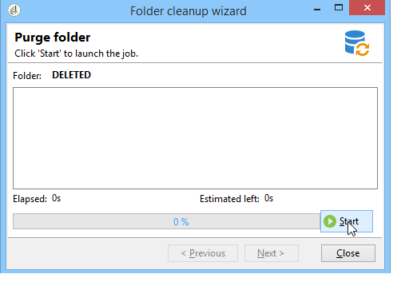

# Profielen beheren{#managing-profiles}

## Ontvangerstructuur {#recipient-tree}

Voor toegang tot de geavanceerde functies voor beheer van ontvangers moet u de Adobe Campaign-structuur bewerken. Klik hiertoe op de **[!UICONTROL Explorer]** knop op de werkbalk.

Ontvangers worden standaard opgeslagen in het **[!UICONTROL Profiles and targets]** knooppunt van de Adobe Campagnestructuur. Vanuit hetzelfde knooppunt kunt u een of meer mappen en submappen maken waarin de profielen van ontvangers worden opgeslagen.

Elk knooppunt valt samen met een map. De gegevens van elke omslag moeten worden beschouwd om van elkaar worden verdeeld. Dit betekent dat het beheer van dubbele bestanden voor meerdere ontvangende mappen lastiger zal zijn.

>[!NOTE]
>
>Als u de lijst met alle ontvangers in de database wilt weergeven, moet u een weergave maken. Zie [Mappen en weergaven](../../platform/using/access-management.md#folders-and-views).

## Ontvangers verplaatsen {#moving-recipients}

U kunt een of meer ontvangers selecteren, deze uit de lijst met ontvangers slepen en neerzetten in de gewenste map. U wordt in een waarschuwingsbericht gevraagd deze actie te bevestigen.

## Een ontvanger kopiëren {#copying-a-recipient}

U kunt een ontvanger in de zelfde omslag kopiëren door de gewenste ontvanger met de rechtermuisknop aan te klikken en te selecteren **[!UICONTROL Copy]**.

## Ontvangers verwijderen {#deleting-recipients}

Als u ontvangers wilt verwijderen, verplaatst u ze naar een specifieke map en wist u de inhoud van deze map. Het wordt **ten zeerste aanbevolen in dit geval geen gebruik** te maken van de **[!UICONTROL Delete]** optie.

Als u een map wilt leegmaken, gebruikt u het **[!UICONTROL Actions > Purge folder]** menu. Dit menu wordt geopend door met de rechtermuisknop op de gewenste map te klikken.

Klik **[!UICONTROL Start]** om de bewerking te starten. In het middelste gedeelte van het venster wordt de voortgangsstatus weergegeven, zoals hieronder wordt getoond:

