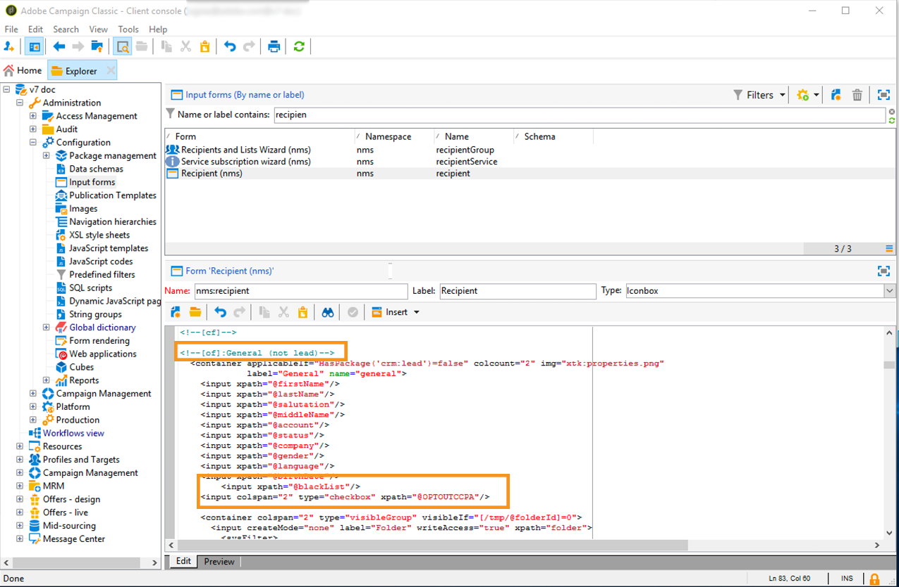
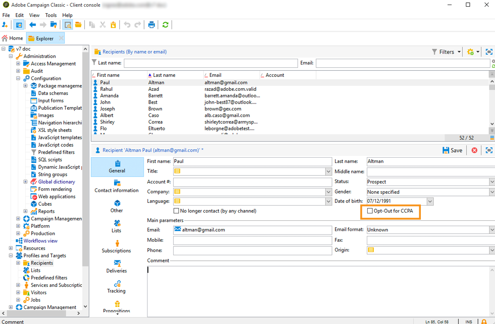

# Privacyverzoeken beheren {#privacy-requests}

Raadpleeg [deze sectie](../../platform/using/privacy-management.md)voor een algemene presentatie over privacybeheer.

Deze informatie is van toepassing op GDPR, CCPA, PDPA en LGPD. For more on these regulations, see [this section](../../platform/using/privacy-management.md#privacy-management-regulations).

De opt-out voor de verkoop van persoonsgegevens, die specifiek is voor de CCPA, wordt in [dit deel](#sale-of-personal-information-ccpa)toegelicht.

>[!IMPORTANT]
>
>De in dit document beschreven installatieprocedures zijn van toepassing vanaf Campaign Classic 18.4 (build 8931+). Als u op een vorige versie werkt, raadpleegt u dit [technische artikel](https://helpx.adobe.com/nl/campaign/kb/how-to-install-gdpr-package-on-legacy-versions.html).

## Over privacyverzoeken {#about-privacy-requests}

Om u te helpen uw privacy-gereedheid te vergemakkelijken, kunt u met Adobe Campaign aanvragen voor toegang en verwijdering afhandelen. Het **recht op toegang** en het **recht om te worden vergeten** (schrappingsverzoek) worden beschreven in [deze sectie](../../platform/using/privacy-management.md#right-access-forgotten).

Laten we zien hoe u Access- en Delete-aanvragen kunt maken en hoe Adobe Campaign deze verwerkt.

### Beginselen {#principles}

Adobe Campaign biedt gegevenscontrollers twee mogelijkheden voor het uitvoeren van aanvragen voor privacytoegang en verwijderingsverzoeken:

* Via de **Adobe Campaign-interface**: voor elke privacyaanvraag maakt de Data Controller een nieuwe privacyaanvraag in Adobe Campaign. Zie [deze sectie](#create-privacy-request-ui).
* Via de **API**: Adobe Campaign biedt een API waarmee het automatische proces van privacyverzoeken met SOAP kan worden uitgevoerd. Zie [deze sectie](#automatic-privacy-request-api).

>[!NOTE]
>
>Voor meer informatie over persoonsgegevens en over de verschillende entiteiten die gegevens beheren (Data Controller, Data Processor en Data Subject), zie [Persoonsgegevens en Persoonlijke personen](../../platform/using/privacy-and-recommendations.md#personal-data).

### Vereisten {#prerequesites}

Adobe Campaign beschikt over gegevensbesturingselementen waarmee u privacyverzoeken voor in Adobe Campaign opgeslagen gegevens kunt maken en verwerken. Het is echter de verantwoordelijkheid van de gegevenscontroller om de relatie met het gegevensonderwerp (e-mail, klantenservice of een webportal) af te handelen.

Daarom is het uw verantwoordelijkheid als Data Controller om de identiteit te bevestigen van de betrokkene die het verzoek indient en om te bevestigen dat de gegevens die aan de aanvrager worden teruggegeven over het onderwerp van Gegevens gaan.

### Het privacypakket installeren {#install-privacy-package}

Als u deze functie wilt gebruiken, moet u het **[!UICONTROL Privacy Data Protection Regulation]** pakket installeren via **[!UICONTROL Tools]** > **[!UICONTROL Advanced]** > **[!UICONTROL Import package]** > **[!UICONTROL Adobe Campaign Package]** . Raadpleeg de [gedetailleerde documentatie](../../installation/using/installing-campaign-standard-packages.md)voor meer informatie over het installeren van pakketten.

Onder **[!UICONTROL Administration]** > **[!UICONTROL Platform]** worden twee nieuwe mappen gemaakt die specifiek zijn voor Privacy:

* **[!UICONTROL Privacy Requests]**: Hier kunt u uw privacyverzoeken maken en de ontwikkeling ervan volgen.
* **[!UICONTROL Namespaces]**: Hier definieert u het veld dat wordt gebruikt voor de identificatie van het gegevensonderwerp in de Adobe Campaign-database.


In **[!UICONTROL Administration]** > **[!UICONTROL Production]** > **[!UICONTROL Technical workflows]**, werken drie technische werkschema&#39;s elke dag om de verzoeken van de Privacy te verwerken.


* **[!UICONTROL Collect privacy requests]**: deze workflow genereert de gegevens van de ontvanger die in Adobe Campaign zijn opgeslagen en maakt deze beschikbaar voor downloaden op het scherm van de privacyaanvraag.
* **[!UICONTROL Delete privacy requests data]**: met deze workflow verwijdert u de gegevens die de ontvanger in Adobe Campaign heeft opgeslagen.
* **[!UICONTROL Privacy request cleanup]**: deze workflow wist de bestanden met toegangsaanvragen die ouder zijn dan 90 dagen .

In **[!UICONTROL Administration]** > **[!UICONTROL Access Management]** > **[!UICONTROL Named rights]**, is het **[!UICONTROL Privacy Data Right]** genoemde recht toegevoegd. Dit genoemde recht wordt vereist voor de Controllers van Gegevens opdat zij privacyhulpmiddelen gebruiken. Hierdoor kunnen ze nieuwe aanvragen maken, hun evolutie volgen, de API gebruiken, enz.


### Naamruimten {#namesspaces}

Voordat u privacyverzoeken maakt, moet u de naamruimte definiëren die u wilt gebruiken. Dit is de sleutel die zal worden gebruikt om het Gegevensonderwerp in het gegevensbestand van Adobe Campaign te identificeren.

Drie naamruimten zijn beschikbaar buiten de box: e-mail, telefoon en mobiele telefoon. Als u een andere naamruimte nodig hebt (bijvoorbeeld een aangepast veld voor ontvangers), kunt u een nieuwe naamruimte maken via **[!UICONTROL Administration]** > **[!UICONTROL Platform]** > **[!UICONTROL Namespaces]**.

## Een privacyaanvraag maken {#create-privacy-request-ui}

Met de **Adobe Campaign-interface** kunt u uw privacyverzoeken maken en de ontwikkeling ervan volgen. Volg de onderstaande instructies om een nieuw privacyverzoek te maken:

1. Open de map Privacy request under **[!UICONTROL Administration]** > **[!UICONTROL Platform]** > **[!UICONTROL Privacy Requests]**.

   

1. In dit scherm kunt u alle huidige privacyverzoeken, hun status en logbestanden bekijken. Klik **[!UICONTROL New]** om een privacyaanvraag te maken.

   

1. Selecteer **[!UICONTROL Regulation]** (GDPR, CCPA, PDPA of LGPD), **[!UICONTROL Request type]** (Toegang of Schrapping), selecteer een **[!UICONTROL Namespace]** en ga in **[!UICONTROL Reconciliation value]**. Als u e-mail als naamruimte gebruikt, typt u de e-mail van de betrokkene.

   

De technische workflows van de Privacy lopen één keer per dag en verwerken elk nieuw verzoek:

* Verzoek verwijderen: de in Adobe Campaign opgeslagen gegevens van de ontvanger worden gewist.
* Toegangsverzoeken: de gegevens van de ontvanger die in Adobe Campaign worden opgeslagen, worden geproduceerd en beschikbaar gemaakt als dossier van XML in het linkergedeelte van het verzoekscherm.


### Lijst met tabellen {#list-of-tables}

Wanneer het uitvoeren van een verzoek van de Privacy van de Schrapping of van de Toegang, zoekt Adobe Campaign alle gegevens van het Onderwerp die op **[!UICONTROL Reconciliation value]** in alle lijsten worden gebaseerd die een verbinding aan de ontvankelijke lijst (eigen type) hebben.

Hier is de lijst van uit-van-de-doos lijsten die in overweging worden genomen wanneer het uitvoeren van de verzoeken van de Privacy:

* Ontvangers (ontvanger)
* Logbestand voor levering ontvanger (wideLogRcp)
* Logbestand voor het bijhouden van ontvangers (trackingLogRcp)
* Gearchiveerd logboek voor levering van gebeurtenis (wideLogEventHisto)
* Inhoud lijst met ontvangers (rcpGrpRel)
* Voorstelling van bezoekeraanbieding (propositionVisitor)
* Bezoekers (bezoeker)
* Abonnementsgeschiedenis (subHisto)
* Abonnementen (abonnement)
* Voorstelling van het aanbod van de ontvanger (propositionRcp)

Als u douanetabellen creeerde die een verbinding aan de ontvankelijke lijst (eigen type) hebben, zullen zij ook in aanmerking worden genomen. Bijvoorbeeld, als u een transactietabel verbonden aan de ontvankelijke lijst en een lijst van transactiedetails verbonden aan de transactietabel hebt, zullen zij allebei in aanmerking worden genomen.

>[!IMPORTANT]
>
>Als u aanvragen voor privacybatch uitvoert met workflows voor het verwijderen van profielen, moet u rekening houden met de volgende opmerkingen:
>* De schrapping van het profiel via werkschema&#39;s verwerkt geen kindlijsten.
>* U moet de schrapping voor alle kindlijsten behandelen.
>* Adobe adviseert dat u een ETL- werkschema creeert dat de lijnen toevoegt om in de lijst van de Toegang van de Privacy te schrappen en de schrapping laat **[!UICONTROL Delete privacy requests data]** uitvoeren. We stellen voor om profielen per dag te beperken tot 200 profielen om redenen van prestaties.


### Status van privacyverzoek {#privacy-request-statuses}

Hier volgen de verschillende statussen voor privacyverzoeken:

* **[!UICONTROL New]** / **[!UICONTROL Retry pending]**: de workflow heeft de aanvraag nog niet verwerkt.
* **[!UICONTROL Processing]** / **[!UICONTROL Retry in progress]**: de workflow verwerkt de aanvraag.
* **[!UICONTROL Delete pending]**: in de workflow zijn alle te verwijderen gegevens voor ontvangers geïdentificeerd.
* **[!UICONTROL Delete in progress]**: de workflow verwerkt de verwijdering.
* **[!UICONTROL Delete Confirmation Pending]** (Verzoek verwijderen in procesmodus met twee stappen): de workflow heeft het verzoek om toegang verwerkt. Voor het verwijderen wordt een handmatige bevestiging gevraagd. De knop is 15 dagen beschikbaar.
* **[!UICONTROL Complete]**: de verwerking van de aanvraag is zonder fout voltooid.
* **[!UICONTROL Error]**: er is een fout opgetreden in de workflow. De reden wordt weergegeven in de lijst met privacyverzoeken in de **[!UICONTROL Request status]** kolom. Bijvoorbeeld, **[!UICONTROL Error data not found]** betekent dat geen ontvankelijke gegevens die de Onderwerp van Gegevens aanpassen in het gegevensbestand **[!UICONTROL Reconciliation value]** zijn gevonden.

### 2-stappenproces {#two-step-process}

Standaard wordt het proces **in** twee stappen geactiveerd. Wanneer u een nieuwe aanvraag Verwijderen maakt met deze modus, voert Adobe Campaign altijd eerst een aanvraag voor toegang uit. Op deze manier kunt u de gegevens controleren voordat u de verwijdering bevestigt.

U kunt deze modus wijzigen vanuit het scherm voor de privacyaanvraag. Klik op **[!UICONTROL Advanced settings]**.


Als de modus in twee stappen is geactiveerd, verandert de status van een nieuwe aanvraag Verwijderen in **[!UICONTROL Confirm Delete Pending]**. Download het gegenereerde XML-bestand van het privacyaanvraagscherm en controleer de gegevens. Klik op de **[!UICONTROL Confirm delete data]** knop om het wissen van de gegevens te bevestigen.


### JSSP-URL {#jspp-url}

Bij het verwerken van de verzoeken van de Toegang, produceert Adobe Campaign JSSP die de gegevens van de ontvanger van het gegevensbestand terugwint en het in een dossier van XML uitvoert dat op de lokale machine wordt opgeslagen. De JSSP URL wordt als volgt gedefinieerd:

```
"$(serverUrl)+'/nms/gdpr.jssp?id='+@id"
```

waarin @id de privacyaanvraag-id is.

Deze URL wordt opgeslagen in het **[!UICONTROL "File location" (@urlFile)]** veld van het **[!UICONTROL Privacy Requests (gdprRequest)]** schema.

De informatie is 90 dagen beschikbaar in de database. Zodra het verzoek door het technische werkschema wordt schoongemaakt, wordt de informatie verwijderd uit het gegevensbestand en URL verouderd. Controleer of de URL nog geldig is voordat u de gegevens van een webpagina downloadt.

Hier volgt een voorbeeld van het gegevensbestand van een betrokkene:


Gegevenscontrollers kunnen eenvoudig een webtoepassing maken, inclusief de bijbehorende JSSP-URL, om het gegevensbestand van de betrokkene beschikbaar te maken via een webpagina.


Hier volgt een codefragment dat u als voorbeeld kunt gebruiken in de **[!UICONTROL Page]** activiteit van de webtoepassing.


```
<!DOCTYPE html PUBLIC "-//W3C//DTD XHTML 1.0 Transitional//EN" "http://www.w3.org/TR/xhtml1/DTD/xhtml1-transitional.dtd"> <html xmlns="http://www.w3.org/1999/xhtml"> <head> <meta http-equiv="Content-Language" content="en"> <meta http-equiv="Content-Type" content="text/html; charset=utf-8" /> <link rel="stylesheet" type="text/css" href="/nl/webForms/landingPage.css"/> <title>Clickthrough</title> <style type="text/css" media="all"> /* override formulary area */ .formulary { top: 200px; position: absolute; left: 0; } </style> </head> <body style="" class="">
<center>
<div id="wrap">
<div id="header">
<div class="header-title center-title">DOWNLOAD GDPR DATA</div>
<div class="formulary center-formulary"><form>
<div class="button large-button"><a href=[SERVER_URL]/nms/gdpr.jssp?id=13000" data-nl-type="externalLink">CLICK TO DOWNLOAD</a></div>
</form></div>
</div>
<div id="content">
<div class="row">
<div class="info">
<div class="desc">
<div class="title">EFFICIENCY</div>
<div class="desc">Our service is guaranteed to improve your efficiency. Increase performance and use our high-technology service to implement even the most ambitious of projects.</div>
</div>
</div>
</div>
</div>
<div id="footer">
<div style="text-align: center;">
<div style="float: left;"><a href="#">Contact us</a></div>
<div style="float: right;">&copy; Copyrights</div>
<div><a href="#"></a> <a href="#"></a> <a href="#"></a> <a href="#"></a></div>
</div>
</div>
</div>
</center>
</body> </html>
```

Aangezien de toegang tot het gegevensbestand van de betrokkene wordt beperkt, moet de Web-pagina anonieme toegang worden onbruikbaar gemaakt. Alleen een operator met de **[!UICONTROL Privacy Data Right]** naam right kan zich aanmelden bij de pagina en de gegevens downloaden.

## Aanvraagprocedure voor automatische privacy {#automatic-privacy-request-api}

Adobe Campaign biedt een **API** waarmee u een automatisch privacyaanvraagproces kunt instellen.

Met de API is het algemene privacyproces hetzelfde als [het gebruik van de interface](#create-privacy-request-ui). Het enige verschil is de creatie van het privacyverzoek. In plaats van de aanvraag in Adobe Campaign te maken, wordt een POST met de aanvraaggegevens naar Campagne verzonden. Voor elke aanvraag wordt een nieuwe vermelding toegevoegd aan het **[!UICONTROL Privacy Requests]** scherm. De technische workflows van de Privacy verwerken dan het verzoek, de zelfde manier zoals voor een verzoek dat gebruikend de interface wordt toegevoegd.

Als u API gebruikt om de verzoeken van de Privacy voor te leggen, adviseren wij dat u het proces **van** 2 stappen geactiveerd voor de eerste verzoeken van de Schrapping laat, om de teruggekeerde gegevens te testen. Wanneer uw tests worden gebeëindigd, kunt u het proces in twee stappen deactiveren zodat het de verzoekproces van de Schrapping automatisch kan lopen.

De **[!UICONTROL CreateRequestByName]** JS API wordt als volgt gedefinieerd.

>[!NOTE]
>
>Als u de **gdprRequest** -API gebruikte, kunt u deze nog wel gebruiken, maar wordt u aangeraden de nieuwe **privacyRequest** -API te gebruiken.

>[!IMPORTANT]
>
>Het **[!UICONTROL Privacy Data Right]** genoemde recht is vereist om API te gebruiken.

```
<method library="nms:gdpr.js" name="CreateRequestByName" static="true">
 <help>Create a new GDPR Request using namespace internal name</help>
 <parameters>
  <param name="namespaceName" type="string" desc="Namespace internal name"/>
  <param name="reconciliationValue" type="string" desc="Reconciliation value"/>
  <param name="type" type="long" desc="Reconciliation value"/>
  <param name="confirmDeletePending" type="boolean" desc="Request confirm before deleting data"/>
  <param name="regulation" type="long" desc="regulation of newly created request"/>
  <param name="id" type="long" inout="out" desc="ID of newly created request"/>
 </parameters>
</method>
```

>[!NOTE]
>
>Het veld &#39;Regelgeving&#39; is alleen beschikbaar als u Campaign Classic 20.2 gebruikt (build 9178+).
>
>Als u naar 20.2 migreert en de API al gebruikt, moet u het veld &quot;Regelgeving&quot; toevoegen, zoals hierboven is aangegeven. Als u een vorige build gebruikt, kunt u de API zonder het veld &quot;Regulation&quot; blijven gebruiken.

### De API extern aanroepen {#invoking-api-externally}

Hier ziet u een voorbeeld van hoe u de API extern kunt aanroepen (verificatie via de API en meer specifiek informatie over de API voor privacy). Raadpleeg de [API-documentatie](https://docs.adobe.com/content/help/en/campaign-classic/technicalresources/api/s-nms-privacyRequest.html)voor meer informatie over de API voor privacy. U kunt de de dienstvraagdocumentatie [van het](../../configuration/using/web-service-calls.md)Web ook raadplegen.

Ten eerste moet u de verificatie uitvoeren via de API:

1. Download de **xtk:session** WSDL via deze URL: **`<server url>`/nl/jsp/schemawsdl.jsp?schema=xtk:session**.

1. Gebruik de methode &quot;Logon&quot; en geef een gebruikersnaam en wachtwoord als parameters in het verzoek door. U krijgt een reactie met een sessietoken. Hier volgt een voorbeeld van het gebruik van SoapUI.

   

1. Gebruik het teruggekeerde Symbolische van de Zitting als authentificatie voor alle verdere API vraag. Het vervalt na 24 uur.

Roep vervolgens de API voor privacy aan:

1. Download WSDL via deze URL: **`<server url>`/nl/jsp/schemawsdl.jsp?schema=nms:privacyRequest**.

1. Gebruik deze optie **[!UICONTROL CreateRequestByName]** om een specifieke privacyaanvraag te maken.

   Hier is een voorbeeld dat het **[!UICONTROL CreateRequestByName]** gebruikt. Merk op hoe wij het zittingsteken hierboven als authentificatie wordt verstrekt gebruiken. De reactie is identiteitskaart van het gecreeerde verzoek.

   

   Overweeg het volgende om u te helpen bovenstaande stappen uit te voeren:

   * U kunt een **queryDef** op het schema **nms:gdprRequest** gebruiken om de status van het verzoek van de Toegang te controleren.
   * U kunt een **queryDef** op het schema **nms gebruiken:gdprRequestData** om het resultaat van het verzoek van de Toegang te krijgen.
   * Als u het XML-bestand wilt downloaden van **&quot;$(serverUrl)&#39;/nms/gdpr.jssp?id=&#39;@id&quot;**, moet u zijn aangemeld en deze openen vanuit een gewhitelist IP. Hiertoe maakt u een webtoepassing waarmee u toegang krijgt tot het bestand dat door het JSSP wordt gegenereerd.

### API aanroepen vanuit een JS {#invoking-api-from-js}

Hier is een voorbeeld van hoe u API van JS binnen Campaign Classic kunt aanhalen.

>[!NOTE]
>
>Het veld &#39;Regelgeving&#39; is alleen beschikbaar als u Campaign Classic 20.2 gebruikt (build 9178+).
>
>Als u naar 20.2 migreert en de API al gebruikt, moet u het veld &quot;Regelgeving&quot; toevoegen. Als u een vorige build gebruikt, kunt u de API zonder het veld &quot;Regulation&quot; blijven gebruiken.

* Als u een eerdere build **gebruikt (met GDPR-pakket)**, kunt u de API blijven gebruiken zonder het veld &quot;Regelgeving&quot;, zoals hieronder wordt getoond:

   ```
   loadLibrary("nms:gdpr.js");
   /**************************** 
   This code calls an API to create new Privay request on the DB.
   It requires 4 parameters below.
   Feel free to change parameter values.
   ****************************/
   // 1. Namespace internal name
   var namespaceName = "defaultNamespace1";
   // 2. Reconciliation value for privacy request
   var reconciliationValue = "example@adobe.com";
   // 3. Privacy request type
   // GDPR_REQUEST_TYPE_ACCESS = 1;
   // GDPR_REQUEST_TYPE_DELETE = 2;
   var requestType = GDPR_REQUEST_TYPE_ACCESS;
   // 4. Confirm deleting data required.
   // value : true or false
   var ConfirmDeletePending = true;
   // BEGIN
   var requestId = nms.privacyRequest.CreateRequestByName(namespaceName, reconciliationValue, requestType, ConfirmDeletePending);
   // User can use a simple queryDef with requestID as a parameter to check request status.
   ```

* Als u **migreert naar 20.2** en als u de API al gebruikt, moet u het veld &quot;Regelgeving&quot; toevoegen, zoals hieronder wordt getoond:

   ```
   loadLibrary("nms:gdpr.js");
   /**************************** 
   This code calls an API to create new Privay request on the DB.
   It requires 5 parameters below.
   Feel free to change parameter values.
   ****************************/
   // 1. Namespace internal name
   var namespaceName = "defaultNamespace1";
   // 2. Reconciliation value for privacy request
   var reconciliationValue = "example@adobe.com";
   // 3. Privacy request type
   // PRIVACY_REQUEST_TYPE_ACCESS = 1;
   // PRIVACY_REQUEST_TYPE_DELETE = 2;
   var requestType = PRIVACY_REQUEST_TYPE_ACCESS;
   // 4. Confirm deleting data required.
   // value : true or false
   var ConfirmDeletePending = true;
   // 5. Specify which regulation applies to newly created request. This is mandatory parameter.
   // GDPR = 1
   // CCPA = 2
   // PDPA = 3
   // LGPD = 4
   var regulation = 1;
   // BEGIN
   var requestId = nms.privacyRequest.CreateRequestByName(namespaceName, reconciliationValue, requestType, ConfirmDeletePending, regulation);
   // User can use a simple queryDef with requestID as a parameter to check request status.
   ```

* Als u Campaign Classic 20.2 (build 9178+) of hoger **** gebruikt, is het veld &#39;reguleren&#39; optioneel, zoals hieronder wordt getoond:

   ```
   loadLibrary("nms:gdpr.js");
   /**************************** 
   This code calls an API to create new Privay request on the DB.
   It requires 5 parameters below.
   Feel free to change parameter values 
   ****************************/
   // 1. Namespace internal name
   var namespaceName = "defaultNamespace1";
   // 2. Reconciliation value for privacy request
   var reconciliationValue = "example@adobe.com";
   // 3. Privacy request type
   // PRIVACY_REQUEST_TYPE_ACCESS = 1;
   // PRIVACY_REQUEST_TYPE_DELETE = 2;
   var requestType = PRIVACY_REQUEST_TYPE_ACCESS;
   // 4. Confirm deleting data required.
   // value : true or false
   var ConfirmDeletePending = true;
   // 5. Specify which regulation applies to newly created request. This is optional parameter.
   // GDPR = 1
   // CCPA = 2
   // PDPA = 3
   // LGPD = 4
   var regulation = 1;
   // BEGIN
   var requestId = nms.privacyRequest.CreateRequestByName(namespaceName, reconciliationValue, requestType, ConfirmDeletePending, regulation);
   // User can use a simple queryDef with requestID as a parameter to check request status.
   ```

## Opt-out voor de verkoop van persoonlijke gegevens (CCPA) {#sale-of-personal-information-ccpa}

The **California Consumer Privacy Act** (CCPA) provides California residents new rights in regards to their personal information and imposes data protection responsibilities on certain entities whom conduct business in California.

De configuratie en het gebruik van verzoeken van de Toegang en van de Schrapping zijn gemeenschappelijk voor zowel GDPR als CCPA. In dit deel wordt de opt-out voor de verkoop van persoonsgegevens beschreven, die specifiek is voor de CCPA.

Naast de instrumenten voor [contentbeheer](../../platform/using/privacy-management.md#consent-management) die Adobe Campaign biedt, kunt u nagaan of een consument heeft gekozen voor de verkoop van persoonlijke informatie.

Een consument besluit via uw systeem dat hij/zij niet toestaat dat zijn/haar persoonlijke gegevens aan derden worden verkocht. In Adobe Campaign kun je deze gegevens opslaan en volgen.

Dit werkt alleen als u de tabel Profielen uitbreidt en een **[!UICONTROL Opt-Out for CCPA]** veld toevoegt.

>[!IMPORTANT]
>
>Het is uw verantwoordelijkheid als de verantwoordelijke voor de gegevens om het verzoek van de betrokkene te ontvangen en de aanvraagdata voor de CCPA bij te houden. Als technologieleverancier bieden we alleen een manier om te weigeren. Voor meer op uw rol als Controlemechanisme van Gegevens, zie [Persoonlijke gegevens en Personas](../../platform/using/privacy-and-recommendations.md#personal-data).

### Vereiste {#ccpa-prerequisite}

Als u deze gegevens wilt gebruiken, moet u dit veld maken in Adobe Campaign Classic. Hiervoor voegt u een Booleaans veld aan de **[!UICONTROL Recipient]** tabel toe. Wanneer een nieuw veld wordt gemaakt, wordt dit automatisch ondersteund door de campagne-API.

Als u een aangepaste ontvankelijke lijst gebruikt, moet u deze verrichting ook uitvoeren.

Raadpleeg de documentatie bij de [Schema-editie voor meer informatie over het maken van een nieuw veld](../../configuration/using/about-schema-edition.md).

>[!IMPORTANT]
>
>Het wijzigen van schema&#39;s is een gevoelige verrichting die door deskundige slechts gebruikers moet worden uitgevoerd.

1. Ga naar **[!UICONTROL Tools]** > **[!UICONTROL Advanced]** > **[!UICONTROL Add new fields]**, selecteer **[!UICONTROL Recipients]** als **[!UICONTROL Document type]** en klik **[!UICONTROL Next]**. Zie [deze sectie](../../configuration/using/new-field-wizard.md)voor meer informatie over het toevoegen van velden aan een tabel.

   

1. Selecteer voor de **[!UICONTROL Field type]** optie **[!UICONTROL SQL field]**. Gebruik voor Label **[!UICONTROL Opt-Out for CCPA]**. Selecteer het **[!UICONTROL 8-bit integer (boolean)]** type en definieer het volgende unieke **[!UICONTROL Relative path]**: @OPTOUTCCPA. Klik op **[!UICONTROL Finish]**.

   

   Hiermee wordt het **[!UICONTROL Recipient (cus)]** schema uitgebreid of gemaakt. Klik erop om te controleren of het veld correct is toegevoegd.

   

1. Klik op het knooppunt **[!UICONTROL Configuration]** > **[!UICONTROL Input forms]** van de verkenner. Voeg onder **[!UICONTROL Recipient (nms)]**&quot;Algemeen pakket&quot; een `<input>` element toe en gebruik voor de waarde xpath het relatieve pad dat in stap 2 is gedefinieerd. Zie [deze sectie](../../configuration/using/identifying-a-form.md)voor meer informatie over het identificeren van een formulier.

   ```
   <input  colspan="2" type="checkbox" xpath="@OPTOUTCCPA"/>
   ```

   

1. Verbinding verbreken en opnieuw verbinden. Voer de stappen uit die in de volgende sectie worden beschreven om te controleren of het veld beschikbaar is op de details van een ontvanger.

### Gebruik {#usage}

Het is de verantwoordelijkheid van de gegevensverwerker om de waarde van het veld te vullen en de CCPA-richtsnoeren en -regels inzake gegevensverkoop te volgen.

U kunt verschillende methoden gebruiken om de waarden te vullen:

* De interface van de Campagne gebruiken door de details van de ontvanger uit te geven
* De API gebruiken
* Via een workflow voor het importeren van gegevens

Vervolgens moet u ervoor zorgen dat u nooit de persoonlijke gegevens van profielen die u hebt afgewezen aan derden verkoopt.

Als u de status van de optie Weigeren wilt wijzigen, gaat u naar **[!UICONTROL Profiles and Target]** > **[!UICONTROL Recipients]** en selecteert u een ontvanger. Op het **[!UICONTROL General]** lusje, zult u het gebied zien dat in de vorige sectie wordt gevormd.



Vorm de lijst van ontvangers om de op-uit kolom te tonen. Leren hoe te om lijsten te vormen, verwijs naar de [gedetailleerde documentatie](../../platform/using/adobe-campaign-workspace.md#configuring-lists).


U kunt op de kolom klikken om ontvangers te sorteren op basis van de gegevens voor niet-deelname. U kunt ook een filter maken om alleen ontvangers weer te geven die hebben uitgeschakeld. For more on creating filters, see [this section](../../platform/using/creating-filters.md).


