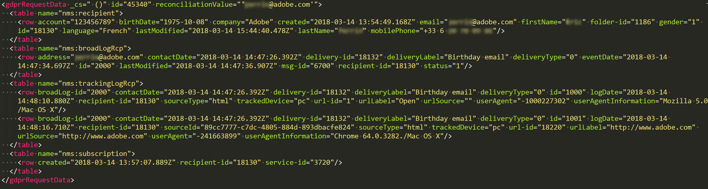
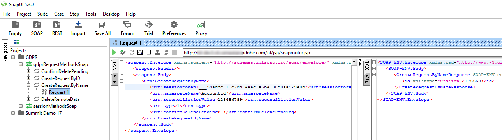

# Beheer van verzoeken om toegang tot persoonsgegevens {#privacy-requests}

Raadpleeg [deze sectie](../../platform/using/privacy-management.md) voor een algemene uitleg van privacybeheer.

Deze informatie geldt voor AVG, CCPA, PDPA en LGPD. Zie [deze sectie](../../platform/using/privacy-management.md#privacy-management-regulations) voor meer informatie over deze regelgeving.

De opt-out voor de verkoop van persoonsgegevens, die specifiek is voor de CCPA, wordt in [deze sectie](#sale-of-personal-information-ccpa) toegelicht.

<!--Installation procedures described in this document are applicable starting Campaign Classic 18.4 (build 8931+). If you are running on a previous version, refer to this [technote](https://helpx.adobe.com/campaign/kb/how-to-install-gdpr-package-on-legacy-versions.html).-->

## Verzoeken om toegang tot persoonsgegevens {#about-privacy-requests}

Doordat u in Adobe Campaign verzoeken voor toegang en verwijdering kunt afhandelen, kunt u zich gemakkelijker houden aan de privacyregels. Het **toegangsrecht** en het **recht om te worden vergeten** (verwijderingsverzoek) worden in [deze sectie](../../platform/using/privacy-management.md#right-access-forgotten) beschreven.

Laten we eens kijken hoe u toegangs- en verwijderingsverzoeken kunt maken en hoe Adobe Campaign deze verwerkt.

### De basis {#principles}

Adobe Campaign biedt gegevenscontrollers twee manieren om verzoeken voor toegang tot persoonsgegevens en verwijderingsverzoeken uit te voeren:

* Via de **Adobe Campaign-interface**: voor elk verzoek om toegang tot persoonsgegevens maakt de gegevenscontroller een nieuw dergelijk verzoek in Adobe Campaign. Zie [deze sectie](#create-privacy-request-ui).
* Via de **API**: Adobe Campaign beschikt over een SOAP-API die verzoeken om toegang tot persoonsgegevens automatiseert. Zie [deze sectie](#automatic-privacy-request-api).

>[!NOTE]
>
>Voor meer informatie over persoonsgegevens en over de verschillende entiteiten die gegevens beheren (gegevenscontroller, gegevensprocessor en betrokkene) raadpleegt u [Persoonsgegevens en persona&#39;s](../../platform/using/privacy-and-recommendations.md#personal-data).

### Vereisten {#prerequesites}

Adobe Campaign biedt tools voor gegevenscontrollers waarmee u verzoeken om toegang tot opgeslagen persoonsgegevens in Adobe Campaign kunt maken en verwerken. Het is echter de verantwoordelijkheid van de gegevenscontroller om de relatie met de betrokkene (e-mail, klantenservice of een webportal) af te handelen.

Daarom is het uw verantwoordelijkheid als gegevenscontroller om de identiteit te bevestigen van de betrokkene die het verzoek indient, en om te bevestigen dat de gegevens die naar de aanvrager worden teruggestuurd, over de betrokkene gaan.

### Het privacypakket installeren {#install-privacy-package}

Als u deze functie wilt gebruiken, moet u het **[!UICONTROL Privacy Data Protection Regulation]**-pakket installeren via het menu **[!UICONTROL Tools]** > **[!UICONTROL Advanced]** > **[!UICONTROL Import package]** > **[!UICONTROL Adobe Campaign Package]**. Raadpleeg de [gedetailleerde documentatie](../../installation/using/installing-campaign-standard-packages.md) voor meer informatie over het installeren van pakketten.

Onder **[!UICONTROL Administration]** > **[!UICONTROL Platform]** worden twee nieuwe mappen gemaakt die specifiek zijn voor privacy:

* **[!UICONTROL Privacy Requests]**: hier kunt u uw verzoeken om toegang tot persoonsgegevens maken en de ontwikkeling ervan volgen.
* **[!UICONTROL Namespaces]**: dit is het veld dat wordt gebruikt om de betrokkene in de Adobe Campaign-database te identificeren.


In **[!UICONTROL Administration]** > **[!UICONTROL Production]** > **[!UICONTROL Technical workflows]** worden elke dag drie technische workflows uitgevoerd om verzoeken om toegang tot persoonsgegevens te verwerken.


* **[!UICONTROL Collect privacy requests]**: deze workflow genereert de gegevens van de ontvanger die in Adobe Campaign zijn opgeslagen en maakt deze beschikbaar voor downloaden op het scherm van het verzoek om toegang tot persoonsgegevens.
* **[!UICONTROL Delete privacy requests data]**: met deze workflow verwijdert u de gegevens van de ontvanger die in Adobe Campaign zijn opgeslagen.
* **[!UICONTROL Privacy request cleanup]**: met deze workflow wist u de bestanden met toegangsverzoeken die ouder zijn dan 90 dagen.

In **[!UICONTROL Administration]** > **[!UICONTROL Access Management]** > **[!UICONTROL Named rights]** is het opgegeven recht **[!UICONTROL Privacy Data Right]** toegevoegd. Dit opgegeven recht is vereist voor gegevenscontrollers om privacytools te kunnen gebruiken. Hiermee kunnen ze nieuwe verzoeken maken, de ontwikkeling ervan volgen, de API gebruiken, enzovoort.


### Naamruimten {#namesspaces}

Voordat u verzoeken om toegang tot persoonsgegevens maakt, moet u de naamruimte definiëren die u wilt gebruiken. Dit is de sleutel die wordt gebruikt om de betrokkene in de Adobe Campaign-database te identificeren.

Drie naamruimten zijn standaard beschikbaar: e-mail, telefoon en mobiele telefoon. Als u een andere naamruimte nodig hebt (bijvoorbeeld een aangepast veld voor ontvangers), kunt u een nieuwe naamruimte maken via **[!UICONTROL Administration]** > **[!UICONTROL Platform]** > **[!UICONTROL Namespaces]**.

## Een verzoek om toegang tot persoonsgegevens maken {#create-privacy-request-ui}

In de **Adobe Campaign-interface** kunt u uw verzoeken om toegang tot persoonsgegevens maken en de ontwikkeling ervan volgen. Volg deze instructies om een nieuw verzoek om toegang tot persoonsgegevens te maken:

1. Open de map voor verzoeken om toegang tot persoonsgegevens onder **[!UICONTROL Administration]** > **[!UICONTROL Platform]** > **[!UICONTROL Privacy Requests]**.

   

1. In dit scherm kunt u alle huidige verzoeken om toegang tot persoonsgegevens, de status en logbestanden ervan bekijken. Klik op **[!UICONTROL New]** om een verzoek om toegang tot persoonsgegevens te maken.

   

1. Selecteer de **[!UICONTROL Regulation]** (AVG, CCPA, PDPA of LGPD), **[!UICONTROL Request type]** (Toegang of verwijderen), selecteer een **[!UICONTROL Namespace]** en voer de **[!UICONTROL Reconciliation value]** in. Als u e-mail als de naamruimte gebruikt, typt u het e-mailadres van de betrokkene.

   

De technische workflows voor privacy worden één keer per dag uitgevoerd en verwerken elk nieuw verzoek:

* Verwijderingsverzoek: de in Adobe Campaign opgeslagen gegevens van de ontvanger worden gewist.
* Toegangsverzoeken: de gegevens van de ontvanger die in Adobe Campaign zijn opgeslagen, worden gegenereerd en beschikbaar gemaakt als XML-bestand in het linkergedeelte van het verzoekscherm.


### Lijst met tabellen {#list-of-tables}

Bij het uitvoeren van een verzoek om verwijdering of toegang tot persoonsgegevens zoekt Adobe Campaign alle gegevens van de betrokkene op basis van de waarde voor **[!UICONTROL Reconciliation value]** in alle tabellen die een koppeling bevatten naar de ontvangsttabel (eigen type).

Hier volgt de lijst van ingebouwde tabellen waarmee rekening wordt gehouden bij het uitvoeren van verzoeken om toegang tot persoonsgegevens:

* Ontvangers (recipient)
* Verzendingslog ontvangers (broadLogRcp)
* Trackinglog ontvangers (trackingLogRcp)
* Verzendingslog gearchiveerde gebeurtenis (broadLogEventHisto)
* Content van lijst met ontvangers (rcpGrpRel)
* Aanbiedingsvoorstel voor bezoeker (propositionVisitor)
* Bezoekers (visitor)
* Lidmaatschapsgeschiedenis (subHisto)
* Lidmaatschappen (subscription)
* Aanbiedingsvoorstel voor ontvanger (propositionRcp)

Als u aangepaste tabellen hebt gemaakt met een koppeling naar de ontvangsttabel (eigen type), wordt hiermee ook rekening gehouden. Als u bijvoorbeeld een transactietabel hebt met een koppeling naar de ontvangsttabel en een transactiedetailtabel met een koppeling naar de transactietabel, wordt met beide rekening gehouden.

>[!IMPORTANT]
>
>Als u privacybatchverzoeken uitvoert met workflows voor het verwijderen van profielen, moet u rekening houden met het volgende:
>* Bij het verwijderen van profielen via workflows worden geen onderliggende tabellen verwerkt.
>* U moet de onderliggende tabellen zelf verwijderen.
>* Adobe raadt u aan een ETL-workflow te maken waarmee de regels die u wilt verwijderen, worden toegevoegd aan de tabel Privacy Access en de **[!UICONTROL Delete privacy requests data]**-workflow de verwijdering te laten uitvoeren. We raden u aan om maximaal 200 profielen per dag te verwijderen voor optimale prestaties.


### Status van verzoeken om toegang tot persoonsgegevens {#privacy-request-statuses}

Dit zijn de verschillende statussen voor verzoeken om toegang tot persoonsgegevens:

* **[!UICONTROL New]**/**[!UICONTROL Retry pending]**: in uitvoering, de workflow heeft het verzoek nog niet verwerkt.
* **[!UICONTROL Processing]**/**[!UICONTROL Retry in progress]**: de workflow verwerkt het verzoek.
* **[!UICONTROL Delete pending]**: in de workflow zijn alle te verwijderen gegevens van ontvangers geïdentificeerd.
* **[!UICONTROL Delete in progress]**: de workflow verwerkt de verwijdering.
* **[!UICONTROL Delete Confirmation Pending]** (Verwijderingsverzoek in de tweestapsmodus): de workflow heeft het toegangsverzoek verwerkt. De verwijdering moet handmatig worden bevestigd. De knop is 15 dagen beschikbaar.
* **[!UICONTROL Complete]**: de verwerking van het verzoek is zonder fout voltooid.
* **[!UICONTROL Error]**: er is een fout opgetreden in de workflow. De reden wordt weergegeven in de kolom **[!UICONTROL Request status]** in de lijst met verzoeken om toegang tot persoonsgegevens. **[!UICONTROL Error data not found]** betekent bijvoorbeeld dat er in de database geen ontvangersgegevens zijn gevonden die overeenkomen met de **[!UICONTROL Reconciliation value]** van de betrokkene.

### Tweestapsproces {#two-step-process}

Het **tweestapsproces** is standaard geactiveerd. Wanneer u met deze modus een nieuw verwijderingsverzoek maakt, voert Adobe Campaign altijd eerst een toegangsverzoek uit. Op deze manier kunt u de gegevens controleren voordat u de verwijdering bevestigt.

U kunt deze modus wijzigen vanuit het bewerkingsscherm voor verzoeken om toegang tot persoonsgegevens. Klik op **[!UICONTROL Advanced settings]**.


Als de tweestapsmodus is geactiveerd, verandert de status van een nieuw verwijderingsverzoek in **[!UICONTROL Confirm Delete Pending]**. Download het gegenereerde XML-bestand in het scherm voor verzoeken om toegang tot persoonsgegevens en controleer de gegevens. Klik op de knop **[!UICONTROL Confirm delete data]** om het wissen van de gegevens te bevestigen.


### JSSP-URL {#jspp-url}

Bij het verwerken van toegangsverzoeken produceert Adobe Campaign een JSSP die de gegevens van de ontvanger uit de database ophaalt. Deze gegevens worden geëxporteerd naar een XML-bestand dat op de lokale machine wordt opgeslagen. De JSSP-URL wordt als volgt gedefinieerd:

```
"$(serverUrl)+'/nms/gdpr.jssp?id='+@id"
```

waarbij @id de id voor het verzoek om toegang tot persoonsgegevens is.

Deze URL wordt opgeslagen in het veld **[!UICONTROL "File location" (@urlFile)]** van het schema **[!UICONTROL Privacy Requests (gdprRequest)]**.

De informatie is 90 dagen beschikbaar in de database. Zodra het verzoek door de technische workflow correct is verwerkt, wordt de informatie verwijderd uit de database en wordt de URL onbruikbaar. Controleer of de URL nog geldig is voordat u de gegevens van een webpagina downloadt.

Hier volgt een voorbeeld van het gegevensbestand van een betrokkene:



Gegevenscontrollers kunnen eenvoudig een webapplicatie maken, inclusief de bijbehorende JSSP-URL, om het gegevensbestand van de betrokkene beschikbaar te maken via een webpagina.


Hier volgt een codefragment dat u als voorbeeld kunt gebruiken voor de **[!UICONTROL Page]**-activiteit in de webapplicatie.


```
<!DOCTYPE html PUBLIC "-//W3C//DTD XHTML 1.0 Transitional//EN" "http://www.w3.org/TR/xhtml1/DTD/xhtml1-transitional.dtd"> <html xmlns="http://www.w3.org/1999/xhtml"> <head> <meta http-equiv="Content-Language" content="en"> <meta http-equiv="Content-Type" content="text/html; charset=utf-8" /> <link rel="stylesheet" type="text/css" href="/nl/webForms/landingPage.css"/> <title>Clickthrough</title> <style type="text/css" media="all"> /* override formulary area */ .formulary { top: 200px; position: absolute; left: 0; } </style> </head> <body style="" class="">
<center>
<div id="wrap">
<div id="header">
<div class="header-title center-title">DOWNLOAD GDPR DATA</div>
<div class="formulary center-formulary"><form>
<div class="button large-button"><a href=[SERVER_URL]/nms/gdpr.jssp?id=13000" data-nl-type="externalLink">CLICK TO DOWNLOAD</a></div>
</form></div>
</div>
<div id="content">
<div class="row">
<div class="info">
<div class="desc">
<div class="title">EFFICIENCY</div>
<div class="desc">Our service is guaranteed to improve your efficiency. Increase performance and use our high-technology service to implement even the most ambitious of projects.</div>
</div>
</div>
</div>
</div>
<div id="footer">
<div style="text-align: center;">
<div style="float: left;"><a href="#">Contact us</a></div>
<div style="float: right;">&copy; Copyrights</div>
<div><a href="#"></a> <a href="#"></a> <a href="#"></a> <a href="#"></a></div>
</div>
</div>
</div>
</center>
</body> </html>
```

Aangezien de toegang tot het gegevensbestand van de betrokkene beperkt is, moet anonieme toegang tot de webpagina worden uitgeschakeld. Alleen een operator met het opgegeven recht **[!UICONTROL Privacy Data Right]** kan zich aanmelden bij de pagina en de gegevens downloaden.

## Automatisch proces voor verzoeken om toegang tot persoonsgegevens {#automatic-privacy-request-api}

Adobe Campaign biedt een **API** waarmee u een automatisch proces voor verzoeken om toegang tot persoonsgegevens kunt instellen.

Het algemene privacyproces met de API is hetzelfde als [met de interface](#create-privacy-request-ui). Het enige verschil is de manier waarop het verzoek om toegang tot persoonsgegevens wordt gemaakt. In plaats van het verzoek in Adobe Campaign te maken, wordt een POST met de gegevens van het verzoek naar Campaign verzonden. Voor elk verzoek wordt een nieuwe vermelding toegevoegd in het scherm **[!UICONTROL Privacy Requests]**. De technische workflows voor privacy verwerken dan het verzoek. Dit gebeurt op dezelfde manier als voor een verzoek dat via de interface wordt toegevoegd.

Als u de API gebruikt om de privacyverzoeken in te dienen, raden wij u aan het **tweestapsproces** te activeren voor de eerste verwijderingsverzoeken. Zo kunnen de geretourneerde gegevens worden getest. Na afloop van de tests kunt u het tweestapsproces deactiveren zodat het proces voor verwijderingsverzoeken automatisch kan worden uitgevoerd.

De **[!UICONTROL CreateRequestByName]** JS-API wordt als volgt gedefinieerd.

>[!NOTE]
>
>Als u de **gdprRequest**-API gebruikte, kunt u deze nog steeds gebruiken, maar we raden u aan de nieuwe **privacyRequest**-API te gebruiken.

>[!IMPORTANT]
>
>Het opgegeven recht **[!UICONTROL Privacy Data Right]** is vereist om de API te gebruiken.

```
<method library="nms:gdpr.js" name="CreateRequestByName" static="true">
 <help>Create a new GDPR Request using namespace internal name</help>
 <parameters>
  <param name="namespaceName" type="string" desc="Namespace internal name"/>
  <param name="reconciliationValue" type="string" desc="Reconciliation value"/>
  <param name="type" type="long" desc="Reconciliation value"/>
  <param name="confirmDeletePending" type="boolean" desc="Request confirm before deleting data"/>
  <param name="regulation" type="long" desc="regulation of newly created request"/>
  <param name="id" type="long" inout="out" desc="ID of newly created request"/>
 </parameters>
</method>
```

>[!NOTE]
>
>Het veld &#39;regulation&#39; is alleen beschikbaar als u Campaign Classic 20.2 (build 9178+) gebruikt.
>
>Als u naar 20.2 migreert en de API voorheen al gebruikte, moet u het veld ‘regulation’ toevoegen, zoals hierboven is aangegeven. Als u een oudere build gebruikt, kunt u de API zonder het veld ‘regulation’ blijven gebruiken.

### De API extern aanroepen {#invoking-api-externally}

Hier ziet u een voorbeeld van hoe u de API extern kunt aanroepen, in het bijzonder de verificatie via de API en informatie over de Privacy-API. Raadpleeg de [API-documentatie](https://docs.adobe.com/content/help/en/campaign-classic/technicalresources/api/s-nms-privacyRequest.html) voor meer informatie over de Privacy-API. U kunt ook de [documentatie voor webserviceaanroepen](../../configuration/using/web-service-calls.md) raadplegen.

Allereerst moet u de verificatie uitvoeren via de API:

1. Download de **xtk:session**-WSDL via deze URL: **`<server url>`/nl/jsp/schemawsdl.jsp?schema=xtk:session**.

1. Gebruik de methode &#39;Logon&#39; en voer een gebruikersnaam en wachtwoord in als parameters voor het verzoek. U krijgt een antwoord met een sessietoken. Hier volgt een voorbeeld van het gebruik van SoapUI.

   

1. Gebruik de geretourneerde sessietoken als verificatie voor alle verdere API-aanroepen. Deze vervalt na 24 uur.

Roep vervolgens de Privacy-API aan:

1. Download de WSDL via deze URL: **`<server url>`/nl/jsp/schemawsdl.jsp?schema=nms:privacyRequest**.

1. Gebruik **[!UICONTROL CreateRequestByName]** om een specifiek verzoek voor toegang tot persoonsgegevens te maken.

   Hier volgt een voorbeeld met de **[!UICONTROL CreateRequestByName]**. Bekijk hoe we de hierboven gegenereerde sessietoken gebruiken als verificatie. Het antwoord is de id van het gemaakte verzoek.

   

   Houd rekening met het volgende als u bovenstaande stappen uitvoert:

   * U kunt een **queryDef** op het **nms:gdprRequest**-schema gebruiken om de status van het toegangsverzoek te controleren.
   * U kunt een **queryDef** op het **nms:gdprRequestData**-schema gebruiken om het resultaat van het toegangsverzoek te krijgen.
   * Als u het XML-bestand wilt downloaden van **&quot;$(serverUrl)&#39;/nms/gdpr.jssp?id=&#39;@id&quot;**, moet u aangemeld zijn en het bestand downloaden via een IP-adres dat op de lijst met gewenste personen staat. U kunt dit doen door een webapplicatie te maken waarmee u toegang krijgt tot het bestand dat door de JSSP wordt gegenereerd.

### De API aanroepen vanuit een JS {#invoking-api-from-js}

Hier is een voorbeeld van hoe u de API vanuit een JS binnen Campaign Classic kunt aanroepen.

>[!NOTE]
>
>Het veld &#39;regulation&#39; is alleen beschikbaar als u Campaign Classic 20.2 (build 9178+) gebruikt.
>
>Als u naar 20.2 migreert en de API voorheen al gebruikte, moet u het veld ‘regulation’ toevoegen. Als u een oudere build gebruikt, kunt u de API zonder het veld ‘regulation’ blijven gebruiken.

* Als u **een oudere build gebruikt (met AVG-pakket)**, kunt u de API blijven gebruiken zonder het veld ‘regulation’, zoals hieronder wordt getoond:

   ```
   loadLibrary("nms:gdpr.js");
   /**************************** 
   This code calls an API to create new Privay request on the DB.
   It requires 4 parameters below.
   Feel free to change parameter values.
   ****************************/
   // 1. Namespace internal name
   var namespaceName = "defaultNamespace1";
   // 2. Reconciliation value for privacy request
   var reconciliationValue = "example@adobe.com";
   // 3. Privacy request type
   // GDPR_REQUEST_TYPE_ACCESS = 1;
   // GDPR_REQUEST_TYPE_DELETE = 2;
   var requestType = GDPR_REQUEST_TYPE_ACCESS;
   // 4. Confirm deleting data required.
   // value : true or false
   var ConfirmDeletePending = true;
   // BEGIN
   var requestId = nms.privacyRequest.CreateRequestByName(namespaceName, reconciliationValue, requestType, ConfirmDeletePending);
   // User can use a simple queryDef with requestID as a parameter to check request status.
   ```

* Als u **migreert naar 20.2** en als u de API al gebruikte, moet u het veld ‘regulation’ toevoegen zoals hieronder wordt weergegeven:

   ```
   loadLibrary("nms:gdpr.js");
   /**************************** 
   This code calls an API to create new Privay request on the DB.
   It requires 5 parameters below.
   Feel free to change parameter values.
   ****************************/
   // 1. Namespace internal name
   var namespaceName = "defaultNamespace1";
   // 2. Reconciliation value for privacy request
   var reconciliationValue = "example@adobe.com";
   // 3. Privacy request type
   // PRIVACY_REQUEST_TYPE_ACCESS = 1;
   // PRIVACY_REQUEST_TYPE_DELETE = 2;
   var requestType = PRIVACY_REQUEST_TYPE_ACCESS;
   // 4. Confirm deleting data required.
   // value : true or false
   var ConfirmDeletePending = true;
   // 5. Specify which regulation applies to newly created request. This is mandatory parameter.
   // GDPR = 1
   // CCPA = 2
   // PDPA = 3
   // LGPD = 4
   var regulation = 1;
   // BEGIN
   var requestId = nms.privacyRequest.CreateRequestByName(namespaceName, reconciliationValue, requestType, ConfirmDeletePending, regulation);
   // User can use a simple queryDef with requestID as a parameter to check request status.
   ```

* Als u **Campaign Classic 20.2 (build 9178+) of hoger gebruikt**, is het veld &#39;regulation&#39; optioneel, zoals hieronder wordt getoond:

   ```
   loadLibrary("nms:gdpr.js");
   /**************************** 
   This code calls an API to create new Privay request on the DB.
   It requires 5 parameters below.
   Feel free to change parameter values 
   ****************************/
   // 1. Namespace internal name
   var namespaceName = "defaultNamespace1";
   // 2. Reconciliation value for privacy request
   var reconciliationValue = "example@adobe.com";
   // 3. Privacy request type
   // PRIVACY_REQUEST_TYPE_ACCESS = 1;
   // PRIVACY_REQUEST_TYPE_DELETE = 2;
   var requestType = PRIVACY_REQUEST_TYPE_ACCESS;
   // 4. Confirm deleting data required.
   // value : true or false
   var ConfirmDeletePending = true;
   // 5. Specify which regulation applies to newly created request. This is optional parameter.
   // GDPR = 1
   // CCPA = 2
   // PDPA = 3
   // LGPD = 4
   var regulation = 1;
   // BEGIN
   var requestId = nms.privacyRequest.CreateRequestByName(namespaceName, reconciliationValue, requestType, ConfirmDeletePending, regulation);
   // User can use a simple queryDef with requestID as a parameter to check request status.
   ```

## Opt-out voor de verkoop van persoonsgegevens (CCPA) {#sale-of-personal-information-ccpa}

De **California Consumer Privacy Act** (CCPA) biedt inwoners van Californië nieuwe rechten met betrekking tot hun persoonsgegevens en legt verantwoordelijkheden op het gebied van gegevensbescherming op aan bepaalde entiteiten die zaken doen in Californië.

De configuratie en het gebruik van verzoeken om toegang en verwijdering zijn hetzelfde voor de AVG en CCPA. In deze sectie wordt de opt-out voor de verkoop van persoonsgegevens beschreven, dit geldt specifiek voor de CCPA.

Naast de tools voor [toestemmingsbeheer](../../platform/using/privacy-management.md#consent-management) die Adobe Campaign biedt, kunt u ook nagaan of een consument ervoor heeft gekozen om zich af te melden voor de verkoop van persoonsgegevens.

Een consument besluit via uw systeem om niet toe te staan dat zijn/haar persoonsgegevens aan derden worden verkocht. In Adobe Campaign kunt u deze gegevens opslaan en volgen.

Dit werkt alleen als u de tabel met profielen uitbreidt en een veld **[!UICONTROL Opt-Out for CCPA]** toevoegt.

>[!IMPORTANT]
>
>Het is uw verantwoordelijkheid als gegevenscontroller om het verzoek van de betrokkene te ontvangen en de verzoekdatums voor de CCPA bij te houden. Als technologieleverancier bieden wij alleen een methode voor opt-out. Raadpleeg [Persoonsgegevens en persona&#39;s](../../platform/using/privacy-and-recommendations.md#personal-data) voor meer informatie over uw rol als gegevenscontroller.

### Vereiste {#ccpa-prerequisite}

Als u deze informatie wilt gebruiken, moet u dit veld in Adobe Campaign Classic maken. Hiervoor voegt u een booleaans veld toe aan de tabel **[!UICONTROL Recipient]**. Wanneer een nieuw veld wordt gemaakt, wordt dit automatisch ondersteund door de Campaign-API.

Als u een aangepaste ontvangerstabel gebruikt, moet u deze bewerking ook uitvoeren.

Zie de [documentatie bij de Schema-editie](../../configuration/using/about-schema-edition.md) voor meer gedetailleerde informatie over het maken van een nieuw veld.

>[!IMPORTANT]
>
>Het aanpassen van schema&#39;s is een gevoelige bewerking die uitsluitend door deskundige gebruikers mag worden uitgevoerd.

1. Ga naar **[!UICONTROL Tools]** > **[!UICONTROL Advanced]** > **[!UICONTROL Add new fields]**, selecteer **[!UICONTROL Recipients]** als het **[!UICONTROL Document type]** en klik op **[!UICONTROL Next]**. Zie [deze sectie](../../configuration/using/new-field-wizard.md) voor meer informatie over het toevoegen van velden aan een tabel.

   

1. Selecteer **[!UICONTROL SQL field]** voor het **[!UICONTROL Field type]**. Gebruik **[!UICONTROL Opt-Out for CCPA]** voor het label. Selecteer het type **[!UICONTROL 8-bit integer (boolean)]** en definieer het volgende unieke **[!UICONTROL Relative path]**: @OPTOUTCCPA. Klik op **[!UICONTROL Finish]**.

   

   Hiermee wordt het schema **[!UICONTROL Recipient (cus)]** uitgebreid of gemaakt. Klik erop om te controleren of het veld correct is toegevoegd.

   

1. Klik op de node **[!UICONTROL Configuration]** > **[!UICONTROL Input forms]** van de verkenner. Voeg bij **[!UICONTROL Recipient (nms)]** onder &#39;General Package&#39; een `<input>`-element toe en gebruik voor de xpath-waarde het relatieve pad dat in stap 2 is gedefinieerd. Zie [deze sectie](../../configuration/using/identifying-a-form.md) voor meer informatie over het identificeren van een formulier.

   ```
   <input  colspan="2" type="checkbox" xpath="@OPTOUTCCPA"/>
   ```

   

1. Verbreek de verbinding en maak opnieuw verbinding. Voer de stappen uit die in de volgende sectie worden beschreven om te controleren of het veld beschikbaar is in de gegevens van een ontvanger.

### Gebruik {#usage}

Het is de verantwoordelijkheid van de gegevenscontroller om de waarde in het veld in te vullen en de CCPA-richtlijnen en -regels voor gegevensverkoop te volgen.

U kunt verschillende methoden gebruiken om de waarden in te vullen:

* De interface van Campaign gebruiken door de gegevens van de ontvanger te bewerken
* De API gebruiken
* Via een workflow voor het importeren van gegevens

Vervolgens moet u ervoor zorgen dat u de persoonsgegevens van profielen die zich hebben afgemeld nooit aan derden verkoopt.

1. Als u de opt-outstatus wilt wijzigen, gaat u naar **[!UICONTROL Profiles and Target]** > **[!UICONTROL Recipients]** en selecteert u een ontvanger. Op het tabblad **[!UICONTROL General]** ziet u het veld dat in de vorige sectie is geconfigureerd.

   

1. Configureer de lijst met ontvangers om de opt-outkolom te tonen. Raadpleeg de [gedetailleerde documentatie](../../platform/using/adobe-campaign-workspace.md#configuring-lists) om te leren hoe u lijsten configureert.

   

1. U kunt op de kolom klikken om ontvangers te sorteren op basis van de opt-outgegevens. U kunt ook een filter maken om alleen ontvangers te tonen die zich hebben afgemeld. Zie [deze sectie](../../platform/using/creating-filters.md) voor meer informatie over het maken van filters.

   
