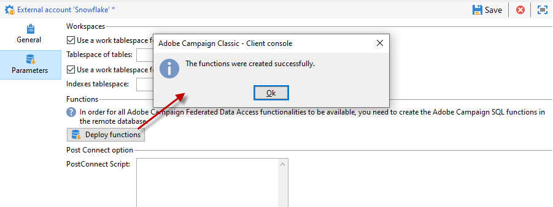

# Specifieke configuraties per databasetype {#specific-configurations-by-database-type}

Afhankelijk van de externe databases die u vanuit Adobe Campaign kunt openen, moet u bepaalde specifieke configuraties uitvoeren. Bij deze configuraties worden vooral stuurprogramma&#39;s geïnstalleerd en worden omgevingsvariabelen opgegeven die bij elke RDBMS op de Adobe Campagneserver horen.

Als algemene regel geldt dat u de corresponderende clientlaag in de externe database op de Adobe Campaign-server moet installeren.

>[!NOTE]
>
>Compatibele versies worden vermeld in de Matrix [van de Verenigbaarheid van de](https://helpx.adobe.com/campaign/kb/compatibility-matrix.html#FederatedDataAccessFDA)Campagne.

<!--
## Configure access to Azure Synapse {#configure-access-to-azure-synapse}

### Azure Synapse on CentOS {#azure-centos}

1. Download mysql57-community-release.noarch.rpm. You can find it in this [page](https://dev.mysql.com/downloads/repo/yum).

1. Install the client library:

    ```
    $ yum install mysql57-community-release-el7-9.noarch.rpm
    $ yum install mysql-community-libs
    ```

1. You now need to configure the external account. In Campaign Classic, unfold the **[!UICONTROL Platform]** menu and click **[!UICONTROL External accounts]**.

1. Select the out-of-the box **[!UICONTROL Azure Synapse]** external account.

1. To configure the **[!UICONTROL Azure Synapse]** external account:

    * **[!UICONTROL Server]**
  
      URL of the Azure Synapse server.

    * **[!UICONTROL Account]**

      Name of the user.

    * **[!UICONTROL Password]**

      User account password.

    * **[!UICONTROL Database]**

      Name of your database

    >[!NOTE]
    >
    >Make sure the **[!UICONTROL Time zone]** and **[!UICONTROL Unicode data]** are set according to your database.

### Azure Synapse on Debian {#azure-debian}

1. Download mysql-apt-config.deb. You can find it in this [page](https://dev.mysql.com/doc/mysql-apt-repo-quick-guide/en).

1. Install the client library:

    ```
    $ dpkg -i mysql-apt-config_*_all.deb # choose mysql-5.7 in the configuration menu
    $ apt update
    $ apt install libmysqlclient20
    ```

1. You now need to configure the external account. In Campaign Classic, unfold the **[!UICONTROL Platform]** menu and click **[!UICONTROL External accounts]**.

1. Select the out-of-the box **[!UICONTROL Azure Synapse]** external account.

1. To configure the **[!UICONTROL Azure Synapse]** external account:

    * **[!UICONTROL Server]**
  
      URL of the Azure Synapse server.

    * **[!UICONTROL Account]**

      Name of the user.

    * **[!UICONTROL Password]**

      User account password.

    * **[!UICONTROL Database]**

      Name of your database

    >[!NOTE]
    >
    >Make sure the **[!UICONTROL Time zone]** and **[!UICONTROL Unicode data]** are set according to your database.

### Azure Synapse on Windows {#azure-windows}

1. Download the C connector. You can find it in this [page](https://dev.mysql.com/downloads/connector/c).

1. Make sure the directory that contains libmysqlclient.dll is added to the PATH environment variable that nlserver will use.

1. You now need to configure the external account. In Campaign Classic, unfold the **[!UICONTROL Platform]** menu and click **[!UICONTROL External accounts]**.

1. You now need to configure the external account. In Campaign Classic, unfold the **[!UICONTROL Platform]** menu and click **[!UICONTROL External accounts]**.

1. Select the out-of-the box **[!UICONTROL Azure Synapse]** external account.

1. To configure the **[!UICONTROL Azure Synapse]** external account:

    * **[!UICONTROL Server]**
  
      URL of the Azure Synapse server.

    * **[!UICONTROL Account]**

      Name of the user.

    * **[!UICONTROL Password]**

      User account password.

    * **[!UICONTROL Database]**

      Name of your database

    >[!NOTE]
    >
    >Make sure the **[!UICONTROL Time zone]** and **[!UICONTROL Unicode data]** are set according to your database.

-->

## Toegang tot Snowflake configureren {#configure-access-to-snowflake}

>[!NOTE]
>
>Sneeuwvlokaansluiting is beschikbaar voor gehoste en on-premise implementaties. Raadpleeg deze [pagina](https://helpx.adobe.com/campaign/kb/acc-on-prem-vs-hosted.html)voor meer informatie.


### Sneeuwvlok op CentOS {#snowflake-centos}

1. Download de ODBC-stuurprogramma&#39;s voor Snowflake. Drivers voor Snowflake vindt u [hier](https://sfc-repo.snowflakecomputing.com/odbc/linux/latest/snowflake-odbc-2.20.2.x86_64.rpm).

1. Vervolgens moet u de ODBC-stuurprogramma&#39;s op CentOs installeren met de volgende opdracht:

   ```
   rpm -Uvh unixodbc
   rpm -Uvh snowflake-odbc-2.20.2.x86_64.rpm
   ```

1. Nadat u de ODBC-stuurprogramma&#39;s hebt gedownload en geïnstalleerd, moet u Campaign Classic opnieuw starten. Voer hiertoe de volgende opdracht uit:

   ```
   /etc/init.d/nlserver6 stop
   /etc/init.d/nlserver6 start
   ```

1. In Campaign Classic configureert u uw Snowflake externe account in Campaign Classic. Maak het **[!UICONTROL Explorer]** menu los van het **[!UICONTROL Administration]** menu.

1. Ontgrendel het **[!UICONTROL Platform]** menu en klik **[!UICONTROL External accounts]**.

1. Selecteer de externe **[!UICONTROL Snowflake]** account die buiten het vak valt.

1. De **[!UICONTROL Snowflake]** externe account configureren:

   * **[!UICONTROL Server]**

      URL van de Snowflake-server.

   * **[!UICONTROL Account]**

      Naam van de gebruiker.

   * **[!UICONTROL Password]**

      Wachtwoord voor gebruikersaccount.

   * **[!UICONTROL Database]**

      Naam van de database.
   

1. Klik op het **[!UICONTROL Parameters]** tabblad en vervolgens op de **[!UICONTROL Deploy function]** knop om functies te maken.

   

De connector ondersteunt de volgende opties:

| Option | Waarde | Beschrijving |
|---|---|---|
| werkschema |  | Databaseschema dat moet worden gebruikt voor werktabellen |
| entrepot |  | Naam van het standaardentrepot aan gebruik. De standaardinstelling van de gebruiker wordt hierdoor genegeerd. |
| TimeZoneName |  | Door gebrek leeg, zo betekent het dat de systeemtijdzone van de Klassieke toepassingsserver van de Campagne wordt gebruikt. De optie kan worden gebruikt om de TIMEZONE-sessieparameter te forceren. <br>Raadpleeg deze [pagina](https://docs.snowflake.net/manuals/sql-reference/parameters.html#timezone)voor meer informatie. |
| WeekStart | 0, 1-7 | Standaard ingesteld op 0. (WEEK_START sessieparameter) <br>Raadpleeg deze [pagina](https://docs.snowflake.net/manuals/sql-reference/parameters.html#week-start)voor meer informatie. |
| UseCachedResult | TRUE/FALSE | Standaard ingesteld op TRUE. Deze optie kan worden gebruikt om Snowflake caching resultaten (USE_CACHED_RESULTS zittingsparameter) onbruikbaar te maken <br>Voor meer op dit, verwijs naar deze [pagina](https://docs.snowflake.net/manuals/user-guide/querying-persisted-results.html). |

### Sneeuwvlok op Debian {#snowflake-debian}

1. Download de ODBC-stuurprogramma&#39;s voor Snowflake. Drivers voor Snowflake vindt u [hier](https://sfc-repo.snowflakecomputing.com/odbc/linux/latest/index.html).

1. Vervolgens moet u de ODBC-stuurprogramma&#39;s op Debian installeren met de volgende opdracht:

   ```
   apt-get install unixodbc
   apt-get install snowflake-odbc-x.xx.x.x86_64.deb
   ```

1. Nadat u de ODBC-stuurprogramma&#39;s hebt gedownload en geïnstalleerd, moet u Campaign Classic opnieuw starten. Voer hiertoe de volgende opdracht uit:

   ```
   systemctl stop nlserver.service
   systemctl start nlserver.service
   ```

1. In Campaign Classic configureert u uw Snowflake externe account in Campaign Classic. Maak het **[!UICONTROL Explorer]** menu los van het **[!UICONTROL Administration]** menu.

1. Ontgrendel het **[!UICONTROL Platform]** menu en klik **[!UICONTROL External accounts]**.

1. Selecteer de externe **[!UICONTROL Snowflake]** account die buiten het vak valt.

1. De **[!UICONTROL Snowflake]** externe account configureren:

   * **[!UICONTROL Server]**

      URL van de Snowflake-server.

   * **[!UICONTROL Account]**

      Naam van de gebruiker.

   * **[!UICONTROL Password]**

      Wachtwoord voor gebruikersaccount.

   * **[!UICONTROL Database]**

      Naam van de database
   

1. Klik op het **[!UICONTROL Parameters]** tabblad en vervolgens op de **[!UICONTROL Deploy function]** knop om functies te maken.

   

De connector ondersteunt de volgende opties:

| Option | Waarde | Beschrijving |
|---|---|---|
| werkschema |   | Databaseschema dat moet worden gebruikt voor werktabellen |
| entrepot |   | Naam van het standaardentrepot aan gebruik. De standaardinstelling van de gebruiker wordt hierdoor genegeerd. |
| TimeZoneName |   | Door gebrek leeg, zo betekent het dat de systeemtijdzone van de Klassieke toepassingsserver van de Campagne wordt gebruikt. De optie kan worden gebruikt om de TIMEZONE-sessieparameter te forceren. <br>Raadpleeg deze [pagina](https://docs.snowflake.net/manuals/sql-reference/parameters.html#timezone)voor meer informatie. |
| WeekStart | 0, 1-7 | Standaard ingesteld op 0. (WEEK_START sessieparameter) <br>Raadpleeg deze [pagina](https://docs.snowflake.net/manuals/sql-reference/parameters.html#week-start)voor meer informatie. |
| UseCachedResult | TRUE/FALSE | Standaard ingesteld op TRUE. Deze optie kan worden gebruikt om Snowflake caching resultaten (USE_CACHED_RESULTS zittingsparameter) onbruikbaar te maken <br>Voor meer op dit, verwijs naar deze [pagina](https://docs.snowflake.net/manuals/user-guide/querying-persisted-results.html). |

### Sneeuwvlok in Windows {#snowflake-windows}

1. Download het [ODBC-stuurprogramma voor Windows](https://docs.snowflake.net/manuals/user-guide/odbc-download.html). U hebt beheerdersrechten nodig om het stuurprogramma te installeren. Raadpleeg deze [pagina voor meer informatie](https://docs.snowflake.net/manuals/user-guide/admin-user-management.html)

1. Configureer het ODBC-stuurprogramma. Raadpleeg deze [pagina voor meer informatie](https://docs.snowflake.net/manuals/user-guide/odbc-windows.html#step-2-configure-the-odbc-driver)

1. Nadat het ODBC-stuurprogramma is geïnstalleerd en geconfigureerd, moet u uw Snowflake externe account configureren in Campaign Classic. Maak het **[!UICONTROL Explorer]** menu los van het **[!UICONTROL Administration]** menu.

1. Ontgrendel het **[!UICONTROL Platform]** menu en klik **[!UICONTROL External accounts]**.

1. Selecteer de externe **[!UICONTROL Snowflake]** account die buiten het vak valt.

1. De **[!UICONTROL Snowflake]** externe account configureren:

   * **[!UICONTROL Server]**

      URL van de Snowflake-server.

   * **[!UICONTROL Account]**

      Naam van de gebruiker.

   * **[!UICONTROL Password]**

      Wachtwoord voor gebruikersaccount.

   * **[!UICONTROL Database]**

      Naam van de database
   

1. Klik op het **[!UICONTROL Parameters]** tabblad en vervolgens op de **[!UICONTROL Deploy function]** knop om functies te maken.

   

De connector ondersteunt de volgende opties:

| Option | Waarde | Beschrijving |
|---|---|---|
| werkschema |   | Databaseschema dat moet worden gebruikt voor werktabellen |
| entrepot |   | Naam van het standaardentrepot aan gebruik. De standaardinstelling van de gebruiker wordt hierdoor genegeerd. |
| TimeZoneName |   | Door gebrek leeg, zo betekent het dat de systeemtijdzone van de Klassieke toepassingsserver van de Campagne wordt gebruikt. De optie kan worden gebruikt om de TIMEZONE-sessieparameter te forceren. <br>Raadpleeg deze [pagina](https://docs.snowflake.net/manuals/sql-reference/parameters.html#timezone)voor meer informatie. |
| WeekStart | 0, 1-7 | Standaard ingesteld op 0. (WEEK_START sessieparameter) <br>Raadpleeg deze [pagina](https://docs.snowflake.net/manuals/sql-reference/parameters.html#week-start)voor meer informatie. |
| UseCachedResult | TRUE/FALSE | Standaard ingesteld op TRUE. Deze optie kan worden gebruikt om Snowflake caching resultaten (USE_CACHED_RESULTS zittingsparameter) onbruikbaar te maken <br>Voor meer op dit, verwijs naar deze [pagina](https://docs.snowflake.net/manuals/user-guide/querying-persisted-results.html). |

## Toegang tot Hadoop 3.0 configureren {#configure-access-to-hadoop-3}

Als u verbinding wilt maken met een externe database in Hadoop in FDA, hebt u de volgende configuraties op de Adobe Campaign-server nodig. Deze configuratie is zowel voor Windows als voor Linux beschikbaar.

1. Download de ODBC-stuurprogramma&#39;s voor Hadoop, afhankelijk van uw OS-versie. Drivers vindt u op deze [pagina](https://www.cloudera.com/downloads.html).

1. Vervolgens moet u de ODBC-stuurprogramma&#39;s installeren en een DSN maken voor uw Hive-verbinding. Instructie vindt u [hier](https://docs.cloudera.com/documentation/other/connectors/hive-odbc/2-6-5/Cloudera-ODBC-Driver-for-Apache-Hive-Install-Guide.pdf)

1. Nadat u de ODBC-stuurprogramma&#39;s hebt gedownload en geïnstalleerd, moet u Campaign Classic opnieuw starten. Voer hiertoe de volgende opdracht uit:

   ```
   systemctl stop nlserver.service
   systemctl start nlserver.service
   ```

1. In Campaign Classic configureert u uw externe account voor Hadoop in Campaign Classic. Maak het **[!UICONTROL Explorer]** menu los van het **[!UICONTROL Administration]** menu.

1. Ontgrendel het **[!UICONTROL Platform]** menu en klik **[!UICONTROL External accounts]**.

1. Klik **[!UICONTROL Create]** en selecteer **[!UICONTROL External database]** als Accounttype.

1. De **[!UICONTROL  Hadoop]** externe account configureren:

   * **[!UICONTROL Type]**

      ODBC (Sybase ASE, Sybase IQ)

   * **[!UICONTROL Server]**

      Naam van de DNS.

   * **[!UICONTROL Account]**

      Naam van de gebruiker.

   * **[!UICONTROL Password]**

      Wachtwoord voor gebruikersaccount.

   * **[!UICONTROL Database]**

      Naam van de database als deze niet is opgegeven in DSN. Deze kan leeg blijven als dit in de DSN is opgegeven.

   * **[!UICONTROL Time zone]**

      Tijdzone van server
   

De schakelaar steunt de volgende opties ODBC:

| Naam | Waarde |
|---|---|
| ODBCMgr | iODBC |
| entrepot | 1/2/4 |

De aansluiting ondersteunt ook de volgende opties voor Hive:

| Naam | Waarde | Beschrijving |
|---|---|---|
| bulkKey | Azure-blob of DataLake-toegangssleutel | Voor wasb:// of wasbs:// (als het gereedschap voor bulkladen begint met wasb:// of wasbs://). <br>Het is de toegangstoets voor blok of DataLake emmertje voor bulklading. |
| hdfsPort | poortnummer <br>standaard ingesteld op 8020 | Voor HDFS bulkload (d.w.z. als het gereedschap voor bulkladen begint met webhdfs:// of webhdfss://). |
| bucketsNumber | 20 | Aantal emmers wanneer het creëren van een gegroepeerde lijst. |
| fileFormat | PARQUET | Standaardbestandsindeling voor werktabellen. |

## Toegang tot Hadoop 2.1 configureren {#configure-access-to-hadoop}

Raadpleeg dit [artikel](https://helpx.adobe.com/campaign/kb/access-hadoop-2.html)voor meer informatie over het configureren van de externe database van Hadoop in FDA.

### Voor Windows {#for-windows}

1. Installeer ODBC- en [Azure HD Insight](https://www.microsoft.com/en-us/download/details.aspx?id=40886) -stuurprogramma&#39;s voor Windows.
1. Creeer DSN (de Naam van de Gegevensbron) door het hulpmiddel van de Beheerder van ODBC DataSource in werking te stellen. Een steekproef van DSN van het Systeem voor Hive wordt verstrekt voor u om te wijzigen.

   ```
   Description: vorac (or any name you like)
   Host: vorac.azurehdinsight.net
   Port: 443
   Database: sm_tst611 (or your database name)
   Mechanism: Azure HDInsight Service
   User/Password: admin/<your password here>
   ```

1. Maak de externe account van Hadoop, zoals wordt beschreven in de sectie [Een gedeelde verbinding](#creating-a-shared-connection) maken.

### Voor Linux {#for-linux}

1. Installeer unixodbc voor Linux.

   ```
   apt-get install unixodbc
   ```

1. Download en installeer ODBC-stuurprogramma&#39;s voor Apache Hive van HortonWorks: [https://www.hortonworks.com/downloads/](https://www.hortonworks.com/downloads/).

   ```
   dpkg -i hive-odbc-native_2.1.10.1014-2_amd64.deb
   ```

1. Controleer de locatie van ODBC-bestanden.

   ```
   root@campadpac71:/tmp# odbcinst -j
   unixODBC 2.3.1
   DRIVERS............: /etc/odbcinst.ini
   SYSTEM DATA SOURCES: /etc/odbc.ini
   FILE DATA SOURCES..: /etc/ODBCDataSources
   USER DATA SOURCES..: /root/.odbc.ini
   SQLULEN Size.......: 8
   SQLLEN Size........: 8
   SQLSETPOSIROW Size.: 8
   ```

1. Maak de DSN (naam gegevensbron) en bewerk het bestand odbc.ini. Maak vervolgens een DSN voor uw Hive-verbinding.

   Hier volgt een voorbeeld voor HDInsight voor het instellen van een verbinding met de naam &quot;viral&quot;:

   ```
   [ODBC Data Sources]
   vorac 
   
   [vorac]
   Driver=/usr/lib/hive/lib/native/Linux-amd64-64/libhortonworkshiveodbc64.so
   HOST=vorac.azurehdinsight.net
   PORT=443
   Schema=sm_tst611
   HiveServerType=2
   AuthMech=6
   UID=admin
   PWD=<your password here>
   HTTPPath=
   UseNativeQuery=1
   ```

   >[!NOTE]
   >
   >De parameter **UseNativeQuery** is hier erg belangrijk. De campagne is Hive-bewust en zal niet correct werken tenzij UseNativeQuery wordt geplaatst. Doorgaans herschrijft het stuurprogramma of de SQL-connector van Hive query&#39;s en wordt de kolomvolgorde gewijzigd.

   De authenticatie-instelling is afhankelijk van de Hive/Hadoop-configuratie. Bijvoorbeeld, voor HD Insight, gebruik AuthMech=6 voor gebruiker/wachtwoordauthentificatie, zoals [hier](http://www.simba.com/products/Spark/doc/ODBC_InstallGuide/unix/content/odbc/hi/configuring/authenticating/azuresvc.htm)beschreven.

1. Exporteer de variabelen.

   ```
   export ODBCINI=/etc/myodbc.ini
   export ODBCSYSINI=/etc/myodbcinst.ini
   ```

1. Stel Hortonworks-stuurprogramma&#39;s in via /usr/lib/hive/lib/native/Linux-amd64-64/hortonworks.hiveodbc.ini.

   U moet UTF-16 gebruiken om verbinding te kunnen maken met Campagne en unix-odbc (libodbcinst).

   ```
   [Driver]
   
   DriverManagerEncoding=UTF-16
   ErrorMessagesPath=/usr/lib/hive/lib/native/hiveodbc/ErrorMessages/
   LogLevel=0
   LogPath=/tmp/hive
   SwapFilePath=/tmp
   
   ODBCInstLib=libodbcinst.so
   ```

1. U kunt de verbinding nu testen met isql.

   ```
   isql vorac
   isql vorac -v
   ```

1. Maak de externe account van Hadoop, zoals wordt beschreven in de sectie [Een gedeelde verbinding](#creating-a-shared-connection) maken.

## Toegang tot Netezza configureren {#configure-access-to-netezza}

Als u verbinding maakt met een externe Netezza-database in FDA, hebt u hieronder aanvullende configuraties op de Adobe Campagneserver nodig:

1. Installeer de ODBC-stuurprogramma&#39;s voor Netezza volgens het besturingssysteem dat u gebruikt:

   * **nz-linuxclient-v7.2.0.0.tar.gz** voor Linux. Selecteer de map die overeenkomt met uw besturingssysteem (linux of linux64) en start de opdracht Uitpakken. U kunt de installatie laten uitvoeren in de opslagplaats die standaard wordt voorgesteld: &quot;/usr/local/nz&quot;.
   * **nz-winclient-v7.2.0.0.zip** voor Windows. Pak het bestand uit en start het uitvoerbare script dat overeenkomt met uw besturingssysteem: nzodbcsetup.exe of nzodbcsetup64.exe. Volg de aanwijzingen van de wizard om de installatie van de stuurprogramma&#39;s te voltooien.

1. Configureer het ODBC-stuurprogramma. De configuratie kan in de standaarddossiers worden uitgevoerd: **/etc/odbc.ini** voor algemene parameters en **/etc/odbcinst.ini** voor het declareren van stuurprogramma&#39;s.

   * **/etc/odbc.ini**

      ```
      [ODBC]
      InstallDir=/etc/
      ```

      &quot;InstallDir&quot; komt overeen met de locatie van het bestand odbcinst.ini.

   * **/etc/odbcinst.ini**

      ```
      [ODBC Drivers]
      NetezzaSQL = Installed
      
      [NetezzaSQL]
      Driver           = /usr/local/nz/lib/libnzsqlodbc3.so
      Setup            = /usr/local/nz/lib/libnzsqlodbc3.so
      APILevel         = 1
      ConnectFunctions = YYN
      Description      = Netezza ODBC driver
      DriverODBCVer    = 03.51
      DebugLogging     = false
      LogPath          = /tmp
      UnicodeTranslationOption = utf8
      CharacterTranslationOption = all
      PreFetch         = 256
      Socket           = 16384
      ```

1. Geef de omgevingsvariabelen van de Adobe Campaign-server op:

   * **LD_LIBRARY_PATH**: /usr/local/nz/lib en /usr/local/nz/lib64. &quot;/usr/local/nz&quot; komt overeen met de standaardopslagplaats voor de installatie van de stuurprogramma&#39;s. Hier moet u de opslagplaats specificeren die u voor de installatie hebt geselecteerd.
   * **ODBCINI**: locatie van het bestand odbc.ini (bijvoorbeeld /etc/odbc.ini).
   * **NZ_ODBC_INI_PATH**: locatie van het bestand odbc.ini. Netezza vereist ook deze tweede variabele voor het gebruiken van het odbc.ini- dossier.

1. Maak de externe Netezza-account, zoals wordt beschreven in het gedeelte [Een gedeelde verbinding](#creating-a-shared-connection) maken.

>[!NOTE]
>
>Bewerkingen op schema&#39;s die automatisch gegenereerde primaire sleutels bevatten, worden niet in aanmerking genomen.
>
>De tabel gebruikt de component **Indelen op** de eerste index die in het schema is gedefinieerd. Aangezien deze clausule tot 1 tot 4 kolommen met Netezza beperkt is, kan deze index niet meer dan 4 kolommen bevatten.

## Toegang tot Oracle configureren {#configure-access-to-oracle}

Als u verbinding wilt maken met een externe Oracle-database in FDA, hebt u hieronder aanvullende configuraties op de Adobe Campaign-server nodig.

### Voor Linux {#for-linux-1}

1. Installeer de volledige Oracle-client die overeenkomt met uw versie van Oracle.
1. Voeg uw definities TNS aan uw installatie toe. Om dit te doen, specificeer hen in een **tnsnames.ora** - dossier in de /etc/oracle bewaarplaats. Als deze gegevensopslagruimte niet bestaat, maakt u deze.

   Maak vervolgens een nieuwe omgevingsvariabele TNS_ADMIN: Exporteer TNS_ADMIN=/etc/oracle en start de computer opnieuw op.

1. Integreer Oracle in uw Adobe Campaign-server (nlserver). Hiervoor controleert u of het bestand **customer.sh** aanwezig is in de map &quot;nl6&quot; van de boomstructuur van de Adobe Campagne-server en of dit bestand de koppelingen naar de Oracle-bibliotheken bevat.

   Bijvoorbeeld voor een client in 11.2:

   ```
   export ORACLE_HOME=/usr/lib/oracle/11.2
   export TNS_ADMIN=/etc/oracle
   export LD_LIBRARY_PATH=$ORACLE_HOME/client64/lib:$LD_LIBRARY_PATH
   ```

   >[!NOTE]
   >
   >Deze waarden (in het bijzonder ORACLE_HOME) zijn afhankelijk van de installatieregisters. Controleer de boomstructuur voordat u naar deze waarden verwijst.

1. Installeer de bibliotheken die nodig zijn voor Oracle:

   * **libclntsh.so**

      ```
      cd /usr/lib/oracle/<version>/client<architecture>/lib
      ln -s libclntsh.so.<version> libclntsh.so
      ```

   * **libaio1**

      ```
      aptitude install libaio1
      or
      yum install libaio1
      ```

### Voor Windows {#for-windows-1}

1. Installeer de Oracle-client.
1. Maak in de map C:Oracle een bestand **tnsnames.ora** met uw TNS-definitie.

   Voeg een omgevingsvariabele TNS_ADMIN toe met C:Oracle als waarde en start de computer opnieuw op.

## Toegang tot Sybase IQ configureren {#configure-access-to-sybase-iq}

Als u verbinding maakt met een externe Sybase-IQ-database in FDA, hebt u hieronder aanvullende configuraties op de Adobe Campagneserver nodig:

1. Zorg ervoor dat het unixodbc-pakket zich op de server bevindt.
1. Installeer **iq_odbc**. Er kan een fout optreden aan het einde van de installatie. Deze fout kan worden genegeerd.
1. Installeer **iq_client_common**. Er kan een Java-fout optreden aan het einde van de installatie. Deze fout kan worden genegeerd.
1. Configureer het ODBC-stuurprogramma. De configuratie kan in de standaarddossiers worden uitgevoerd: /etc/odbc.ini voor algemene parameters en /etc/odbcinst.ini voor het declareren van stuurprogramma&#39;s:

   * **/etc/odbc.ini** (vervang uw eigen waarden, zoals `<server_alias>` tekens):

      ```
      [ODBC Data Sources]
      <server_alias>=libdbodbc.so
      
      [<server_alias>]
      Driver=/opt/sybase/IQ-16_0/lib64/libdbodbc16.so
      Description=<description>
      Username=<username>
      Password=<password>
      ServerName=<server_name>
      CommLinks=tcpip(host=<host>)
      ```

   * **/etc/odbcinst.ini**

      ```
      [ODBC DRIVERS]
      SAP SybaseIQ=Installed
      
      [SAP SybaseIQ]
      Driver=/opt/sybase/IQ-16_0/lib64/libdbodbc16.so
      ```

1. Voeg het pad voor de nieuwe bibliotheek libodbc16.so toe in de variabele LD_LIBRARY_PATH. Dat doet u als volgt:

   * Als u een bestand customer.sh gebruikt om het pad te declareren: Voeg het pad /opt/sybase/IQ-16_0/lib64 toe voor de variabele LD_LIBRARY_PATH.
   * Gebruik anders een Unix-opdracht.

1. Maak een nieuwe externe FDA-account, zoals wordt beschreven in de sectie [Een gedeelde verbinding](#creating-a-shared-connection) maken. Voor Sybase IQ komt de servernaam overeen met de ODBC-verbinding (`<server_alias>`) die is gedefinieerd in stap 5. Het is niet noodzakelijkerwijs de naam van de server zelf.

>[!NOTE]
>
>Voor Windows moet u de Sybase IQ-client installeren op de Adobe Campaign-server en een ODBC-verbinding maken. Zorg ervoor dat u een systeemgegevensbron maakt wanneer de Adobe Campaign-server (nlserver) als service in Windows wordt uitgevoerd.

## Toegang tot metagegevens configureren {#configure-access-to-teradata}

Als u verbinding wilt maken met een externe database met Teradata in FDA, hebt u bepaalde aanvullende configuraties op de Adobe Campagneserver nodig. Raadpleeg dit [artikel](https://helpx.adobe.com/campaign/kb/campaign_fda_teradata.html)voor meer informatie over het configureren van uw Teradata-database.

1. Installeer het [ODBC-stuurprogramma voor Teradata](http://downloads.teradata.com/download/connectivity/odbc-driver/linux).

   Het bestaat uit drie pakketten die in de volgende volgorde op Red Hat (of CentOS)/Suse kunnen worden geïnstalleerd:

   * TeraGSS
   * tdicu1510 (installeer het met setup_wrapper.sh)
   * tdodbc1510 (installeer het met setup_wrapper.sh)

1. Configureer het ODBC-stuurprogramma. De configuratie kan in de standaarddossiers worden uitgevoerd: **/etc/odbc.ini** voor algemene parameters en /etc/odbcinst.ini voor het declareren van bestuurders:

   * **/etc/odbc.ini**

      ```
      [ODBC]
      InstallDir=/etc/
      ```

      &quot;InstallDir&quot; komt overeen met de locatie van het bestand **odbcinst.ini** .

   * **/etc/odbcinst.ini**

      ```
      [ODBC DRIVERS]
      teradata=Installed
      
      [teradata]
      Driver=/opt/teradata/client/15.10/lib64/tdata.so
      APILevel=CORE
      ConnectFunctions=YYY
      DriverODBCVer=3.51
      SQLLevel=1
      ```

1. Geef de omgevingsvariabelen van de Adobe Campaign-server op:

   * **LD_LIBRARY_PATH**: /opt/teradata/client/15.10/lib64 and /opt/teradata/client/15.10/odbc_64/lib.
   * **ODBCINI**: locatie van het bestand odbc.ini (bijvoorbeeld /etc/odbc.ini).
   * **NLSPATH**: locatie van het bestand opermsgs.cat (/opt/teradata/client/15.10/msg/opermsgs.cat)

## Toegang tot SAP HANA configureren {#configure-access-to-sap-hana}

Als u verbinding maakt met een externe SAP HANA-database in FDA, hebt u bepaalde aanvullende configuraties op de Adobe Campagneserver nodig:

1. Installeer de ODBC-stuurprogramma&#39;s voor SAP HANA, afhankelijk van het besturingssysteem dat u gebruikt:

   * **hdb_client_linux.tgz** voor Linux. Nadat u de installatie hebt beëindigd, start u de hdbinst-opdracht en volgt u de instructies om de installatie van de stuurprogramma&#39;s te voltooien.
   * **hdb_client_windows.zip** voor Windows. Pak het bestand uit en start het uitvoerbare bestand: **hdbinst.exe**. Volg de aanwijzingen van de wizard om de installatie van de stuurprogramma&#39;s te voltooien.

1. Configureer het ODBC-stuurprogramma. De configuratie kan in de standaarddossiers worden uitgevoerd: /etc/odbc.ini voor algemene parameters en /etc/odbcinst.ini voor het declareren van stuurprogramma&#39;s.

   * **/etc/odbc.ini**

      ```
      [ODBC]
      InstallDir=/etc/
      
      [HDB]
      Driver=HDBODBC
      servernode=localhost:39013 (this value depend of your server)
      User:SYSTEM
      ```

      &quot;InstallDir&quot; komt overeen met de locatie van het bestand **odbcinst.ini** .

   * **/etc/odbcinst.ini**

      ```
      [HDBODBC]
      Description = "SmartCloudPT HANA"
      Driver = /usr/sap/hdbclient/libodbcHDB.so
      ```

1. Geef de omgevingsvariabelen van de Adobe Campaign-server op:

   * **LD_LIBRARY_PATH**: Het zou de verbinding aan uw cliënt van SAP Hana (/usr/sap/hdbclient/libodbcHDB.so) door gebrek moeten omvatten.
   * **ODBCINI**: locatie van het bestand odbc.ini (bijvoorbeeld /etc/odbc.ini).

1. Maak de externe SAP Hana-account, zoals wordt beschreven in de sectie [Een gedeelde verbinding](#creating-a-shared-connection) maken.
