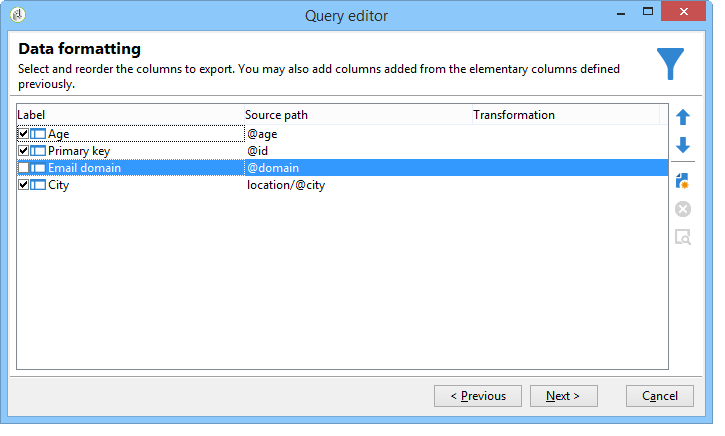
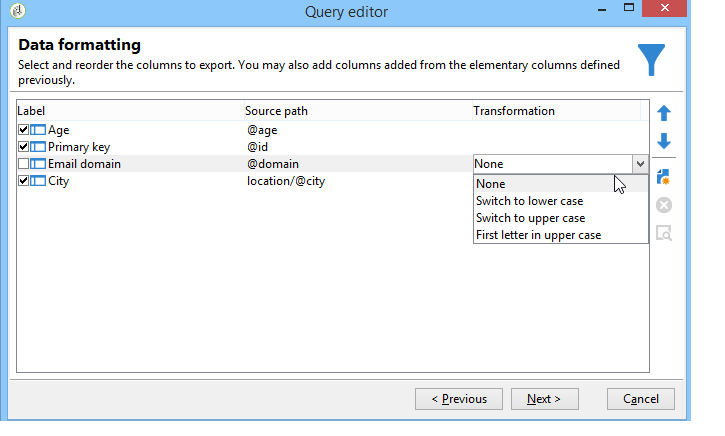

# Stappen om een query te maken{#steps-to-create-a-query}

De stappen voor het bouwen van een vraag in Adobe Campaign zijn als volgt:

1. Selecteer de werktabel. Verwijs naar [Stap 1 - kies een lijst](#step-1---choose-a-table).
1. Selecteer de gegevens die u wilt extraheren. Zie [Stap 2 - Kies gegevens om te extraheren](#step-2---choose-data-to-extract).
1. Definieer de gegevenssorteervolgorde. Zie [Stap 3 - Gegevens sorteren](#step-3---sort-data).
1. Filter de gegevens. Zie [Stap 4 - Gegevens filteren](#step-4---filter-data).
1. Maak de gegevens op. Raadpleeg [Stap 5 - Gegevens opmaken](#step-5---format-data).
1. Geef het resultaat weer. Raadpleeg [Stap 6 - Voorbeeldgegevens](#step-6---preview-data).

>[!NOTE]
>
>Al deze stappen zijn beschikbaar in de generische vraagredacteur. Wanneer een query in een andere context wordt gemaakt, kunnen sommige stappen worden weggelaten.\
>De activiteit van de Vraag wordt voorgesteld in [deze sectie](../../workflow/using/query.md).

## Stap 1 - kies een lijst {#step-1---choose-a-table}

Selecteer de lijst die de gegevens bevat u in het **[!UICONTROL Document type]** venster wilt vragen. Indien nodig, filtert u de gegevens met het filterveld of met de knop **[!UICONTROL Filters]**.

## Stap 2 - kies gegevens om {#step-2---choose-data-to-extract} uit te pakken

Selecteer in het venster **[!UICONTROL Data to extract]** de gegevens die u wilt weergeven: deze velden vormen de uitvoerkolommen .

Selecteer bijvoorbeeld **[!UICONTROL Age]**, **[!UICONTROL Primary key]**, **[!UICONTROL Email domain]** en **[!UICONTROL City]**. De resultaten worden op basis van deze selectie geordend. Gebruik de blauwe pijlen rechts van het venster om de kolomvolgorde te wijzigen.

U kunt een expressie bewerken door er een formule in op te nemen of door een proces uit te voeren voor een statistische functie. Klik hiertoe op het kolomveld **[!UICONTROL Expression]** en selecteer **[!UICONTROL Edit expression]**.

U kunt uitvoerkolomgegevens groeperen: Om dit te doen, controleer **[!UICONTROL Yes]** in **[!UICONTROL Group]** kolom van het **[!UICONTROL Data to extract]** venster. Deze functie genereert een resultaat rond de geselecteerde groeperingsas. Een voorbeeld van een vraag met groepering is beschikbaar in [deze sectie](../../workflow/using/querying-delivery-information.md).

* Met de functie **[!UICONTROL Handle groupings (GROUP BY + HAVING)]** kunt u &quot;groeperen door&quot; en selecteren wat is gegroepeerd (&quot;hebben&quot;). Deze functie is van toepassing op alle velden in de uitvoerkolom. Met deze optie kunt u bijvoorbeeld alle keuzen van een uitvoerkolom groeperen en een bepaald type informatie herstellen, zoals ontvangers tussen 35 en 50.

   Raadpleeg [deze sectie](../../workflow/using/querying-using-grouping-management.md) voor meer informatie.

* Met de functie **[!UICONTROL Remove duplicate rows (DISTINCT)]** kunt u identieke resultaten dedupliceren die in de uitvoerkolom zijn verkregen. Als u bijvoorbeeld een telling uitvoert door de velden Achternaam, Voornaam en E-mail te selecteren in de uitvoerkolom, worden de velden met identieke gegevens verwijderd, omdat dit betekent dat dezelfde contactpersoon meerdere malen in de database is ingevoerd: slechts één resultaat zal in aanmerking worden genomen .

## Stap 3 - Gegevens sorteren {#step-3---sort-data}

In het venster **[!UICONTROL Sorting]** kunt u kolominhoud sorteren. Gebruik de pijlen om de kolomvolgorde te wijzigen:

* Met de kolom **[!UICONTROL Sorting]** kunt u eenvoudig sorteren en de kolominhoud rangschikken van A naar Z of in oplopende volgorde.
* Met de **[!UICONTROL Descending sort]** rangschikt u de inhoud van Z naar A en in aflopende volgorde. Dit is bijvoorbeeld handig voor het weergeven van recordverkopen: boven aan de lijst staan de hoogste cijfers .

In dit voorbeeld worden de gegevens in oplopende volgorde gesorteerd op basis van de leeftijd van de ontvanger.

## Stap 4 - Gegevens filteren {#step-4---filter-data}

Met de query-editor kunt u gegevens filteren om uw zoekopdracht te verfijnen.

De aangeboden filters zijn afhankelijk van de tabel waarop de query betrekking heeft.

Wanneer u **[!UICONTROL Filtering conditions]** selecteert, krijgt u toegang tot de sectie **[!UICONTROL Target elements]**: hiermee kunt u definiëren hoe de te verzamelen gegevens moeten worden gefilterd.

* Als u een nieuw filter wilt maken, selecteert u de velden, operatoren en waarden die nodig zijn voor het maken van de formule die moet worden gecontroleerd voordat de gegevens worden geselecteerd. Het is mogelijk om verscheidene voorwaarden te combineren (voor meer op dit, verwijs naar [Bepalende filtervoorwaarden](../../platform/using/defining-filter-conditions.md)).
* Als u eerder opgeslagen filters wilt gebruiken, opent u de vervolgkeuzelijst door op de knop **[!UICONTROL Add]** te klikken, op **[!UICONTROL Predefined filter]** te klikken en de gewenste filters te selecteren.

   

* De filters die in **[!UICONTROL Generic query editor]** worden gecreeerd zijn beschikbaar in andere vraagtoepassingen en vice versa. Als u een filter wilt opslaan, klikt u op het pictogram **[!UICONTROL Save]**.

   >[!NOTE]
   >
   >Raadpleeg [Filteropties](../../platform/using/filtering-options.md) voor meer informatie over het maken en gebruiken van filters.

Zoals aangetoond in het volgende voorbeeld, om alle Engelstalige ontvangers terug te krijgen, selecteer: &quot;taal van de ontvanger **gelijk aan** EN&quot;.

>[!NOTE]
>
>U hebt rechtstreeks toegang tot een optie door de volgende formule te typen in het veld **Waarde**: **$(options:OPTION_NAME)**.

Klik op het tabblad **[!UICONTROL Preview]** om het resultaat van de filtervoorwaarde weer te geven. In dit geval worden alle Engelstalige ontvangers weergegeven met hun naam, voornaam en e-mailadres.

Gebruikers die bekend zijn met SQL kunnen op **[!UICONTROL Generate SQL query]** klikken om de query in SQL weer te geven.

## Stap 5 - Gegevens opmaken {#step-5---format-data}

Zodra u de beperkingsfilters hebt gevormd, zult u tot het **[!UICONTROL Data formatting]** venster toegang hebben. In dit venster kunt u de uitvoerkolommen opnieuw rangschikken, gegevens transformeren en het hoofdlettergebruik van de kolomlabels wijzigen. Hiermee kunt u ook een formule op het uiteindelijke resultaat toepassen met een berekend veld.

>[!NOTE]
>
>Raadpleeg [Berekende velden maken](../../platform/using/defining-filter-conditions.md#creating-calculated-fields) voor meer informatie over de typen berekende velden.

Niet-geselecteerde kolommen worden niet weergegeven in het venster met gegevensvoorvertoning.

Met de kolom **[!UICONTROL Transformation]** kunt u een kolomlabel wijzigen in hoofdletters of kleine letters. Selecteer de kolom en klik in **[!UICONTROL Transformation]** kolom. U kunt kiezen:

* **[!UICONTROL Switch to lower case]**,
* **[!UICONTROL Switch to upper case]**,
* **[!UICONTROL First letter in upper case]**.

## Stap 6 - Voorvertoningsgegevens {#step-6---preview-data}

Het **[!UICONTROL Data preview]** venster is het laatste stadium. Klik **[!UICONTROL Start the preview of the data]** om uw vraagresultaat te krijgen. Deze optie is beschikbaar in kolommen of in XML-indeling. Klik op het tabblad **[!UICONTROL Generated SQL queries]** om de query in SQL-indeling weer te geven.

In dit voorbeeld worden gegevens in oplopende volgorde gesorteerd op basis van de leeftijd van de ontvanger.

>[!NOTE]
>
>Standaard worden alleen de eerste 200 regels weergegeven in het venster **[!UICONTROL Data preview]**. Om dit te veranderen, ga een aantal in **[!UICONTROL Lines to display]** doos in en klik **[!UICONTROL Start the preview of the data]**.

