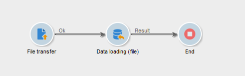

# Een bestand {#unzipping-or-decrypting-a-file-before-processing} decoderen

Met Adobe Campaign kunt u gecomprimeerde of gecodeerde bestanden importeren. Voordat ze kunnen worden gelezen in een [activiteit voor het laden van gegevens (bestand)](../../workflow/using/data-loading--file-.md), kunt u een voorbewerking definiëren voor decoderen of decoderen van het bestand.

Om dit te kunnen doen:

1. Gebruik [Controlebord](https://docs.adobe.com/content/help/en/control-panel/using/instances-settings/gpg-keys-management.html#decrypting-data) om een openbaar/privé zeer belangrijk paar te produceren.

   >[!NOTE]
   >
   >Het Configuratiescherm is beschikbaar voor alle klanten die op AWS worden gehost (behalve voor klanten die hun marketinginstanties op locatie hosten).

1. Als uw installatie van Adobe Campaign wordt gehost door Adobe, neemt u contact op met de klantenservice van Adobe om de benodigde hulpprogramma&#39;s op de server te installeren.
1. Als de installatie van Adobe Campaign op locatie plaatsvindt, installeert u het hulpprogramma dat u wilt gebruiken (bijvoorbeeld: GPG, GZIP) en de benodigde sleutels (coderingssleutel) op de toepassingsserver.

Vervolgens kunt u de gewenste voorverwerkingsopdrachten in uw workflows gebruiken:

1. Voeg en vorm een **[!UICONTROL File transfer]** activiteit in uw werkschema toe.
1. Voeg een **[!UICONTROL Data loading (file)]** activiteit toe en bepaal het dossierformaat.
1. Schakel de optie **[!UICONTROL Pre-process the file]** in.
1. Geef de voorverwerkingsopdracht op die u wilt toepassen.
1. Voeg andere activiteiten toe om gegevens die uit het bestand komen te beheren.
1. Sla de workflow op en voer deze uit.

In het onderstaande gebruiksgeval wordt een voorbeeld gegeven.

**Verwante onderwerpen:**

* [Activiteit](../../workflow/using/data-loading--file-.md) bij laden van gegevens (bestand).
* [Een bestand](../../workflow/using/how-to-use-workflow-data.md#zipping-or-encrypting-a-file) bekijken of versleutelen.

## Hoofdlettergebruik: Gegevens importeren die zijn versleuteld met een toets die is gegenereerd door Configuratiescherm {#use-case-gpg-decrypt}

In dit geval, zullen wij een werkschema bouwen om gegevens in te voeren die in een extern systeem zijn gecodeerd, gebruikend een sleutel die in het Controlebord wordt geproduceerd.

 [Ontdek deze functie in video](#video)

De volgende stappen worden uitgevoerd:

1. Gebruik het Configuratiescherm om een sleutelpaar (openbaar/privé) te genereren. Gedetailleerde stappen zijn beschikbaar in [documentatie van het Configuratiescherm](https://docs.adobe.com/content/help/en/control-panel/using/instances-settings/gpg-keys-management.html#decrypting-data).

   * De openbare sleutel zal met het externe systeem worden gedeeld, dat het zal gebruiken om de gegevens te coderen om naar Campagne te verzenden.
   * De persoonlijke sleutel wordt door Campaign Classic gebruikt om de inkomende gecodeerde gegevens te decoderen.

   

1. In het externe systeem gebruikt u de openbare sleutel die u van het Configuratiescherm hebt gedownload om de gegevens te coderen die u naar Campaign Classic wilt importeren.

1. In Campaign Classic, bouwt een werkschema om de gecodeerde gegevens in te voeren en het te decrypteren gebruikend de privé sleutel die via het Controlebord is geïnstalleerd. Hiervoor maken we als volgt een workflow:

   

   * **[!UICONTROL File transfer]** activiteit: Hiermee wordt het bestand van een externe bron naar Campaign Classic overgedragen. In dit voorbeeld willen we het bestand overbrengen van een SFTP-server.
   * **[!UICONTROL Data loading (file)]** activiteit: Laadt de gegevens van het dossier in het gegevensbestand en decrypteert het gebruikend de privé sleutel die in het Controlebord wordt geproduceerd.

1. Open de **[!UICONTROL File transfer]** activiteit dan specificeer de externe rekening waarvan u het gecodeerde .gpg dossier wilt invoeren.

   

   De globale concepten op hoe te om de activiteit te vormen zijn beschikbaar in [deze sectie](../../workflow/using/file-transfer.md).

1. Open de **[!UICONTROL Data loading (file)]** activiteit, dan vorm het op uw behoeften. De globale concepten op hoe te om de activiteit te vormen zijn beschikbaar in [deze sectie](../../workflow/using/data-loading--file-.md).

   Voeg een voorbewerkingsstadium aan de activiteit toe, om de inkomende gegevens te decrypteren. Om dit te doen, selecteer **[!UICONTROL Pre-process the file]** optie, dan kopieer-kleef dit decryptiebevel in het **[!UICONTROL Command]** gebied:

   `gpg --batch --passphrase passphrase --decrypt <%=vars.filename%>`

   

   >[!CAUTION]
   >
   >In dit voorbeeld, gebruiken wij passphrase die door gebrek door Controlebord wordt gebruikt, dat &quot;passphrase&quot;is.
   >
   >Als u in het verleden al GPG-sleutels op uw exemplaar hebt geïnstalleerd via een verzoek van de klantenservice, is de passphrase mogelijk gewijzigd en is deze standaard anders.

1. Klik **[!UICONTROL OK]** om de activiteitenconfiguratie te bevestigen.

1. U kunt de workflow nu uitvoeren. Nadat de decodering is uitgevoerd, kunt u in de werkstroomlogboeken controleren of de decodering is uitgevoerd en of de gegevens uit het bestand zijn geïmporteerd.

   

## Video over zelfstudie {#video}

In deze video wordt getoond hoe u een GPG-sleutel kunt gebruiken voor het decoderen van gegevens.

>[!VIDEO](https://video.tv.adobe.com/v/36482?quality=12)

Er zijn [hier](https://experienceleague.adobe.com/docs/campaign-classic-learn/tutorials/overview.html?lang=nl) extra Campaign Classic hoe kan ik-video&#39;s beschikbaar.
