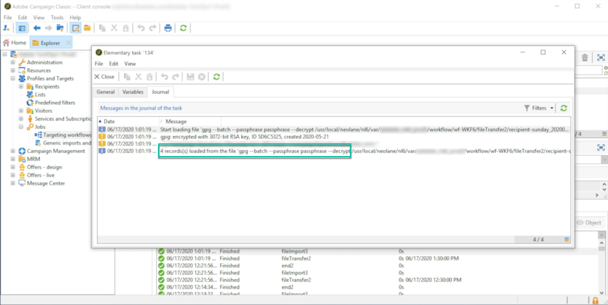

# Een bestand decoderen of decoderen {#unzipping-or-decrypting-a-file-before-processing}

Met Adobe Campaign kunt u gecomprimeerde of gecodeerde bestanden importeren. Alvorens zij in a [ Gegevens kunnen worden gelezen die (dossier) laden ](https://experienceleague.adobe.com/docs/campaign/automation/workflows/wf-activities/action-activities/data-loading-file.html){target="_blank"} activiteit, kunt u een pre-verwerking aan unzip bepalen of het dossier decrypteren.

>[!IMPORTANT]
>
>U kunt gecomprimeerde bestanden van meer dan 4 GB niet decomprimeren.

Om dit te kunnen doen:

1. Gebruik het [ Controlebord ](https://experienceleague.adobe.com/docs/control-panel/using/instances-settings/gpg-keys-management.html#decrypting-data) om een openbaar/privé zeer belangrijk paar te produceren om dossierdecryptie toe te staan.

   >[!NOTE]
   >
   >Het configuratiescherm is toegankelijk voor alle gebruikers met beheerdersrechten. De stappen om toegang met beheerdersrechten aan een gebruiker te verlenen worden gedetailleerd beschreven op [deze pagina](https://experienceleague.adobe.com/docs/control-panel/using/discover-control-panel/managing-permissions.html?lang=nl#discover-control-panel).
   >
   >Merk op dat uw instantie op AWS moet worden ontvangen en met de [ recentste bouw GA ](../../rn/using/rn-overview.md) wordt bevorderd. Leer hoe u uw versie kunt controleren in [dit gedeelte](../../platform/using/launching-adobe-campaign.md#getting-your-campaign-version). Controleer of uw versie wordt gehost op AWS door de volgende stappen te volgen op [deze pagina](https://experienceleague.adobe.com/docs/control-panel/using/faq.html?lang=nl).

1. Als de installatie van Adobe Campaign op locatie plaatsvindt, installeert u het hulpprogramma dat u wilt gebruiken (bijvoorbeeld GPG, GZIP) en de benodigde sleutels (coderingssleutel) op de toepassingsserver.

   Als uw installatie van Adobe Campaign door Adobe wordt ontvangen, contacteer [ de Zorg van de Klant van Adobe ](https://helpx.adobe.com/nl/enterprise/admin-guide.html/enterprise/using/support-for-experience-cloud.ug.html) om de noodzakelijke nut te hebben die op de server worden geïnstalleerd.

Vervolgens kunt u de gewenste voorverwerkingsopdrachten in uw workflows gebruiken:

1. Voeg een **[!UICONTROL File transfer]** activiteit in uw werkschema toe en vorm.
1. Voeg een **[!UICONTROL Data loading (file)]** -activiteit toe en definieer de bestandsindeling.
1. Schakel de optie **[!UICONTROL Pre-process the file]** in.
1. Selecteer de voorverwerkingsopdracht die u wilt toepassen.
1. Voeg andere activiteiten toe om gegevens die uit het bestand komen te beheren.
1. Sla de workflow op en voer deze uit.

In het onderstaande gebruiksgeval wordt een voorbeeld gegeven.

**Verwante onderwerpen:**

* [ het laden van Gegevens (dossier) activiteit ](https://experienceleague.adobe.com/docs/campaign/automation/workflows/wf-activities/action-activities/data-loading-file.html){target="_blank"}.
* [ Zip of codeer een dossier ](https://experienceleague.adobe.com/docs/campaign/automation/workflows/wf-activities/action-activities/extraction-file.html){target="_blank"}.

## Hoofdlettergebruik: gegevens importeren die zijn versleuteld met een toets die is gegenereerd door Configuratiescherm {#use-case-gpg-decrypt}

In dit geval, zullen wij een werkschema bouwen om gegevens in te voeren die in een extern systeem zijn gecodeerd, gebruikend een sleutel die in het Controlebord wordt geproduceerd.

 [Ontdek deze functie in video](#video)

De volgende stappen voor dit gebruik zijn nodig:

1. Gebruik het Configuratiescherm om een sleutelpaar (openbaar/privé) te genereren. De gedetailleerde stappen zijn beschikbaar in [ documentatie van het Controlebord ](https://experienceleague.adobe.com/docs/control-panel/using/instances-settings/gpg-keys-management.html#decrypting-data).

   * De openbare sleutel zal met het externe systeem worden gedeeld, dat het zal gebruiken om de gegevens te coderen om naar Campagne te verzenden.
   * De persoonlijke sleutel wordt door Campaign Classic gebruikt om de inkomende gecodeerde gegevens te decoderen.

   

1. In het externe systeem gebruikt u de openbare sleutel die u van het Configuratiescherm hebt gedownload om de gegevens te coderen die u naar Campaign Classic wilt importeren.

1. In Campaign Classic maakt u een workflow om de gecodeerde gegevens te importeren en te decoderen met de persoonlijke sleutel die is geïnstalleerd via het Configuratiescherm. Hiervoor maken we als volgt een workflow:

   

   * **[!UICONTROL File transfer]** activity: hiermee wordt het bestand van een externe bron naar Campaign Classic overgedragen. In dit voorbeeld willen we het bestand overbrengen van een SFTP-server.
   * **[!UICONTROL Data loading (file)]** activiteit: laadt de gegevens van het bestand in de database en decodeert deze met de persoonlijke sleutel die is gegenereerd in het Configuratiescherm.

1. Open de **[!UICONTROL File transfer]** -activiteit en geef vervolgens het externe account op waaruit u het gecodeerde gpg-bestand wilt importeren.

   

   De globale concepten op hoe te om de activiteit te vormen zijn beschikbaar in de [ documentatie van de Campagne v8 ](https://experienceleague.adobe.com/docs/campaign/automation/workflows/wf-activities/event-activities/file-transfer.html){target="_blank"}.

1. Open de **[!UICONTROL Data loading (file)]** activiteit, dan vorm het op uw behoeften. De globale concepten op hoe te om de activiteit te vormen zijn beschikbaar in de [ documentatie van de Campagne v8 ](https://experienceleague.adobe.com/docs/campaign/automation/workflows/wf-activities/action-activities/data-loading-file.html){target="_blank"}.

   Voeg een voorbewerkingsstadium aan de activiteit toe, om de inkomende gegevens te decrypteren. Selecteer hiertoe de optie **[!UICONTROL Pre-process the file]** en selecteer vervolgens **[!UICONTROL Decrypt]** in de vervolgkeuzelijst **[!UICONTROL Command]** :

   

   >[!NOTE]
   >
   >Als de veranderingen aan de beschikbare bevelen nodig zijn, kunt u uit aan [ de Zorg van de Klant van Adobe ](https://helpx.adobe.com/nl/enterprise/admin-guide.html/enterprise/using/support-for-experience-cloud.ug.html) reiken om de montages aan te passen preProcessCommand.
   >
   >Als u met een hybride plaatsing werkt, kunt u deze bevelen direct van het dossier van de serverconfiguratie (serverConf.xml) vormen. [ Leer hoe te om pre-verwerkingsbevelen in het dossier van de serverconfiguratie te vormen ](../../installation/using/the-server-configuration-file.md#preprocesscommand)

1. Klik op **[!UICONTROL OK]** om de activiteitenconfiguratie te bevestigen.

1. U kunt de workflow nu uitvoeren. Nadat de decodering is uitgevoerd, kunt u in de werkstroomlogboeken controleren of de decodering is uitgevoerd en of de gegevens uit het bestand zijn geïmporteerd.

   

## Video over zelfstudie {#video}

In deze video wordt getoond hoe u een GPG-sleutel kunt gebruiken voor het decoderen van gegevens.

>[!VIDEO](https://video.tv.adobe.com/v/36482?quality=12)

De extra hoe te video&#39;s van Campaign Classic zijn beschikbaar [ hier ](https://experienceleague.adobe.com/docs/campaign-classic-learn/tutorials/overview.html?lang=nl).
