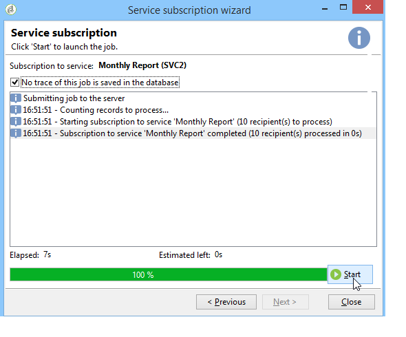

# Data bijwerken{#updating-data}

De gegevens die aan het profiel van een ontvanger zijn gekoppeld, kunnen handmatig of automatisch worden bijgewerkt.

## Een automatische update instellen {#setting-up-an-automatic-update}

Een automatische update kan worden geconfigureerd via een workflow. Raadpleeg [deze sectie](../../workflow/using/update-data.md) voor meer informatie.

## Een massa-update uitvoeren {#performing-a-mass-update}

Als u handmatige updates wilt uitvoeren, klikt u met de rechtermuisknop op de geselecteerde ontvanger(s) om het snelmenu **[!UICONTROL Actions]** te gebruiken of gebruikt u het pictogram **[!UICONTROL Actions]**.

Er zijn twee typen updates: massa-update voor een reeks ontvangers en gegevens samenvoegen tussen twee profielen. Voor elke actie, laat een tovenaar u de update vormen.

### Massa-update {#mass-update}

Gebruik **[!UICONTROL Action > Mass update of selected lines...]** voor het bijwerken van massa&#39;s. Met de wizard kunt u de update configureren en uitvoeren.

De eerste stap van de wizard is het opgeven van het veld of de velden die moeten worden bijgewerkt.

In het linkergedeelte van de wizard wordt de lijst met beschikbare velden weergegeven. Gebruik het veld **[!UICONTROL Find]** om deze velden te doorzoeken. Druk op **Enter** om door de lijst te bladeren. De veldnamen die overeenkomen met uw invoer worden vet weergegeven, zoals hieronder wordt weergegeven.

Dubbelklik op de velden die u wilt bijwerken om deze weer te geven in het rechtergedeelte van de wizard.

Als er een fout optreedt, gebruikt u de knop **[!UICONTROL Delete]** om een veld te verwijderen uit de lijst met velden die moeten worden bijgewerkt.

Selecteer of voer de waarden in die u wilt toepassen op de profielen die moeten worden bijgewerkt.

U kunt op **[!UICONTROL Distribution of values]** klikken om de verdeling van waarden van het geselecteerde veld weer te geven voor de ontvangers in de huidige map (niet alleen de ontvangers die door de update worden beïnvloed).

U kunt filters definiëren om de verdeling van waarden in dit venster weer te geven of de huidige map wijzigen om de verdeling van waarden in een andere map weer te geven. Dit zijn alleen-lezen handelingen; ze hebben geen invloed op de configuratie van de update die wordt gedefinieerd.

Sluit dit venster en klik op **[!UICONTROL Next]** om de tweede stap van de updatetovenaar weer te geven. In deze stap kunt u de update starten door op **[!UICONTROL Start]** te klikken.

Informatie over het uitvoeren van updates wordt weergegeven in de bovenste sectie van de wizard.

Met **[!UICONTROL Stop]** kunt u de update annuleren, maar bepaalde records zijn mogelijk bijgewerkt. Als u het proces stopt, worden deze updates niet geannuleerd. Op de voortgangsbalk ziet u hoe ver de bewerking is gevorderd.

### Gegevens {#merge-data} samenvoegen

Selecteer **[!UICONTROL Merge selected lines...]** om het samenvoegen van twee ontvangende profielen te starten. De profielen die moeten worden samengevoegd, moeten worden geselecteerd voordat u de optie selecteert. De samenvoeging wordt geconfigureerd en gestart met een wizard.

De wizard geeft de waarden weer die moeten worden opgehaald voor elk veld dat wordt ingevuld in een van de bronprofielen. Als een of meer velden in de profielen die moeten worden samengevoegd andere waarden hebben, worden deze weergegeven in de sectie **[!UICONTROL List of conflicts]**. Vervolgens kunt u het standaardprofiel selecteren met de keuzerondjes in de lijst, zoals in het volgende voorbeeld:

Klik **[!UICONTROL Compute]** om het resultaat van uw keus te tonen.

Controleer de **[!UICONTROL Result]** kolommen van beide secties van het venster, en klik **[!UICONTROL Finish]** om de fusie in werking te stellen.

## Data exporteren {#exporting-data}

De inhoud van een lijst kan worden geëxporteerd. Het exporteren configureren en uitvoeren:

1. Selecteer de records die u wilt exporteren.
1. Klik met de rechtermuisknop en selecteer **[!UICONTROL Export...]**.

   

1. Selecteer vervolgens de gegevens die u wilt extraheren. Standaard worden alle weergegeven kolommen toegevoegd aan de uitvoerkolommen.

   

   Voor meer op hoe te om de uitvoertovenaar te vormen, verwijs naar [tovenaar van de Uitvoer](../../platform/using/exporting-data.md#export-wizard).

## Abonneren op een service {#subscribing-to-a-service}

In de meeste gevallen abonneren ontvangers op een nieuwsbrief via een specifieke landingspagina, zoals wordt uitgelegd in [deze sectie](../../delivery/using/managing-subscriptions.md). De profielen van gefilterde ontvangers kunnen echter handmatig worden geabonneerd op een service (Newsletter of Viral-service). Dit doet u als volgt:

1. Selecteer de ontvangers u zich wilt intekenen en met de rechtermuisknop klikken.
1. Selecteer **[!UICONTROL Actions > Subscribe selection to a service]**.

   

1. Selecteer de gewenste service en klik op **[!UICONTROL Next]**:

   

   >[!NOTE]
   >
   >Met deze editor kunt u een nieuwe service maken: Klik op de knop **[!UICONTROL Create]**.

1. U kunt **[!UICONTROL Send a confirmation message]** aan ontvangers. De inhoud van dit bericht kan in het abonnementsscenario worden gevormd verbonden aan de geselecteerde dienst.
1. Klik op de knop **[!UICONTROL Start]** om het abonnementsproces uit te voeren.

   

In de bovenste sectie van het venster kunt u het uitvoeringsproces volgen. Met de knop **[!UICONTROL Stop]** kunt u het proces stoppen. Ontvangers die al zijn verwerkt, worden echter geabonneerd.

Als u de optie **[!UICONTROL Do not keep a trace of this job in the database]** uitschakelt, kunt u de uitvoeringsmap selecteren (of maken) waarin de informatie over dit proces wordt opgeslagen.

Als u het proces wilt controleren, gaat u naar het tabblad **[!UICONTROL Subscriptions]** in de profielen van de ontvangers die bij deze bewerking betrokken zijn, of naar het tabblad **[!UICONTROL Subscriptions]** dat u opent via het knooppunt **[!UICONTROL Profiles and Targets > Services and Subscriptions]**.

>[!NOTE]
>
>Raadpleeg [deze pagina](../../delivery/using/managing-subscriptions.md) voor meer informatie over het maken en configureren van informatieservices.

