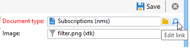
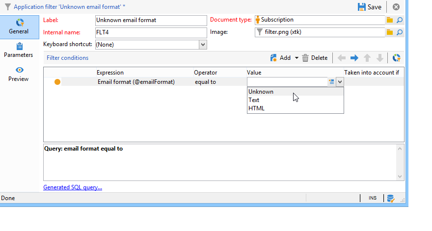

# Hoofdletters gebruiken{#use-case}

## Een filter maken in de e-mailindeling van abonnees {#creating-a-filter-on-the-email-format-of-subscribers}

Met deze gebruiksaanwijzing kunt u zien hoe u een filter maakt voor het sorteren van nieuwsbrieven-abonnementen op basis van de e-mailindeling van de ontvanger.

Hiervoor moet een vooraf gedefinieerde filterfunctie worden gebruikt: deze filters zijn gekoppeld aan een documenttype en zijn toegankelijk via het **[!UICONTROL Administration > Configuration > Predefined filters]** knooppunt. Deze gegevensfilters kunnen worden gebruikt voor elk type editor (of document) in de toepassing.

Gegevensfilters worden op dezelfde manier gemaakt als vooraf gedefinieerde filters, maar er is een extra veld om het documenttype te selecteren waarop het filter wordt toegepast.

Voer de volgende stappen uit:

1. Maak een nieuw filter via het **[!UICONTROL Administration > Configuration > Predefined filters]** knooppunt.
1. Klik op het **[!UICONTROL Select link]** pictogram om het desbetreffende document te selecteren:

   

1. Selecteer het abonnementsschema (nms:abonnement) en klik **[!UICONTROL OK]**.

   

1. Klik **[!UICONTROL Edit link]** om de velden van het geselecteerde document weer te geven.

   

   Vervolgens kunt u de inhoud van het geselecteerde document bekijken:

   

   U hebt toegang tot deze velden om filtervoorwaarden in de hoofdtekst van de filtereditor te definiëren. Een toepassingsfilter wordt op precies dezelfde manier gedefinieerd als een geavanceerd filter. Zie [Een geavanceerd filter](../../platform/using/creating-filters.md#creating-an-advanced-filter)maken.

1. Maak een nieuw filter op abonnementen om alleen abonnementen met een niet-gedefinieerde e-mailindeling weer te geven:

   

1. Klik **[!UICONTROL Save]** om een filter aan de vooraf bepaalde filters voor dit type van lijst toe te voegen.
1. U kunt dit filter nu gebruiken op het **[!UICONTROL Subscriptions]** tabblad van het ontvangende profiel. U kunt het filter Onbekende e-mailindeling openen door op de **[!UICONTROL Filters]** knop te klikken.

   

   De naam van het huidige filter wordt boven de lijst weergegeven. Klik op het **[!UICONTROL Delete this filter]** pictogram om het filter te annuleren.

   

