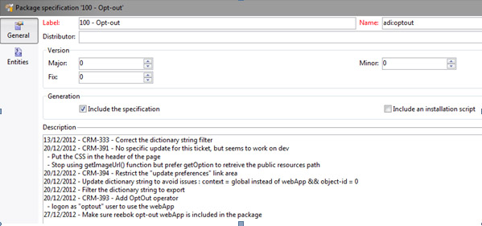

# Werken met gegevenspakketten{#working-with-data-packages}


## Over gegevenspakketten {#about-data-packages}

Met Adobe Campaign kunt u de platformconfiguratie en data via een pakketsysteem exporteren of importeren. Pakketten kunnen verschillende configuraties, elementen bevatten, al dan niet gefilterd.

Met datapakketten kunnen entiteiten van de Adobe Campaign-database worden weergegeven via bestanden in XML-indeling. Elke entiteit in een pakket wordt met al zijn data vertegenwoordigd.

Het beginsel van **gegevenspakketten** moet een gegevensconfiguratie uitvoeren en het in een ander systeem van Adobe Campaign integreren. Leer hoe te om een verenigbare reeks gegevenspakketten in deze [ sectie ](#data-package-best-practices) te handhaven.

### Typen pakketten {#types-of-packages}

Er zijn drie typen exporteerbare pakketten: gebruikerspakketten, platformpakketten en beheerpakketten.

* **pakket van de Gebruiker**: het laat u toe om de lijst van uit te voeren entiteiten te selecteren. Dit type pakket beheert afhankelijkheden en controleert fouten.
* **het pakket van het Platform**: het omvat alle toegevoegde technische middelen (niet standaard): schema&#39;s, de code van JavaScript, enz.

  

* **Admin pakket**: het omvat alle toegevoegde malplaatjes en bedrijfsvoorwerpen (niet standaard): malplaatjes, bibliotheken, enz.

  

>[!CAUTION]
>
>De **platform** en **admin** types bevatten een vooraf bepaalde lijst van uit te voeren entiteiten. Elke entiteit is verbonden met het filtreren voorwaarden die u toelaten om de uit-van-de-doosmiddelen van het gecreeerde pakket te verwijderen.

## Gegevensstructuur {#data-structure}

De beschrijving van een gegevenspakket is een gestructureerd document van XML dat met de grammatica van **xrk voldoet:navtree** gegevensschema.

Voorbeeld van gegevenspakketten:

```
<package>
  <entities schema="nms:recipient">
    <recipient email="john.smith@adobe.com" lastName="Smith" firstName="John">      
      <folder _operation="none" name="nmsRootFolder"/>      
      <company _operation="none" name="Adobe"/>
    </recipient>
  </entities>
  <entities schema="sfa:company">
    <company name="Adobe">
      location city="London" zipCode="W11 2BQ"/>
    </company>
  </entities>
</package>
```

Het XML-document moet beginnen en eindigen met het element **`<package>`** . Alle **`<entities>`** -elementen die volgen, verdelen de gegevens op documenttype.

Een **`<entities>`** element bevat de gegevens van het pakket in het formaat van het gegevensschema ingegaan in het **schema** attribuut.

De gegevens in een pakket moeten geen interne sleutels bevatten die niet compatibel tussen bases, zoals auto-geproduceerde sleutels (**automatische 1} optie) zijn.**

In ons voorbeeld zijn de verbindingen op de &quot;omslag&quot;en &quot;bedrijf&quot;verbindingen vervangen door zogenaamde &quot;high level&quot;sleutels op de bestemmingstabellen:

```
<recipient>
  <folder _operation="none" name="nmsRootFolder"/>
  <company _operation="none" name="Adobe"/>
</recipient>
```

Het attribuut **`operation`** met de waarde &quot;none&quot; definieert een afstemmingskoppeling.

Een gegevenspakket kan manueel van om het even welke tekstredacteur worden samengesteld. Zorg er gewoon voor dat de structuur van het XML-document voldoet aan het gegevensschema &quot;xtk:navtree&quot;. De Adobe Campaign-console heeft een export- en importmodule voor gegevenspakketten.

## Pakketten exporteren {#exporting-packages}

### Over exporteren van pakket {#about-package-export}

U kunt pakketten op drie verschillende manieren exporteren:

* Met **[!UICONTROL Package Export Assistant]** kunt u een set objecten exporteren in één pakket. Voor meer op dit verwijs naar [ Uitvoer een reeks voorwerpen in een pakket ](#exporting-a-set-of-objects-in-a-package)
* A **één enkel voorwerp** kan in een pakket direct worden uitgevoerd door op het met de rechtermuisknop te klikken en **[!UICONTROL Actions > Export in a package]** te selecteren.
* **de definities van het Pakket** laten u een pakketstructuur tot stand brengen waarin u voorwerpen toevoegt die later op in een pakket zullen worden uitgevoerd. Voor meer op dit, verwijs naar [ beheer pakketdefinities ](#managing-package-definitions)

Nadat een pakket is geëxporteerd, kunt u het pakket en alle toegevoegde entiteiten importeren in een andere Campagne-instantie.

### Een set objecten in een pakket exporteren {#exporting-a-set-of-objects-in-a-package}

De exportassistent voor pakketten is toegankelijk via het **[!UICONTROL Tools > Advanced > Export package...]** -menu van de Adobe Campaign-clientconsole.


Voor de drie types van pakketten, biedt de medewerker de volgende stappen aan:

1. Geef een lijst weer van de entiteiten die moeten worden geëxporteerd op documenttype:

   

   >[!CAUTION]
   >
   >Als u een **[!UICONTROL Offer category]**, **[!UICONTROL Offer environment]**, **[!UICONTROL Program]** of **[!UICONTROL Plan]** typemap uitvoert, selecteer nooit **xtk:omslag** aangezien u sommige gegevens kunt verliezen. Selecteer de entiteit die met de omslag beantwoordt: **nms:offerCategory** voor aanbiedingscategorieën, **nms:offerEnv** voor aanbiedingsmilieu&#39;s, **nms:programma** voor programma&#39;s, en **nms:plan** voor plannen.

   Met lijstbeheer kunt u entiteiten voor export uit de configuratie toevoegen of verwijderen. Klik op **[!UICONTROL Add]** om een nieuwe entiteit te selecteren.

   Met de knop **[!UICONTROL Detail]** bewerkt u de geselecteerde configuratie.

   >[!NOTE]
   >
   >Het afhankelijkheidsmechanisme bestuurt de uitvoersequentie van de entiteit. Voor meer op dit, verwijs naar [ het Leiden gebiedsdelen ](#managing-dependencies).

1. Het scherm van de entiteitconfiguratie bepaalt de filtervraag op het type van document dat moet worden gehaald.

   U moet de het filtreren clausule voor gegevensextractie vormen.

   

   >[!NOTE]
   >
   >De vraagredacteur wordt voorgesteld in [ deze sectie ](../../platform/using/about-queries-in-campaign.md).

1. Klik op **[!UICONTROL Next]** en selecteer de sorteerkolommen om de gegevens tijdens de extractie te ordenen:

   

1. Geef een voorvertoning weer van de gegevens die u wilt extraheren voordat u het exporteren uitvoert.

   

1. Op de laatste pagina van de exportassistent voor pakketten kunt u het exporteren starten. De gegevens worden opgeslagen in het bestand dat wordt aangegeven in het veld **[!UICONTROL File]** .

   

### Afhankelijkheden beheren {#managing-dependencies}

Met het exportmechanisme kan Adobe Campaign de koppelingen tussen de verschillende geëxporteerde elementen bijhouden.

Dit mechanisme wordt gedefinieerd door twee regels:

* de voorwerpen verbonden aan een verbinding met een **eigen** of **eigen exemplaar** typeintegriteit worden uitgevoerd in het zelfde pakket zoals het uitgevoerde voorwerp.
* de voorwerpen verbonden aan een verbinding met a **neutraal** of **bepalen** typeintegriteit (bepaalde verbinding) moeten afzonderlijk worden uitgevoerd.

>[!NOTE]
>
>De types van integriteit verbonden aan schemaelementen worden bepaald in [ deze sectie ](../../configuration/using/database-mapping.md#links--relation-between-tables).

#### Een campagne exporteren {#exporting-a-campaign}

Hier volgt een voorbeeld van hoe u een campagne kunt exporteren. De marketingcampagne die geëxporteerd moet worden, bevat een taak (label: &quot;MyTask&quot;) en een workflow (label: &quot;CampaignWorkflow&quot;) in een map &quot;MyWorkflow&quot; (knooppunt: Beheer / Productie / Technische workflows / Campagne-processen / MyWorkflow).

De taak en de workflow worden geëxporteerd in hetzelfde pakket als de campagne, aangezien de overeenkomende schema&#39;s worden verbonden door koppelingen met een integriteit van het type &quot;own&quot;.

Inhoud pakket:

```
<?xml version='1.0'?>
<package author="Administrator (admin)" buildNumber="7974" buildVersion="7.1" img=""
label="" name="" namespace="" vendor="">
 <desc></desc>
 <version buildDate="AAAA-MM-DD HH:MM:SS.954Z"/>
 <entities schema="nms:operation">
  <operation duration="432000" end="AAAA-MM-DD" internalName="OP1" label="MyCampaign"
  modelName="opEmpty" start="AAAA-MM-DD">
   <controlGroup>
    <where filteringSchema=""/>
   </controlGroup>
   <seedList>
    <where filteringSchema="nms:seedMember"></where>
    <seedMember internalName="SDM1"></seedMember>
   </seedList>
   <parameter useAsset="1" useBudget="1" useControlGroup="1" useDeliveryOutline="1"
   useDocument="1" useFCPValidation="0" useSeedMember="1" useTask="1"
   useValidation="1" useWorkflow="1"></parameter>
   <fcpSeed>
    <where filteringSchema="nms:seedMember"></where>
   </fcpSeed>
   <owner _operation="none" name="admin" type="0"/>
   <program _operation="none" name="nmsOperations"/>
   <task end="2023-01-17 10:07:51.000Z" label="MyTask" name="TSK2" start="2023-01-16 10:07:51.000Z"
   status="1">
    <owner _operation="none" name="admin" type="0"/>
    <operation _operation="none" internalName="OP1"/>
    <folder _operation="none" name="nmsTask"/>
   </task>
   <workflow internalName="WKF12" label="CampaignWorkflow" modelName="newOpEmpty"
   order="8982" scenario-cs="Notification of the workflow supervisor (notifySupervisor)"
   schema="nms:recipient">
    <scenario internalName="notifySupervisor"/>
    <desc></desc>
    <folder _operation="none" name="Folder4"/>
    <operation _operation="none" internalName="OP1"/>
   </workflow>
  </operation>
 </entities>
</package>   
```

De verbinding aan een type van pakket wordt bepaald in een schema met **@pkgAdmin en @pkgPlatform** attributen. Beide eigenschappen ontvangen een XTK-expressie die de voorwaarden voor aansluiting bij het pakket definieert.

```
<element name="offerEnv" img="nms:offerEnv.png" 
template="xtk:folder" pkgAdmin="@id != 0">
```

Tot slot laat het **@pkgStatus** attribuut u toe om de de uitvoerregels voor deze elementen of attributen te bepalen. Afhankelijk van de waarde van het kenmerk, wordt het element of kenmerk gevonden in het geëxporteerde pakket. De drie mogelijke waarden voor dit kenmerk zijn:

* **nooit**: voert niet het gebied/de verbinding uit
* **altijd**: De uitvoer van krachten voor dit gebied
* **preCreate**: keurt verwezenlijking van de verbonden entiteit goed

>[!NOTE]
>
>De **preCreate** waarde wordt slechts toegelaten voor gebeurtenissen van het verbindingstype. Hiermee kunt u een entiteit maken of aanwijzen die nog niet in het geëxporteerde pakket is geladen.

## Pakketdefinities beheren {#managing-package-definitions}

Met pakketdefinities kunt u een pakketstructuur maken waarin u entiteiten toevoegt die later in één pakket worden geëxporteerd. Vervolgens kunt u dit pakket en alle toegevoegde entiteiten importeren in een andere Campagne-instantie.

**Verwante onderwerpen:**

* [Een pakketdefinitie maken](#creating-a-package-definition)
* [Entiteiten toevoegen aan een pakketdefinitie](#adding-entities-to-a-package-definition)
* [Genereren van pakketdefinities configureren](#configuring-package-definitions-generation)
* [Pakketten uit een pakketdefinitie exporteren](#exporting-packages-from-a-package-definition)

### Een pakketdefinitie maken {#creating-a-package-definition}

Pakketdefinities zijn toegankelijk via het menu **[!UICONTROL Administration > Configuration > Package management > Package definitions]** .

Als u een pakketdefinitie wilt maken, klikt u op de knop **[!UICONTROL New]** en vult u vervolgens de algemene informatie over de pakketdefinitie in.


Vervolgens kunt u entiteiten toevoegen aan de pakketdefinitie en deze exporteren naar een XML-bestandspakket.

**Verwante onderwerpen:**

* [Entiteiten toevoegen aan een pakketdefinitie](#adding-entities-to-a-package-definition)
* [Genereren van pakketdefinities configureren](#configuring-package-definitions-generation)
* [Pakketten uit een pakketdefinitie exporteren](#exporting-packages-from-a-package-definition)

### Entiteiten toevoegen aan een pakketdefinitie {#adding-entities-to-a-package-definition}

Klik in het tabblad **[!UICONTROL Content]** op de knop **[!UICONTROL Add]** om de entiteiten te selecteren die u met het pakket wilt exporteren. De beste praktijken wanneer het selecteren van entiteiten worden voorgesteld in [ deze sectie ](#exporting-a-set-of-objects-in-a-package) sectie.


Entiteiten kunnen rechtstreeks vanaf hun locatie in de instantie aan een pakketdefinitie worden toegevoegd. Hiervoor voert u de volgende stappen uit:

1. Klik met de rechtermuisknop op de gewenste entiteit en selecteer vervolgens **[!UICONTROL Actions > Export in a package]** .

   

1. Selecteer **[!UICONTROL Add to a package definition]** en selecteer vervolgens de pakketdefinitie waaraan u de entiteit wilt toevoegen.

   

1. De entiteit wordt toegevoegd aan de pakketdefinitie, zal het met het pakket (zie [ worden uitgevoerd deze sectie ](#exporting-packages-from-a-package-definition)).

   

### Genereren van pakketdefinities configureren {#configuring-package-definitions-generation}

Pakketgeneratie kan worden geconfigureerd via het tabblad pakketdefinitie **[!UICONTROL Content]** . Klik hiertoe op de koppeling **[!UICONTROL Generation parameters]** .


* **[!UICONTROL Include the definition]**: bevat de definitie die momenteel wordt gebruikt in de pakketdefinitie.
* **[!UICONTROL Include an installation script]** : hiermee kunt u een JavaScript-script toevoegen dat moet worden uitgevoerd bij het importeren van het pakket. Als deze optie is geselecteerd, wordt een tab **[!UICONTROL Script]** toegevoegd aan het scherm met pakketdefinities.
* **[!UICONTROL Include default values]** : voegt de waarden van alle kenmerken van de entiteiten toe aan het pakket.

  Deze optie is niet standaard geselecteerd om langdurige export te voorkomen. Dit betekent dat de attributen van entiteiten met standaardwaarden (&quot;lege koord&quot;, &quot;0&quot;, en &quot;vals&quot;als niet anders bepaald in het schema) niet aan het pakket zullen worden toegevoegd en daarom niet zullen worden uitgevoerd.

  >[!CAUTION]
  >
  >Als u deze optie uitschakelt, kunnen lokale en geïmporteerde versies worden samengevoegd.
  >
  >Als de instantie waarin het pakket wordt geïmporteerd, entiteiten bevat die identiek zijn aan die van het pakket (bijvoorbeeld met dezelfde externe id), worden de kenmerken ervan niet bijgewerkt. Dit kan gebeuren als de kenmerken van de eerste instantie standaardwaarden hebben, omdat ze niet in het pakket zijn opgenomen.
  >
  >In dat geval voorkomt u dat versies worden samengevoegd door de optie **[!UICONTROL Include default values]** te selecteren, aangezien alle kenmerken van de eerste instantie samen met het pakket worden geëxporteerd.

### Pakketten uit een pakketdefinitie exporteren {#exporting-packages-from-a-package-definition}

Voer de volgende stappen uit om een pakket uit een pakketdefinitie te exporteren:

1. Selecteer de pakketdefinitie die u wilt exporteren, klik op de knop **[!UICONTROL Actions]** en selecteer **[!UICONTROL Export the package]** .
1. Een XML-bestand dat overeenkomt met het geëxporteerde pakket wordt standaard geselecteerd. De naam wordt bepaald door de naamruimte en naam van de pakketdefinitie.
1. Nadat de pakketnaam en -locatie zijn gedefinieerd, klikt u op de knop **[!UICONTROL Start]** om het exporteren te starten.

   

## Pakketten importeren {#importing-packages}

De importassistent voor pakketten is toegankelijk via het hoofdmenu **[!UICONTROL Tools > Advanced > Import package]** van de Adobe Campaign-clientconsole.

U kunt een pakket van de uitvoer invoeren vroeger, bijvoorbeeld van een andere instantie van Adobe Campaign, of a [ ingebouwd pakket ](../../installation/using/installing-campaign-standard-packages.md), afhankelijk van de termijnen van uw vergunning wordt uitgevoerd.


### Een pakket uit een bestand installeren {#installing-a-package-from-a-file}

Als u een bestaand gegevenspakket wilt importeren, selecteert u het XML-bestand en klikt u op **[!UICONTROL Open]** .


De inhoud van het te importeren pakket wordt vervolgens in het middelste gedeelte van de editor weergegeven.

Klik op **[!UICONTROL Next]** en **[!UICONTROL Start]** om het importeren te starten.


### Een ingebouwd pakket installeren {#installing-a-standard-package}

Standaardpakketten zijn ingebouwde pakketten die worden geïnstalleerd wanneer de Adobe Campaign wordt geconfigureerd. Afhankelijk van uw toestemmingen en uw plaatsingsmodel, kunt u nieuwe standaardpakketten invoeren als u nieuwe opties of toe:voegen-ons verwerft, of als u aan een nieuwe aanbieding bevordert.

Raadpleeg de licentieovereenkomst om te controleren welke pakketten u kunt installeren.

Voor meer informatie over ingebouwde pakketten, verwijs naar [ deze pagina ](../../installation/using/installing-campaign-standard-packages.md).

## Aanbevolen werkwijzen voor gegevenspakketten {#data-package-best-practices}

In deze sectie wordt beschreven hoe u gegevenspakketten op consistente wijze kunt ordenen gedurende de levensduur van het project.

Pakketten kunnen verschillende configuraties en elementen bevatten, al dan niet gefilterd. Als u sommige elementen mist of geen elementen/pakketten in de correcte orde invoert, kan de platformconfiguratie breken.

Bovendien kan de map met pakketspecificaties snel complex worden, aangezien meerdere mensen met veel verschillende functies aan hetzelfde platform werken.

Hoewel dit niet verplicht is, biedt deze sectie een oplossing om pakketten in Adobe Campaign te helpen organiseren en gebruiken voor grootschalige projecten.

De belangrijkste beperkingen zijn:
* Pakketten organiseren en bijhouden wat er is gewijzigd en wanneer
* Als een configuratie wordt bijgewerkt, minimaliseert u het risico om iets te breken dat niet rechtstreeks aan de update is gekoppeld

>[!NOTE]
>
>Voor meer bij vestiging een werkschema om pakketten automatisch uit te voeren, zie [ deze pagina ](https://helpx.adobe.com/campaign/kb/export-packages-automatically.html).

### Aanbevelingen {#data-package-recommendations}

Importeer altijd binnen dezelfde versie van het platform. U moet controleren dat u uw pakketten tussen twee instanties opstelt die de zelfde bouwstijl hebben. Dwing nooit de import en werk altijd eerst het platform bij (als de build anders is).

>[!IMPORTANT]
>
>Importeren tussen verschillende versies wordt niet ondersteund door de Adobe.
<!--This is not allowed. Importing from 6.02 to 6.1, for example, is prohibited. If you do so, R&D won't be able to help you resolve any issues you encounter.-->

Let op het schema en de databasestructuur. De invoer van pakket met schema moet door schemageneratie worden gevolgd.

### Oplossing {#data-package-solution}

#### Pakkettypen {#package-types}

Begin door verschillende typen pakketten te definiëren. Er worden slechts vier typen gebruikt:

**Entiteiten**
* Alle &quot;xtk&quot;- en &quot;nms&quot;-specifieke elementen in Adobe Campaign, zoals schema&#39;s, formulieren, mappen, leveringssjablonen, enz.
* U kunt een entiteit beschouwen als zowel een element &quot;admin&quot; als een element &quot;platform&quot;.
* U mag niet meer dan één entiteit in een pakket opnemen wanneer u het pakket uploadt naar een Campagne-instantie.

<!--Nothing "works" alone. An entity package does not have a specific role or objective.-->

Als u uw configuratie op een nieuw geval moet opstellen, kunt u al uw entiteitpakketten invoeren.

**Eigenschappen**

Dit type pakket:
* Beantwoord een cliëntvereiste/specificatie.
* Bevat een of meer functies.
* Alle afhankelijkheden moeten worden opgenomen om de functionaliteit zonder enig ander pakket te kunnen uitvoeren.

**Campagnes**

Dit pakket is niet verplicht. Het is soms nuttig om een specifiek type voor alle campagnes te creëren, zelfs als een campagne als eigenschap kan worden gezien.

**Updates**

Zodra gevormd, kan een eigenschap in een ander milieu worden uitgevoerd. Het pakket kan bijvoorbeeld worden geëxporteerd van een ontwikkelomgeving naar een testomgeving. Bij deze test wordt een defect aan het licht gebracht. In de eerste plaats moet het worden aangepast aan de ontwikkelomgeving. Vervolgens moet de pleister op het testplatform worden aangebracht.

De eerste oplossing zou zijn om de hele functie opnieuw te exporteren. Maar om elk risico te vermijden (het bijwerken van ongewenste elementen) is het veiliger om een pakket te hebben dat alleen de correctie bevat.

Daarom raden we u aan een updatepakket te maken dat slechts één entiteitstype van de functie bevat.

Een update kan niet alleen een oplossing zijn, maar ook een nieuw element van uw entiteit/functie/campagnemakket. Als u wilt voorkomen dat het hele pakket wordt geïmplementeerd, kunt u een updatepakket exporteren.

### Naamconventies {#data-package-naming}

Nu er typen zijn gedefinieerd, moeten we een naamgevingsconventie opgeven. Adobe Campaign staat het niet toe om subfolders voor pakketspecificaties tot stand te brengen, betekenend dat de aantallen de beste oplossing voor het blijven georganiseerd zijn. Nummervoorvoegselpakketnamen. U kunt de volgende conventie gebruiken:

* Entiteit: van 1 tot 99
* Te gedenken gebeurtenis: van 100 tot 199
* Campagne: van 200 tot 299
* Bijwerken: van 5000 tot 5999

### Pakketten {#data-packages}

>[!NOTE]
>
>Het is beter regels op te stellen voor het bepalen van het juiste aantal pakketten.

#### Volgorde van pakketten voor entiteiten {#entity-packages-order}

Om het importeren te vergemakkelijken, moeten eenheidspakketten worden geordend op het moment dat ze worden geïmporteerd. Bijvoorbeeld:
* 001 - Schema
* 002 - Formulier
* 003 - Afbeeldingen
* enz.

>[!NOTE]
>
>Forms mag alleen worden geïmporteerd nadat het schema is bijgewerkt.

#### Pakket 200 {#package-200}

Pakketnummer &quot;200&quot; mag niet worden gebruikt voor een specifieke campagne: dit nummer wordt gebruikt om iets bij te werken dat betrekking heeft op alle campagnes.

#### Pakket bijwerken {#update-package}

Het laatste punt betreft de nummering van updatepakketten. Het is uw pakketnummer (entiteit, functie of campagne) met het voorvoegsel &quot;5&quot;. Bijvoorbeeld:
* 5001 om één schema bij te werken
* 5200 om alle campagnes bij te werken
* 5101 om de 101-functie bij te werken

Het updatepakket mag slechts één specifieke entiteit bevatten, zodat het gemakkelijk opnieuw kan worden gebruikt. Als u deze wilt splitsen, voegt u een nieuw nummer toe (begin vanaf 1). Er zijn geen specifieke bestelregels voor deze pakketten. Om beter te begrijpen, veronderstel dat wij een 101 eigenschap, een sociale toepassing hebben:
* Het bevat een webApp en een externe account.
   * Het pakketlabel is: 101 - Sociale toepassing (socialApplication).
* Er is een fout opgetreden in de webApp.
   * De wepApp wordt gecorrigeerd.
   * Er moet een reparatiepakket worden gemaakt met de volgende naam: 5101 - 1 - WebApp voor sociale toepassing (socialApplication_webApp).
* Er moet een nieuwe externe rekening worden toegevoegd voor het sociale aspect.
   * Externe account wordt gemaakt.
   * Het nieuwe pakket is: 5101 - 2 - Externe account voor sociale toepassingen (socialApplication_extAccount).
   * Parallel hieraan wordt het 101-pakket bijgewerkt en toegevoegd aan de externe account, maar het wordt niet geïmplementeerd.
     

#### Pakketdocumentatie {#package-documentation}

Wanneer u een pakket bijwerkt, moet u altijd een opmerking in het beschrijvingsveld plaatsen om eventuele wijzigingen en redenen (bijvoorbeeld &quot;voeg een nieuw schema toe&quot; of &quot;repareer een fout&quot;) nader toe te lichten.



De opmerking moet u ook op de hoogte brengen. Meld uw opmerking over een updatepakket altijd aan het &quot;bovenliggende item&quot; (pakket zonder het voorvoegsel 5).

>[!IMPORTANT]
>
>Het beschrijvingsveld mag maximaal 2.000 tekens bevatten.
