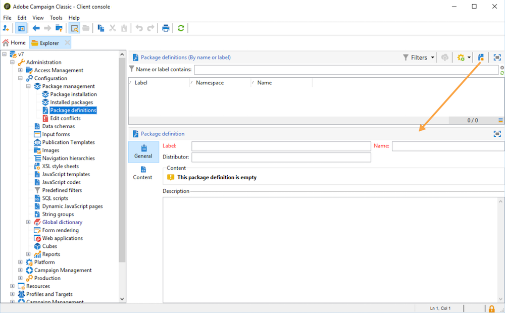

# Werken met gegevenspakketten{#working-with-data-packages}

## Over gegevenspakketten {#about-data-packages}

Met Adobe Campaign kunt u de platformconfiguratie en gegevens via een pakketsysteem exporteren of importeren. Pakketten kunnen verschillende configuraties, elementen bevatten, al dan niet gefilterd.

Met gegevenspakketten kunnen entiteiten van de Adobe Campagne-database worden weergegeven via bestanden in XML-indeling. Elke entiteit in een pakket wordt met al zijn gegevens vertegenwoordigd.

Het beginsel van **gegevenspakketten** is een gegevensconfiguratie uit te voeren en het te integreren in een ander systeem van de Campagne van Adobe. Voor meer informatie over hoe te om een verenigbare reeks gegevenspakketten te handhaven, verwijs naar dit [technologie](https://docs.campaign.adobe.com/doc/AC/en/technicalResources/Technotes/AdobeCampaign_How_to_maintain_a_consistent_set_of_data_packages.pdf).

### Typen pakketten {#types-of-packages}

Er zijn drie soorten exporteerbare pakketten: gebruikerspakketten, platformpakketten en beheerpakketten.

* **Gebruikerspakket**: hiermee kunt u de lijst met te exporteren entiteiten selecteren. Dit type pakket beheert afhankelijkheden en controleert fouten.
* **Platform-pakket**: het omvat alle toegevoegde technische middelen ( niet standaard ) : schema&#39;s, JavaScript-code, enz.

   

* **Admin-pakket**: het omvat alle toegevoegde malplaatjes en bedrijfsvoorwerpen (niet norm): sjablonen, bibliotheken, enz.

   

>[!CAUTION]
>
>De **platform** - en **beheertypen** bevatten een vooraf gedefinieerde lijst met te exporteren entiteiten. Elke entiteit is verbonden met het filtreren voorwaarden die u toelaten om de uit-van-de-doosmiddelen van het gecreeerde pakket te verwijderen.

## Gegevensstructuur {#data-structure}

De beschrijving van een gegevenspakket is een gestructureerd XML-document dat voldoet aan de grammatica van het gegevensschema **xrk:navtree** .

Voorbeeld van gegevenspakketten:

```
<package>
  <entities schema="nms:recipient">
    <recipient email="john.smith@adobe.com" lastName="Smith" firstName="John">      
      <folder _operation="none" name="nmsRootFolder"/>      
      <company _operation="none" name="Adobe"/>
    </recipient>
  </entities>
  <entities schema="sfa:company">
    <company name="Adobe">
      location city="London" zipCode="W11 2BQ"/>
    </company>
  </entities>
</package>
```

Het XML-document moet beginnen en eindigen met het **`<package>`** element. Alle **`<entities>`** elementen die volgen, verdelen de gegevens op documenttype.

Een **`<entities>`** element bevat de gegevens van het pakket in het formaat van het gegevensschema ingegaan in het **schemaattribuut** .

De gegevens in een pakket mogen geen interne sleutels bevatten die niet compatibel zijn tussen databases, zoals automatisch gegenereerde toetsen (**optie Automatisch uitvoeren** ).

In ons voorbeeld zijn de verbindingen op de &quot;omslag&quot;en &quot;bedrijf&quot;verbindingen vervangen door zogenaamde &quot;high level&quot;sleutels op de bestemmingstabellen:

```
<recipient>
  <folder _operation="none" name="nmsRootFolder"/>
  <company _operation="none" name="Adobe"/>
</recipient>
```

Het **`operation`** attribuut met de waarde &quot;none&quot; definieert een afstemmingskoppeling.

Een gegevenspakket kan manueel van om het even welke tekstredacteur worden samengesteld. Zorg er gewoon voor dat de structuur van het XML-document voldoet aan het gegevensschema &quot;xtk:navtree&quot;. De Adobe Campaign-console heeft een module voor het exporteren en importeren van gegevenspakketten.

## Pakketten exporteren {#exporting-packages}

### Over exporteren van pakket {#about-package-export}

Pakketten kunnen op drie verschillende manieren worden geëxporteerd:

* Met **[!UICONTROL Package Export Wizard]** deze opdracht kunt u een set objecten in één pakket exporteren. Zie Een set objecten in een pakket [exporteren voor meer informatie](#exporting-a-set-of-objects-in-a-package)
* Een **enkel object** kan rechtstreeks in een pakket worden geëxporteerd door er met de rechtermuisknop op te klikken en te selecteren **[!UICONTROL Actions > Export in a package]**.
* **Met pakketdefinities** kunt u een pakketstructuur maken waarin u objecten toevoegt die later in een pakket worden geëxporteerd. Zie Pakketdefinities [beheren voor meer informatie](#managing-package-definitions)

Nadat een pakket is geëxporteerd, kunt u het pakket en alle toegevoegde entiteiten importeren in een andere Campagne-instantie.

### Een set objecten in een pakket exporteren {#exporting-a-set-of-objects-in-a-package}

De wizard voor het exporteren van pakketten is toegankelijk via het **[!UICONTROL Tools > Advanced > Export package...]** menu van de Adobe Campagne-clientconsole.


Voor de drie typen pakketten biedt de wizard de volgende stappen:

1. Geef de entiteiten weer die u wilt exporteren op documenttype:

   

   >[!CAUTION]
   >
   >Als u een map **[!UICONTROL Offer category]**, **[!UICONTROL Offer environment]****[!UICONTROL Program]** of een **[!UICONTROL Plan]** tekstmap exporteert, moet u nooit de **xtk:map** selecteren omdat er gegevens verloren kunnen gaan. Selecteer de entiteit die overeenkomt met de map: **nms:aanbiedingCategorie** voor aanbiedingscategorieën, **nms:aanbiedingEnv** voor aanbiedingsmilieu&#39;s, **nms:programma** voor programma&#39;s, en **nms:plan** voor plannen.

   Met lijstbeheer kunt u entiteiten voor export uit de configuratie toevoegen of verwijderen. Klik **[!UICONTROL Add]** om een nieuwe entiteit te selecteren.

   Met de **[!UICONTROL Detail]** knop bewerkt u de geselecteerde configuratie.

   >[!NOTE]
   >
   >Het afhankelijkheidsmechanisme bestuurt de uitvoersequentie van de entiteit. Voor meer op dit, verwijs naar het [Leiden gebiedsdelen](#managing-dependencies).

1. Het scherm van de entiteitconfiguratie bepaalt de filtervraag op het type van document dat moet worden gehaald.

   U moet de het filtreren clausule voor gegevensextractie vormen.

   

   >[!NOTE]
   >
   >De vraagredacteur wordt voorgesteld in [deze sectie](../../platform/using/about-queries-in-campaign.md).

1. Klik op de sorteerkolommen **[!UICONTROL Next]** en selecteer deze om de gegevens tijdens de extractie te ordenen:

   

1. Geef een voorvertoning weer van de gegevens die u wilt extraheren voordat u het exporteren uitvoert.

   

1. Op de laatste pagina van de wizard Pakket exporteren kunt u het exporteren starten. De gegevens worden opgeslagen in het bestand dat in het **[!UICONTROL File]** veld wordt aangegeven.

   

### Afhankelijkheden beheren {#managing-dependencies}

Met het exportmechanisme kan Adobe Campaign de koppelingen tussen de verschillende geëxporteerde elementen bijhouden.

Dit mechanisme wordt gedefinieerd door twee regels:

* objecten die zijn gekoppeld aan een koppeling met een **eigen** of **eigen** tekstintegriteit worden geëxporteerd in hetzelfde pakket als het geëxporteerde object.
* objecten die zijn gekoppeld aan een koppeling met een **neutrale** of **gedefinieerde** tekstintegriteit (gedefinieerde koppeling) moeten afzonderlijk worden geëxporteerd.

>[!NOTE]
>
>De types van integriteit verbonden aan schemaelementen worden bepaald in [deze sectie](../../configuration/using/database-mapping.md#links--relation-between-tables).

#### Een campagne exporteren {#exporting-a-campaign}

Hier volgt een voorbeeld van hoe u een campagne kunt exporteren. De uit te voeren marketingcampagne bevat een taak (label: &quot;MyTask&quot;) en een workflow (label: &quot;CampaignWorkflow&quot;) in een map &quot;MyWorkflow&quot; (knooppunt: Beheer / Productie / Technische workflows / Campagne processen / MyWorkflow).

De taak en de workflow worden geëxporteerd in hetzelfde pakket als de campagne, aangezien de overeenkomende schema&#39;s worden verbonden door koppelingen met een integriteit van het type &quot;own&quot;.

Inhoud pakket:

```
<?xml version='1.0'?>
<package author="Administrator (admin)" buildNumber="7974" buildVersion="6.1" img=""
label="" name="" namespace="" vendor="">
 <desc></desc>
 <version buildDate="2013-01-09 10:30:18.954Z"/>
 <entities schema="nms:operation">
  <operation duration="432000" end="2013-01-14" internalName="OP1" label="MyCampaign"
  modelName="opEmpty" start="2013-01-09">
   <controlGroup>
    <where filteringSchema=""/>
   </controlGroup>
   <seedList>
    <where filteringSchema="nms:seedMember"></where>
    <seedMember internalName="SDM1"></seedMember>
   </seedList>
   <parameter useAsset="1" useBudget="1" useControlGroup="1" useDeliveryOutline="1"
   useDocument="1" useFCPValidation="0" useSeedMember="1" useTask="1"
   useValidation="1" useWorkflow="1"></parameter>
   <fcpSeed>
    <where filteringSchema="nms:seedMember"></where>
   </fcpSeed>
   <owner _operation="none" name="admin" type="0"/>
   <program _operation="none" name="nmsOperations"/>
   <task end="2013-01-17 10:07:51.000Z" label="MyTask" name="TSK2" start="2013-01-16 10:07:51.000Z"
   status="1">
    <owner _operation="none" name="admin" type="0"/>
    <operation _operation="none" internalName="OP1"/>
    <folder _operation="none" name="nmsTask"/>
   </task>
   <workflow internalName="WKF12" label="CampaignWorkflow" modelName="newOpEmpty"
   order="8982" scenario-cs="Notification of the workflow supervisor (notifySupervisor)"
   schema="nms:recipient">
    <scenario internalName="notifySupervisor"/>
    <desc></desc>
    <folder _operation="none" name="Folder4"/>
    <operation _operation="none" internalName="OP1"/>
   </workflow>
  </operation>
 </entities>
</package>   
```

De verbinding aan een type van pakket wordt bepaald in een schema met het **@pkgAdmin en @pkgPlatform** attribuut. Beide eigenschappen ontvangen een XTK-expressie die de voorwaarden voor aansluiting bij het pakket definieert.

```
<element name="offerEnv" img="nms:offerEnv.png" 
template="xtk:folder" pkgAdmin="@id != 0">
```

Tot slot laat het **@pkgStatus** attribuut u toe om de de uitvoerregels voor deze elementen of attributen te bepalen. Afhankelijk van de waarde van het kenmerk, wordt het element of kenmerk gevonden in het geëxporteerde pakket. De drie mogelijke waarden voor dit kenmerk zijn:

* **nooit**: exporteert het veld/de koppeling niet
* **altijd**: exportkrachten voor dit gebied
* **preCreate**: hecht zijn goedkeuring aan de oprichting van de verbonden entiteit

>[!NOTE]
>
>De waarde **preCreate** wordt alleen geaccepteerd voor koppelingstypegebeurtenissen. Hiermee kunt u een entiteit maken of aanwijzen die nog niet in het geëxporteerde pakket is geladen.

## Pakketdefinities beheren {#managing-package-definitions}

### Pakketdefinities {#about-package-definitions}

Met pakketdefinities kunt u een pakketstructuur maken waarin u entiteiten toevoegt die later in één pakket worden geëxporteerd. Vervolgens kunt u dit pakket en alle toegevoegde entiteiten importeren in een andere Campagne-instantie.

**Verwante onderwerpen:**

* [Een pakketdefinitie maken](#creating-a-package-definition)
* [Entiteiten toevoegen aan een pakketdefinitie](#adding-entities-to-a-package-definition)
* [Genereren van pakketdefinities configureren](#configuring-package-definitions-generation)
* [Pakketten uit een pakketdefinitie exporteren](#exporting-packages-from-a-package-definition)

### Een pakketdefinitie maken {#creating-a-package-definition}

Pakketdefinities zijn toegankelijk via het **[!UICONTROL Administration > Configuration > Package management > Package definitions]** menu.

Als u een pakketdefinitie wilt maken, klikt u op de **[!UICONTROL New]** knop en vult u vervolgens de algemene informatie over de pakketdefinitie in.



Vervolgens kunt u entiteiten toevoegen aan de pakketdefinitie en deze exporteren naar een XML-bestandspakket.

**Verwante onderwerpen:**

* [Entiteiten toevoegen aan een pakketdefinitie](#adding-entities-to-a-package-definition)
* [Genereren van pakketdefinities configureren](#configuring-package-definitions-generation)
* [Pakketten uit een pakketdefinitie exporteren](#exporting-packages-from-a-package-definition)

### Entiteiten toevoegen aan een pakketdefinitie {#adding-entities-to-a-package-definition}

Klik op het **[!UICONTROL Content]** tabblad op de **[!UICONTROL Add]** knop om de entiteiten te selecteren die u met het pakket wilt exporteren. Aanbevolen procedures voor het selecteren van entiteiten worden weergegeven in de sectie Een set objecten [exporteren in een pakketsectie](#exporting-a-set-of-objects-in-a-package) .


Entiteiten kunnen rechtstreeks vanaf hun locatie in de instantie aan een pakketdefinitie worden toegevoegd. Hiervoor voert u de volgende stappen uit:

1. Klik met de rechtermuisknop op de gewenste entiteit en selecteer **[!UICONTROL Actions > Export in a package]**.

   

1. Selecteer **[!UICONTROL Add to a package definition]** vervolgens de pakketdefinitie waaraan u de entiteit wilt toevoegen.

   

1. De entiteit wordt toegevoegd aan de pakketdefinitie en wordt geëxporteerd met het pakket (zie Pakketten [exporteren uit een pakketdefinitie](#exporting-packages-from-a-package-definition)).

   

### Genereren van pakketdefinities configureren {#configuring-package-definitions-generation}

Pakketgeneratie kan worden geconfigureerd via het **[!UICONTROL Content]** tabblad pakketdefinitie. Klik hiertoe op de **[!UICONTROL Generation parameters]** koppeling.


* **[!UICONTROL Include the definition]**: bevat de definitie die momenteel wordt gebruikt in de pakketdefinitie.
* **[!UICONTROL Include an installation script]**: Hiermee kunt u een JavaScript-script toevoegen dat wordt uitgevoerd bij het importeren van het pakket. Als deze optie is geselecteerd, wordt een **[!UICONTROL Script]** tab toegevoegd aan het scherm met pakketdefinities.
* **[!UICONTROL Include default values]**: voegt de waarden van alle kenmerken van de entiteiten toe aan het pakket.

   Deze optie is niet standaard geselecteerd om langdurige export te voorkomen. Dit betekent dat de attributen van entiteiten met standaardwaarden (&quot;lege koord&quot;, &quot;0&quot;, en &quot;vals&quot;als niet anders bepaald in het schema) niet aan het pakket zullen worden toegevoegd en daarom niet zullen worden uitgevoerd.

   >[!CAUTION]
   >
   >Als u deze optie uitschakelt, worden lokale en geïmporteerde versies samengevoegd.
   >
   >Als de instantie waarin het pakket wordt geïmporteerd, entiteiten bevat die identiek zijn aan die van het pakket (bijvoorbeeld met dezelfde externe id), worden de kenmerken ervan niet bijgewerkt. Dit kan gebeuren als de kenmerken van de eerste instantie standaardwaarden hebben, omdat ze niet in het pakket zijn opgenomen.
   >
   >In dat geval voorkomt u dat versies worden samengevoegd door de **[!UICONTROL Include default values]** optie te selecteren, aangezien alle kenmerken van de eerste instantie samen met het pakket worden geëxporteerd.

### Pakketten uit een pakketdefinitie exporteren {#exporting-packages-from-a-package-definition}

Voer de volgende stappen uit om een pakket uit een pakketdefinitie te exporteren:

1. Selecteer de pakketdefinitie die u wilt exporteren, klik op de **[!UICONTROL Actions]** knop en selecteer **[!UICONTROL Export the package]**.
1. Een XML-bestand dat overeenkomt met het geëxporteerde pakket wordt standaard geselecteerd. De naam wordt bepaald door de naamruimte en naam van de pakketdefinitie.
1. Nadat de pakketnaam en -locatie zijn gedefinieerd, klikt u op de **[!UICONTROL Start]** knop om het exporteren te starten.

   

## Pakketten importeren {#importing-packages}

### Over importeren van pakket {#about-package-import}

De wizard voor het importeren van pakketten is toegankelijk via het hoofdmenu **[!UICONTROL Tools > Advanced > Package import...]** van de Adobe Campagne-clientconsole.

U kunt een pakket importeren uit een eerder uitgevoerde exportbewerking, bijvoorbeeld uit een ander Adobe Campagne-exemplaar of uit een standaardpakket, afhankelijk van de voorwaarden van uw licentie.


### Een pakket installeren vanuit een bestand {#installing-a-package-from-a-file}

Als u een bestaand gegevenspakket wilt importeren, selecteert u het XML-bestand en klikt u op **[!UICONTROL Open]**.


De inhoud van het te importeren pakket wordt vervolgens in het middelste gedeelte van de editor weergegeven.

Klik **[!UICONTROL Next]** en **[!UICONTROL Start]** om het importeren te starten.


### Een standaardpakket installeren {#installing-a-standard-package}

De standaardpakketten worden geïnstalleerd wanneer de Campagne van Adobe wordt gevormd. Afhankelijk van uw toestemmingen en uw plaatsingsmodel, kunt u nieuwe standaardpakketten invoeren als u nieuwe opties of toe:voegen-ons verwerft, of als u aan een nieuwe aanbieding bevordert.

Raadpleeg de licentieovereenkomst om te controleren welke pakketten u kunt installeren.

Raadpleeg [deze pagina](../../installation/using/installing-campaign-standard-packages.md)voor meer informatie over standaardpakketten.
