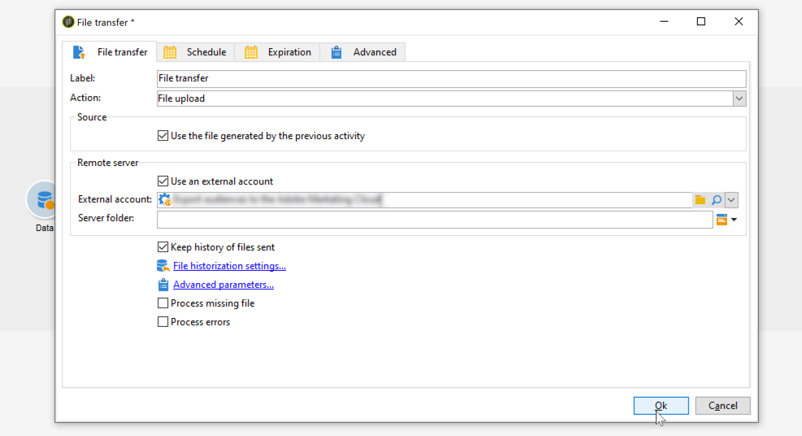

# Een bestand {#zipping-or-encrypting-a-file} uitpakken of versleutelen

Met Adobe Campaign kunt u gecomprimeerde of gecodeerde bestanden exporteren. Wanneer u een exportbewerking definieert aan de hand van een **[!UICONTROL Data extraction (file)]**-activiteit, kunt u een nabewerkingsbewerking definiëren als ZIP-bestand of het bestand versleutelen.

Om dit te kunnen doen:

1. Installeer een sleutelpaar GPG voor uw instantie gebruikend [Controlebord](https://docs.adobe.com/content/help/en/control-panel/using/instances-settings/gpg-keys-management.html#encrypting-data).

   >[!NOTE]
   >
   >Het Configuratiescherm is beschikbaar voor alle klanten die op AWS worden gehost (behalve voor klanten die hun marketinginstanties op locatie hosten).

1. Als uw installatie van Adobe Campaign wordt gehost door Adobe, neemt u contact op met [Adobe Customer Care](https://helpx.adobe.com/enterprise/admin-guide.html/enterprise/using/support-for-experience-cloud.ug.html) om de benodigde hulpprogramma&#39;s op de server te installeren.
1. Als de installatie van Adobe Campaign op locatie plaatsvindt, installeert u het hulpprogramma dat u wilt gebruiken (bijvoorbeeld: GPG, GZIP) en de benodigde sleutels (coderingssleutel) op de toepassingsserver.

Vervolgens kunt u opdrachten of code gebruiken op het tabblad **[!UICONTROL Script]** van de activiteit of in een activiteit **[!UICONTROL JavaScript code]**. In het onderstaande gebruiksgeval wordt een voorbeeld gegeven.

**Verwante onderwerpen:**

* [Een bestand uitpakken of decoderen voordat het wordt verwerkt](../../platform/using/unzip-decrypt.md)
* [Activiteit](../../workflow/using/extraction--file-.md) voor gegevensextractie (bestand).

## Hoofdlettergebruik: Gegevens coderen en exporteren met behulp van een sleutel die is geïnstalleerd in het Configuratiescherm {#use-case-gpg-encrypt}

In dit geval, zullen wij een werkschema bouwen om gegevens te coderen en uit te voeren gebruikend een sleutel die op Controlebord wordt geïnstalleerd.

 [Ontdek deze functie in video](#video)

De volgende stappen worden uitgevoerd:

1. Genereer een sleutelpaar van GPG (openbaar/privé) gebruikend een nut van GPG, dan installeer de openbare sleutel op Controlebord. Gedetailleerde stappen zijn beschikbaar in [documentatie van het Configuratiescherm](https://docs.adobe.com/content/help/en/control-panel/using/instances-settings/gpg-keys-management.html#encrypting-data).

1. In Campaign Classic, bouwt een werkschema om de gegevens uit te voeren en het te coderen gebruikend de privé sleutel die via het Controlebord is geïnstalleerd. Hiervoor maken we als volgt een workflow:

   

   * **[!UICONTROL Query]** activiteit: In dit voorbeeld, willen wij een vraag uitvoeren om de gegevens van het gegevensbestand te richten dat wij willen uitvoeren.
   * **[!UICONTROL Data extraction (file)]** activiteit: Extraheert de gegevens naar een bestand.
   * **[!UICONTROL JavaScript code]** activiteit: Codeert de gegevens die u wilt extraheren.
   * **[!UICONTROL File transfer]** activiteit: Hiermee verzendt u de gegevens naar een externe bron (in dit voorbeeld een SFTP-server).

1. Vorm **[!UICONTROL Query]** activiteit om de gewenste gegevens van het gegevensbestand te richten. Raadpleeg [deze sectie](../../workflow/using/query.md) voor meer informatie.

1. Open de **[!UICONTROL Data extraction (file)]** activiteit dan vorm het op uw behoeften. De globale concepten op hoe te om de activiteit te vormen zijn beschikbaar in [deze sectie](../../workflow/using/extraction--file-.md).

   

1. Open de **[!UICONTROL JavaScript code]** activiteit, dan kopieer-kleef het hieronder bevel om de gegevens te coderen om te halen.

   >[!IMPORTANT]
   >
   >Zorg ervoor dat u de **vingerafdruk**-waarde van de opdracht vervangt door de vingerafdruk van de openbare sleutel die in het Configuratiescherm is geïnstalleerd.

   ```
   var cmd='gpg ';
   cmd += ' --trust-model always';
   cmd += ' --batch --yes';
   cmd += ' --recipient fingerprint';
   cmd += ' --encrypt --output ' + vars.filename + '.gpg ' + vars.filename;
   execCommand(cmd,true);
   vars.filename=vars.filename + '.gpg'
   ```

   

1. Open de **[!UICONTROL File transfer]** activiteit, dan specificeer de server SFTP waarnaar u het dossier wilt verzenden. De globale concepten op hoe te om de activiteit te vormen zijn beschikbaar in [deze sectie](../../workflow/using/file-transfer.md).

   

1. U kunt de workflow nu uitvoeren. Zodra het wordt uitgevoerd, zal het gegevensdoel door de vraag naar de server SFTP in een gecodeerd.gpg- dossier worden uitgevoerd.

## Video over zelfstudie {#video}

In deze video wordt getoond hoe u een GPG-sleutel kunt gebruiken om gegevens te coderen. Deze video is ook beschikbaar in

>[!VIDEO](https://video.tv.adobe.com/v/36399?quality=12)

Er zijn [hier](https://experienceleague.adobe.com/docs/campaign-classic-learn/tutorials/overview.html?lang=nl) extra Campaign Classic hoe kan ik-video&#39;s beschikbaar.
