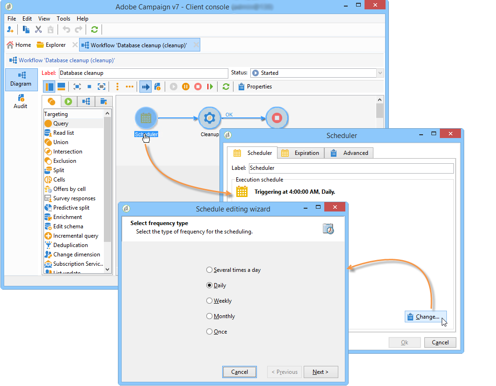

# Workflow voor het opschonen van databases{#database-cleanup-workflow}


## Inleiding {#introduction}

De **[!UICONTROL Database cleanup]** via de **[!UICONTROL Administration > Production > Technical workflows]** knoop, laat u verouderde gegevens schrappen om exponentiële groei van het gegevensbestand te vermijden. De workflow wordt automatisch geactiveerd zonder tussenkomst van de gebruiker.


## Configuratie {#configuration}

De database wordt op twee niveaus opgeschoond: in de werkstroomplanner en in de plaatsingstovenaar.

### Workflowplanner {#the-scheduler}

>[!NOTE]
>
>Voor meer op de planner, verwijs naar [deze sectie](../../workflow/using/scheduler.md).

Standaard worden de **[!UICONTROL Database cleanup]** de workflow is geconfigureerd om dagelijks om 4.00 uur te beginnen. De planner laat u het werkschema veranderen die frequentie teweegbrengen. De volgende frequenties zijn beschikbaar:

* **[!UICONTROL Several times a day]**
* **[!UICONTROL Daily]**
* **[!UICONTROL Weekly]**
* **[!UICONTROL Once]**



>[!IMPORTANT]
>
>Om **[!UICONTROL Database cleanup]** werkschema om bij de datum en de tijd te beginnen die in de planner wordt bepaald, moet de werkschemamotor (wfserver) worden begonnen.

### Implementatiewizard {#deployment-wizard}

De **[!UICONTROL Deployment wizard]**, toegankelijk via de **[!UICONTROL Tools > Advanced]** , kunt u configureren hoe lang gegevens worden opgeslagen. Waarden worden uitgedrukt in dagen. Als deze waarden niet worden gewijzigd, gebruikt de workflow de standaardwaarden.


De velden van de **[!UICONTROL Purge of data]** vallen samen met de volgende opties. Deze worden gebruikt door sommige van de taken die worden uitgevoerd door de **[!UICONTROL Database cleanup]** workflow:

* Geconsolideerde reeksspatiëring: **NmsCleanup_TrackingStatePurgeDelay** (zie [Opschonen van trackinglogboeken](#cleanup-of-tracking-logs))
* Leveringslogboeken: **NmsCleanup_BroadLogPurgeDelay** (zie [Opschonen van leveringslogboeken](#cleanup-of-delivery-logs))
* Logbestanden bijhouden: **NmsCleanup_TrackingLogPurgeDelay** (zie [Opschonen van trackinglogboeken](#cleanup-of-tracking-logs))
* Verwijderde leveringen: **NmsCleanup_RecycledDeliveryPurgeDelay** (zie [Reiniging van te verwijderen of te recyclen leveringen](#cleanup-of-deliveries-to-be-deleted-or-recycled))
* Import weigert: **NmsCleanup_RejectsPurgeDelay** (zie [Reiniging van door invoer gegenereerde afwijzingen](#cleanup-of-rejects-generated-by-imports-))
* Bezoekersprofielen: **NmsCleanup_VisitorPurgeDelay** (zie [Opschonen van bezoekers](#cleanup-of-visitors))
* Voorstellen voorstellen: **NmsCleanup_PropositionPurgeDelay** (zie [Opschonen van voorstellen](#cleanup-of-propositions))

   >[!NOTE]
   >
   >De **[!UICONTROL Offer propositions]** veld is alleen beschikbaar als de **Interactie** is geïnstalleerd.

* Gebeurtenissen: **NmsCleanup_EventPurgeDelay** (zie [Verlopen gebeurtenissen wissen](#cleansing-expired-events))
* Gearchiveerde gebeurtenissen: **NmsCleanup_EventHistoPurgeDelay** (zie [Verlopen gebeurtenissen wissen](#cleansing-expired-events))

   >[!NOTE]
   >
   >De **[!UICONTROL Events]** en **[!UICONTROL Archived events]** velden zijn alleen beschikbaar als de **Berichtencentrum** is geïnstalleerd.

* Audittrail: **XtkCleanup_AuditTrailPurgeDelay** (zie [Reiniging van audittrail](#cleanup-of-audit-trail))

Alle taken die door **[!UICONTROL Database cleanup]** wordt in de volgende sectie beschreven.

## Taken die worden uitgevoerd door de workflow voor het opschonen van databases {#tasks-carried-out-by-the-database-cleanup-workflow}

Op de datum en tijd die in de werkstroomplanner worden bepaald (verwijs naar [De planner](#the-scheduler)), start de workflow-engine het opschonen van de database. De schoonmaakbeurt van het Gegevensbestand verbindt met het gegevensbestand en voert de taken in de hieronder getoonde opeenvolging uit.

>[!IMPORTANT]
>
>Als een van deze taken mislukt, worden de volgende niet uitgevoerd.
>
>SQL-query&#39;s met een **LIMIET** kenmerk wordt herhaaldelijk uitgevoerd totdat alle informatie is verwerkt.


### Lijsten om opschoonbewerking te verwijderen {#lists-to-delete-cleanup}

De eerste taak die door de **[!UICONTROL Database cleanup]** alle groepen met de **deleteStatus != 0** kenmerk van de **NmsGroup**. De verslagen verbonden aan deze groepen en die in andere lijsten bestaan worden ook geschrapt.

1. Lijsten die moeten worden verwijderd, worden hersteld met de volgende SQL-query:

   ```sql
   SELECT iGroupId, sLabel, iType FROM NmsGroup WHERE iDeleteStatus <> 0 OR tsExpirationDate <= GetDate() 
   ```

1. Elke lijst bevat verschillende koppelingen naar andere tabellen. Al deze verbindingen worden geschrapt in bulk gebruikend de volgende vraag:

   ```sql
   DELETE FROM $(relatedTable) WHERE iGroupId=$(l) IN (SELECT iGroupId FROM $(relatedTable) WHERE iGroupId=$(l) LIMIT 5000) 
   ```

   waar `$(relatedTable)` is een tabel die betrekking heeft op **NmsGroup** en `$(l)` is de lijst-id.

1. Wanneer de lijst een lijst van het type &quot;Lijst&quot;is, wordt de bijbehorende lijst geschrapt gebruikend de volgende vraag:

   ```sql
   DROP TABLE grp$(l)
   ```

1. Elke **Selecteren** typelijst die door de bewerking wordt hersteld, wordt verwijderd met de volgende query:

   ```sql
   DELETE FROM NmsGroup WHERE iGroupId=$(l) 
   ```

   waar `$(l)` is de lijst-id

### Reiniging van te verwijderen of te recyclen leveringen {#cleanup-of-deliveries-to-be-deleted-or-recycled}

Met deze taak worden alle leveringen verwijderd of gerecycleerd.

1. De **[!UICONTROL Database cleanup]** worden alle leveringen geselecteerd waarvoor de **deleteStatus** veld heeft de waarde **[!UICONTROL Yes]** of **[!UICONTROL Recycled]** en waarvan de datum van schrapping vroeger is dan de in **[!UICONTROL Deleted deliveries]** (**NmsCleanup_RecycledDeliveryPurgeDelay**) van de implementatiewizard. Raadpleeg voor meer informatie hierover [Implementatiewizard](#deployment-wizard). Deze periode wordt berekend op basis van de huidige serverdatum.
1. Voor elke server voor midsourcing selecteert de taak de lijst met te verwijderen leveringen.
1. De **[!UICONTROL Database cleanup]** de werkstroom schrapt leveringslogboeken, gehechtheid, spiegelpaginainformatie en alle andere verwante gegevens.
1. Voordat de levering goed wordt verwijderd, worden de gekoppelde gegevens in de volgende tabellen gewist:

   * In de uitsluitingstabel van de levering (**NmsDlvExclusion**), wordt de volgende query gebruikt:

      ```sql
      DELETE FROM NmsDlvExclusion WHERE iDeliveryId=$(l)
      ```

      waar **$(l)** is de identificatiecode van de levering.

   * In de coupontabel (**NmsCouponValue**), wordt de volgende zoekopdracht gebruikt (met massale schrappingen):

      ```sql
      DELETE FROM NmsCouponValue WHERE iMessageId IN (SELECT iMessageId FROM NmsCouponValue WHERE EXISTS (SELECT B.iBroadLogId FROM $(BroadLogTableName) B WHERE B.iDeliveryId = $(l) AND B.iBroadLogId = iMessageId ) LIMIT 5000)
      ```

      waar `$(l)` is de identificatiecode van de levering.

   * In de lijsten van het leveringslogboek (**NmsBroadlogXxx**), worden massale verwijderingen uitgevoerd in partijen van 20.000 records.
   * In de tabellen met voorstellen (**NmsPropositionXxx**), worden massale verwijderingen uitgevoerd in partijen van 20.000 records.
   * In de volgende logtabellen (**NmsTrackinglogXxx**), worden massale verwijderingen uitgevoerd in partijen van 20.000 records.
   * In de tabel met het leveringsfragment (**NmsDeliveryPart**), worden massale verwijderingen uitgevoerd in partijen van 500.000 records. Deze lijst bevat verpersoonlijkingsinformatie over de resterende te leveren berichten.
   * In de tabel met gegevensfragmenten op de spiegelpagina (**NmsMirrorPageInfo**) worden massavernietigingen uitgevoerd in partijen van 20.000 records voor verlopen leveringsonderdelen en voor afgewerkte of geannuleerde onderdelen. Deze lijst bevat verpersoonlijkingsinformatie over alle berichten die voor het produceren van spiegelpagina&#39;s worden gebruikt.
   * In de tabel met zoekopdrachten op de spiegelpagina (**NmsMirrorPageSearch**), worden massale verwijderingen uitgevoerd in partijen van 20.000 records. Deze lijst is een onderzoeksindex die toegang tot verpersoonlijkingsinformatie verleent die in wordt opgeslagen **NmsMirrorPageInfo** tabel.
   * In de logboeklijst van het partijproces (**XtkJobLog**), worden massale verwijderingen uitgevoerd in partijen van 20.000 records. Deze tabel bevat het logboek met te verwijderen leveringen.
   * In de tabel URL van levering (**NmsTrackingUrl**), wordt de volgende query gebruikt:

      ```sql
      DELETE FROM NmsTrackingUrl WHERE iDeliveryId=$(l)
      ```

      waar `$(l)` is de identificatiecode van de levering.

      Deze tabel bevat de URL&#39;s in de te verwijderen items, zodat deze kunnen worden bijgehouden.

1. De levering wordt geschrapt uit de leveringstabel (**NmsDelivery**):

   ```sql
   DELETE FROM NmsDelivery WHERE iDeliveryId = $(l)
   ```

   waar `$(l)` is de identificatiecode van de levering.

#### Leveringen met behulp van mid-sourcing {#deliveries-using-mid-sourcing}

De **[!UICONTROL Database cleanup]** worden ook leveringen op de server(s) voor midsourcing verwijderd.

1. Hiervoor controleert de workflow of elke levering inactief is (op basis van de status). Als een levering actief is, wordt deze gestopt voordat deze wordt verwijderd. De controle wordt uitgevoerd door de volgende vraag uit te voeren:

   ```sql
   SELECT iState FROM NmsDelivery WHERE iDeliveryId = $(l) AND iState <> 100;
   ```

   waar **$(l)** is de identificatiecode van de levering.

1. Als de waarde van de status **[!UICONTROL Start pending]** , **[!UICONTROL In progress]** , **[!UICONTROL Recovery pending]** , **[!UICONTROL Recovery in progress]** , **[!UICONTROL Pause requested]** , **[!UICONTROL Pause in progress]** , of **[!UICONTROL Paused]** (waarden 51, 55, 61, 62, 71, 72, 75), de levering wordt gestopt en de taak zuivert de verwante informatie.

### Opschonen van verlopen leveringen {#cleanup-of-expired-deliveries}

Met deze taak worden leveringen gestopt waarvan de geldigheidsperiode is verlopen.

1. De **[!UICONTROL Database cleanup]** de workflow maakt een lijst met verlopen leveringen. Deze lijst bevat alle verlopen leveringen met een andere status dan **[!UICONTROL Finished]** en onlangs stopte met leveringen met meer dan 10.000 niet-verwerkte berichten. De volgende query wordt gebruikt:

   ```sql
   SELECT iDeliveryId, iState FROM NmsDelivery WHERE iDeleteStatus=0 AND iIsModel=0 AND iDeliveryMode=1 AND ( (iState >= 51 AND iState < 85 AND tsValidity IS NOT NULL AND tsValidity < $(currentDate) ) OR (iState = 85 AND DateMinusDays(15) < tsLastModified AND iToDeliver - iProcessed >= 10000 ))
   ```

   waar `delivery mode 1` komt overeen met de **[!UICONTROL Mass delivery]** modus, `state 51` komt overeen met de **[!UICONTROL Start pending]** staat, `state 85` komt overeen met de **[!UICONTROL Stopped]** staat, en het hoogste aantal leveringslogboeken massa-bijgewerkt op de leveringsserver evenaart 10.000.

1. De workflow bevat vervolgens een lijst met onlangs verlopen leveringen die gebruikmaken van mid-sourcing. Leveringen waarvoor nog geen leveringslogs via de server voor midsourcing zijn hersteld, zijn uitgesloten.

   De volgende query wordt gebruikt:

   ```sql
   SELECT iDeliveryId, tsValidity, iMidRemoteId, mData FROM NmsDelivery WHERE (iDeliveryMode = 4 AND (iState = 85 OR iState = 95) AND tsValidity IS NOT NULL AND (tsValidity < SubDays(GetDate() , 15) OR tsValidity < $(DateOfLastLogPullUp)) AND tsLastModified > SubDays(GetDate() , 15))
   ```

1. De volgende vraag wordt gebruikt om te ontdekken al dan niet de externe rekening nog actief is, voor het filtreren leveringen door datum:

   ```sql
   SELECT iExtAccountId FROM NmsExtAccount WHERE iActive<>0 AND sName=$(providerName)
   ```

1. In de lijst met verlopen leveringen, leveringslogs waarvan de status is **[!UICONTROL Pending]** , overschakelen op **[!UICONTROL Delivery cancelled]** en alle leveringen in deze lijst schakelen over op **[!UICONTROL Finished]** .

   De volgende query&#39;s worden gebruikt:

   ```sql
   UPDATE $(BroadLogTableName) SET tsLastModified=$(curdate), iStatus=7, iMsgId=$(bl) WHERE iDeliveryId=$(dl) AND iStatus=6
   ```

   waar `$(curdate)`de huidige datum van de databaseserver is, `$(bl)` de identificatiecode van het bericht van de leveringslogs; `$(dl)` de identificatiecode van de levering; `delivery status 6` komt overeen met de **[!UICONTROL Pending]** status en `delivery status 7` komt overeen met de **[!UICONTROL Delivery cancelled]** status.

   ```sql
   UPDATE NmsDelivery SET iState = 95, tsLastModified = $(curdate), tsBroadEnd = tsValidity WHERE iDeliveryId = $(dl)
   ```

   waar `delivery state 95` komt overeen met de **[!UICONTROL Finished]** status, en `$(dl)` is de identificatiecode van de levering.

1. Alle fragmenten (**deliveryParts**) van verouderde leveringen worden verwijderd en alle verouderde fragmenten van lopende meldingsleveringen worden verwijderd. Mass-delete wordt gebruikt voor beide taken.

   De volgende query&#39;s worden gebruikt:

   ```sql
   DELETE FROM NmsDeliveryPart WHERE iDeliveryPartId IN (SELECT iDeliveryPartId FROM NmsDeliveryPart WHERE iDeliveryId IN (SELECT iDeliveryId FROM NmsDelivery WHERE iState=95 OR iState=85) LIMIT 5000)
   ```

   ```sql
   DELETE FROM NmsDeliveryPart WHERE iDeliveryPartId IN (SELECT iDeliveryPartId FROM NmsDeliveryPart WHERE tsValidity < $(curDate) LIMIT 500000)
   ```

   waar `delivery state 95` komt overeen met de **[!UICONTROL Finished]** status, `delivery state 85` komt overeen met de **[!UICONTROL Stopped]** status, en `$(curDate)` is de huidige serverdatum.

### Overbodig verwijderen van spiegelpagina&#39;s {#cleanup-of-mirror-pages}

Met deze taak verwijdert u de webbronnen (spiegel-pagina&#39;s) die door leveringen worden gebruikt.

1. Ten eerste wordt de lijst met te wissen leveringen hersteld met behulp van de volgende query:

   ```sql
   SELECT iDeliveryId, iNeedMirrorPage FROM NmsDelivery WHERE iWebResPurged = 0 AND tsWebValidity IS NOT NULL AND tsWebValidity < $(curdate)"
   ```

   waar `$(curDate)` is de huidige serverdatum.

1. De **NmsMirrorPageInfo** de tabel wordt vervolgens gezuiverd, zo nodig met behulp van de identificatiecode van de eerder teruggewonnen levering. De massa-schrapping wordt gebruikt om de volgende vragen te produceren:

   ```sql
   DELETE FROM NmsMirrorPageInfo WHERE iMirrorPageInfoId IN (SELECT iMirrorPageInfoId FROM NmsMirrorPageInfo WHERE iDeliveryId = $(dl)) LIMIT 5000)
   ```

   ```sql
   DELETE FROM NmsMirrorPageSearch WHERE iMessageId IN (SELECT iMessageId FROM NmsMirrorPageSearch WHERE iDeliveryId = $(dl)) LIMIT 5000)
   ```

   waar `$(dl)` is de identificatiecode van de levering.

1. Een ingang wordt dan toegevoegd aan het leveringslogboek.
1. De geraffineerde leveringen worden vervolgens geïdentificeerd, zodat ze niet later opnieuw hoeven te worden verwerkt. De volgende query wordt uitgevoerd:

   ```sql
   UPDATE NmsDelivery SET iWebResPurged = 1 WHERE iDeliveryId IN ($(strIn))
   ```

   waar `$(strIn)` is de lijst van leveringsidentificatoren.

### Opschonen van werktabellen {#cleanup-of-work-tables}

Deze taak verwijdert uit het gegevensbestand, alle werklijsten die levering aanpassen waarvan status is **[!UICONTROL Being edited]** , **[!UICONTROL Stopped]** of **[!UICONTROL Deleted]** .

1. De lijst met tabellen met namen die beginnen met **wkDlv_** wordt teruggekregen eerst met de volgende vraag (postgresql):

   ```sql
   SELECT relname FROM pg_class WHERE relname LIKE Lower('wkDlv_') ESCAPE E'\\' AND relkind IN ('r','v') AND pg_get_userbyid(relowner)<>'postgres'
   ```

1. De tabellen die worden gebruikt door werkstromen die worden uitgevoerd, worden dan uitgesloten. Hiervoor wordt de lijst met lopende leveringen hersteld met behulp van de volgende query:

   ```sql
   SELECT iDeliveryId FROM NmsDelivery WHERE iDeliveryId<>0 AND iDeleteStatus=0 AND iState NOT IN (0,85,100);
   ```

   waar `0` is de waarde die overeenkomt met de **[!UICONTROL Being edited]** leveringsstatus; `85` komt overeen met de **[!UICONTROL Stopped]** status en `100` komt overeen met de **[!UICONTROL Deleted]** status.

1. De lijsten die niet meer worden gebruikt zullen worden geschrapt gebruikend de volgende vraag:

   ```sql
   DROP TABLE wkDlv_15487_1;
   ```

### Reiniging van door invoer gegenereerde afwijzingen {#cleanup-of-rejects-generated-by-imports-}

Met deze stap kunt u records verwijderen waarvoor niet alle gegevens tijdens het importeren zijn verwerkt.

1. De massale schrapping wordt uitgevoerd op de **XtkReject** tabel met de volgende query:

   ```sql
   DELETE FROM XtkReject WHERE iRejectId IN (SELECT iRejectId FROM XtkReject WHERE tsLog < $(curDate)) LIMIT $(l))
   ```

   waar `$(curDate)` is de huidige serverdatum waarvan we de periode aftrekken die is gedefinieerd voor de **NmsCleanup_RejectsPurgeDelay** (raadpleeg [Implementatiewizard](#deployment-wizard)) en `$(l)` het maximumaantal te verwijderen records is.

1. Alle wezen worden dan geschrapt gebruikend de volgende vraag:

   ```sql
   DELETE FROM XtkReject WHERE iJobId NOT IN (SELECT iJobId FROM XtkJob)
   ```

### Opschonen van workflowinstanties {#cleanup-of-workflow-instances}

Met deze taak wist u elke werkstroominstantie met de bijbehorende id (**lWorkflowId**) en geschiedenis (**Geschiedenis**). Het schrapt inactieve lijsten door de werktable schoonmaakbeurttaak opnieuw in werking te stellen. De opschoning verwijdert ook alle zwevende werktabellen (wkf% en wkfhisto%) van verwijderde workflows.

>[!NOTE]
>
>De zuiveringsfrequentie van de geschiedenis wordt voor elke workflow in het dialoogvenster **Geschiedenis in dagen** veld (standaardwaarde 30 dagen). Dit veld is te vinden in het dialoogvenster **Uitvoering** tabblad van de workfloweigenschappen. Raadpleeg [deze sectie](../../workflow/using/workflow-properties.md#execution) voor meer informatie.

1. De volgende query wordt gebruikt om de lijst met te verwijderen workflows te herstellen:

   ```sql
   SELECT iWorkflowId, iHistory FROM XtkWorkflow WHERE iWorkflowId<>0
   ```

1. Deze vraag produceert de lijst van werkschema&#39;s die zal worden gebruikt om alle verbonden logboeken, gebeëindigde taken en gebeëindigde gebeurtenissen te schrappen, gebruikend de volgende vragen:

   ```sql
   DELETE FROM XtkWorkflowLog WHERE iWorkflowId=$(lworkflow) AND tsLog < DateMinusDays($(lhistory))
   ```

   ```sql
   DELETE FROM XtkWorkflowTask WHERE iWorkflowId=$(lworkflow) AND iStatus<>0 AND tsCompletion < DateMinusDays($(lhistory)) 
   ```

   ```sql
   DELETE FROM XtkWorkflowEvent WHERE iWorkflowId=$(l) AND iStatus>2 AND tsProcessing < DateMinusDays($(lHistory))
   ```

   waar `$(lworkflow)` is de id van de workflow en `$(lhistory)` is de id van de geschiedenis.

1. Alle ongebruikte tabellen worden verwijderd. Hiertoe worden alle tabellen verzameld via een **wkf%** typemasker die de volgende vraag (postgresql) gebruikt:

   ```sql
   SELECT relname FROM pg_class WHERE relname LIKE Lower('wkf%') ESCAPE E'\\' AND relkind IN ('r','v') AND pg_get_userbyid(relowner)<>'postgres'
   ```

1. Vervolgens worden alle tabellen die worden gebruikt door een instantie van een werkstroom die in behandeling is, uitgesloten. De lijst met actieve workflows wordt hersteld met behulp van de volgende query:

   ```sql
   SELECT iWorkflowId FROM XtkWorkflow WHERE iWorkflowId<>0 AND iState<>20
   ```

1. Elke werkstroom-id wordt vervolgens hersteld om de naam te vinden van de tabellen die worden gebruikt door werkstromen die worden uitgevoerd. Deze namen zijn uitgesloten van de lijst met eerder herstelde tabellen.
1. De &quot;stijgende vraag&quot;de lijsten van het type van vraagactiviteit zijn uitgesloten gebruikend de volgende vragen:

   ```sql
   SELECT relname FROM pg_class WHERE relname LIKE Lower('wkfhisto%') ESCAPE E'\\' AND relkind IN ('r','v') AND pg_get_userbyid(relowner)<>'postgres'
   ```

   ```sql
   SELECT iWorkflowId FROM XtkWorkflow WHERE iWorkflowId IN ($(strCondition))
   ```

   waar `$(strcondition)` is de lijst met tabellen die overeenkomen met de **wkfhisto%** masker.

1. De overige tabellen worden verwijderd met de volgende query:

   ```sql
   DROP TABLE wkf15487_12;
   ```

### Opschonen van workflowlogins {#cleanup-of-workflow-logins}

Met deze taak verwijdert u workflowaanmeldingen met de volgende query:

```sql
DELETE FROM XtkWorkflowLogin WHERE iWorkflowId NOT IN (SELECT iWorkflowId FROM XtkWorkflow)
```

### Opruiming van verweesde werktabellen {#cleanup-of-orphan-work-tables}

Met deze taak verwijdert u zwevende werktabellen die aan groepen zijn gekoppeld. De **NmsGroup** in de tabel worden de groepen opgeslagen die moeten worden gereinigd (met een ander type dan 0). Het voorvoegsel van de tabelnamen is **grp**. Om de te reinigen groepen te identificeren, wordt de volgende vraag gebruikt:

```sql
SELECT iGroupId FROM NmsGroup WHERE iType>0"
```

### Opschonen van bezoekers {#cleanup-of-visitors}

Met deze taak verwijdert u overbodige records uit de bezoekerstabel door middel van massaverwijdering. De verouderde verslagen zijn die waarvoor de laatste wijziging vroeger is dan de bewaarperiode die in de plaatsingstovenaar wordt bepaald (verwijs naar [Implementatiewizard](#deployment-wizard)). De volgende query wordt gebruikt:

```sql
DELETE FROM NmsVisitor WHERE iVisitorId IN (SELECT iVisitorId FROM NmsVisitor WHERE iRecipientId = 0 AND tsLastModified < AddDays(GetDate(), -30) AND iOrigin = 0 LIMIT 20000)
```

waar `$(tsDate)` is de huidige serverdatum, waarvan wij de periode aftrekken die voor wordt bepaald **NmsCleanup_VisitorPurgeDelay** optie.

### Opruiming van NPAI {#cleanup-of-npai}

Met deze taak kunt u records verwijderen die overeenkomen met geldige adressen uit de **NmsAddress** tabel. De volgende vraag wordt gebruikt om massa-schrapping uit te voeren:

```sql
DELETE FROM NmsAddress WHERE iAddressId IN (SELECT iAddressId FROM NmsAddress WHERE iStatus=2 AND tsLastModified < $(tsDate1) AND tsLastModified >= $(tsDate2) LIMIT 5000)
```

waar `status 2` komt overeen met de **[!UICONTROL Valid]** status, `$(tsDate1)` de huidige serverdatum is, en `$(tsDate2)` komt overeen met de **NmsCleanup_LastCleanup** optie.

### Opschonen van abonnementen {#cleanup-of-subscriptions-}

Met deze taak worden alle abonnementen verwijderd die de gebruiker heeft verwijderd uit de **NmsSubscription** tabel, met gebruik van massale schrapping. De volgende query wordt gebruikt:

```sql
DELETE FROM NmsSubscription WHERE iDeleteStatus <>0
```

### Opschonen van trackinglogboeken {#cleanup-of-tracking-logs}

Met deze taak verwijdert u overbodige records uit de logtabellen voor bijhouden en webtracking. De verouderde verslagen zijn die die vroeger zijn dan de bewaarperiode die in de plaatsingstovenaar wordt bepaald (verwijs naar [Implementatiewizard](#deployment-wizard)).

1. Eerst, wordt de lijst van het volgen logboeklijsten teruggekregen gebruikend de volgende vraag:

   ```sql
   SELECT distinct(sTrackingLogSchema) FROM NmsDeliveryMapping WHERE sTrackingLogSchema IS NOT NULL;
   ```

1. Massa-schrapping wordt gebruikt om alle lijsten in de lijst van eerder teruggekregen lijsten te zuiveren. De volgende query wordt gebruikt:

   ```sql
   DELETE FROM NmsTrackingLogRcp WHERE iTrackingLogId IN (SELECT iTrackingLogId FROM NmsTrackingLogRcp WHERE tsLog < $(tsDate) LIMIT 5000) 
   ```

   waar `$(tsDate)` is de huidige serverdatum waarvan we de periode aftrekken die is gedefinieerd voor de **NmsCleanup_TrackingLogPurgeDelay** optie.

1. De tabel met volgstatistieken wordt gewist door middel van massale verwijdering. De volgende query wordt gebruikt:

   ```sql
   DELETE FROM NmsTrackingStats WHERE iTrackingStatsId IN (SELECT iTrackingStatsId FROM NmsTrackingStats WHERE tsStart < $(tsDate) LIMIT 5000) 
   ```

   waar `$(tsDate)` is de huidige serverdatum waarvan we de periode aftrekken die is gedefinieerd voor de **NmsCleanup_TrackingStatePurgeDelay** optie.

### Opschonen van leveringslogboeken {#cleanup-of-delivery-logs}

Met deze taak kunt u de leveringslogboeken die in verschillende tabellen zijn opgeslagen, leegmaken.

1. Hiertoe wordt de lijst van schema&#39;s van het leveringslogboek teruggekregen gebruikend de volgende vraag:

   ```sql
   SELECT distinct(sBroadLogSchema) FROM NmsDeliveryMapping WHERE sBroadLogSchema IS NOT NULL UNION SELECT distinct(sBroadLogExclSchema) FROM NmsDeliveryMapping WHERE sBroadLogExclSchema IS NOT NULL
   ```

1. Bij gebruik van mid-sourcing worden de **NmsBroadLogMid** Er wordt niet verwezen naar de tabel in de leveringstoewijzingen. De **nms:wideLogMid** schema wordt toegevoegd aan de lijst die door de vorige vraag wordt teruggekregen.
1. De **Database opschonen** vervolgens worden verouderde gegevens uit eerder herstelde tabellen verwijderd. De volgende query wordt gebruikt:

   ```sql
   DELETE FROM $(tableName) WHERE iBroadLogId IN (SELECT iBroadLogId FROM $(tableName) WHERE tsLastModified < $(option) LIMIT 5000) 
   ```

   waar `$(tableName)` de naam is van elke tabel in de lijst van schema&#39;s, en `$(option)` is de datum die is gedefinieerd voor de **NmsCleanup_BroadLogPurgeDelay** (raadpleeg [Implementatiewizard](#deployment-wizard)).

1. Tot slot controleert de werkstroom of **NmsProviderMsgId** de tabel bestaat. Als dat het geval is, worden alle verouderde gegevens verwijderd met de volgende query:

   ```sql
   DELETE FROM NmsProviderMsgId WHERE iBroadLogId IN (SELECT iBroadLogId FROM NmsProviderMsgId WHERE tsCreated < $(option) LIMIT 5000)
   ```

   waar `$(option)` komt overeen met de datum die is gedefinieerd voor de **NmsCleanup_BroadLogPurgeDelay** (raadpleeg [Implementatiewizard](#deployment-wizard)).

### Opschonen van de tabel NmsEmailErrorStat {#cleanup-of-the-nmsemailerrorstat-table-}

Met deze taak wist u de **NmsEmailErrorStat** tabel. Het hoofdprogramma (**coalesceErrors**) definieert twee datums:

* **Begindatum**: datum van het volgende proces dat overeenkomt met de **NmsLastErrorStatCoalesce** of de meest recente datum in de tabel.
* **Einddatum**: huidige serverdatum.

Als de begindatum groter dan of gelijk is aan de einddatum, vindt er geen proces plaats. In dit geval worden de **coalesceUpToDate** wordt weergegeven.

Als de begindatum eerder is dan de einddatum, **NmsEmailErrorStat** tabel is gereinigd.

Het totale aantal fouten in de **NmsEmailErrorStat** tabel, tussen de begin- en einddatum, wordt hersteld met behulp van de volgende query:

```sql
SELECT COUNT(*) FROM NmsEmailErrorStat WHERE tsDate>= $(start) AND tsDate< $(end)
```

waar `$end` en `$start` Dit zijn de eerder gedefinieerde begin- en einddatum.

Als het totaal groter is dan 0:

1. De volgende query wordt uitgevoerd om alleen fouten boven een bepaalde drempel (gelijk aan 20) te houden:

   ```sql
   SELECT iMXIP, iPublicId, SUM(iTotalConnections), SUM(iTotalErrors), SUM(iMessageErrors), SUM(iAbortedConnections), SUM(iFailedConnections), SUM(iRefusedConnections), SUM(iTimeoutConnections) FROM NmsEmailErrorStat WHERE tsDate>=$(start ) AND tsDate<$(end ) GROUP BY iMXIP, iPublicId HAVING SUM(iTotalErrors) >= 20
   ```

1. De **coalescingErrors** bericht wordt weergegeven.
1. Er wordt een nieuwe verbinding gemaakt om alle fouten tussen de begin- en einddatum te verwijderen. De volgende query wordt gebruikt:

   ```sql
   DELETE FROM NmsEmailErrorStat WHERE tsDate>=$(start) AND tsDate<$(end)
   ```

1. Elke fout wordt opgeslagen in het dialoogvenster **NmsEmailErrorStat** tabel met de volgende query:

   ```sql
   INSERT INTO NmsEmailErrorStat(iMXIP, iPublicId, tsDate, iTotalConnections, iTotalErrors, iTimeoutConnections, iRefusedConnections, iAbortedConnections, iFailedConnections, iMessageErrors) VALUES($(lmxip ), $(lpublicId ), $(tsstart ), $(lconnections ), $(lconnectionErrors ),$(ltimeoutConnections ), $(lrefusedConnections ), $(labortedConnections ), $(lfailedConnections ), $(lmessageErrors))
   ```

   waarbij elke variabele overeenkomt met een waarde die door de vorige query is hersteld.

1. De **start** De variabele wordt bijgewerkt met de waarden van het vorige proces om de lus te beëindigen.

De lus en de taakstop.

Cleanups worden uitgevoerd op de **NmsEmailError** en **cleanNmsMxDomain** tabellen.

### Opschonen van de tabel NmsEmailError {#cleanup-of-the-nmsemailerror-table-}

De volgende query wordt gebruikt:

```sql
DELETE FROM NmsEmailError WHERE iMXIP NOT IN (SELECT DISTINCT iMXIP FROM NmsEmailErrorStat)
```

Met deze query worden alle regels zonder gekoppelde records in het dialoogvenster **NmsEmailErrorStat** van de **NmsEmailError** tabel.

### Opschonen van de tabel NmsMxDomain {#cleanup-of-the-nmsmxdomain-table-}

De volgende query wordt gebruikt:

```sql
DELETE FROM NmsMxDomain WHERE iMXIP NOT IN (SELECT DISTINCT iMXIP FROM NmsEmailErrorStat)
```

Met deze query verwijdert u alle regels zonder een gekoppelde record in het dialoogvenster **NmsEmailErrorStat** tabel **NmsMxDomain** tabel.

### Opschonen van voorstellen {#cleanup-of-propositions}

Als de **Interactie** is geïnstalleerd, wordt deze taak uitgevoerd om de **NmsPropositionXxx** tabellen.

De lijst met voorstellingstabellen wordt teruggewonnen en de massa-schrapping wordt uitgevoerd op elk, gebruikend de volgende vraag:

```sql
DELETE FROM NmsPropositionXxx WHERE iPropositionId IN (SELECT iPropositionId FROM NmsPropositionXxx WHERE tsLastModified < $(option) LIMIT 5000) 
```

waar `$(option)` is de datum die is gedefinieerd voor de **NmsCleanup_PropositionPurgeDelay** (raadpleeg [Implementatiewizard](#deployment-wizard)).

### Opschonen van simulatietabellen {#cleanup-of-simulation-tables}

Deze taak zuivert wezen simulatietabellen (die niet meer aan een aanbiedingssimulatie of een leveringssimulatie verbonden zijn).

1. Om de lijst van simulaties terug te krijgen die schoonmaakbeurt vereisen, wordt de volgende vraag gebruikt:

   ```sql
   SELECT iSimulationId FROM NmsSimulation WHERE iSimulationId<>0
   ```

1. De naam van de tabellen die u wilt verwijderen, bestaat uit de **wkSimu_** voorvoegsel gevolgd door de id van de simulatie (bijvoorbeeld: **wkSimu_456831_aggr**):

   ```sql
   DROP TABLE wkSimu_456831_aggr
   ```

### Reiniging van audittrail {#cleanup-of-audit-trail}

De volgende query wordt gebruikt:

```sql
DELETE FROM XtkAudit WHERE tsChanged < $(tsDate)
```

waar **$(tsDate)** is de huidige serverdatum met ingang waarvan de periode voor de **XtkCleanup_AuditTrailPurgeDelay** wordt afgetrokken.

### Opschonen van Nmsaddress {#cleanup-of-nmsaddress}

De volgende query wordt gebruikt:

```sql
DELETE FROM NmsAddress WHERE iAddressId IN (SELECT iAddressId FROM NmsAddress WHERE iStatus=STATUS_QUARANTINE AND tsLastModified < $(NmsCleanup_AppSubscriptionRcpPurgeDelay + 5d) AND iType IN (MESSAGETYPE_IOS, MESSAGETYPE_ANDROID ) LIMIT 5000)
```

Met deze query worden alle items met betrekking tot iOS en Android verwijderd.

### Statistieken bijwerken en optimaliseren van opslag {#statistics-update}

De **XtkCleanup_NoStats** kunt u het gedrag van de optimaliseringsstap voor de opslag van de opschoningsworkflow bepalen.

Als de **XtkCleanup_NoStats** bestaat niet of als zijn waarde 0 is, zal dit de opslagoptimalisering op uitgebreide wijze (VACUUM VERBOSE ANALYZE) op PostgreSQL uitvoeren en statistieken op alle andere gegevensbestanden bijwerken. Om ervoor te zorgen dat dit bevel wordt uitgevoerd, controleer de logboeken PostgreSQL. VACUUM zal lijnen in het formaat uitvoeren: `INFO: vacuuming "public.nmsactivecontact"` en ANALYZE zullen lijnen in het formaat uitvoeren: `INFO: analyzing "public.nmsactivecontact"`.

Als de waarde van de optie 1 is, worden statistieken het bijwerken niet uitgevoerd op om het even welk gegevensbestand. De volgende loglijn zal in de werkschemalogboeken verschijnen: `Option 'XtkCleanup_NoStats' is set to '1'`.

Als de waarde van de optie 2 is, zal dit de opslaganalyse op uitgebreide wijze (ANALYZE VERBOSE) op PostgreSQL uitvoeren en statistieken op alle andere gegevensbestanden bijwerken. Om ervoor te zorgen dat dit bevel wordt uitgevoerd, controleer de logboeken PostgreSQL. ANALYZE geeft de regels in de volgende notatie: `INFO: analyzing "public.nmsactivecontact"`.

### Opschonen van abonnementen (NMAC) {#subscription-cleanup--nmac-}

Met deze taak verwijdert u alle abonnementen die betrekking hebben op verwijderde services of mobiele toepassingen.

Om de lijst van breedbandschema&#39;s terug te krijgen, wordt de volgende vraag gebruikt:

```sql
SELECT distinct(sBroadLogSchema) FROM NmsDeliveryMapping WHERE sBroadLogSchema IS NOT NULL
```

De taak herstelt dan de namen van de lijsten verbonden aan **appSubscription** Deze tabellen koppelen en verwijderen.

Deze opschoonworkflow verwijdert ook alle items waarvoor de optie = 1 is uitgeschakeld en die niet zijn bijgewerkt sinds de tijd die is ingesteld in het dialoogvenster **NmsCleanup_AppSubscriptionRcpPurgeDelay** optie.

### Sessiegegevens wissen {#cleansing-session-information}

Met deze taak wordt informatie uit de **sessionInfo** In tabel wordt de volgende query gebruikt:

```sql
DELETE FROM XtkSessionInfo WHERE tsexpiration < $(curdate) 
```

### Verlopen gebeurtenissen wissen {#cleansing-expired-events}

Deze taak schoonmaakt de gebeurtenissen die op de uitvoeringsinstanties en de gebeurtenissen worden ontvangen en worden opgeslagen die op een controleinstantie worden gearchiveerd.

### Reacties {#cleansing-reactions}

Hiermee worden de reacties gewist (tabel **NmsRemaMatchRcp**) waarin de hypothesen zelf zijn geschrapt.
