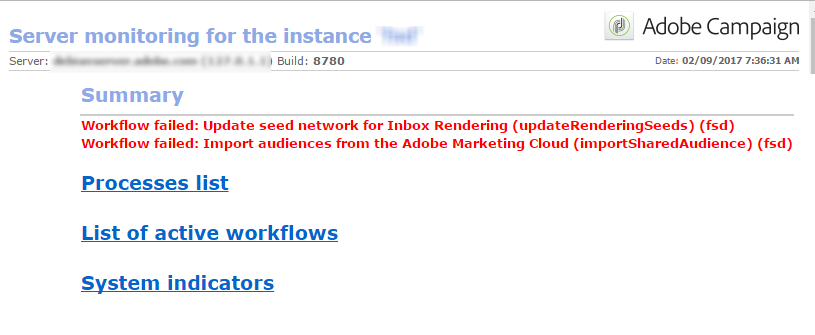
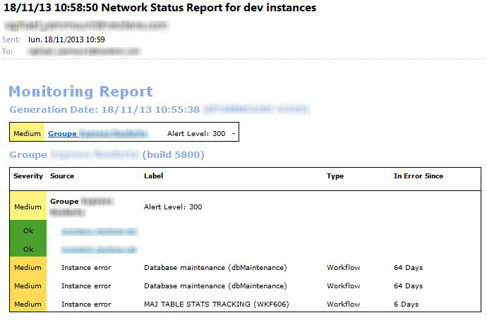

# Monitoringprocessen{#monitoring-processes}

De toepassingsserver en de omleidingsserver (**tracking**) kunnen handmatig of automatisch worden gecontroleerd.

## Handmatige controle {#manual-monitoring}

Ga naar **[!UICONTROL Monitoring]** en klik op de **[!UICONTROL Overview]** koppeling om de pagina voor toezicht op het Adobe Campagne-proces weer te geven.


Met de weergegeven pagina kunt u de status van de verbonden instantie weergeven, namelijk:

* informatie over de zaak : versie, naam, database-engine, geïnstalleerde pakketten, serversysteemindicatoren,
* de lijst van ontbrekende processen en uitvoeringsinformatie (begindatum, PID, enz.);
* een weergave van workflows en leveringen.

In [deze pagina](https://helpx.adobe.com/campaign/kb/acc-maintenance.html)worden extra manieren weergegeven om de verschillende campagneprocessen te controleren.

### Logboekjournaal {#log-journal}

Het is mogelijk om het logboekdagboek met betrekking tot een proces te tonen. U doet dit door op het proces te klikken, bijvoorbeeld **mta** en vervolgens op **[!UICONTROL Open the log journal]** .


### Systeemindicatoren {#system-indicators}

Met de lijst met systeemindicatoren kunt u informatie over de computer weergeven, zoals het fysieke en virtuele geheugen, actieve processen en beschikbare schijfruimte. De indicatoren zijn verschillend voor Linux en Vensters werkende systemen. Ga naar de **[!UICONTROL Instance Monitoring]** pagina en klik op de **[!UICONTROL Display]** koppeling om de lijst met indicatoren te openen

#### In Windows {#in-windows}

* **[!UICONTROL Pending events queued]** : specifieke indicator voor het Centrum van het **Bericht**. Zie [deze sectie](../../message-center/using/monitoring-thresholds.md) voor meer informatie.
* **[!UICONTROL Memory]** : informatie over het fysieke geheugen (RAM).

   **[!UICONTROL Current value]** : daadwerkelijk geheugenverbruik.

   **[!UICONTROL Max Value]** : totale hoeveelheid geïnstalleerd geheugen.

   **[!UICONTROL Available]** : hoeveelheid beschikbaar geheugen.

   **[!UICONTROL Warning]** : deze indicator wordt weergegeven wanneer het geheugenverbruik 80% van de totale hoeveelheid bereikt.

   **[!UICONTROL Alert]** : deze indicator wordt weergegeven wanneer het geheugenverbruik 90% van de totale hoeveelheid bereikt.

   Wanneer de **[!UICONTROL Warning]** indicatoren en **[!UICONTROL Alert]** indicatoren worden weergegeven, kunt u het probleem oplossen door RAM toe te voegen aan het apparaat waarop de Adobe Campagneserver is geïnstalleerd. U kunt ook besluiten om de Adobe Campagneserver op een specifieke computer te installeren.

* **[!UICONTROL Swap Memory]** : informatie met betrekking tot het virtuele geheugen dat een pagineringsdossier aanpast: een gebied op de vaste schijf dat door Windows wordt gebruikt alsof het RAM-geheugen is.

   **[!UICONTROL Current value]** : daadwerkelijk geheugenverbruik.

   **[!UICONTROL Max Value]** : totale hoeveelheid geheugen.

   **[!UICONTROL Available]** : hoeveelheid beschikbaar geheugen.

   **[!UICONTROL Warning]** : deze indicator wordt weergegeven wanneer het geheugenverbruik 80% van de totale hoeveelheid bereikt.

   **[!UICONTROL Alert]** : deze indicator wordt weergegeven wanneer het geheugenverbruik 90% van de totale hoeveelheid bereikt.

   Wanneer de **[!UICONTROL Warning]** indicatoren en **[!UICONTROL Alert]** indicatoren worden weergegeven, kunt u het probleem oplossen door de grootte van het uitwisselingsbestand te verhogen in de geavanceerde Windows-instellingen.

* **[!UICONTROL Disk XXX]** : informatie over machinelezers.

   **[!UICONTROL Current value]** : werkelijk gebruikte schijfruimte.

   **[!UICONTROL Max Value]** : totale schijfcapaciteit.

   **[!UICONTROL Available]** : schijfruimte beschikbaar

   **[!UICONTROL Used]** : percentage gebruikte schijf.

   **[!UICONTROL Warning]** : deze indicator wordt weergegeven wanneer de beschikbare schijfruimte 80% van de totale capaciteit bereikt.

   **[!UICONTROL Alert]** : deze indicator wordt weergegeven wanneer de beschikbare schijfruimte 90% van de totale capaciteit bereikt.

* **[!UICONTROL Number of processes too old]** : informatie over Adobe Campagne-processen die langer dan één dag actief zijn geweest.

   **[!UICONTROL Current value]** : aantal processen dat momenteel actief is.

   **[!UICONTROL Max Value]** : maximumaantal toegestane processen (1).

   **[!UICONTROL Alert]** : deze indicator wordt weergegeven als het aantal processen gelijk is aan 1.

   Wanneer de **[!UICONTROL Alert]** indicator wordt getoond, kan het zijn dat het betrokken proces door de SQL gegevensbestandmotor wordt gesloten of dat het in een oneindige lijn wordt geplakt. Het **waakhond** -proces dat door de Campagne van Adobe wordt verstrekt begint automatisch alle processen elke dag opnieuw en laat u toe om dit probleem op te lossen. U kunt echter ook zelf een einde maken aan het desbetreffende proces om een nieuwe start te forceren.

#### In Linux {#in-linux}


* **[!UICONTROL Pending events queued]** : specifieke indicator voor het Centrum van het **Bericht**. Zie [deze sectie](../../message-center/using/monitoring-thresholds.md) voor meer informatie.
* **[!UICONTROL Load average (1/5/15 minutes)]** : informatie over de belasting, d.w.z. de gebruikssnelheid van de verwerker door de processen die gedurende de laatste minuut, vijf minuten of vijftien minuten op de machine worden uitgevoerd

   **[!UICONTROL Current value]** : werkelijke lading van de machine.

   **[!UICONTROL Max value]** : maximale belasting van het proces of de processen op de machine

   **[!UICONTROL Warning]** : deze indicator wordt weergegeven wanneer de lading 80 % van de maximaal toegestane waarde over de laatste minuut , vijf minuten of vijftien minuten bereikt .

   **[!UICONTROL Alert]** : deze indicator wordt weergegeven wanneer de lading 90 % bereikt van de maximaal toegestane waarde van de laatste minuut , vijf minuten of vijftien minuten .

* **[!UICONTROL Memory]** : informatie over het fysieke geheugen (RAM).

   **[!UICONTROL Current value]** : daadwerkelijk geheugenverbruik.

   **[!UICONTROL Max Value]** : totale hoeveelheid geïnstalleerd geheugen.

   **[!UICONTROL Available]** : hoeveelheid beschikbaar geheugen.

   **[!UICONTROL Warning]** : deze indicator wordt weergegeven wanneer het geheugenverbruik 80% van de totale hoeveelheid bereikt.

   **[!UICONTROL Alert]** : deze indicator wordt weergegeven wanneer het geheugenverbruik 90% van de totale hoeveelheid bereikt.

   Wanneer de **[!UICONTROL Warning]** indicatoren en **[!UICONTROL Alert]** indicatoren worden weergegeven, kunt u het probleem oplossen door RAM toe te voegen aan het apparaat waarop de Adobe Campagneserver is geïnstalleerd. U kunt ook besluiten om de Adobe Campagneserver op een specifieke computer te installeren.

* **[!UICONTROL Swap Memory]** : informatie met betrekking tot het virtuele geheugen dat een pagineringsdossier aanpast: een gebied op de vaste schijf dat door Windows wordt gebruikt alsof het RAM-geheugen is.

   **[!UICONTROL Current value]** : daadwerkelijk geheugenverbruik.

   **[!UICONTROL Max Value]** : totale hoeveelheid geheugen.

   **[!UICONTROL Available]** : hoeveelheid beschikbaar geheugen.

   **[!UICONTROL Warning]** : deze indicator wordt weergegeven wanneer het geheugenverbruik 80% van de totale hoeveelheid bereikt.

   **[!UICONTROL Alert]** : deze indicator wordt weergegeven wanneer het geheugenverbruik 90% van de totale hoeveelheid bereikt.

   Wanneer de **[!UICONTROL Warning]** indicatoren en **[!UICONTROL Alert]** indicatoren worden weergegeven, kunt u het probleem oplossen door het uitwisselingsbestand groter te maken.

* **[!UICONTROL Core Files]** : informatie over de bestanden die zijn gegenereerd na het vastlopen van een Adobe-campagne. Met deze bestanden kunt u de oorzaken van het vastlopen vaststellen.

   **[!UICONTROL Current Value]** : aantal bestaande bestanden.

   **[!UICONTROL Max Value]** : maximumaantal geoorloofde bestanden (1).

   **[!UICONTROL Warning]** : deze indicator wordt weergegeven wanneer het aantal bestanden groter is dan 1.

   **[!UICONTROL Alert]** : deze indicator wordt weergegeven wanneer het aantal bestanden gelijk is aan 1.

   Wanneer een proces ontbreekt als gevolg van een crash, wordt het in het rood weergegeven in de lijst met processen en wordt het proces automatisch opnieuw gestart door het **waakhond** -proces dat wordt geleverd door Adobe Campaign.

* **[!UICONTROL Number of shared memory segments]** : informatie over de geheugensegmenten die door alle Adobe Campagne-processen worden gedeeld.

   **[!UICONTROL Current value]** : aantal geheugensegmenten dat momenteel in gebruik is.

   **[!UICONTROL Max Value]** : maximum aantal geoorloofde geheugensegmenten (2).

   **[!UICONTROL Warning]** : deze indicator wordt getoond wanneer het aantal geheugensegmenten 1 bereikt.

   **[!UICONTROL Alert]** : deze indicator wordt getoond wanneer het aantal geheugensegmenten 2 bereikt.

* **[!UICONTROL Number of processes too old]** : informatie over processen die langer dan één dag actief zijn geweest.

   **[!UICONTROL Current value]** : aantal processen dat momenteel actief is.

   **[!UICONTROL Max Value]** : maximumaantal toegestane processen.

   **[!UICONTROL Warning]** : deze indicator wordt weergegeven wanneer het aantal processen 80 % van de toegestane drempel bereikt .

   **[!UICONTROL Alert]** : deze indicator wordt weergegeven wanneer het aantal processen 90 % van de toegestane drempel bereikt .

* **[!UICONTROL File Handles]** : informatie over de bestandsdescriptoren, d.w.z. het aantal geopende bestanden per proces.

   **[!UICONTROL Current value]** : het huidige aantal bestandsdescriptors.

   **[!UICONTROL Max Value]** : maximumaantal bestandsdescriptors dat door het besturingssysteem is geautoriseerd.

   **[!UICONTROL Warning]** : deze indicator wordt weergegeven wanneer het aantal geautoriseerde bestandsdescriptors de drempel van 80% bereikt.

   **[!UICONTROL Alert]** : deze indicator wordt weergegeven wanneer het aantal geautoriseerde bestandsdescriptors de drempel van 90% bereikt.

* **[!UICONTROL Processes]** : informatie over de machineverwerking.

   **[!UICONTROL Current value]** : aantal processen dat momenteel actief is.

   **[!UICONTROL Max Value]** : maximumaantal toegestane processen.

   **[!UICONTROL Active Processes]** : aantal actieve processen.

   **[!UICONTROL Inactive Processes]** : aantal inactieve processen.

   **[!UICONTROL Warning]** : deze indicator wordt weergegeven wanneer het aantal toegestane processen de drempel van 80 % bereikt.

   **[!UICONTROL Alert]** : deze indicator wordt weergegeven wanneer het aantal toegestane processen de drempel van 90% bereikt.

* **[!UICONTROL Zombie Processes]** : informatie over de processen die zijn gestopt maar nog een proces-herkenningsteken (PID) hebben en in de proceslijst zichtbaar blijven.

   **[!UICONTROL Current value]** : aantal zombie-processen dat momenteel actief is.

   **[!UICONTROL Max Value]** : maximumaantal toegestane zombie-processen (2).

   **[!UICONTROL Warning]** : deze indicator wordt weergegeven wanneer het aantal zombie-processen dichtbij 2 ligt.

   **[!UICONTROL Alert]** deze indicator wordt weergegeven wanneer het aantal zombie-processen 2 bereikt.

#### Aangepaste indicatoren {#customized-indicators}

Met Adobe Campaign kunt u indicatoren aanpassen. Dit doet u als volgt:

1. Maak een **.sh** -bestand en geef het een naam **[!UICONTROL cust_indicators.sh]** .
1. Voeg uw aangepaste indicatoren toe aan dit bestand. Bijvoorbeeld:

   ```
   #!/bin/bash 
   echo "<indicator name='Zombie Processes'>  
   <current label='Current Value' value='0' display=''/>  
   <warning value='2'/>  <alert value='2'/>  
   <max label='Max Value' value='2'/>
   </indicator>"
   ```

   of

   ```
   #!/bin/bash 
   echo "<indicator name='Availability'>  
   <current label='Last update of data' display='2012-09-03 10:00'/>  
   <current label='Availability last month' display='100.00%'/>  
   <current label='Availability this month' display='100.00%'/> 
   <current label='Recent downtime periods' display='2012-07-04 11:10:00 - 11:19:59'/>
   </indicator>"
   ```

1. Plaats het bestand in de **[!UICONTROL usr/local/neolane/nl6]** map.

Dit bestand wordt opgeroepen door Adobe Campaign.

## SMTP-rapporten {#smtp-reports}

De SMTP rapporten van de leveringscontrole zijn geïntegreerd in het platform van de Campagne van Adobe. Zij kunnen via de console of het gebruiken van de toegang van het Web worden betreden.

Deze rapporten tonen SMTP leveringsstatistieken en SMTP fouten door domein.

De exploitant moet beheerrechten hebben om toegang te krijgen tot deze rechten.

Zij worden gegroepeerd onder **Controle** > &quot;Controle SMTP&quot;.


>[!CAUTION]
>
>* Informatie over SMTP-bewaking is alleen beschikbaar als het e-mailkanaal is geactiveerd.
>* De **[!UICONTROL SMTP sending statistics]** worden slechts aangeboden als de statistiekenserver op de instantie is begonnen.
>


### SMTP-verzendende statistieken {#smtp-sending-statistics}

Het **[!UICONTROL SMTP sending statistics]** rapport laat u serveractiviteit controleren. Er wordt een synthese van elk van de overeenkomende elementen weergegeven.


De lijst van indicatoren voor dit verslag wordt onder de grafiek weergegeven.

1. Het totale aantal verzonden berichten.
1. 
   * Blauwe lijn: berichten die klaar zijn om te worden verzonden en die in de Shaper zijn binnengekomen, d.w.z. laatste fase voordat SMTP wordt verzonden (valt samen met de binnenkomende gegevens).

   * Groene lijn: met succes verzonden berichten (valt samen met de uitgaande gegevens).

   * Rode lijn: berichten die door Shaper worden verlaten, aan de **mta** zijn teruggekeerd (valt samen met de gegevens die op deze terugwinning worden verworpen).
   Deze waarden worden uitgedrukt in aantal berichten per uur.

1. Vertegenwoordigt twee rijen van Shapier:

   * Blauwe curve: wachtrij met actieve berichten. Deze berichten worden zo snel mogelijk verzonden.

   * Kaki-curve: de &#39;uitgestelde&#39; wachtrij. Deze berichten kunnen op dit moment niet worden geretourneerd vanwege een vertraging of omdat er geen verbinding met het doel beschikbaar is. De pogingen worden elke 5s, 10s, 20s, 40s, 2 min, enz. uitgevoerd. voor de gedefinieerde **MaxAgeSec** -tijd voordat deze wordt verlaten.

1. Deze grafieken tonen een detail van verlaten berichten (rode kromme op de tweede grafiek): het toont het aandeel berichten die zonder herpoging (fout) worden verlaten vergeleken met berichten het waarvan verzenden ontbrak (rood). Dit laat u het aandeel berichten bekijken die niet binnen de toegekende periode wegens beperkingen door de statistiekserver (throttling) of wegens verre serveronbeschikbaarheid worden verwerkt.
1. SMTP-verbindingen geopend of geopend.
1. Schatting van het aantal **kinderen**.

>[!NOTE]
>
>Dit rapport heeft betrekking op de status van de component Email Traffic Shaper.

### SMTP-fouten per domein {#smtp-errors-per-domain}

Dit rapport laat u de leveringsfouten, over een vastgestelde periode bekijken, die door domein wordt verdeeld.

>[!NOTE]
>
>Met de **opties minConnectionsToLog**, **minErrorsToLog** en **minMessagesToLog** van het bestand **serverConf.xml** worden de drempels gedefinieerd waarboven verbindingsstatistieken worden gebruikt.


De lijst van indicatoren voor dit verslag is hieronder weergegeven.

* De kolom **Domein** bevat de naam van het domein waarnaar de berichten worden verzonden (of de echte domeinnaam, yahoo.com bijvoorbeeld voor yahoo.fr),
* De **kolom Cnx** toont het aantal verbindingen SMTP open voor dit domein,
* De kolom **Verzonden** komt overeen met het aantal berichten dat naar dit domein wordt verzonden,
* In de kolom **Volume** wordt het volume weergegeven van berichten die naar dit domein zijn verzonden (bij benadering waarde).
* In de kolom **Fouten** wordt een volumeindicator van fouten in dit domein gedurende de periode weergegeven.
* In de kolom **Laatste reactie** wordt het laatste SMTP-antwoordbericht weergegeven dat voor dit domein is ontvangen.
* De **kolom van de Datum** toont de datum van de laatste reactie SMTP die voor dit domein wordt ontvangen.

>[!NOTE]
>
>De waarden die worden weergegeven in de kolommen **Cnx**, **Verzonden** en **Volume** worden berekend op basis van de geselecteerde periode in het **[!UICONTROL Period]** veld.

Klik op een domeinnaam om de fouten te bekijken.

Ze zijn gecategoriseerd door PublicId: deze id komt overeen met een IP-adres dat door verschillende Adobe Campaign-tags achter een router wordt gedeeld. De statistiekserver gebruikt deze id om de verbinding- en leveringsstatistieken tussen dit beginpunt en de doelserver te onthouden.


In het **[!UICONTROL Owner of domain]** veld kunt u verschillende domeinnamen groeperen onder hetzelfde label. In de aanvankelijke rapportmening, zullen alle MX domeinnamen aan deze eigenaar worden geassocieerd.

Klik op een PublicID om meer details te bekijken.


>[!NOTE]
>
>Het foutenpercentage wordt vertegenwoordigd door twee grafieken. Het eerste is een horizontale voortgangsbalk op een zwarte achtergrond. De tweede grafiek is chronologisch. De geselecteerde periode wordt verdeeld in twaalf tijdintervallen, elk die door een verticale vooruitgangsbar worden vertegenwoordigd. In beide weergaven is de balk zwart als er geen fout is gedetecteerd. De kleur van de balk is afhankelijk van het percentage fouten dat is aangetroffen (geel, vervolgens oranje en tenslotte rood). De kleur grijs betekent dat er geen significant gegevensvolume is gevonden. Het is mogelijk om het nauwkeurige percentage van fouten te tonen door de curseur op de grafiek te zetten.

>[!NOTE]
>
>Voor meer informatie over SMTP-fouten en het beheer ervan in de Adobe-campagne raadpleegt u [deze sectie](../../installation/using/email-deliverability.md).

## Factureringsrapport {#billing-report}

Het **[!UICONTROL Billing]** technische werkschema verzendt het rapport van de systeemactiviteit naar de &quot;facturerings&quot;exploitant per e-mail. Deze wordt standaard geactiveerd op de 25e van elke maand.

De technische workflow vindt u in een submap van het volgende knooppunt: **Beheer** > **Productie** > **Technische workflows**.


Wanneer de workflow elke 25e van de maand wordt gestart, ontvangt uw factureringsoperator het volgende rapport in zijn postvak.


De volgende cijfers zijn beschikbaar om uw leveringen te volgen:

* **[!UICONTROL Start date]** : Begindatum van de levering. Merk op dat het vroeger dan de &quot;van&quot;datum van het rapport kan zijn.
* **[!UICONTROL Label]** : Etiket van de levering. Leveringen met minder dan 100 berichten worden als te klein beschouwd en dus geaggregeerd op de begindatum. In dat geval geeft het label het aantal aggregaten weer, bijvoorbeeld [aggregatie van 3 kleine leveringen].
* **[!UICONTROL Total volume]** : Het totale volume van de bytes dat voor de levering wordt overgebracht.
* **[!UICONTROL Avg volume]** : Gemiddeld volume van overgedragen bytes. Dit is het resultaat van de volgende formule **(totaal volume/berichten)**, die de berekeningsbasis van **[!UICONTROL Multiplier]** metrisch is.
* **[!UICONTROL Messages]** : Aantal verzonden berichten. Dit omvat zowel berichten die met succes werden verzonden als pogingen (na de ontvangst van een stuitbericht van de gecontacteerde server).
* **[!UICONTROL Multiplier (x)]** : De waarde van de vermenigvuldiger wordt afgetrokken van het gemiddelde volume van de berichten.
* **[!UICONTROL Count]** : Resultaat van de vermenigvuldiging van de berichten en de vermenigvuldiger.

## Automatische controle {#automatic-monitoring}

Adobe Campaign biedt verschillende automatische controlemethoden, die hieronder worden weergegeven.

### Opdrachtregel {#command-line}

Opdracht

**nlserver-monitor**

Hier kunt u een aantal indicatoren weergeven voor de Adobe Campaign-modules en het systeem.

Er wordt uitvoer gegenereerd in een gemakkelijk verwerkte XML-indeling.

Dit bevel kan ook met de **-ontbrekende** parameter worden in werking gesteld, die van de processen een lijst maakt die van deze instantie missen wanneer de configuratiedossiers zeggen dat zij zouden moeten uitvoeren.

```
nlserver monitor -missing
HH:MM:SS > Application server for Adobe Campaign Classic (7.X YY.R build XXX@SHA1) of DD/MM/YYYY
mta@prod
stat@prod
wfserver@prod
```

### Door de server gepubliceerde informatie {#information-published-by-the-server}

#### /r/test {#r-test}

De **http(s)://`<application>`/r/test** -pagina wordt gebruikt om de omleidingsserver te testen. Wij adviseren gebruikend deze zelfde methode om de frontale servers te testen die voor het volgen worden gebruikt. Deze pagina kan ook worden gebruikt om een verzender van de lading te testen.

Een regel als deze wordt weergegeven in XML-indeling:

```
<redir status='OK' date='YYYY-MM-DD HH:MM:SS.112Z' build='XXXX' host='<hostname>' localHost='<servername>'/>
```

**Frequentie**: deze test maakt geen gebruik van belasting en kan dus zeer vaak worden uitgevoerd (bijvoorbeeld eenmaal per seconde).

#### /nl/jsp/ping.jsp {#nl-jsp-ping-jsp}

Deze **http(s)://`<Application server url>`/nl/jsp/ping.jsp** pagina werkt op dezelfde manier als de bijbehorende netwerktegenhanger: het test een volledige vraag die door apache/tomcat/Webmodule/gegevensbestand gaat en aan de cliënt uploadt. Als alles goed werkt, geeft het een &quot;OK&quot;. We raden u aan deze test uit te voeren op computers met toegang tot de databases (bijvoorbeeld mtas&#39;s en enquêtes).

**Gebruik**: Als u zich op afstand wilt aanmelden, moet u een sessietoken die aan een aanmeldingsnaam van de operator is gekoppeld, doorgeven als een argument (zie de tip in [Automatische controle via Adobe Campagnerscripts](#automatic-monitoring-via-adobe-campaign-scripts)).

Bijvoorbeeld:


De naam van de operator en de aanmelding moeten eerder zijn geconfigureerd in de Adobe Campagne-clientconsole met databaserechten.


**Frequentie**: dit is een test die zeer weinig bandbreedte gebruikt . Het kan dus vrij vaak, maar niet meer dan eenmaal per minuut, worden uitgevoerd.

#### /nl/jsp/monitor.jsp {#nl-jsp-monitor-jsp}

Dit is een test om te controleren of een exploitant tot de server van de Campagne van Adobe via een Web-pagina kan toegang hebben; dezelfde webpagina als de pagina die via de menu&#39;s van de clientconsole wordt geopend. We raden u aan om dit onderdeel op te nemen in uw bewakingstools (Tivoli, Nagios, enz.).



**Gebruik**: Een sessietoken dat is gekoppeld aan een aanmeldingsnaam van de operator waarmee u verbinding kunt maken met de instantie, moet worden gebruikt als een argument (zie de tip in [Automatische controle via Adobe Campagnerscripts](#automatic-monitoring-via-adobe-campaign-scripts)).

De operator en de bijbehorende aanmelding moeten eerder worden geconfigureerd in de Adobe Campagne-clientconsole met de juiste databaserechten en -beperkingen.

**Frequentie**: dit is een volledige servertest en hoeft niet vaak te worden uitgevoerd (het kan bijvoorbeeld elke tien minuten worden uitgevoerd).

#### /nl/jsp/soaprouter.jsp {#nl-jsp-soaprouter-jsp}

Deze **jsp** vertegenwoordigt het toegangspunt voor de API&#39;s van de Adobe Campagne-toepassing. Zij kan daarom een gedetailleerd toezicht op de aanvraag uitvoeren. Deze kan ook worden gebruikt om de webservices van Adobe Campagne te controleren. Het wordt gebruikt in onze toezichtmanuscripten, maar merk op dat het voor machtsgebruikers slechts is.

### Controle op basis van implementatietypen {#monitoring-based-on-deployment-types}

De Campagne van Adobe laat diverse plaatsingsconfiguraties (voor meer op dit, verwijs naar [deze sectie](../../installation/using/hosting-models.md)) toe. In deze sectie worden de verschillende automatische bewakingstechnieken beschreven die moeten worden toegepast, afhankelijk van het type installatie.

<table> 
 <thead> 
  <tr> 
   <th> Type implementatie </th> 
   <th> Toezicht </th> 
  </tr> 
 </thead> 
 <tbody> 
  <tr> 
   <td> Zelfstandig </td> 
   <td> 
    <ul> 
     <li><p> <span class="uicontrol">/r/test</span> en <span class="uicontrol">/nl/jsp/monitor.jsp</span> op de Adobe Campaign-server</p> </li> 
    </ul> </td> 
  </tr> 
  <tr> 
   <td> Standaard </td> 
   <td> 
    <ul> 
     <li><p> <span class="uicontrol">/r/test</span> en <span class="uicontrol">/nl/jsp/ping.jsp</span> op de frontservers</p> </li> 
     <li><p> <span class="uicontrol">/nl/jsp/monitor.jsp</span> op de toepassingsserver</p> </li> 
    </ul> </td> 
  </tr> 
  <tr> 
   <td> Enterprise </td> 
   <td> 
    <ul> 
     <li><p> <span class="uicontrol">/r/test</span> en <span class="uicontrol">/nl/jsp/ping.jsp</span> op de frontservers</p> </li> 
     <li><p> <span class="uicontrol">/r/test</span> en <span class="uicontrol">/nl/jsp/monitor.jsp</span> op de toepassingsserver</p> </li> 
    </ul> </td> 
  </tr> 
  <tr> 
   <td> Midden-sourcing </td> 
   <td> 
    <ul> 
     <li><p> <span class="uicontrol">/nl/jsp/monitor.jsp</span> op de toepassingsserver</p> </li> 
    </ul> </td> 
  </tr> 
 </tbody> 
</table>

## Automatische controle via Adobe Campaign-scripts {#automatic-monitoring-via-adobe-campaign-scripts}

Adobe Campagne kan een hulpmiddel van de instantiemonitoring (netreport) verstrekken dat u een rapport door e-mail betreffende de ontdekte anomalieën laat verzenden.



>[!CAUTION]
>
>Dit programma kan worden gebruikt om uw instanties te controleren, maar wordt niet ondersteund door Adobe Campaign. Neem voor meer informatie contact op met de beheerder van de campagne.

### Vereiste elementen {#required-elements}

Voor automatische controle zijn de volgende voorzorgsmaatregelen voorafgaand aan de installatie vereist:

* U moet de bestanden **netreport.tgz **(Linux-installatie) of **netreport.zip** (Windows-installatie) hebben,
* We raden u ten zeerste aan om geen controle op de te controleren machine te installeren,
* het moet zijn geïnstalleerd op een machine met een JRE of JDK;
* in Linux moet de te controleren machine het **bc** pakket hebben. Zie [deze sectie](../../installation/using/installing-packages-with-linux.md#distribution-based-on-rpm--packages)voor meer informatie.

### Installatieprocedure {#installation-procedure}

De installatieprocedure is als volgt:

1. Maak indien nodig in de console een nieuwe operator (de gebruiker voor &#39;controle&#39; bestaat al), maar wijs geen rechten toe.
1. Ophalen van archief uitvoeren.
1. Lees het **Lees mij** -bestand.
1. Werk het **configuratiebestand netconf.xml** bij.
1. Werk het bestand **netreport.bat** (Windows) of **netreport.sh **(Linux) bij.

### Het bestand netconf.xml configureren {#configuring-the-netconf-xml-file}

Het XML-configuratiebestand bevat de volgende elementen:

* [Element &#39;Eigenschappen&#39;](#properties--element)
* [Instantie-element](#instance--element)
* [Element &#39;Host&#39;](#host--element)
* [Subelementen](#sub-elements)

Hier volgt een configuratievoorbeeld:

```
<?xml version="1.0" encoding="ISO-8859-1"?>
<netconf>
  <properties mailServer="mail.adobe.net" mailFrom="mail@adobe.com" recipientList="recipient@adobe.com">
    <nightMode start="00:00 am" end="07:00 am"/>
    <buildRange minimum="7829" maximum="8180"/>
    <buildRange minimum="8300" maximum="8400"/>
    <sla/>
  </properties>

  <instance name="dev" recipientList="mail@mail.com,mail2@mail.com">
                <host name="devrd.domain.com" alias="devrd" sessiontoken="monitoring" criticalLevel="1" filter="wkf;new">
                                <ncs instance="devrd" url="/nl/jsp/soaprouter.jsp" includeDead="false" isSecure="false"/>
                                <redir url="/r/test"/>
                                <http url="/nl/jsp/ping.jsp"/>
                </host>
                <host name="devtrk.domain.com" alias="devtrk" sessiontoken="monitoring" criticalLevel="0" filter="wkf;new">
                                <ncs instance="devrd" url="/nl/jsp/soaprouter.jsp" includeDead="true" isSecure="false"/>
                </host>
  </instance>
  <host name="dev-test" alias="dev-test" sessiontoken="monitoring" criticalLevel="2">
                <ncs instance="dev" url="/nl/jsp/soaprouter.jsp" includeDead="false"/>
  </host>
</netconf>
```

>[!NOTE]
>
>U kunt verschillende configuraties opgeven door een achtervoegsel toe te voegen aan het bestand **netconf.xml** , bijvoorbeeld **netconf-dev.xml**, **netconf-prod.xml**, enz. Geef vervolgens de configuratie op die moet worden gebruikt voor het uitvoeren van het netreport in de bestanden **netreport.bat** of **netreport.sh** door bijvoorbeeld **$JAVA_HOME/bin/java netreport dev** of **@%JAVA_HOME%binjava netreport prod** toe te voegen.

>[!CAUTION]
>
>Voor de **controleexploitant** om te werken, moet de machine dat het netrapport wordt uitgevoerd in een veiligheidsstreek zijn die op **sessionTokenOnly** wijze is. Als er voor deze operator geen vertrouwd IP-masker is opgegeven, moet de beveiligingszone ook de modus **allowEmptyPassword** en **allowUserPassword** hebben.

#### Element &#39;Eigenschappen&#39; {#properties--element}

Dit element wordt gebruikt om de configuratie van e-mailberichten te vullen, dat wil zeggen

* **mailServer**: SMTP-server gebruikt om e-mailberichten te verzenden (bijvoorbeeld: smtp.domain.net).
* **mailFrom**: e-mailadres van de afzender van het rapport (bv.: monitoring@domain.net).
* **receivingList**: de lijst met e-mailadressen van ontvangers die toezicht houden. Adressen moeten worden gescheiden door komma&#39;s (geen spaties).
* De modus &#39;**nacht**&#39; (optioneel) wordt gebruikt om te voorkomen dat e-mails worden verzonden tussen de opgegeven tijdsperiode. In plaats daarvan worden de gegevens geconsolideerd en wordt een e-mail over de activiteit van de nacht verzonden na de eindtijd (standaard 7:00).
* Met het subelement **buildRange** (optioneel) kunt u een minimum- en maximumbuildnummer opgeven. Er wordt een fout gegenereerd voor alle computers waarvan het buildnummer niet binnen dit bereik valt

   ```
   <buildRange minimum="0000" maximum="9999"/>
   ```

* U kunt een **`<sla>`** (optioneel) subelement toevoegen aan het element **properties** . Een logboekdossier zal worden geproduceerd telkens als netreport wordt uitgevoerd. De naam van het bestand bevat de configuratienaam en de datum en tijd, bijvoorbeeld **dev_06_12_13_16_47_05.tmp**. Het bestand bevat de volgende informatie: instantienaam, machinenaam, ernstniveau, (0 tot 3, van minst kritiek aan meest kritiek), datum (timestamp formaat), tijd die (in milliseconden) tussen de vraag en de reactie, de gebruikte dienst (http, ncs, ncsex, redir) wordt verstreken. Deze informatie wordt gescheiden door lusrekentekens en lijnonderbrekingen aan het eind van elke dienst.

>[!NOTE]
>
>Het **persistHtmlFile** attribuut met de waarde &quot;waar&quot;op het **`<property>`** element wordt gebruikt om de recentste controlestatus in het dossier **netreport.md** te registreren. Dit bestand wordt opgeslagen in de installatiemap.

#### Instantie-element {#instance--element}

Met dit element kunt u verschillende computers (hosts) opnieuw groeperen in dezelfde instantie. De instantienamen worden weergegeven in het eerste deel van de e-mail met controle. U kunt op de naam van een instantie klikken om de details van elke computer te openen.

```
instance name="instanceName" recipientList="mail@mail.com,mail2@mail.com">
                <host name="devcamp.domain.com" ...>
                       ...
                </host>
                <host name="devtrack.domain.com" ...>
                       ...
                </host>
</instance
```

* **naam**: instantienaam die in het eerste deel van de e-mail zal verschijnen.
* **receivingList** (optioneel): Hiermee kunt u via e-mail een monitoringrapport over een bepaald exemplaar verzenden.

#### Element &#39;Host&#39; {#host--element}

Dit element vormt de controle van een bepaalde server op de gastheer, d.w.z.

* **naam**: naam van de te controleren machine.
* **alias** (optioneel): naam van de bewaakte computer zoals deze in het rapport wordt weergegeven.
* **sessionToken**: biedt aanmeldingsverificatie via een geautoriseerd sessietoken.

   Als u het sessietoken wilt configureren, selecteert u de **operator voor controle** in de Adobe Campagne-console. Geef op het tabblad **Toegangsrechten** de IP-adressen op van de computers die gemachtigd zijn om dit exemplaar te controleren. Vervolgens kunt u verbinding maken met de controlepagina vanaf deze computers met behulp van de **controle** -id en zonder dat u een wachtwoord hoeft op te geven.

   

* **CriticalLevel** (optioneel): Hiermee kunt u fouten sorteren en weergeven op ernst. Mogelijke waarden zijn &#39;0&#39; (alle weergegeven niveaus), &#39;1&#39; (alleen hoge en kritieke fouten weergegeven) en &#39;2&#39; (alleen kritieke fouten weergegeven). Als dit kenmerk niet wordt opgegeven, worden alle foutniveaus weergegeven.
* **filter** (optioneel): Hiermee kunt u bepaalde workflowfouten uitsluiten, bijvoorbeeld **filter=&quot;wkf;wkf1&quot;**. Workflowlabels moeten worden gescheiden door puntkomma&#39;s.

#### Subelementen {#sub-elements}

* **tcp**: controleert of de server omhoog of omlaag is. U moet een poortnummer invoeren.
* **http**: controleert of de server van het Web bestaat (toepassingsserver is operationeel).
* **ncs**: controleert de processen op de instantie ingegaan in het &quot;instantie&quot;attribuut (werkschemafouten, geheugengebruik, enz.). Het **include** -kenmerk (verplicht) geeft u de mogelijkheid dode processen weer te geven (&#39;true&#39; of &#39;false&#39; waarden).
* **redir**: controleert het volgen.

In de meeste gevallen kunnen alleen de **ncs** - en **redir** -subelementen worden behouden.

In elk geval, kunnen bepaalde knopen in sub-elementen worden overbelast (bijvoorbeeld, de knoop **port=75** om de haven te overbelasten die voor de http, ncs of redir verbinding wordt gebruikt):

```
<ncs instance="clap40" url="/nl/jsp/soaprouter.jsp" includeDead="false" port="80"/>
```

In de subelementen **ncs**, **redir** en **http** kunt u het **isSecure** -kenmerk (optioneel) toevoegen om te kiezen of u het HTTPS-protocol (&#39;true&#39; of &#39;false&#39; waarden) al dan niet wilt gebruiken. Als dit kenmerk niet wordt opgegeven, wordt het http-protocol gebruikt.

### Het vormen van het netreport.bat of netreport.sh- dossier {#configuring-the-netreport-bat-or-netreport-sh--file}

Om het te vormen, geef dit dossier uit en wijs op welke folder JRE of JDK geïnstalleerd is.

### Bewaking starten {#launching-monitoring}

Om controle te lanceren, voer het **netreport.bat** of **netreport.sh** dossier met regelmatige intervallen via een manuscript uit. Een rapport wordt verzonden na de eerste uitvoering, en dan slechts in het geval van een verandering van status.

### Bewaking van tests {#testing-monitoring}

Om de controle te testen, voer het **netreport.bat** of **netreport.sh** - dossier uit.

Er wordt een e-mail verzonden naar de ontvangers die zijn opgegeven in de **receivingList** van het bestand **netconf.xml** .
