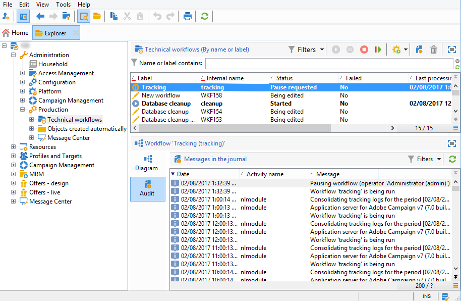

# Problemen met het bijhouden van logboeken{#tracking-logs-issues}

Er kunnen veelvoudige redenen voor het volgen van logboeken zijn niet door:sturen. We raden u aan de volgende gegevens te controleren:

* Heeft de workflow voor **bijhouden** fouten?

   Raadpleeg de technische [workflows](../../workflow/using/monitoring-technical-workflows.md)controleren.

   

* Wordt de module **gevolgd** die op de server loopt?

   Zie [Logbestanden](../../production/using/log-files.md).

* Zijn er wijzigingen aangebracht? Zij kunnen een verlies van verbinding aan de servers teweegbrengen gebruikend de volgende alias.

