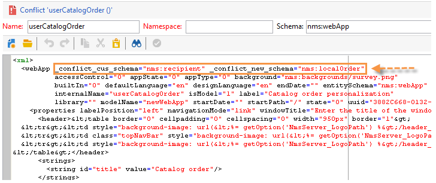

# Upgraden naar een nieuwe build (on-premise){#upgrading}

Voordat u het upgradeproces start, bepaalt en bevestigt u welke versie van Adobe Campaign moet worden bijgewerkt naar en raadpleegt u de [releaseopmerkingen](../../rn/using/latest-release.md) .

>[!IMPORTANT]
>
>Wij adviseren sterk makend een gegevensbestandsteun op elke instantie alvorens bij te werken. Raadpleeg [Back-up](../../production/using/backup.md)voor meer informatie.\
>Om een verbetering uit te voeren, zorg ervoor u de capaciteit en de toestemmingen hebt om tot instanties en logboeken toegang te hebben.

>[!NOTE]
>
>Raadpleeg ook de [installatiegids](../../installation/using/general-architecture.md) en de [build-upgrade](https://helpx.adobe.com/nl/campaign/kb/acc-build-upgrade.html) die aan de slag gaat.

## Windows {#in-windows}

Om Adobe Campaign in een nieuwe versie bij te werken wanneer het leveren van een nieuwe bouwstijl, zou de volgende procedure in Vensters moeten worden toegepast:

* [Afsluitdiensten](#shut-down-services),
* [Een upgrade uitvoeren van de Adobe Campaign-servertoepassing](#upgrade-the-adobe-campaign-server-application),
* [Bronnen](#synchronize-resources)synchroniseren
* [Start de services](#restart-services)opnieuw.

Raadpleeg [deze sectie](../../installation/using/client-console-availability-for-windows.md)voor informatie over het bijwerken van de clientconsole.

### Afsluiten van services {#shut-down-services}

Als u alle bestanden wilt vervangen door de nieuwe versie, moet u alle instanties van de NLSereservice afsluiten.

1. Sluit de volgende services af:

   * Webservices (IIS):

      **iisreset /stop**

   * Adobe Campaign-service: **netstop nlserver6**
   >[!IMPORTANT]
   >
   >U moet er ook voor zorgen dat de omleidingsserver (webmdl) wordt gestopt, zodat het bestand **nlsrvmod.dll** dat door IIS wordt gebruikt, kan worden vervangen door de nieuwe versie.

1. Controleer of geen taken actief zijn door de opdracht **pdump** van de server uit te voeren. Het volgende moet naar voren komen:

   ```
   C:<installation path>Adobe Campaign v7bin>nlserver pdump
   HH:MM:SS > Application Server for Adobe Campaign Classic (7.X YY.R build XXX@SHA1) of DD/MM/YYYY
   No tasks
   ```

   U kunt de Manager van de Taak van Vensters gebruiken om ervoor te zorgen alle processen worden tegengehouden.

### De Adobe Campaign-servertoepassing upgraden {#upgrade-the-adobe-campaign-server-application}

Voer de volgende stappen uit om het upgradebestand uit te voeren:

1. Voer **setup.exe** uit.

   Als u dit bestand wilt downloaden, gaat u naar de pagina Adobe Campaign Support ( [https://support.neolane.net/](https://support.neolane.net/)) via de koppeling **Download Center** .

1. Selecteer de installatiemodus: kiezen **[!UICONTROL Update or repair]**
1. Klik op **[!UICONTROL Next]** .
1. Klik op **[!UICONTROL Finish]** .

   Het installatieprogramma kopieert vervolgens de nieuwe bestanden.

1. Wanneer de bewerking is voltooid, klikt u op **[!UICONTROL Finish]** .

### Bronnen synchroniseren {#synchronize-resources}

Gebruik de volgende opdrachtregel:

**nlserver config -postupgrade -allinstances**

Op deze manier kunt u de volgende bewerkingen uitvoeren:

* Bronnen synchroniseren
* updateschema&#39;s,
* de database bij te werken.

>[!NOTE]
>
>Deze bewerking mag maar één keer worden uitgevoerd en alleen op een (**nlserver-web**) toepassingsserver.

Controleer vervolgens of de synchronisatie fouten of waarschuwingen heeft gegenereerd. Raadpleeg [Verbeteringsconflicten](#resolving-upgrade-conflicts)oplossen voor meer informatie.

### Herstartservices {#restart-services}

De volgende diensten moeten opnieuw worden opgestart:

* Webservices (IIS):

   **iisreset /start**

* Adobe Campaign-service: **netwerkbeginserver6**

## Linux {#in-linux}

Als u Adobe Campaign wilt bijwerken in een nieuwe versie wanneer een nieuwe build wordt geleverd, volgt de procedure voor Linux:

* [Updates](#obtain-updated-packages)verkrijgen,
* [Een update](#perform-an-update)uitvoeren
* [Start de webserver](#reboot-the-web-server)opnieuw op.

Raadpleeg [deze sectie](../../installation/using/client-console-availability-for-linux.md)voor informatie over het bijwerken van de clientconsole.

>[!NOTE]
>
>Vanaf build 8757 is de bibliotheek van derden niet meer nodig.

### Bijgewerkte pakketten ophalen {#obtain-updated-packages}

Begin door beide bijgewerkte pakketten van Adobe Campaign te herstellen: Ga naar de pagina Adobe Campaign Support ( [https://support.neolane.net/](https://support.neolane.net/)) via de link **Download Center** .

Het bestand is **nlserver6-v7-XXX.rpm**

### Een update uitvoeren {#perform-an-update}

* RPM-gebaseerde distributie (RedHat, SuSe)

   Als u deze wilt installeren, voert u uit als hoofdmap:

   ```
   $rpm -Uvh nlserver6-v7-XXXX.rpm
   ```

   waarbij XXX de versie van het bestand is.

   Het rpm-bestand is afhankelijk van pakketten die u kunt vinden op CentOS/Red Hat-distributies. Als u sommige van deze gebiedsdelen niet wilt gebruiken, kunt u de &quot;nodeps&quot;optie van rpm moeten gebruiken:

   ```
   rpm --nodeps -Uvh nlserver6-v7-XXXX-0.x86_64.rpm
   ```

* DEB-distributie (Debian)

   Als u deze wilt installeren, voert u uit als hoofdmap:

   ```
   dpkg -i nlserver6-v7-XXXX-amd64_debX.deb
   ```

>[!NOTE]
>
>De volledige installatieprocedures worden in [dit gedeelte](../../installation/using/installing-campaign-standard-packages.md)beschreven. De middelen worden automatisch gesynchroniseerd, nochtans moet u ervoor zorgen geen fouten voorkwamen. Raadpleeg [Verbeteringsconflicten](#resolving-upgrade-conflicts)oplossen voor meer informatie.

### De webserver opnieuw opstarten {#reboot-the-web-server}

U moet Apache afsluiten voordat de nieuwe bibliotheek van toepassing wordt.

Hiervoor voert u de volgende opdracht uit:

```
/etc/init.d/apache stop
```

>[!IMPORTANT]
>
>* Uw script wordt mogelijk **httpd** genoemd in plaats van **apache**.
>* U MOET dit bevel uitvoeren tot u het volgende antwoord verkrijgt:
   >Deze bewerking is vereist om Apache de nieuwe bibliotheek te laten toepassen.

>


Start vervolgens Apache opnieuw:

```
/etc/init.d/apache start
```

## Oplossen van upgradeconflicten {#resolving-upgrade-conflicts}

Tijdens middelsynchronisatie, laat het **postupgrade** bevel u toe om te ontdekken of de synchronisatie fouten of waarschuwingen heeft geproduceerd.

### Het synchronisatieresultaat weergeven {#view-the-synchronization-result}

Er zijn twee manieren om het synchronisatieresultaat weer te geven:

* In de opdrachtregelinterface worden fouten geconcretiseerd door een drievoudig chevron **>>** en wordt de synchronisatie automatisch gestopt. Waarschuwingen worden geconcretiseerd door een dubbel chevron **>>** en moeten worden opgelost zodra de synchronisatie is voltooid. Aan het eind van postupgrade, wordt een samenvatting getoond in de bevelherinnering. Het kan er als volgt uitzien:

   ```
   2013-04-09 07:48:39.749Z 00002E7A 1 info log =========Summary of the update==========
   2013-04-09 07:48:39.749Z 00002E7A 1 info log <instance name> instance, 6 warning(s) and 0 error(s) during the update.
   2013-04-09 07:48:39.749Z 00002E7A 1 warning log The document with identifier 'mobileAppDeliveryFeedback' and type 'xtk:report' is in conflict with the new version.
   2013-04-09 07:48:39.749Z 00002E7A 1 warning log The document with identifier 'opensByUserAgent' and type 'xtk:report' is in conflict with the new version.
   2013-04-09 07:48:39.750Z 00002E7A 1 warning log The document with identifier 'deliveryValidation' and type 'nms:webApp' is in conflict with the new version.
   2013-04-09 07:48:39.750Z 00002E7A 1 warning log Document of identifier 'nms:includeView' and type 'xtk:srcSchema' updated in the database and found in the file system. You will have to merge the two versions manually.
   ```

   Als de waarschuwing een conflict van middelen betreft, wordt de aandacht van de gebruiker vereist om het op te lossen.

* Het logbestand **postupgrade_`<server version number>_<time of postupgrade>`.log** bevat het synchronisatieresultaat. Deze is standaard beschikbaar in de volgende map: **`<installation directory>/var/<instance/postupgrade`**. Fouten en waarschuwingen worden aangegeven door de fout- en waarschuwingskenmerken.

### Conflicten oplossen {#resolving-conflicts}

Pas het volgende proces toe om conflicten op te lossen:

1. Ga in de Adobe Campaign boom naar **[!UICONTROL Administration > Configuration > Package management > Edit conflicts]** .
1. Selecteer het conflict dat u wilt oplossen in de lijst.

Er zijn drie manieren om een conflict op te lossen:

* **[!UICONTROL Declare as resolved]** : moet vooraf door de gebruiker worden ingeschakeld.
* **[!UICONTROL Accept the new version]** : aanbevolen als de gebruiker de bronnen die bij Adobe Campaign worden geleverd, niet heeft gewijzigd.
* **[!UICONTROL Keep the current version]** : betekent dat de bijwerking wordt afgewezen.

   >[!IMPORTANT]
   >
   >Als u deze resolutiemodus selecteert, kunt u geen baat hebben bij correcties in de nieuwe versie.

Ga als volgt te werk als u het conflict handmatig wilt oplossen:

1. Zoek in de onderste sectie van het venster naar de **_conflictreeks_** om de entiteiten met conflicten te vinden. De entiteit die met de nieuwe versie is geïnstalleerd, bevat het **nieuwe** argument. De entiteit die met de vorige versie overeenkomt, bevat het **focusargument** .

   

1. Verwijder de versie die u niet wilt behouden. Verwijder de **_conflict_argument_** -tekenreeks van de entiteit die u bewaart.

   

1. Ga naar het conflict dat u hebt opgelost. Klik op het **[!UICONTROL Actions]** pictogram en selecteer **[!UICONTROL Declare as resolved]** .
1. Sla uw wijzigingen op: het conflict is nu opgelost .

### Aanbevolen procedures {#best-practices}

Er kan een updatefout worden gekoppeld aan de databaseconfiguratie. Zorg ervoor dat de configuraties die door de technische beheerder en de gegevensbestandbeheerder worden uitgevoerd compatibel zijn.

Een unicode-database mag bijvoorbeeld niet alleen de opslag van LATIN1-gegevens, enzovoort, toestaan.

## Waarschuwen als de clientconsoles van de beschikbare update {#warn-the-client-consoles-of-the-available-update}

### Windows {#in-windows-1}

Download en kopieer het bestand op de computer waarop de Adobe Campaign-toepassingsserver (**nlserver web**) is geïnstalleerd

**setup-client-6.XXXX.exe**

in **[pad van de toepassing]**datakitnlengjsp

De volgende keer dat clientconsoles worden aangesloten, wordt gebruikers in een venster geïnformeerd over de beschikbaarheid van een update en kunnen ze deze downloaden en installeren.

>[!NOTE]
>
>Zorg ervoor de gebruiker IIS_XPG de aangewezen leesrechten voor dit installatiedossier heeft en verwijs naar de [installatiegids](../../installation/using/general-architecture.md) voor meer informatie.

### Linux {#in-linux-1}

Op de computer waarop de Adobe Campaign-toepassingsserver (**nlserver-web**) is geïnstalleerd, haalt u het volgende pakket op:

**setup-client-6.XXXX.exe**

en kopieer het bestand en sla het op als **/usr/local/neolane/nl6/datakit/nl/eng/jsp**:

```
 cp setup-client-6.XXXX.exe /usr/local/neolane/nl6/datakit/nl/eng/jsp
```

De volgende keer dat clientconsoles worden aangesloten, wordt gebruikers in een venster geïnformeerd over de beschikbaarheid van een update en kunnen ze deze downloaden en installeren.

>[!NOTE]
>
>Zorg ervoor dat de Apache-gebruiker de juiste leesrechten heeft voor dit installatiebestand en raadpleeg de [installatiehandleiding](../../installation/using/general-architecture.md) voor meer informatie.

