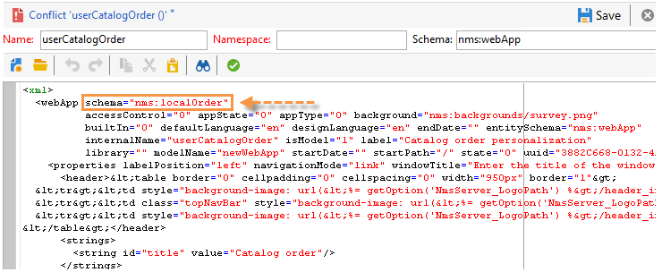

# Upgraden naar een nieuwe build (op locatie){#upgrading}

Alvorens het verbeteringsproces te beginnen, bepaal en bevestig welke versie van Adobe Campaign aan wordt bevorderd en raadpleeg de [ Nota&#39;s van de Versie ](../../rn/using/latest-release.md).

>[!IMPORTANT]
>
>* Adobe raadt u ten zeerste aan een databaseback-up te maken voordat u de database bijwerkt. Raadpleeg [deze sectie](../../production/using/backup.md) voor meer informatie.
>* Om een verbetering uit te voeren, zorg ervoor u de capaciteit en de toestemmingen hebt om tot instanties en logboeken toegang te hebben.
>* Lees uit [ deze sectie ](../../installation/using/general-architecture.md) en [ bouwt verbeterings ](https://helpx.adobe.com/nl/campaign/kb/acc-build-upgrade.html) hoofdstuk alvorens te beginnen.
>

## Windows {#in-windows}

Voor een Windows-omgeving voert u de onderstaande stappen uit om Adobe Campaign bij te werken naar een nieuwe build:

* [ de diensten van de sluiting ](#shut-down-services),
* [ bevordert de toepassingsserver ](#upgrade-the-adobe-campaign-server-application),
* [ synchroniseer middelen ](#synchronize-resources),
* [ herstart de diensten ](#restart-services).

Om te weten te komen hoe te om de cliëntconsole bij te werken, verwijs naar [ deze sectie ](../../installation/using/client-console-availability-for-windows.md).

### Afsluiten van services {#shut-down-services}

Als u alle bestanden wilt vervangen door de nieuwe versie, moet u alle instanties van de NLSereservice afsluiten.

1. Sluit de volgende services af:

   * Webservices (IIS):

     **iisreset /stop**

   * De dienst van Adobe Campaign: **netto stop nlserver6**

   >[!IMPORTANT]
   >
   >U moet ook ervoor zorgen de omleidingsserver (webmdl) wordt tegengehouden, zodat het {**dossier 0} nlsrvmod.dll dat door IIS wordt gebruikt met de nieuwe versie kan worden vervangen.**

1. Controle dat geen taken door het **in werking te stellen nlserver** bevel actief zijn. Het volgende moet naar voren komen:

   ```sql
   C:<installation path>Adobe Campaign v7bin>nlserver pdump
   HH:MM:SS > Application Server for Adobe Campaign Classic (7.X YY.R build XXX@SHA1) of DD/MM/YYYY
   No tasks
   ```

   U kunt Windows Taakbeheer gebruiken om ervoor te zorgen dat alle processen worden gestopt.

### De Adobe Campaign-servertoepassing upgraden {#upgrade-the-adobe-campaign-server-application}

Voer de volgende stappen uit om het upgradebestand uit te voeren:

1. Looppas **setup.exe**.

   Om dit dossier te downloaden, verbind met het [ de distributieportaal van de Software ](https://experience.adobe.com/#/downloads/content/software-distribution/en/campaign.html) gebruikend uw gebruikersgeloofsbrieven. Leer meer over de distributie van de Software in [ deze pagina ](https://experienceleague.adobe.com/docs/experience-cloud/software-distribution/home.html).

1. Selecteer de installatiemodus: kies **[!UICONTROL Update or repair]**
1. Klik op **[!UICONTROL Next]** .
1. Klik op **[!UICONTROL Finish]** .

   Het installatieprogramma kopieert vervolgens de nieuwe bestanden.

1. Klik op **[!UICONTROL Finish]** als de bewerking is voltooid.

### Bronnen synchroniseren {#synchronize-resources}

Gebruik de volgende opdrachtregel:

**nlserver config - postupgrade - alle instanties**

Op deze manier kunt u de volgende bewerkingen uitvoeren:

* Bronnen synchroniseren
* Schema&#39;s bijwerken
* de database bijwerken

>[!NOTE]
>
>Deze verrichting zou slechts eens, en slechts op een (**moeten worden uitgevoerd het Web van de server**) toepassingsserver.

Controleer vervolgens of de synchronisatie fouten of waarschuwingen heeft gegenereerd. Voor meer op dit, verwijs naar [ Oplossende verbeteringsconflicten ](#resolving-upgrade-conflicts).

### Herstartservices {#restart-services}

De diensten die opnieuw moeten worden opgestart zijn:

* Webservices (IIS):

  **iisreset /start**

* De dienst van Adobe Campaign: **netto begin nlserver6**

## Linux {#in-linux}

Voor een Linux-omgeving voert u de onderstaande stappen uit om Adobe Campaign bij te werken naar een nieuwe build:

* [ Download de bijgewerkte pakketten ](#obtain-updated-packages),
* [ voer de update ](#perform-an-update) uit,
* [ reboot de Webserver ](#reboot-the-web-server).

[ Leer meer over de beschikbaarheid van de Console van de Cliënt ](../../installation/using/client-console-availability-for-windows.md).

### Bijgewerkte pakketten ophalen {#obtain-updated-packages}

Begin door beide bijgewerkte pakketten van Adobe Campaign terug te winnen: verbind met het [ de distributieportaal van de Software ](https://experience.adobe.com/#/downloads/content/software-distribution/en/campaign.html) gebruikend uw gebruikersgeloofsbrieven. Leer meer over de distributie van de Software in [ deze pagina ](https://experienceleague.adobe.com/docs/experience-cloud/software-distribution/home.html).

Het dossier is **nlserver6-v7-XXX.rpm**

>[!AVAILABILITY]
>
>Vanaf versie 7.4.1 worden bibliotheken voor RPM Linux-pakketten niet meer opgenomen in de campagne. U moet deze bibliotheken installeren.
> 


### Een update uitvoeren {#perform-an-update}

* RPM-gebaseerde distributie (RedHat, SuSe)

  Als u deze wilt installeren, voert u uit als hoofdmap:

  ```
  $rpm -Uvh nlserver6-v7-XXXX.rpm
  ```

  Hierbij is XXX de versie van het bestand.

  Het rpm-bestand is afhankelijk van pakketten die u kunt vinden op CentOS/Red Hat-distributies. Als u sommige van deze gebiedsdelen niet wilt gebruiken, kunt u de &quot;nodeps&quot;optie van rpm moeten gebruiken:

  ```
  rpm --nodeps -Uvh nlserver6-v7-XXXX-0.x86_64.rpm
  ```

* DEB-distributie (Debian)

  Als u deze wilt installeren, voert u uit als hoofdmap:

  ```
  dpkg -i nlserver6-v7-XXXX-amd64_debX.deb
  ```

>[!NOTE]
>
>De volledige installatieprocedures zijn gedetailleerd in [ deze sectie ](../../installation/using/installing-campaign-standard-packages.md). De middelen worden automatisch gesynchroniseerd, nochtans moet u ervoor zorgen geen fouten voorkwamen. Voor meer op dit, verwijs naar [ los verbeteringsconflicten ](#resolving-upgrade-conflicts) op.

### De webserver opnieuw opstarten {#reboot-the-web-server}

U moet Apache afsluiten voordat de nieuwe bibliotheek van toepassing wordt.

Hiervoor voert u de volgende opdracht uit:

```
/etc/init.d/apache stop
```

>[!IMPORTANT]
>
>* Uw manuscript zou **httpd** in plaats van **apache** kunnen worden genoemd.
>* U MOET dit bevel uitvoeren tot u het volgende antwoord verkrijgt:
>
>   Deze bewerking is vereist om Apache de nieuwe bibliotheek te laten toepassen.

Start vervolgens Apache opnieuw:

```
/etc/init.d/apache start
```

## Verbeteringsconflicten oplossen {#resolving-upgrade-conflicts}

Tijdens middelsynchronisatie, laat het **postupgrade** bevel u toe om te ontdekken of de synchronisatie fouten of waarschuwingen heeft geproduceerd.

### Het synchronisatieresultaat weergeven {#view-the-synchronization-result}

Er zijn twee manieren om het synchronisatieresultaat weer te geven:

* In de bevel-lijn interface, worden de fouten materialized door een drievoudig chevron **>>>** en de synchronisatie wordt automatisch tegengehouden. De waarschuwingen worden materialized door een dubbel chevron **>>** en moeten worden opgelost zodra de synchronisatie volledig is. Aan het eind van postupgrade, wordt een samenvatting getoond in de bevelherinnering. Het kan er als volgt uitzien:

  ```
  2013-04-09 07:48:39.749Z 00002E7A 1 info log =========Summary of the update==========
  2013-04-09 07:48:39.749Z 00002E7A 1 info log <instance name> instance, 6 warning(s) and 0 error(s) during the update.
  2013-04-09 07:48:39.749Z 00002E7A 1 warning log The document with identifier 'mobileAppDeliveryFeedback' and type 'xtk:report' is in conflict with the new version.
  2013-04-09 07:48:39.749Z 00002E7A 1 warning log The document with identifier 'opensByUserAgent' and type 'xtk:report' is in conflict with the new version.
  2013-04-09 07:48:39.750Z 00002E7A 1 warning log The document with identifier 'deliveryValidation' and type 'nms:webApp' is in conflict with the new version.
  2013-04-09 07:48:39.750Z 00002E7A 1 warning log Document of identifier 'nms:includeView' and type 'xtk:srcSchema' updated in the database and found in the file system. You will have to merge the two versions manually.
  ```

  Als de waarschuwing een conflict van middelen betreft, wordt de aandacht van de gebruiker vereist om het op te lossen.

* Het **postupgrade_ `<server version number>_<time of postupgrade>` .log** logboekdossier bevat het synchronisatieresultaat. Deze is standaard beschikbaar in de volgende map: **`<installation directory>/var/<instance/postupgrade`** . Fouten en waarschuwingen worden aangegeven door de fout- en waarschuwingskenmerken.

### Conflicten oplossen {#resolving-conflicts}

Pas het volgende proces toe om conflicten op te lossen:

1. Ga in de Adobe Campaign-structuur naar **[!UICONTROL Administration > Configuration > Package management > Edit conflicts]** .
1. Selecteer het conflict dat u wilt oplossen in de lijst.

Er zijn drie manieren om een conflict op te lossen:

* **[!UICONTROL Declare as resolved]** : vereist vooraf tussenkomst van de gebruiker.
* **[!UICONTROL Accept the new version]** : aanbevolen als de bronnen die bij Adobe Campaign worden geleverd, niet door de gebruiker zijn gewijzigd.
* **[!UICONTROL Keep the current version]** : betekent dat de update wordt afgewezen.

  >[!IMPORTANT]
  >
  >Als u deze resolutiemodus selecteert, kunt u geen baat hebben bij correcties in de nieuwe versie.

Ga als volgt te werk als u het conflict handmatig wilt oplossen:

1. In de lagere sectie van het venster, onderzoek naar het **_conflict_** koord om van de entiteiten met conflicten de plaats te bepalen. De entiteit die met de nieuwe versie wordt geïnstalleerd bevat het **nieuwe** argument, de entiteit die de vorige versie aanpast bevat het **focus** argument.

   

1. Verwijder de versie die u niet wilt behouden. Schrap het **_conflict_argument_** koord van de entiteit u houdt.

   

1. Ga naar het conflict dat u hebt opgelost. Klik op het pictogram **[!UICONTROL Actions]** en selecteer **[!UICONTROL Declare as resolved]** .
1. Sla uw wijzigingen op: het conflict is nu opgelost.

### Best practices {#best-practices}

Er kan een updatefout worden gekoppeld aan de databaseconfiguratie. Zorg ervoor de configuraties die door de technische beheerder en de gegevensbestandbeheerder worden uitgevoerd compatibel zijn.

Een unicode-database mag bijvoorbeeld niet alleen de opslag van LATIN1-gegevens, enzovoort, toestaan.

## Waarschuwen als de clientconsoles van de beschikbare update {#warn-the-client-consoles-of-the-available-update}

### Windows {#in-windows-1}

Op de machine waar de de toepassingsserver van Adobe Campaign wordt geïnstalleerd (**nlserver Web**), download en kopieer het dossier **opstelling-cliënt-6.XXXX.exe** in n **[weg van de toepassing ]/datakit/nl/eng/jsp**.

De volgende keer dat clientconsoles worden aangesloten, wordt gebruikers in een venster geïnformeerd over de beschikbaarheid van een update en kunnen ze deze downloaden en installeren.

>[!NOTE]
>
>Zorg ervoor de gebruiker IIS_XPG de aangewezen leesrechten voor dit installatiedossier heeft en naar de [ installatiegids ](../../installation/using/general-architecture.md) voor meer informatie verwijst.

### Linux {#in-linux-1}

Op de machine waar de de toepassingsserver van Adobe Campaign (**nlserver Web**) geïnstalleerd is, wint **setup-cliënt-6.XXXX.exe** pakket terug en kopieert het, sparen als **/usr/local/neolane/nl6/datakit/nl/eng/jsp**:

```
 cp setup-client-6.XXXX.exe /usr/local/neolane/nl6/datakit/nl/eng/jsp
```

De volgende keer dat clientconsoles worden aangesloten, wordt gebruikers in een venster geïnformeerd over de beschikbaarheid van een update en kunnen ze deze downloaden en installeren.

>[!NOTE]
>
>Zorg ervoor de gebruiker Apache de aangewezen leesrechten voor dit installatiedossier heeft en verwijs naar de [ installatiegids ](../../installation/using/general-architecture.md) voor meer informatie.
