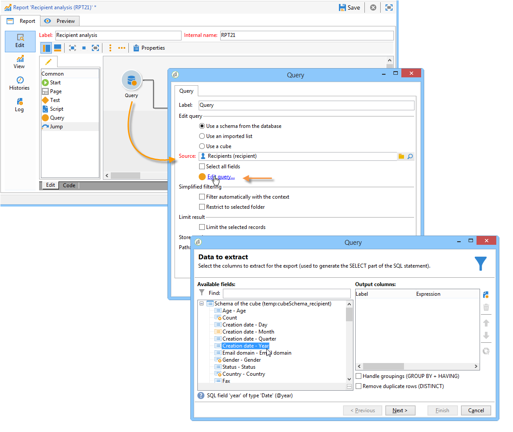

# Kubussen{#about-cubes}

De exploratie van gegevens in het gegevensbestand wordt aangeboden via de module van de Analyse van de **Marketing** . Het laat u toe om gegevens te analyseren en te meten, statistieken te berekenen, en rapportverwezenlijking en berekening te vereenvoudigen en te optimaliseren. Daarnaast kunt u met Marketing Analytics rapporten maken en doelpopulaties maken. Als deze eenmaal zijn geïdentificeerd, worden ze opgeslagen in lijsten die kunnen worden gebruikt in Adobe Campaign (zoeken, segmenteren, enz.).

De kubussen worden gebruikt voor het produceren van bepaalde ingebouwde rapporten, met inbegrip van leveringsrapporten (levering het volgen, klikt, opent, enz.). Rapporten op basis van kubussen mogen alleen worden gebruikt als standaard voor gegevensvolumes onder 5 miljoen feitenlijnen.

U kunt de mogelijkheden van de gegevensbestandexploratie en analyse uitbreiden terwijl het voor eindgebruikers gemakkelijker maken om rapporten en lijsten te vormen: alles wat zij moeten doen is een bestaande (volledig gevormde) kubus selecteren wanneer het creëren van hun rapport of lijst om berekeningen, maatregelen en statistieken te verwerken.

Zodra zij zijn gecreeerd en gevormd, worden de kubussen gebruikt in de dozen van de rapportvraag en de toepassingen van het Web. Ze kunnen worden gebruikt en bewerkt binnen draaitabellen.

>[!CAUTION]
>
>**Marketing Analytics** is een Adobe Campaign-module. Het moet op uw instantie worden geïnstalleerd zodat u de hieronder beschreven mogelijkheden kunt gebruiken.

Met de module van de Analyse van de Marketing, laat de Campagne u toe:

1. Kubussen maken met het oog op:

   * gegevens samenvoegen en opslaan in een werktabel om indicatoren vooraf te berekenen op basis van gebruikersbehoeften;
   * vermindering van de hoeveelheid gegevens die betrokken is bij de verschillende berekeningen die voor rapporten en vragen worden gebruikt, waardoor de berekeningstijden van de indicatoren aanzienlijk worden geoptimaliseerd;
   * het vereenvoudigen van de toegang tot gegevens, waardoor gebruikers gegevens (al dan niet vooraf geaggregeerd) kunnen manipuleren, afhankelijk van verschillende dimensies.
   Zie [Indicatoren](../../reporting/using/creating-indicators.md)maken voor meer informatie.

1. Draai-tabellen maken met de volgende weergave:

   * het verkennen van berekende gegevens, geconfigureerde maatregelen;
   * selecteren van de gegevens die moeten worden weergegeven en de weergavemodus;
   * aanpassing van de gebruikte maatregelen en indicatoren;
   * het aanbieden van interactieve analysehulpmiddelen aan gebruikers met een niet-technische achtergrond.
   Voor meer op dit, verwijs naar het [Gebruiken van kubussen om gegevens](../../reporting/using/using-cubes-to-explore-data.md)te onderzoeken.

1. Bouw een vraag gebruikend gegevens die in een kubus worden berekend en worden samengevoegd.
1. Identificeer populaties en verwijs hen in lijsten.

##  Terminologie {#terminology}

Wanneer het werken met kubussen, moeten de volgende concepten gekend zijn:

* Kubus

   Een kubus is een weergave van multidimensionale informatie: het biedt eindgebruikers structuren die ontworpen zijn voor interactieve gegevensanalyse .

* Feitentabel/schema

   De tabel met feiten (of het feitelijke schema) bevat de onbewerkte of elementaire gegevens waarop analyses worden gebaseerd. Dit zijn hoofdzakelijk grote volumelijsten (misschien met verbonden lijsten) met potentieel lange berekeningen.

   Een feitentabel kan bijvoorbeeld: de omroeptabel, de aankooptabel, enz.

* Dimensie

   Met afmetingen kunt u gegevens segmenteren in groepen: zodra zij zijn gecreëerd , dienen de afmetingen als analysecentra . In de meeste gevallen zullen voor een bepaalde dimensie verschillende niveaus worden vastgesteld. Voor een tijdsdimensie zijn de niveaus bijvoorbeeld maanden, dagen, uren, minuten, enzovoort. Deze reeks niveaus vertegenwoordigt de dimensiehiërarchie en laat diverse niveaus van gegevensanalyse toe.

* Binding

   Voor sommige velden kunt u binding met groepswaarden definiëren en het gemakkelijker maken om informatie te lezen. Binding wordt toegepast op niveaus

   Wij adviseren dat u het binden bepaalt wanneer er een mogelijkheid van vele verschillende waarden is.

* Meetlat

   De meest voorkomende maatregelen zijn som, gemiddelde, maximum, minimum, standaardafwijking enz.

   De maatregelen kunnen worden berekend: zo is het aanvaardingspercentage van een aanbieding bijvoorbeeld de verhouding tussen het aantal ingediende aanbiedingen en het aantal aanvaarde inschrijvingen .

## De werkruimte Kubus {#cube-workspace}

De kubussen worden opgeslagen in de **[!UICONTROL Administration > Configuration > Cubes]** knoop.

De belangrijkste gebruikscontext voor kubussen is als volgt:

* Gegevens kunnen rechtstreeks worden geëxporteerd in een rapport dat is ontworpen in het **[!UICONTROL Reports]** universum van het Adobe Campaign-platform.

   Hiertoe maakt u een nieuw rapport en selecteert u de kubus die u wilt gebruiken.

   

   De kubussen verschijnen als malplaatjes die op welke rapporten worden gebaseerd worden gecreeerd. Zodra u een malplaatje hebt gekozen, klik **[!UICONTROL Create]** om het passende rapport te vormen en te bekijken.

   U kunt maatregelen aanpassen, de vertoningswijze veranderen of de lijst vormen, dan het rapport tonen gebruikend de belangrijkste knoop.

   

* U kunt ook naar een kubus in het **[!UICONTROL Query]** vak van een rapport verwijzen om de bijbehorende indicatoren te gebruiken, zoals hieronder wordt getoond:

   

* U kunt een spillijst ook opnemen die op een kubus wordt gebaseerd in om het even welke pagina van een rapport. Hiervoor verwijst u naar de kubus die u wilt gebruiken op het **[!UICONTROL Data]** tabblad van de draaitabel op de betreffende pagina.

   

   Voor meer op dit, verwijs naar het [Verkennen van de gegevens in een rapport](../../reporting/using/using-cubes-to-explore-data.md#exploring-the-data-in-a-report).

