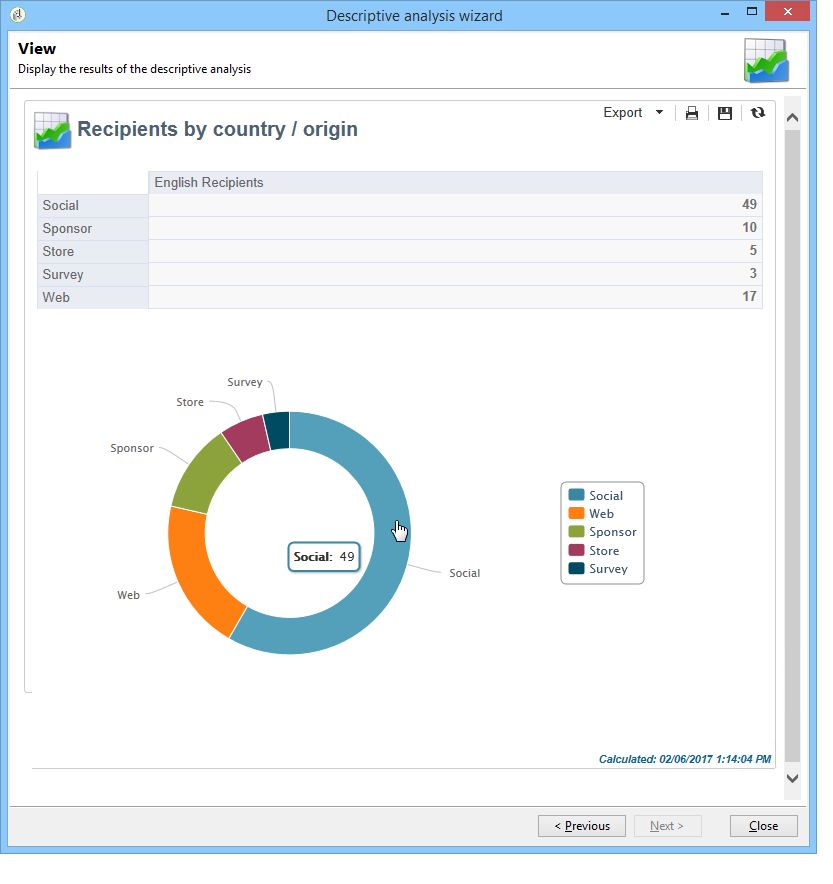

# Informatie over beschrijvende analyse{#about-descriptive-analysis}

Als u statistieken over de gegevens in de database wilt maken, maakt u beschrijvende analyserapporten met de toegewezen wizard en past u de inhoud en presentatie aan uw wensen aan.

Deze verslagen hebben betrekking op populaties en mogen alleen worden gebruikt voor de analyse van kleine gegevensvolumes.

U kunt kwantitatieve of kwalitatieve analyserapporten genereren. Met kwalitatieve analyses kunt u de gegevens als volgt weergeven:

* Tabel en histogram:

   

* Gecumuleerde waarden, zonder de tabel:

   

* Uitsplitsing naar branche

   

Kwantitatieve analyses leveren algemene statistieken op over de numerieke gegevens van de selectie, zoals hieronder wordt getoond:

Deze rapporten worden gecreeerd via de beschrijvende analysetovenaar, die op diverse stappen gebaseerd is, laat u het type van rapport kiezen u evenals de gegevens en de lay-out wilt tot stand brengen. Het rapport wordt weergegeven in de laatste stap. Indien nodig kan het rapport worden gepubliceerd en gedeeld met andere operatoren, worden afgedrukt, worden geëxporteerd in Excel-, PDF- of OpenDocument-indeling.

De beschrijvende analysetovenaars zijn niet zo krachtig zoals de rapporten van de Campagne van Adobe maar zij verstrekken een snel overzicht van de gegevensbestandinhoud of een selectie van gegevens.

>[!CAUTION]
>
>Met een beschrijvende analyse kunt u geen grote gegevensvolumes verkennen.

