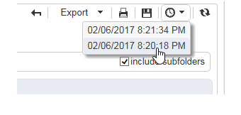

# Acties inzake rapporten{#actions-on-reports}

Wanneer u een rapport weergeeft, kunt u op de werkbalk een bepaald aantal handelingen uitvoeren. Deze worden hieronder beschreven.


Met de werkbalk kunt u het rapport bijvoorbeeld exporteren, afdrukken, archiveren of weergeven in een webbrowser.


## Een rapport exporteren {#exporting-a-report}

Selecteer de indeling waarin u het rapport wilt exporteren in de vervolgkeuzelijst. (.xls, .pdf of .ods).


Wanneer een rapport meerdere pagina&#39;s bevat, moet u de bewerking voor elke pagina herhalen.

U kunt uw rapport configureren met het oog op het exporteren ervan in PDF-, Excel- of OpenOffice-indeling. Open de Adobe Campagneverkenner en selecteer het betreffende rapport.

Exportopties zijn toegankelijk via de **[!UICONTROL Page]** activiteiten van het rapport op het **[!UICONTROL Advanced]** tabblad.

Wijzig de instellingen van **[!UICONTROL Paper]** en **[!UICONTROL Margins]** naar wens. U kunt het exporteren van een pagina alleen in PDF-indeling toestaan. Schakel de **[!UICONTROL Activate OpenOffice/Microsoft Excel export]** optie uit om dit te doen.


### Exporteren naar Microsoft Excel {#exporting-into-microsoft-excel}

Voor **[!UICONTROL List with group]** typerapporten die naar Excel worden geëxporteerd, gelden de volgende aanbevelingen en beperkingen:

* Deze rapporten mogen geen lege regels bevatten.

   

* De legenda van de lijst moet verborgen zijn.

   

* In de rapporten hoeft geen specifieke opmaak te worden gebruikt die op celniveau is gedefinieerd. U kunt het beste de indeling van de cellen in de tabel definiëren **[!UICONTROL Form rendering]** . De **[!UICONTROL Form rendering]** gegevens zijn toegankelijk via **[!UICONTROL Administration > Configuration > Form rendering]**.
* We raden u niet aan HTML-inhoud in te voegen.
* Als een rapport meerdere tabellen, grafieken enzovoort bevat. typeelementen, zullen zij onder andere worden uitgevoerd.
* U kunt de regelterugloop in cellen forceren: deze configuratie zal in Excel worden gehouden. Zie deze celindeling [](../../reporting/using/creating-a-table.md#defining-cell-format)definiëren voor meer informatie.

### Exporteren uitstellen {#postpone-the-export}

U kunt het uitvoeren van een rapport uitstellen, bijvoorbeeld om op asynchrone vraag te wachten. Hiervoor voert u de volgende parameter in het initialisatiescript van de pagina in:

```
document.nl_waitBeforeRender = true;
```

Als u het exporteren wilt activeren en de conversie naar een PDF wilt starten, gebruikt u de functie **document.nl_renderToPdf()** zonder parameter.

### Geheugentoewijzing {#memory-allocation}

Bij het exporteren van bepaalde grote rapporten kunnen fouten in de geheugentoewijzing optreden.

In bepaalde gevallen is de standaardwaarde **maxMB** (**SKMS** voor gehoste instanties) van het JavaScript dat in het configuratiebestand **serverConf.xml** wordt aangegeven, ingesteld op 64 MB. Als er onvoldoende geheugenfouten optreden tijdens het exporteren van een rapport, kunt u dit aantal verhogen tot 512 MB:

```
<javaScript maxMB="512" stackSizeKB="8"/>
```

Om veranderingen toe te passen die aan de configuratie worden aangebracht, moet de **dienst van de server** opnieuw worden begonnen.

Raadpleeg **deze sectie** voor meer informatie over het bestand [serverConf.xml](../../production/using/configuration-principle.md).

Raadpleeg **deze sectie** voor meer informatie over de service [nlserver](../../production/using/administration.md).

## Een rapport afdrukken {#printing-a-report}

U kunt uw rapport afdrukken: Klik hiertoe op het printerpictogram: hiermee wordt het dialoogvenster geopend.

Voor een beter resultaat bewerkt u de afdrukopties van Internet Explorer en selecteert u **[!UICONTROL Print background colors and images]**.


## Rapportarchieven maken {#creating-report-archives}

Door een rapport te archiveren kunt u het rapport op verschillende tijdstippen bekijken, bijvoorbeeld om de statistieken voor een bepaalde periode weer te geven.

Als u een archief wilt maken, opent u het desbetreffende rapport en klikt u op het juiste pictogram.


Klik op het pictogram voor tonen/verbergen om bestaande archieven weer te geven of te verbergen.


De archiefdatums worden weergegeven onder het pictogram voor tonen/verbergen. Klik op het archief om dit weer te geven.



Het is mogelijk om een rapportarchief te schrappen. Ga hiertoe naar het knooppunt Adobe Campagne waar de rapporten zijn opgeslagen. Klik op het **[!UICONTROL Archives]** tabblad, selecteer het tabblad dat u wilt verwijderen en klik op **[!UICONTROL Delete]**.


