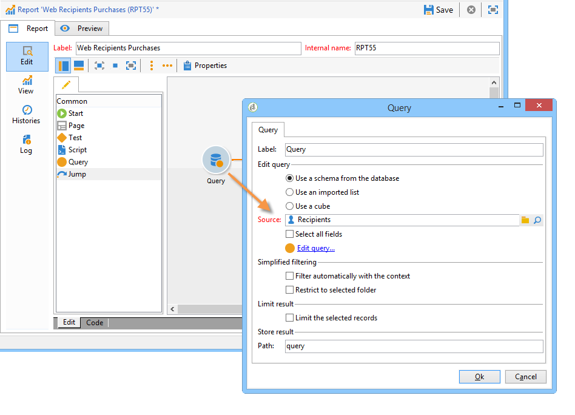

# Data verzamelen om te analyseren{#collecting-data-to-analyze}

De gegevens die voor de bouw van het rapport moeten worden gebruikt kunnen direct in de rapportpagina worden geselecteerd (voor meer op dit, verwijs naar [Gebruikend context](../../reporting/using/using-the-context.md)) of verzameld via één of meerdere vragen.

Deze activiteit biedt drie verschillende methodes aan:

1. Een query maken met de gegevens in de database.
1. De gegevens in een lijst verwerken.
1. Gegevens in een bestaande kubus gebruiken.

De keuze van de methode hangt af van het type berekening, het gegevensvolume en de duurzaamheid ervan, enz. Al deze parameters moeten zorgvuldig worden onderzocht om overbelasting van de Adobe Campaign-database te voorkomen en om het genereren en manipuleren van de gemaakte rapporten te optimaliseren. Raadpleeg [deze pagina](../../reporting/using/best-practices.md#optimizing-report-creation) voor meer informatie.

In alle gevallen worden gegevens verzameld via een activiteit van het type **[!UICONTROL Query]**.

Deze wijze van de gegevensselectie is relevant wanneer de gegevens in het rapport moeten worden verzameld of worden gebouwd gebruikend gegevens in het gegevensbestand. In sommige gevallen kunt u de gegevens ook rechtstreeks selecteren uit de elementen die in het rapport worden gebruikt. Als u bijvoorbeeld een grafiek invoegt, kunt u de brongegevens rechtstreeks selecteren. Voor meer op dit, verwijs naar [Gebruikend de context](../../reporting/using/using-the-context.md).

## De gegevens van een schema {#using-the-data-from-a-schema} gebruiken

Om gegevens te gebruiken verbonden aan een gegevensbestandschema, selecteer de aangewezen optie in de vraagredacteur en vorm de vraag die moet worden toegepast.

In het volgende voorbeeld kunt u het aantal ontvangers voor elk land verzamelen, onder de profielen in de database. Ze kunnen vervolgens in een rapport in de vorm van een tabel worden weergegeven.

## Een geïmporteerde lijst {#using-an-imported-list} gebruiken

Als u een rapport wilt maken, kunt u gegevens uit een lijst met geïmporteerde gegevens gebruiken.

Om dit te doen, selecteer **[!UICONTROL Use an imported list]** optie in het vraagvakje en selecteer de betrokken lijst.

Klik op de koppeling **[!UICONTROL Edit query...]** om de gegevens te definiëren die moeten worden verzameld onder de elementen in deze lijst voor het samenstellen van het rapport.

## Een kubus {#using-a-cube} gebruiken

Het is mogelijk om een kubus voor het bepalen van de vraag te selecteren.

Met behulp van kubussen kunt u de exploratie- en analysemogelijkheden van de database uitbreiden en tegelijkertijd de configuratie van rapporten en tabellen voor eindgebruikers vereenvoudigen: Selecteer eenvoudig een bestaande, volledig gevormde kubus en gebruik zijn berekeningen, maatregelen en statistieken. Raadpleeg [deze sectie](../../reporting/using/about-cubes.md) voor meer informatie over het maken van kubussen.

Klik op de koppeling **[!UICONTROL Edit query...]** en selecteer de indicatoren die u in uw rapport wilt weergeven of gebruiken.

## Filteropties in de query {#filtering-options-in-the-queries}

Om het runnen van vragen over het volledige gegevensbestand te vermijden, moeten de gegevens worden gefiltreerd.

### Vereenvoudigd filter {#simplified-filter}

U kunt de optie **[!UICONTROL Filter automatically with the context]** selecteren om het rapport toegankelijk te maken via een specifiek knooppunt van de boomstructuur, zoals een lijst, een ontvanger of een levering.

Met de optie **[!UICONTROL Filter with the folder]** kunt u een map opgeven en alleen de inhoud ervan in aanmerking nemen. Hiermee kunt u de rapportgegevens filteren, zodat alleen de gegevens uit een van de mappen in de structuur worden weergegeven, zoals hieronder wordt getoond:

### De hoeveelheid verzamelde gegevens beperken {#limiting-the-amount-of-data-collected}

Vorm het aantal verslagen dat via de vraag moet worden gehaald gebruikend de resultaat beperkende opties:

* **[!UICONTROL Limit to first record]** om één resultaat te extraheren,
* **[!UICONTROL Size]** om een ingesteld aantal records te extraheren.

