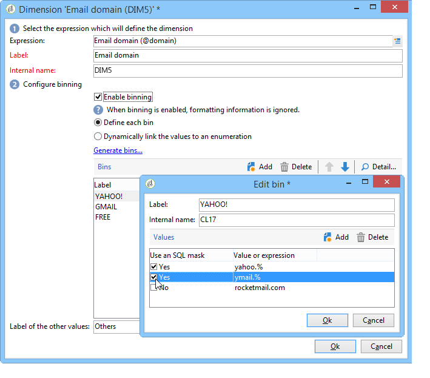
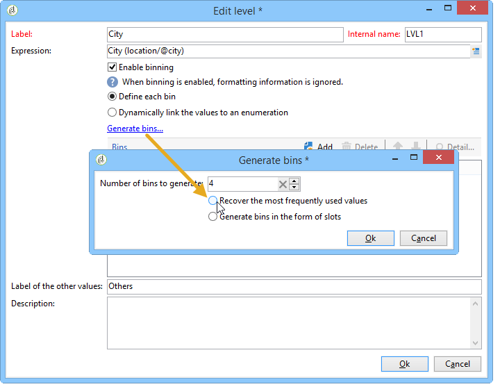
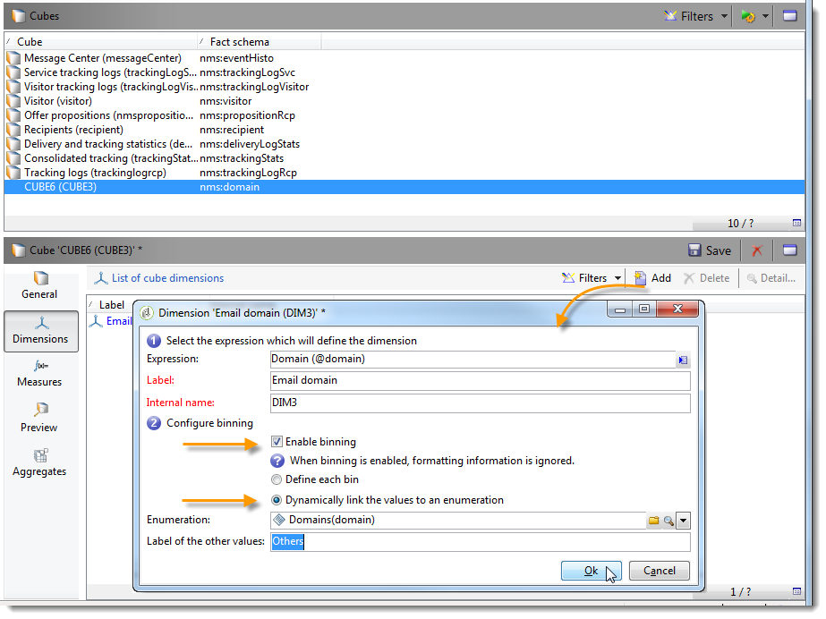
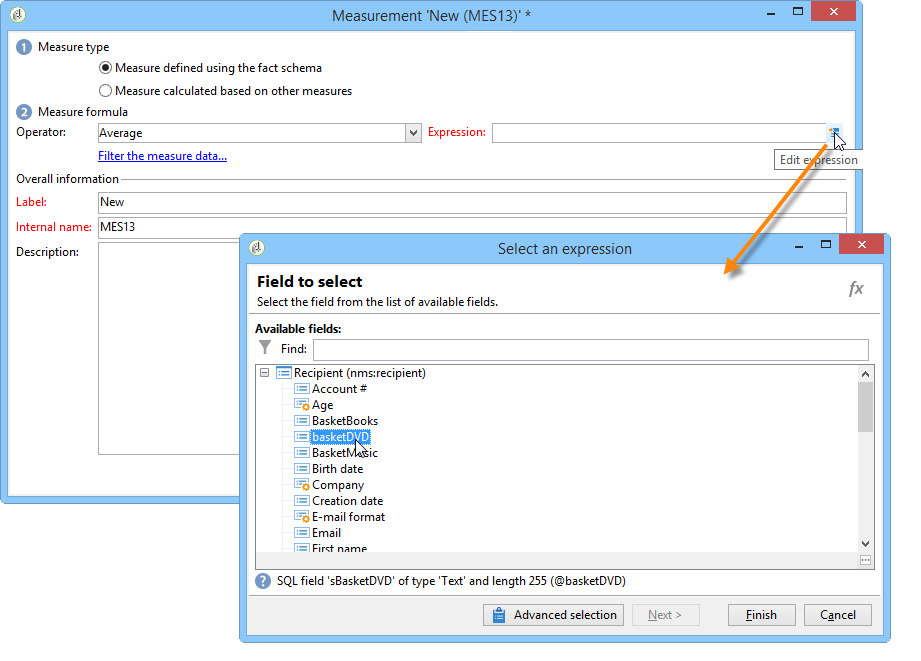
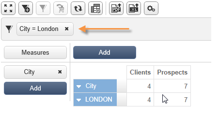

# Aanbevolen werkwijzen voor kubussen{#concepts-and-methodology}

## Gegevensbinding {#data-binning}

Met Binding kunt u de gegevensweergave vereenvoudigen door waarden te groeperen op basis van criteria. Afhankelijk van de informatie beschikbaar aan u, kunt u leeftijdsgroepen, groep e-maildomeinen samen bepalen, tot een waardeopsomming beperken, uitdrukkelijk de gegevens beperken tot vertoning en groepeert alle andere gegevens in een specifieke lijn of een kolom, enz.

Er zijn in totaal drie typen binding beschikbaar:

1. Handmatig gedefinieerde waardebereiken gebruiken. Bijvoorbeeld leeftijd, gemiddelde winkelwagentje, aantal geopende leveringen, enz.). Raadpleeg voor meer informatie hierover [Elke bin definiëren](#defining-each-bin).
1. Afhankelijk van de waarden van een opsomming, dynamisch: alleen de waarden in de opsomming worden weergegeven, alle andere waarden worden gegroepeerd in &#39;Overige&#39;. Raadpleeg voor meer informatie hierover [Banden dynamisch beheren](#dynamically-managing-bins).
1. Met behulp van waardebereiken worden alle andere reeksen gegroepeerd. Bijvoorbeeld 18- tot 25-jarigen, 26- tot 59-jarigen en de andere. Raadpleeg voor meer informatie hierover [Waardebereiken maken](#creating-value-ranges).

Om het binden toe te laten, controleer de aangewezen doos wanneer het creëren van de afmeting.

U kunt mappen handmatig maken of ze koppelen aan een bestaande opsomming.

Adobe Campaign biedt ook een assistent voor automatisch binden: Waarden kunnen worden opgesplitst in N-groepen of worden gegroepeerd op basis van de meest voorkomende waarden in de database.

### Elke bin definiëren {#defining-each-bin}

Als u elke bin afzonderlijk wilt maken, selecteert u de **[!UICONTROL Define each bin]** en gebruikt u de tabel om de verschillende vakken te maken.

Klik op de knop **[!UICONTROL Add]** om een nieuwe bin te maken en de waarden weer te geven die in de bin worden gegroepeerd.

In het volgende voorbeeld worden talen gegroepeerd in drie categorieën: Engels/Duits/Nederlands, Frans/Italiaans/Spaans, en andere.

Met een SQL-masker kunt u verschillende waarden combineren tot een filter. Om dit te doen, controleer **[!UICONTROL Yes]** in de **[!UICONTROL Use an SQL mask]** en voer het SQL-filter in dat u wilt toepassen in het dialoogvenster **[!UICONTROL Value or expression]** kolom.

In het onderstaande voorbeeld worden alle e-maildomeinen weergegeven waarmee wordt begonnen **yahoo** (yahoo.fr, yahoo.com, yahoo.be, enz.) of met **e-mail** (ymail.com, ymail.eu, enz.) wordt onder het label gegroepeerd **YAHOO!**, alsmede de adressen met de **rocketmail.com** domein.

### Banden dynamisch beheren {#dynamically-managing-bins}

Waarden kunnen dynamisch worden beheerd via opsommingen. Dit betekent dat alleen de waarden in de opsomming worden weergegeven. Wanneer de opsommingswaarden worden gewijzigd, wordt de inhoud van de kubus automatisch aangepast.

Voer de volgende stappen uit om dit type waardenbinding te maken:

1. Maak een nieuwe dimensie en schakel het binden in.
1. Selecteer **[!UICONTROL Dynamically link the values to an enumeration]** en selecteer de overeenkomstige opsomming.

   

   Wanneer de opsommingswaarden worden bijgewerkt, worden de overeenkomstige bakken automatisch aangepast.

### Waardebereiken maken {#creating-value-ranges}

U kunt de waarden op basis van een gewenst interval groeperen in bereiken.

Als u bereiken handmatig wilt definiëren, klikt u op de knop **[!UICONTROL Add]** en selecteert u **[!UICONTROL Define a range]** :

Geef vervolgens de onderste en bovenste limiet op en klik op **[!UICONTROL Ok]** ter bevestiging.

### Automatisch vakken genereren {#generating-bins-automatically}

Het is ook mogelijk om automatisch bakken te produceren. Om dit te doen, klik **[!UICONTROL Generate bins...]** koppeling.

U kunt:

* De meest gebruikte waarden herstellen

   In het volgende voorbeeld worden de vier meest gebruikte waarden weergegeven, terwijl de andere worden geteld en gegroepeerd in de categorie &#39;Overige&#39;.

* Banden genereren in de vorm van sleuven

   In het volgende voorbeeld maakt Adobe Campaign automatisch vier sleuven van hetzelfde formaat om de waarden in de database weer te geven.

In dit geval wordt het filter dat in het feitelijke schema is geselecteerd, genegeerd.

### Opsommingen {#enumerations}

Om de relevantie en leesbaarheid van een rapport te verbeteren, kunt u met Adobe Campaign specifieke opsommingen maken om verschillende waarden te groeperen in hetzelfde vak. Deze opsommingen, die voor het binden worden gereserveerd, worden van verwijzingen voorzien in de kubussen dan getoond in de rapporten.

Adobe Campaign biedt ook een opsomming op domeinen aan die u een lijst van de e-maildomeinen van alle contacten in het gegevensbestand laat tonen, die door ISP, zoals aangetoond in het volgende voorbeeld wordt gegroepeerd:

Deze is gemaakt met de volgende sjabloon:

Als u een rapport wilt maken met deze opsomming, maakt u een kubus met de opdracht **[!UICONTROL Email domain]** dimensie. Kies de optie **[!UICONTROL Enable binning]** optie dan **[!UICONTROL Dynamically link the values to an enumeration]**. Selecteer vervolgens de **Domeinen** opsomming zoals hierboven getoond. Alle waarden zonder opgegeven alias worden opnieuw gegroepeerd onder het dialoogvenster **Overige** label.

Maak vervolgens een rapport op basis van deze kubus om de waarden weer te geven.

U hoeft alleen de opsomming te wijzigen om het verwante rapport bij te werken. Maak bijvoorbeeld de **Adobe** en voeg de **adobe.com** alias en het rapport wordt automatisch bijgewerkt met de waarde van Adobe op het opsommingsniveau.

De **[!UICONTROL Domains]** opsomming wordt gebruikt om ingebouwde rapporten te produceren die de lijst van domeinen tonen. Als u de inhoud van deze rapporten wilt aanpassen, kunt u deze lijst bewerken.

U kunt andere opsommingen maken die zijn gereserveerd voor binden en deze gebruiken in andere kubussen: alle aliaswaarden worden opnieuw gegroepeerd in de vakken die zijn opgegeven op het eerste tabblad voor opsomming.

## aggregaten berekenen en gebruiken {#calculating-and-using-aggregates}

De grootste gegevensvolumes kunnen in aggregaten worden berekend.

Samengevoegde gegevens zijn handig wanneer u grote hoeveelheden gegevens bewerkt. Ze worden automatisch bijgewerkt op basis van de instellingen die in het specifieke werkstroomvak zijn gedefinieerd, zodat de gegevens die het laatst zijn verzameld, worden geïntegreerd in de indicatoren

De aggregaten worden bepaald in het relevante lusje van elke kubus.

>[!NOTE]
>
>De workflow voor het bijwerken van geaggregeerde berekeningen kan worden geconfigureerd in het aggregaat zelf, of het aggregaat kan worden bijgewerkt via een externe workflow die is gekoppeld aan de relevante kubus.

Voer de volgende stappen uit om een nieuw aggregaat te maken:

1. Klik op de knop **[!UICONTROL Aggregates]** tabblad van de kubus en klik vervolgens op de knop **[!UICONTROL Add]** knop.

   

1. Voer een label in voor het aggregaat en voeg vervolgens de afmetingen toe die moeten worden berekend.

   

1. Selecteer een dimensie en een niveau. Herhaal dit proces voor elke dimensie en elk niveau.
1. Klik op de knop **[!UICONTROL Workflow]** om de samenvoegingsworkflow te maken.

   

   * De **[!UICONTROL Scheduler]** Met deze activiteit kunt u de frequentie van de berekening-updates definiëren. De planner is gedetailleerd in [deze sectie](../../workflow/using/scheduler.md).
   * De **[!UICONTROL Aggregate update]** Met activiteit kunt u de updatemodus selecteren die u wilt toepassen: volledig of gedeeltelijk.

      Standaard wordt bij elke berekening een volledige update uitgevoerd. Als u een gedeeltelijke update wilt inschakelen, selecteert u de desbetreffende optie en definieert u de updatevoorwaarden.

      

## Maatregelen definiëren {#defining-measures}

De soorten maatregelen worden gedefinieerd in de **[!UICONTROL Measures]** tabblad van de kubus. U kunt sommen, gemiddelden, afwijkingen, enz. berekenen.

U kunt zoveel maatregelen maken als nodig zijn: Selecteer vervolgens de maatregel die u in de tabel wilt weergeven of verbergen. Raadpleeg voor meer informatie hierover [Weergavemaatregelen](#displaying-measures).

Voer de volgende stappen uit om een nieuwe maatregel te definiëren:

1. Klik op de knop **[!UICONTROL Add]** boven de lijst van maatregelen en selecteer het type maatregel en de te berekenen formule.

   

1. Kies zo nodig, en afhankelijk van de operator, de expressie waarop de bewerking betrekking heeft.

   De **[!UICONTROL Advanced selection]** Met deze knop kunt u complexe berekeningsformules maken. Raadpleeg [deze sectie](../../platform/using/about-queries-in-campaign.md) voor meer informatie.

   

1. De **[!UICONTROL Filter the measure data...]** Met de koppeling kunt u het berekeningsveld beperken en alleen toepassen op specifieke gegevens in de database.

   

1. Voer het label van de maatregel in en voeg een beschrijving toe. Klik vervolgens op **[!UICONTROL Finish]** om het te maken.

## Weergavemetingen {#displaying-measures}

U kunt de weergave van maatregelen in de tabel configureren, afhankelijk van uw behoeften:

* de weergavesequentie van metingen (zie [Weergavevolgorde](#display-sequence)),
* de informatie die in het rapport moet worden weergegeven/verborgen (zie [De weergave configureren](#configuring-the-display))
* welke maatstaven moeten worden weergegeven: percentage, totaal, aantal decimalen enz. (zie [Het weergegeven type maatregel wijzigen](#changing-the-type-of-measure-displayed)).

### Weergavevolgorde {#display-sequence}

De in de kubus berekende maatregelen worden geconfigureerd via de **[!UICONTROL Measures]** knop.

Verplaats de lijnen om de weergavereeks te wijzigen. In het volgende voorbeeld worden Franse gegevens naar de onderkant van de lijst verplaatst: dit betekent dat het in de laatste kolom zal worden getoond.

### De weergave configureren {#configuring-the-display}

De opstelling van maatregelen, lijnen en kolommen kan voor elke maatregel afzonderlijk of in zijn geheel worden uitgevoerd. Met een specifiek pictogram hebt u toegang tot het selectievenster voor de weergavemodus.

* Klik op de knop **[!UICONTROL Edit the configuration of the pivot table]** pictogram om tot het configuratievenster toegang te hebben.

   U kunt kiezen of u de labels van maatregelen wilt weergeven en de lay-out (lijnen of kolommen) ervan wilt configureren.

Met de kleuropties kunt u belangrijke waarden markeren, zodat u deze eenvoudig kunt lezen.

### Het weergegeven type maatregel wijzigen {#changing-the-type-of-measure-displayed}

Binnen elke meting kunt u de toe te passen eenheid en opmaak definiëren.

## Uw rapport delen {#sharing-a-report}

Zodra het rapport wordt gevormd, kunt u het bewaren en het met andere exploitanten delen.

Om dit te doen, klik **[!UICONTROL Show the report properties]** en schakelt u de **[!UICONTROL Share this report]** optie.

Geef aan tot welke categorie het rapport behoort en wat de relevantie ervan is. Raadpleeg voor meer informatie hierover de [deze pagina](../../reporting/using/configuring-access-to-the-report.md#report-display-context) aan de **Weergavevolgorde** en **Filteropties definiëren** secties.

Om deze veranderingen te bevestigen, moet u het rapport bewaren.

## Filters maken {#creating-filters}

Het is mogelijk filters te maken voor het weergeven van een gedeelte van de gegevens.

Dit doet u als volgt:

1. Klik op de knop **[!UICONTROL Add a filter]** pictogram.

   

1. Selecteer de dimensie waarop het filter betrekking heeft

   

1. Selecteer het type filter en de precisie ervan.

   

1. Zodra het wordt gecreeerd, wordt de filter getoond boven het rapport.

   

   Klik op het filter om het te bewerken.

   Klik op het kruisje om het te verwijderen.

   U kunt zoveel filters combineren als nodig is: zij zullen allemaal op dit gebied worden getoond .

   

Telkens wanneer een filter wordt gewijzigd (voeg toe, verwijder, verander), moet het rapport worden opnieuw berekend.

U kunt ook filters maken op basis van een selectie. Hiervoor selecteert u de broncellen, -lijnen en -kolommen en klikt u op de knop **[!UICONTROL Add a filter]** pictogram.

Als u een lijn, kolom of cel wilt selecteren, klikt u er met de linkermuisknop op. Klik nogmaals om de selectie op te heffen.

Het filter wordt automatisch toegepast en aan de filterstreek boven het rapport toegevoegd.

