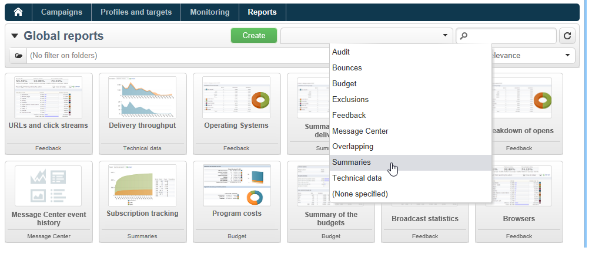
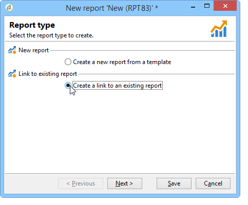
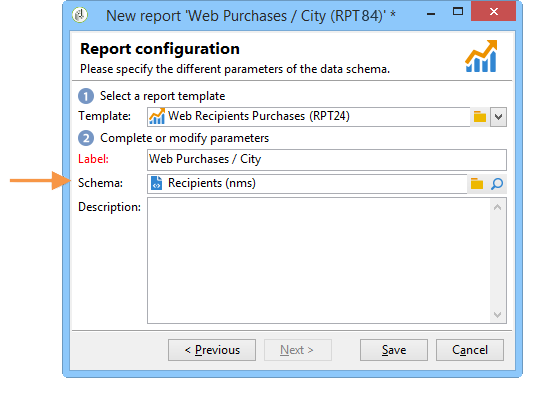
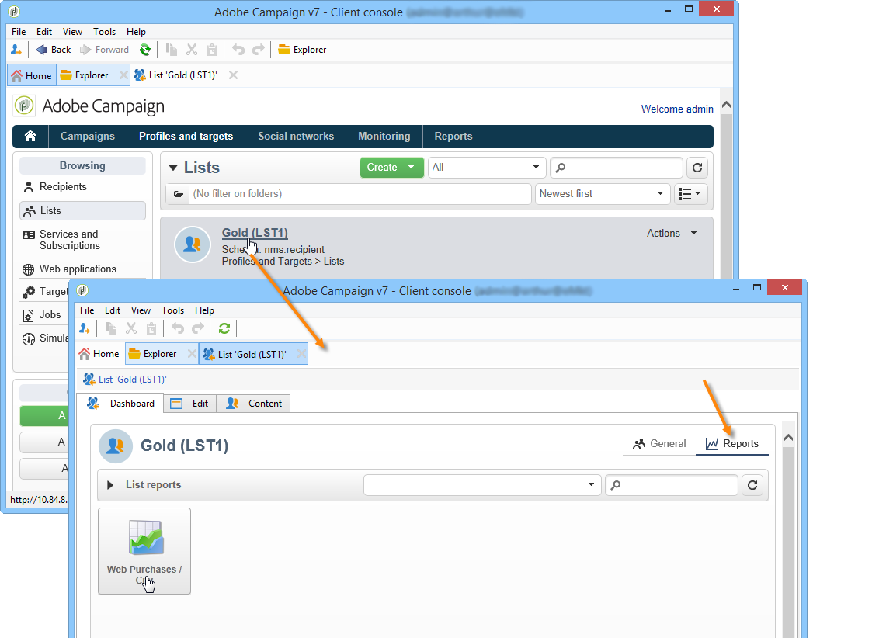

# Toegang tot het rapport configureren{#configuring-access-to-the-report}

## Weergavecontext rapporteren {#report-display-context}

Bepaal de vertoningscontext van het rapport in het platform van Adobe Campaign gebruikend **[!UICONTROL Display]** tab. De toegang tot een rapport hangt van zijn selectietype, vertoningsvoorwaarden en toegangsvergunningen af.

### Type selectie {#selection-type}

De toegang tot het rapport kan worden beperkt tot een specifieke context of ruimte bieden, bijvoorbeeld een levering, een ontvanger, een selectie van ontvangers, enz. Deze toegang wordt gevormd in **[!UICONTROL Selection type]** van de **[!UICONTROL Display]** tab.

* **[!UICONTROL Single selection]** : het verslag is alleen toegankelijk wanneer een specifieke entiteit is geselecteerd .
* **[!UICONTROL Multiple selection]** : het rapport is toegankelijk wanneer meerdere entiteiten zijn geselecteerd.
* **[!UICONTROL Global]** : het rapport is toegankelijk via de lijst van beschikbare rapporten in het **[!UICONTROL Reports]** tab.

### Weergavevolgorde {#display-sequence}

De **[!UICONTROL Sequence]** In dit veld kunt u een numerieke waarde invoeren die de weergavevolgorde van het rapport in de lijst aangeeft.

Standaard worden rapporten weergegeven op relevantie: Met de waarde die u in dit veld opgeeft, kunt u rapporten sorteren van de meest (hoogste waarde) naar de minst (laagste waarde) relevante.

U kunt de schaal selecteren die u wilt gebruiken op basis van uw behoeften: 1 tot en met 10, 0 tot en met 100, -10 tot en met 10, enz.

### Weergavevoorwaarden {#display-conditions}

U kunt de vertoning van het rapport via een vraag ook bepalen.

In het volgende voorbeeld wordt het rapport weergegeven als het hoofdcampagnekanaal e-mail is.

Dit betekent dat als het hoofdkanaal van de campagne direct mail is, het rapport niet beschikbaar zal zijn in de campagnerapporten.

### Toegangsvergunning {#access-authorization}

Het rapport kan met andere exploitanten worden gedeeld.

Als u het rapport toegankelijk wilt maken, selecteert u de optie **[!UICONTROL Report shared with other operators]** optie. Als deze optie niet wordt geselecteerd, slechts kan de exploitant die het rapport creeerde tot het rapport toegang hebben.

Het rapport kan ook worden gedeeld met specifieke operatoren of groepen operatoren die via het venster voor machtigingen zijn toegevoegd.

### Filteropties definiëren {#defining-the-filtering-options}

De **[!UICONTROL Reports]** worden alle beschikbare rapporten in het platform weergegeven waarvoor de verbonden operator een toegangsrecht heeft.

Standaard worden ze gesorteerd op relevantie, maar u kunt andere typen filters toepassen: alfabetisch, naar leeftijd, enz.

U kunt de weergave ook filteren op basis van de rapportcategorie:

Om de categorie van een rapport te bepalen, selecteer het via **[!UICONTROL Display]** tab, zoals hieronder wordt getoond:

Je kunt hier een nieuwe rubriek invoeren en deze toevoegen aan de lijst met beschikbare rubrieken. De overeenkomstige opsomming wordt automatisch bijgewerkt.

## Een koppeling naar een rapport maken {#creating-a-link-to-a-report-}

Het is mogelijk om een rapport toegankelijk te maken via een specifiek knooppunt van de boom, zoals een lijst, een ontvanger, een levering, enz. Hiertoe maakt u gewoon een koppeling naar het betreffende rapport en geeft u de entiteit op waar u het wilt aanbieden.

Als voorbeeld zullen wij een verbinding aan een rapport creëren om het via een lijst van ontvangers toegankelijk te maken.

1. Klikken **[!UICONTROL New]** en selecteert u **[!UICONTROL Create a link to an existing report]** in de wizard voor het maken van rapporten.

   

1. Selecteer het rapport waarnaar u een koppeling wilt maken in de vervolgkeuzelijst. In dit voorbeeld gaan we de **Uitsplitsing naar land** verslag.

   

1. Voer een label in en selecteer het schema. In dit voorbeeld, gaan wij de ontvankelijke lijstlijst selecteren.

   

   Dit betekent dat het rapport toegankelijk zal zijn via een lijst van ontvangers en dat de statistieken betrekking zullen hebben op de ontvangers in de geselecteerde lijst.

1. Uw rapport opslaan en weergeven.
1. Voer de koppelingssleutel in. In dit geval is dit de buitenlandse sleutel van de koppeling &#39;Mappen&#39;.

   

1. Publiceer uw rapport.
1. Ga naar een van uw lijsten met ontvangers en klik op de knop **[!UICONTROL Reports]** koppeling: het rapport dat u zojuist hebt gemaakt, is toegankelijk.

   

## Voorbeeld van het rapport {#preview-of-the-report}

Voordat u uw rapport publiceert, moet u controleren of het correct wordt weergegeven in het dialoogvenster **[!UICONTROL Preview]** tab.

Als u de voorvertoning van het rapport wilt weergeven, selecteert u de optie **[!UICONTROL Global]** of de **[!UICONTROL Selection]** optie.

Deze twee opties worden geselecteerd gebaseerd op de vertoningsmontages van het rapport. Als de weergave-instelling **[!UICONTROL Global]** selecteert u de **[!UICONTROL Global]** voorvertoningsoptie. Als de weergave-instellingen **[!UICONTROL Single selection]** of **[!UICONTROL Multiple selection]** de **[!UICONTROL Selection]** De voorvertoningsoptie moet zijn geselecteerd.

Raadpleeg voor meer informatie hierover [Weergavecontext rapporteren](#report-display-context).

Met specifieke instellingen kunt u fouten beheren. De **_uuid** het plaatsen wordt gevonden in URL van het rapport. U kunt de **&amp;Voorvertoning** of de **&amp;Foutopsporing** instellingen.

Raadpleeg voor meer informatie over deze instellingen de **Eigenschappen van webformulieren definiëren** van de [Webformulieren](../../web/using/about-web-forms.md) hoofdstuk

## Het rapport publiceren {#publishing-the-report}

Publicatie van het rapport is verplicht om het te delen met andere exploitanten en weer te geven in de lijst van beschikbare rapporten (zie ook [Weergavecontext rapporteren](#report-display-context)). Deze operatie moet telkens opnieuw worden uitgevoerd wanneer het verslag wordt gewijzigd.

1. Open de wizard Publiceren door op **[!UICONTROL Publish]** in de werkbalk.

   

1. Klikken **[!UICONTROL Start]** om te publiceren.

   

1. Klik op de knop **[!UICONTROL Enlarge]** om het rapport te openen in een webbrowser.
