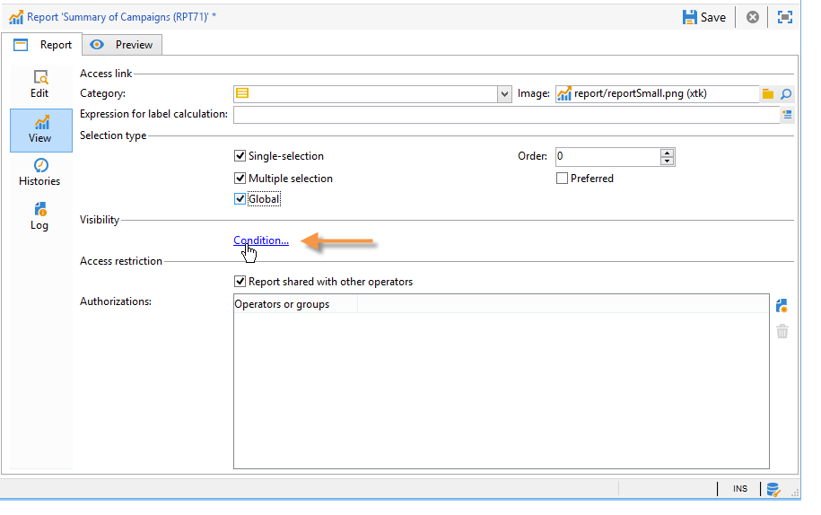

# Toegang tot het rapport configureren{#configuring-access-to-the-report}

## Weergavecontext rapporteren {#report-display-context}

Bepaal de vertoningscontext van het rapport in het platform van Adobe Campaign gebruikend **[!UICONTROL Display]** tabel. De toegang tot een rapport hangt van zijn selectietype, vertoningsvoorwaarden en toegangsvergunningen af.

### Type selectie {#selection-type}

De toegang tot het rapport kan worden beperkt tot een specifieke context of ruimte bieden, bijvoorbeeld een levering, een ontvanger, een selectie van ontvangers, enz. Deze toegang wordt geconfigureerd in de sectie **[!UICONTROL Selection type]** van het tabblad **[!UICONTROL Display]** .

* **[!UICONTROL Single selection]** : het rapport is alleen toegankelijk wanneer een specifieke entiteit is geselecteerd.
* **[!UICONTROL Multiple selection]** : het rapport wordt geopend wanneer meerdere entiteiten zijn geselecteerd.
* **[!UICONTROL Global]** : het rapport wordt geopend via de lijst met beschikbare rapporten op het tabblad **[!UICONTROL Reports]** .

### Weergavevolgorde {#display-sequence}

In het veld **[!UICONTROL Sequence]** kunt u een numerieke waarde invoeren die de weergavevolgorde van het rapport in de lijst aangeeft.

Standaard worden rapporten weergegeven op relevantie: met de waarde die in dit veld wordt ingevoerd, kunt u rapporten sorteren van de meest (hoogste waarde) tot de minst (laagste waarde) relevante.

U kunt de te gebruiken schaal op uw behoeften baseren: 1 tot 10, 0 tot 100, -10 tot 10, enz.

### Weergavevoorwaarden {#display-conditions}

U kunt de vertoning van het rapport via een vraag ook bepalen.

In het volgende voorbeeld wordt het rapport weergegeven als het hoofdcampagnekanaal e-mail is.

Dit betekent dat als het hoofdkanaal van de campagne direct mail is, het rapport niet beschikbaar zal zijn in de campagnerapporten.

### Toegangsvergunning {#access-authorization}

Het rapport kan met andere exploitanten worden gedeeld.

Als u het rapport toegankelijk wilt maken, selecteert u de optie **[!UICONTROL Report shared with other operators]** . Als deze optie niet wordt geselecteerd, slechts kan de exploitant die het rapport creeerde tot het rapport toegang hebben.

Het rapport kan ook worden gedeeld met specifieke operatoren of groepen operatoren die via het venster voor machtigingen zijn toegevoegd.

### Definieer de filteropties {#defining-the-filtering-options}

Op het tabblad **[!UICONTROL Reports]** worden alle beschikbare rapporten in het platform weergegeven waarvoor de verbonden operator een toegangsrecht heeft.

Standaard worden ze gesorteerd op relevantie, maar u kunt andere typen filters toepassen: alfabetisch, op leeftijd enzovoort.

U kunt de weergave ook filteren op basis van de rapportcategorie:

Als u de categorie van een rapport wilt definiëren, selecteert u het rapport via het tabblad **[!UICONTROL Display]** , zoals hieronder wordt weergegeven:

Je kunt hier een nieuwe rubriek invoeren en deze toevoegen aan de lijst met beschikbare rubrieken. De overeenkomstige opsomming wordt automatisch bijgewerkt.

## Een koppeling naar een rapport maken {#creating-a-link-to-a-report-}

Het is mogelijk om een rapport toegankelijk te maken via een specifiek knooppunt van de boom, zoals een lijst, een ontvanger, een levering, enz. Hiertoe maakt u gewoon een koppeling naar het betreffende rapport en geeft u de entiteit op waar u het wilt aanbieden.

Als voorbeeld zullen wij een verbinding aan een rapport creëren om het via een lijst van ontvangers toegankelijk te maken.

1. Klik op **[!UICONTROL New]** en selecteer **[!UICONTROL Create a link to an existing report]** in de assistent voor het maken van rapporten.

   

1. Selecteer het rapport waarnaar u een koppeling wilt maken in de vervolgkeuzelijst. In dit voorbeeld, gaan wij de **Uitsplitsing door land** rapport selecteren.

   

1. Voer een label in en selecteer het schema. In dit voorbeeld, gaan wij de ontvankelijke lijstlijst selecteren.

   

   Dit betekent dat het rapport toegankelijk zal zijn via een lijst van ontvangers en dat de statistieken betrekking zullen hebben op de ontvangers in de geselecteerde lijst.

1. Uw rapport opslaan en weergeven.
1. Voer de koppelingssleutel in. In dit geval is dit de buitenlandse sleutel van de koppeling &#39;Mappen&#39;.

   

1. Publish je rapport.
1. Ga naar een van uw lijsten met ontvangers en klik op de koppeling **[!UICONTROL Reports]** . Het rapport dat u zojuist hebt gemaakt, is toegankelijk.

   

## Voorbeeld van het rapport {#preview-of-the-report}

Voordat u uw rapport publiceert, moet u controleren of het rapport correct wordt weergegeven op het tabblad **[!UICONTROL Preview]** .

Selecteer de optie **[!UICONTROL Global]** of **[!UICONTROL Selection]** om de voorvertoning van het rapport weer te geven.

Deze twee opties worden geselecteerd gebaseerd op de vertoningsmontages van het rapport. Als de weergave-instelling **[!UICONTROL Global]** is, moet u de voorvertoningsoptie van **[!UICONTROL Global]** selecteren. Als de weergave-instellingen **[!UICONTROL Single selection]** of **[!UICONTROL Multiple selection]** zijn, moet de voorvertoningsoptie **[!UICONTROL Selection]** zijn geselecteerd.

Voor meer op dit, verwijs naar [ de vertoningscontext van het Rapport ](#report-display-context).

Met specifieke instellingen kunt u fouten beheren. De **_uuid** instelling wordt gevonden in URL van het rapport. U kunt **&amp;_preview** of **&amp;_debug** montages aan het toevoegen.

Meer over deze montages leren, verwijs naar **het Bepalen van de eigenschappen van de Webvorm** sectie van het [ de vormen van het Web ](../../web/using/about-web-forms.md) hoofdstuk.

## Publish het rapport {#publishing-the-report}

Het publiceren van het rapport is verplicht om hen met andere exploitanten te delen en hen in de lijst van beschikbare rapporten te tonen (verwijs ook naar [ de vertoningscontext van het Rapport ](#report-display-context)). Deze operatie moet telkens opnieuw worden uitgevoerd wanneer het verslag wordt gewijzigd.

1. Open de publicatieassistent door op **[!UICONTROL Publish]** op de werkbalk te klikken.

   

1. Klik op **[!UICONTROL Start]** om te publiceren.

   

1. Klik op het pictogram **[!UICONTROL Enlarge]** om het rapport in een webbrowser te openen.
