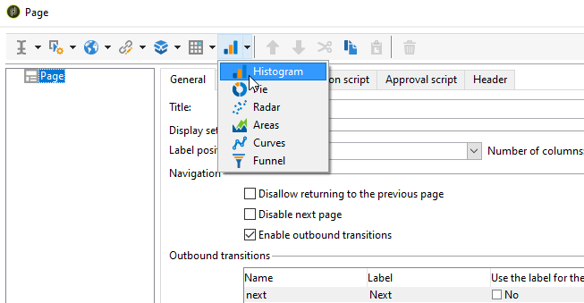

# Een diagram maken{#creating-a-chart}

De gegevens in het gegevensbestand kunnen ook in een grafiek worden verzameld en worden getoond. Adobe Campaign biedt een aantal grafische voorstellingen. Hun configuratie wordt hieronder gedetailleerd beschreven.

grafieken worden rechtstreeks in een rapportpagina ingevoegd via het snelmenu of de werkbalk.

## Aanmaakstappen {#creation-steps}

Pas de volgende stappen toe om een grafiek in een rapport te maken:

1. Bewerk de pagina waar u het diagram wilt weergeven en selecteer het diagramtype op de werkbalk.

   

1. Voer een naam en een bijschrift in. Indien nodig kunt u de positie van het bijschrift wijzigen in de vervolgkeuzelijst.

   

1. Klik op het **[!UICONTROL Data]** tabblad om de gegevensbron en de te berekenen reeks te definiëren.

   De statistieken die in de grafiek moeten worden getoond kunnen worden berekend gebaseerd op een vraag of op de contextgegevens, d.w.z. de gegevens die door de binnenkomende overgang van de huidige pagina worden verstrekt (voor meer op dit, verwijs naar het [Gebruiken van contextgegevens](../../reporting/using/using-the-context.md#using-context-data)).

   * Klik op de **[!UICONTROL Filter data...]** koppeling om filtercriteria voor de gegevens in de database te definiëren.

      

   * Als u contextafhankelijke gegevens wilt gebruiken, selecteert u deze optie en klikt u op de **[!UICONTROL Advanced settings...]** koppeling. Selecteer vervolgens de gegevens waarop de statistieken betrekking hebben.

      

      Vervolgens hebt u toegang tot de contextafhankelijke gegevens om de waarden te definiëren die in het diagram moeten worden weergegeven:

      

## Grafiektypen en -varianten {#chart-types-and-variants}

Adobe Campaign biedt verschillende typen grafische voorstellingen. Deze worden hieronder nader beschreven.

Het grafiektype wordt geselecteerd wanneer het in de pagina wordt opgenomen.

Het kan ook worden gewijzigd via de **[!UICONTROL Chart type]** sectie van het **[!UICONTROL General]** tabblad in het diagram.

Varianten zijn afhankelijk van het geselecteerde diagramtype. Ze worden via de **[!UICONTROL Variants...]** koppeling geselecteerd.

### Indeling: cirkeldiagrammen {#breakdown--pie-charts}

Met dit type grafische weergave kunt u een overzicht van de gemeten elementen weergeven.

Met schijfgrafieken kunt u slechts één variabele analyseren.

Met de **[!UICONTROL Variants]** koppeling kunt u de algemene rendering van het diagram aanpassen.

Met schijfgrafieken kunt u de waarde van de binnenstraal invoeren in het juiste veld.

Bijvoorbeeld:

0,00 traceert een volledige cirkel.

0,40 traceert een cirkel met een straal van 40%.

1,00 traceert alleen de buitenkant van de cirkel.

### Evolutie: curven en gebieden {#evolution--curves-and-areas}

Met dit type grafische weergave kunt u de evolutie van een of meer maatstaven in de tijd begrijpen.

### Vergelijking: histogrammen {#comparison--histograms}

Met histogrammen kunt u de waarden van een of meer variabelen vergelijken.

Voor deze typen grafieken worden de volgende opties aangeboden in het **[!UICONTROL Variants]** venster:

Schakel de **[!UICONTROL Display caption]** optie in om het bijschrift met het diagram weer te geven en de positie ervan te kiezen:

Indien van toepassing, kunt u waarden samen stapelen.

Indien nodig kunt u de weergavevolgorde van waarden omkeren. Selecteer de **[!UICONTROL Reverse stacking]** optie om dit te doen.

### Conversie: trechter {#conversion--funnel}

Dit type van grafiek laat u het gesprekstarief van gemeten elementen volgen.

### Voortgang: profiel {#progress--gauge}

Met dit diagramtype kunt u de voortgang van een waarde ten opzichte van een gedefinieerd doel weergeven. In het onderstaande voorbeeld toont de zwarte wijzerplaat het aantal met succes verzonden leveringen (76) van een doel van 100 leveringen. Het omgrenzingsprofiel is verdeeld in drie bereiken die overeenkomen met specifieke statussen.

Deze elementen worden bepaald wanneer het vormen van de grafiek.

* Het **[!UICONTROL Value]** gebied wordt vertegenwoordigd door een zwarte wijzerplaat in de grafiek. Het vertegenwoordigt het element waarvan vooruitgang u zou willen berekenen. De waarde die moet worden weergegeven, moet al zijn opgeslagen om te kunnen worden gebruikt.
* Het **[!UICONTROL Goal]** veld vertegenwoordigt de maximale waarde die moet worden bereikt.
* Met behulp van het **[!UICONTROL Other mark]** veld kunt u een tweede indicator aan het diagram toevoegen.
* In de **[!UICONTROL Display range]** velden kunt u de waarden opgeven waartussen het rapport wordt berekend.
* In het **[!UICONTROL Value ranges]** veld kunt u statussen (Geen, Slecht, Aanvaardbaar, Goed) toewijzen aan een set waarden om de voortgang beter te illustreren.

In de **[!UICONTROL Display settings]** sectie, **[!UICONTROL Change appearance...]** laat u de manier vormen de grafiek wordt getoond.

Met de **[!UICONTROL Display the value below the gauge]** optie kunt u de voortgang van de waarde onder het diagram weergeven.

In het **[!UICONTROL Aperture ratio]** veld, dat tussen 0 en 1 moet liggen, kunt u de lensopening van het rapport in een meer of minder volledige cirkel bewerken. In het bovenstaande voorbeeld komt de waarde 0,50 overeen met een halve cirkel.

In het **[!UICONTROL Width]** veld kunt u de diagramgrootte bewerken.

## Interactie met de grafiek {#interaction-with-the-chart}

U kunt een actie bepalen wanneer de gebruiker de grafiek klikt. Open het **[!UICONTROL Interaction events]** venster en selecteer de handeling die u wilt uitvoeren.

Mogelijke interactietypen en de bijbehorende configuraties worden in [deze sectie](../../web/using/static-elements-in-a-web-form.md#inserting-html-content)beschreven.

## Berekening van statistieken {#calculating-statistics}

Met grafieken kunt u statistieken weergeven over de verzamelde gegevens.

Deze statistieken worden bepaald via de **[!UICONTROL Series parameters]** sectie van het **[!UICONTROL Data]** lusje.

Als u een nieuwe statistiek wilt maken, klikt u op het **[!UICONTROL Add]** pictogram en configureert u het desbetreffende venster. De beschikbare berekeningstypen worden hieronder beschreven.

Zie [deze sectie](../../reporting/using/using-the-descriptive-analysis-wizard.md#statistics-calculation)voor meer informatie.
