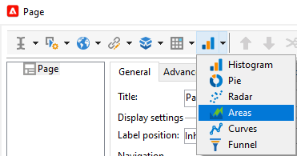
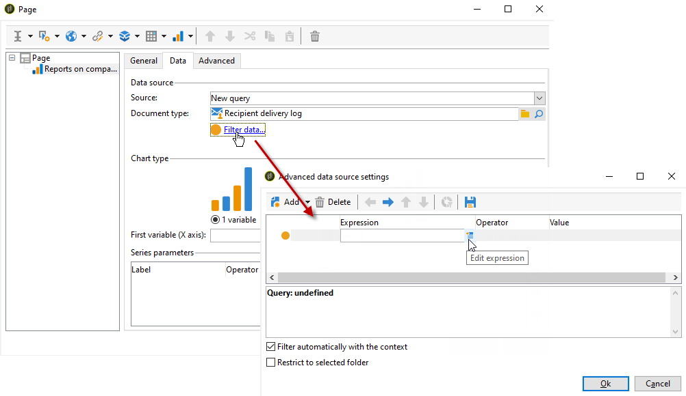
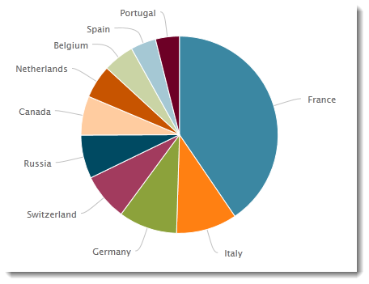

# Een grafiek maken{#creating-a-chart}

De gegevens in het gegevensbestand kunnen ook in een grafiek worden verzameld en worden getoond. Adobe Campaign biedt een aantal grafische voorstellingen. Hun configuratie wordt hieronder gedetailleerd beschreven.

grafieken worden rechtstreeks in een rapportpagina ingevoegd via het snelmenu of de werkbalk.

## Aanmaakstappen {#creation-steps}

Pas de volgende stappen toe om een grafiek in een rapport te maken:

1. Bewerk de pagina waar u het diagram wilt weergeven en selecteer het diagramtype op de werkbalk.

   

1. Voer een naam en een bijschrift in. Indien nodig kunt u de positie van het bijschrift wijzigen in de vervolgkeuzelijst.

   

1. Klik op het tabblad **[!UICONTROL Data]** om de gegevensbron en de te berekenen reeks te definiëren.

   De statistieken die in de grafiek moeten worden getoond kunnen worden berekend gebaseerd op een vraag of op de contextgegevens, d.w.z. de gegevens die door de binnenkomende overgang van de huidige pagina worden verstrekt (voor meer op dit, verwijs naar [ Gebruikend contextgegevens ](../../reporting/using/using-the-context.md#using-context-data)).

   * Klik op de koppeling **[!UICONTROL Filter data...]** om filtercriteria voor de gegevens in de database te definiëren.

     

   * Als u contextuele gegevens wilt gebruiken, selecteert u **[!UICONTROL Context data]** in de vervolgkeuzelijst **[!UICONTROL Source]** en klikt u op de koppeling **[!UICONTROL Advanced settings...]** . Selecteer vervolgens de gegevens waarop de statistieken betrekking hebben.

     

     Vervolgens hebt u toegang tot de contextafhankelijke gegevens om de waarden te definiëren die in het diagram moeten worden weergegeven:

     

## Grafiektypen en -varianten {#chart-types-and-variants}

Adobe Campaign biedt verschillende typen grafische voorstellingen. Deze worden hieronder nader toegelicht.

Het grafiektype wordt geselecteerd wanneer het in de pagina wordt opgenomen.

Deze kan ook worden gewijzigd via de sectie **[!UICONTROL Chart type]** van het tabblad **[!UICONTROL General]** in het diagram.

Varianten zijn afhankelijk van het geselecteerde diagramtype. Ze worden geselecteerd via de koppeling **[!UICONTROL Variants...]** .

### Indeling: schijfgrafieken {#breakdown--pie-charts}

Met dit type grafische weergave kunt u een overzicht van de gemeten elementen weergeven.

Met schijfgrafieken kunt u slechts één variabele analyseren.

Met de koppeling **[!UICONTROL Variants]** kunt u de algemene rendering van het diagram aanpassen.

Met schijfgrafieken kunt u de waarde van de binnenstraal invoeren in het juiste veld.

Bijvoorbeeld:

0,00 traceert een volledige cirkel.

0,40 traceert een cirkel met een straal van 40%.

1,00 traceert alleen de buitenkant van de cirkel.

### Evolutie: curven en gebieden {#evolution--curves-and-areas}

Met dit type grafische weergave kunt u de evolutie van een of meer maatstaven in de tijd begrijpen.

### Vergelijking: histogrammen {#comparison--histograms}

Met histogrammen kunt u de waarden van een of meer variabelen vergelijken.

Voor deze typen grafieken worden de volgende opties aangeboden in het **[!UICONTROL Variants]** -venster:

Schakel de optie **[!UICONTROL Display caption]** in om het bijschrift met het diagram weer te geven en de positie ervan te kiezen:

Indien van toepassing, kunt u waarden samen stapelen.

Indien nodig, kunt u de reeks van de waardevertoning omkeren. Selecteer hiervoor de optie **[!UICONTROL Reverse stacking]** .

### Omzetting: trechter {#conversion--funnel}

Dit type van grafiek laat u het gesprekstarief van gemeten elementen volgen.

## Interactie met de grafiek {#interaction-with-the-chart}

U kunt een actie bepalen wanneer de gebruiker de grafiek klikt. Open het venster **[!UICONTROL Interaction events]** en selecteer de handeling die u wilt uitvoeren.

De mogelijke interactietypen en hun configuraties zijn gedetailleerd in [ deze sectie ](../../web/using/static-elements-in-a-web-form.md#inserting-html-content).

## Statistieken berekenen {#calculating-statistics}

Met grafieken kunt u statistieken weergeven over de verzamelde gegevens.

Deze statistieken worden gedefinieerd via de sectie **[!UICONTROL Series parameters]** van het tabblad **[!UICONTROL Data]** .

Als u een nieuwe statistiek wilt maken, klikt u op het pictogram **[!UICONTROL Add]** en configureert u het desbetreffende venster. De beschikbare berekeningstypen worden hieronder beschreven.

Raadpleeg [deze sectie](../../reporting/using/using-the-descriptive-analysis-wizard.md#statistics-calculation) voor meer informatie.
