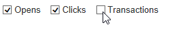

# Een nieuw rapport maken{#creating-a-new-report}

Voer de volgende stappen uit om een rapport te maken:

1. Open Adobe Campaign Explorer en vanuit de **[!UICONTROL Administration > Configuration]** knoop, dan selecteer **[!UICONTROL Reports]** map.
1. Klik op de knop **[!UICONTROL New]** boven de lijst met rapporten.
1. Selecteer **[!UICONTROL Create a new report from a template]** en klik op **[!UICONTROL Next]**.

   

1. Selecteer het rapportmalplaatje in de drop-down lijst.

   * De **[!UICONTROL Extended report]** laat u een gevormd rapport tot stand brengen gebruikend een grafiek.
   * De **[!UICONTROL Qualitative distribution]** Met rapporten kunt u statistieken maken op basis van alle typen gegevens (bedrijfsnaam, e-maildomein, enzovoort).
   * De **[!UICONTROL Quantitative distribution]** Met dit rapport kunt u statistieken maken over gegevens die kunnen worden gemeten of geteld (factuurbedrag, leeftijd van de ontvanger, enz.).

   Voor meer informatie over deze rapportmalplaatjes, verwijs naar [deze sectie](../../reporting/using/about-descriptive-analysis.md).

1. Voer de rapportnaam en de beschrijving ervan in de desbetreffende velden in. Geef de **[!UICONTROL schema]** waarop het verslag zal worden toegepast.

   

1. Sla dit rapport op.

## Het diagram modelleren {#modelizing-the-chart}

Nadat u uw rapport hebt opgeslagen, moet dit worden weergegeven. U kunt nu het diagram van uw rapport maken.

Het overzicht voor de opstelling van het verslag bestaat uit een opeenvolging van activiteiten.

Activiteiten worden gekoppeld met behulp van overgangen, weergegeven door pijlen.

Om een rapport te bouwen, afhankelijk van zijn aard en context, moet u de nuttige elementen identificeren en hun logische opeenvolging verwissen.

1. Gebruik de **[!UICONTROL Start]** activiteiten om het eerste proces tot stand te brengen dat moet worden uitgevoerd om het verslag op te stellen. U kunt slechts één van deze activiteiten per rapport gebruiken.

   Het is verplicht als het diagram een lus bevat.

1. Een of meer toevoegen **[!UICONTROL Query]** activiteiten om gegevens te verzamelen die nuttig zijn voor het opstellen van het rapport. Gegevens kunnen rechtstreeks worden verzameld via een query op een schema van de database, of via een geïmporteerde lijst of een bestaande kubus.

   Raadpleeg voor meer informatie hierover [Gegevens verzamelen voor analyse](../../reporting/using/collecting-data-to-analyze.md).

   Deze gegevens zullen (of niet) in het rapport afhankelijk van paginaconfiguratie worden getoond.

1. Een of meer plaatsen **[!UICONTROL Page]** activiteiten om de grafische weergave van de verzamelde gegevens te definiëren. U kunt tabellen, grafieken, invoervelden invoegen en de weergave van een of meer pagina&#39;s of elementen van de pagina bepalen. De weergegeven inhoud kan volledig worden geconfigureerd.

   Raadpleeg voor meer informatie hierover [Statische elementen](#static-elements).

1. Een **[!UICONTROL Test]** activiteit om de voorwaarden voor het tonen van of de toegang tot van gegevens te bepalen.

   Raadpleeg voor meer informatie hierover [Weergave van pagina&#39;s conditioneren](../../reporting/using/defining-a-conditional-content.md#conditioning-page-display).

1. Voeg, indien nodig, gepersonaliseerde scripts toe via de **[!UICONTROL Script]** activiteit, bijvoorbeeld om de naam van een rapport te berekenen, om de weergave van het resultaat binnen een specifieke context te filteren, enz.

   Raadpleeg voor meer informatie hierover [Scriptactiviteit](../../reporting/using/advanced-functionalities.md#script-activity).

1. Tot slot kunt u voor het lezen van complexe rapporten een of meer **[!UICONTROL Jump]** type activiteiten. Dit laat u van één activiteit aan een andere gaan zonder de overgang op het rapport te concretiseren. De **[!UICONTROL Jump]** de activiteit kan ook worden gebruikt om een ander rapport te tonen.

   Raadpleeg voor meer informatie hierover [Snelheid](../../reporting/using/advanced-functionalities.md#jump-activity).

U kunt niet meerdere vertakkingen tegelijk uitvoeren. Dit betekent dat een dergelijk rapport niet werkt:

U kunt echter verschillende vertakkingen plaatsen. Slechts één van hen zal worden uitgevoerd:

## Een pagina maken {#creating-a-page}

De inhoud wordt gevormd via de activiteiten die in de grafiek worden geplaatst. Raadpleeg voor meer informatie hierover [De grafiek wissen](#modelizing-the-chart).

Om een activiteit te vormen, klik zijn pictogram tweemaal.

De weergegeven inhoud wordt gedefinieerd in het dialoogvenster **Pagina** type activiteiten.

Een rapport kan een of meer pagina&#39;s bevatten. Pagina&#39;s worden gemaakt via een speciale editor waarmee u in een boomstructuur invoervelden, selectievelden, statische elementen, grafieken of tabellen kunt invoegen. Met behulp van containers kunt u de lay-out definiëren. Raadpleeg voor meer informatie hierover [Element-indeling](../../reporting/using/element-layout.md).

Als u een component aan de pagina wilt toevoegen, gebruikt u de pictogrammen in de linkerbovensectie van de werkbalk.

U kunt ook met de rechtermuisknop op het knooppunt klikken waar u de component wilt toevoegen en dit selecteren in de lijst.

>[!CAUTION]
>
>Als het rapport bestemd is om in het formaat van Excel worden uitgevoerd, adviseren wij het gebruiken van complex HTML formatteren niet. Raadpleeg voor meer informatie hierover [Een rapport exporteren](../../reporting/using/actions-on-reports.md#exporting-a-report).

A **[!UICONTROL Page]** kan de volgende elementen bevatten:

* Staaf, taart, curvetype **[!UICONTROL charts]**, enz.
* Draaien; weergeven met groep of Indeling **[!UICONTROL tables]**.
* Tekst- of getaltype **[!UICONTROL Input controls]**.
* Vervolgkeuzelijst, selectievakje, keuzerondje, meerkeuzevype, datum of type matrix **[!UICONTROL Selection controls]**.
* Koppelingseditor, Constant, Mapselectietype **[!UICONTROL Advanced controls]**.
* Waarde, Koppeling, HTML, Afbeelding, enzovoort. **[!UICONTROL Static elements]**.
* **[!UICONTROL Containers]** waarmee u de indeling van componenten kunt bepalen.

De configuratiewijze van een pagina en zijn componenten is gedetailleerd in [deze sectie](../../web/using/about-web-forms.md).

Met de werkbalk kunt u besturingselementen toevoegen of verwijderen en de volgorde ervan in de rapportpagina(&#39;s) ordenen.

### Statische elementen {#static-elements}

De statische elementen laten u toe om informatie in het rapport, zoals grafische elementen of manuscripten te tonen, die de gebruiker niet met zal in wisselwerking staan. Zie [deze sectie](../../web/using/static-elements-in-a-web-form.md#inserting-html-content) voor meer informatie .

### Gegevens in een rapport filteren {#filtering-information-in-a-report}

De controles van de input en van de selectie laten u toe om de informatie te filtreren die in het rapport wordt getoond. Raadpleeg voor meer informatie over het implementeren van dit type filters [Filteropties in de query&#39;s](../../reporting/using/collecting-data-to-analyze.md#filtering-options-in-the-queries).

Raadpleeg voor meer informatie over het maken en configureren van invoervelden en selectievelden de [deze sectie](../../web/using/about-web-forms.md).

U kunt één of meerdere inputcontroles in uw rapporten integreren. Met dit type besturingselement kunt u informatie filteren die wordt weergegeven volgens een ingevoerde waarde.

U kunt ook een of meer selectiemiddelen in uw rapporten integreren. Met dit type besturingselement kunt u de informatie in het rapport filteren op basis van de geselecteerde waarde(n), zoals:

* via keuzerondjes of selectievakjes:

  

* via een vervolgkeuzelijst:

  

* via een kalender:

  

Tot slot kunt u één of meer geavanceerde controles in uw rapporten integreren. Met dit type besturingselement kunt u een koppeling, constante of een map invoegen.

Hier kunt u de gegevens in het rapport filtreren om slechts de informatie te tonen bevat in één van de omslagen van de boom:

