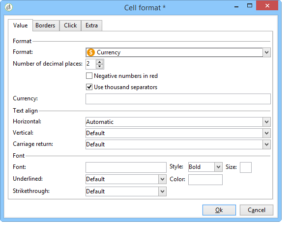
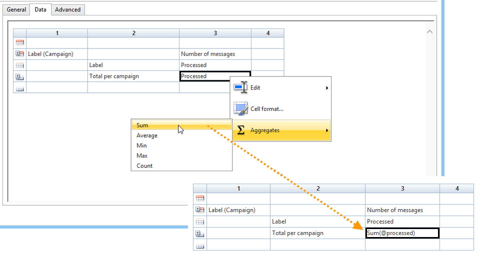
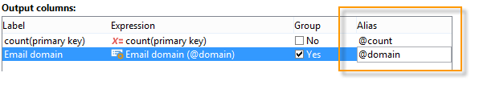

# Een tabel maken{#creating-a-table}

U kunt een lijst aan een rapport toevoegen om gegevens te tonen. Dit kan een draaitabel zijn die is gemaakt op basis van kubutemetingen, een lijst met groepen of een tabel met een uitsplitsing van waarden.


## Een lijst met groepen maken {#creating-a-list-with-group}

Met een **[!UICONTROL List with group]** typetabel kunt u gegevens in de tabel groeperen en er statistieken over produceren. U kunt bijvoorbeeld totalen en subtotalen maken voor de gegevens. Elke groep heeft zijn eigen kop-, detail- en voettekstregel.

>[!CAUTION]
>
>De **[!UICONTROL Page]** activiteit die de tabel bevat, moet worden voorafgegaan door een **[!UICONTROL Query]** of **[!UICONTROL Script]** activiteit om de in het verslag te analyseren gegevens te verzamelen. Zie Gegevens [verzamelen voor analyse](../../reporting/using/collecting-data-to-analyze.md) en [scriptactiviteit](../../reporting/using/advanced-functionalities.md#script-activity)voor meer informatie over deze activiteiten.

### Exploitatiebeginsel {#operating-principle}

Het kan gebeuren dat u verschillende gegevenscategorieën tegelijk moet analyseren. Met een lijst met groepen kunt u gegevens combineren en statistieken maken over verschillende groepen gegevens in dezelfde tabel. Hiertoe kunt u een groep in de tabel maken.

In het volgende voorbeeld toont de groep alle campagnes in het gegevensbestand, de leveringen, en het aantal berichten die per levering en per campagne worden verzonden.

Hier kunt u een lijst weergeven met de campagnes (**[!UICONTROL Label (Campaign)]**, de lijst met leveringen (**[!UICONTROL Label]** ) die aan de campagne zijn gekoppeld, en het aantal berichten dat per levering wordt verzonden (**[!UICONTROL Processed)]**, voordat u deze optelt voor elke campagne (**[!UICONTROL Sum(@processed)]** ).


### Uitvoeringsstappen {#implementation-steps}

Hier vindt u een volledig voorbeeld van implementatie: Hoofdlettergebruik [: Maak een rapport met een groepslijst](#use-case--create-a-report-with-a-group-list).

Houd rekening met de volgende stappen om een tabel van het type &#39;Lijst met groep&#39; te maken:

1. Ga naar het rapportdiagram en plaats een **[!UICONTROL Query]** activiteit. Zie Gegevens [verzamelen om te analyseren](../../reporting/using/collecting-data-to-analyze.md).
1. Vul de brontabel in en selecteer de velden van de tabel die de statistieken betreffen.
1. Plaats een **[!UICONTROL Page]** activiteit in de grafiek. Zie [Statische elementen](../../reporting/using/creating-a-new-report.md#static-elements)voor meer informatie.
1. Voeg een **[!UICONTROL List with group]** typetabel op de pagina in.
1. Geef het gegevenspad op of de tabel die als gegevensbron in de query is geselecteerd.

   Deze stap is verplicht als u de velden in de brontabel later wilt herstellen en deze wilt invoegen in de cellen van de tabel.

1. De tabel en de inhoud ervan maken.
1. Geef het voltooide rapport op het **[!UICONTROL Preview]** tabblad weer. Vervolgens kunt u het rapport publiceren en het indien nodig exporteren naar een andere indeling. Voor meer op dit, verwijs naar het [Uitvoeren van een rapport](../../reporting/using/actions-on-reports.md#exporting-a-report).

### Lijnen en kolommen toevoegen {#adding-lines-and-columns}

Een **[!UICONTROL List with group]** tabel bevat standaard een koptekst, een detailregel en een voettekstregel.

De groep zelf bevat kop-, detail- en voettekstregel.

* **Koptekstregel**: op deze regel geeft u een titel aan de kolommen van de tabel.

   

* **Detaillijn**: deze regel bevat statistische waarden .

   

* **Voettekstregel**: op deze regel kunt u de totale waarden weergeven.

   

Lijnen en kolommen kunnen naar wens worden toegevoegd.

De groep kan op om het even welke lijn van de lijst worden geplaatst en omvat zijn eigen kopbal, detail en footer lijnen.


**Regel en kolom**: als u een regel of kolom wilt toevoegen of verwijderen, gaat u naar een bestaande regel of kolom en gebruikt u het snelmenu.


De aard van de lijn die u toevoegt, is afhankelijk van de locatie van de cursor. Als u bijvoorbeeld een koptekstregel wilt toevoegen, plaatst u de cursors op een koptekst en klikt u op **[!UICONTROL Add > A line above/below]**.


De breedte van de kolommen kan via het **[!UICONTROL Column format]** item worden gewijzigd.

**Groep**: om een groep toe te voegen, ga naar een lijn en selecteer het passende punt in het drop-down menu.


### Celinhoud definiëren {#defining-cell-content}

Als u een cel van de tabel wilt bewerken en de inhoud en indeling ervan wilt definiëren, gaat u naar de cel en gebruikt u het snelmenu.

Gebruik het **[!UICONTROL Expression]** menu-item om de waarden te selecteren die u wilt weergeven.


* Als u de waarden wilt invoegen die rechtstreeks in de tabel moeten worden geanalyseerd, selecteert u deze in de beschikbare velden.

   De lijst van beschikbare gebieden valt met de inhoud van de vraag vóór de lijst in de grafiek van de rapportconstructie samen.

   

* Voer een label in voor een cel, bijvoorbeeld de koptekst.

   Hiervoor gebruikt u hetzelfde proces als voor het invoegen van een veld in de database, maar selecteert u geen expressie. Voer het label in het **[!UICONTROL Label]** veld in. Het zal worden getoond zoals is.

* Een aggregaat berekenen (gemiddelde waarde, som enz.) en in de cel weergeven.

   Hiervoor gebruikt u het **[!UICONTROL Aggregates]** menu-item en selecteert u de gewenste campagne.

   

### Celindeling definiëren {#defining-cell-format}


Als u de celindeling wilt definiëren, opent u met het **[!UICONTROL Cell format...]** menu alle opmaakopties die beschikbaar zijn voor de geselecteerde cel.

Met deze opties kunt u de uiteindelijke rendering van het rapport aanpassen en het lezen van informatie vereenvoudigen.

Gebruik het **[!UICONTROL Carriage return]** veld bij het exporteren van gegevens naar Excel: Selecteer de **[!UICONTROL Yes]** waarde om de harde return te forceren. Deze waarde blijft behouden bij het exporteren. Voor meer op dit, verwijs naar het [Uitvoeren van een rapport](../../reporting/using/actions-on-reports.md#exporting-a-report).

In het **[!UICONTROL Cell format]** venster hebt u toegang tot het volgende tabblad:

* Het **[!UICONTROL Value]** tabblad
* Het **[!UICONTROL Borders]** tabblad
* Het **[!UICONTROL Click]** tabblad
* Het **[!UICONTROL Extra]** tabblad

Op het **[!UICONTROL Value]** tabblad kunt u het lettertype en de verschillende waardetekenmerken wijzigen of een opmaak definiëren op basis van de aard ervan.


De indeling wijzigt de weergave van gegevens: Met de **[!UICONTROL Number]**, **[!UICONTROL Monetary]** en **[!UICONTROL Percentage]** notaties kunt u bijvoorbeeld de cijfers rechts uitlijnen en decimalen weergeven.

Voorbeeld van het configureren van een valutaopmaak: u kunt opgeven in welke valuta de waarden worden uitgedrukt, kiezen of duizenden worden gescheiden en negatieve waarden in rood worden weergegeven. De positie van het valutasymbool hangt af van de taal van de operator die in zijn profiel is gedefinieerd.



Voorbeeld van configuratie voor datums: U kunt kiezen of u de tijd wilt weergeven.


Op het tabblad **Randen** kunt u randen toevoegen aan de lijnen en kolommen in de tabel. Als u randen toevoegt aan de cellen, kunnen er prestatieproblemen optreden wanneer u grote rapporten exporteert naar Excel.


Indien nodig kunt u randen definiëren in de tabelsjabloon (**[!UICONTROL Administration > Configuration > Form rendering]** ).

In dit geval hebt u de volgende syntaxis:

Op het tabblad Web:

```
 .tabular td {
 border: solid 1px #000000;
 }
```

Op het tabblad Excel:

```
 <style name="odd" fillColor="#fdfdfd">
  <border>
   <borderTop value="solid 0.05pt #000000" />
   <borderBottom value="solid 0.05pt #000000" />
   <borderLeft value="solid 0.05pt #000000" />
   <borderRight value="solid 0.05pt #000000" />
  </border>
 </style> 
 
 <style name="even" fillColor="#f7f8fa">
  <border>
   <borderTop value="solid 0.05pt #000000" />
   <borderBottom value="solid 0.05pt #000000" />
   <borderLeft value="solid 0.05pt #000000" />
   <borderRight value="solid 0.05pt #000000" />
  </border>
 </style> 
```

Op het **[!UICONTROL Click]** tabblad kunt u een actie definiëren wanneer de gebruiker op de inhoud van een cel of van de tabel klikt.

In het onderstaande voorbeeld kunt u de tweede pagina van het rapport weergeven door op de waarde in de cel te klikken: het zal informatie over de levering in de cel bevatten .


Op het tabblad **Extra** kunt u een visuele koppeling maken naar uw gegevens, zoals een gekleurd teken of een waardebalk. Het gekleurde teken wordt gebruikt wanneer de tabel als een legenda in een diagram wordt weergegeven. Raadpleeg voor meer informatie het voorbeeld van de implementatie: [Stap 5 - De tweede pagina maken](#step-5---create-the-second-page)


## Hoofdlettergebruik: Een rapport maken met een groepslijst {#use-case--create-a-report-with-a-group-list}

In dit voorbeeld gaan we een rapport van twee pagina&#39;s maken: de eerste pagina bevat de lijst en het totale aantal leveringen per campagne , alsmede het aantal verzonden berichten . De namen van de levering zullen klikbare verbindingen zijn en zullen u toelaten om naar de tweede pagina van het rapport te gaan om de uitsplitsing van leveringen per e-maildomein voor de geselecteerde levering met een lijst en een grafiek te bekijken. Op de tweede pagina fungeert de tabel als een legenda voor het diagram.


### Stap 1 - Een rapport maken {#step-1---create-a-report}

Maak een nieuw rapport over het campagnereschema **[!UICONTROL Campaigns (nms)]**.


Klik **[!UICONTROL Save]** om het rapport te creëren.

Ga naar de grafiek en voeg de eerste componenten toe die voor het ontwerpen van de rapportinhoud moeten worden gebruikt: een eerste query en een eerste pagina.


### Stap 2 - creeer de eerste vraag {#step-2---create-the-first-query}

Met de eerste query kunt u leveringen verzamelen die aan elke campagne zijn gekoppeld. Het doel is om een rapport weer te geven over de verschillende leveringen van de Adobe Campaign-database die aan elke campagne zijn gekoppeld.

Dubbelklik op de eerste query om deze te bewerken en pas vervolgens de volgende stappen toe om deze te configureren:

1. Begin door het schema te veranderen waarop de bron van de vraag wordt toegepast: Selecteer het **[!UICONTROL Deliveries (nms)]** schema.
1. Klik op de **[!UICONTROL Edit query]** koppeling en geef de geavanceerde velden weer.

   

1. Selecteer de volgende velden:

   * het leveringsetiket,
   * de primaire sleutel voor de levering,
   * het campagneetiket,
   * de indicator van de verwerkte leveringen,
   * de buitenlandse sleutel van de Campagne-koppeling,
   * de indicator voor de foutenfrequentie.
   

   Een alias koppelen aan elk veld: dit wordt aanbevolen om de gegevens in de tabel die aan de eerste pagina van het rapport worden toegevoegd, gemakkelijker te kunnen selecteren.

   In dit voorbeeld gebruiken we de volgende aliassen:

   * Label: **@label**
   * Primaire sleutel: **@deliveryId**
   * Label (campagne): **@label1**
   * Verwerkt: **@processing**
   * Externe sleutel van de koppeling &#39;Campaign&#39; (&#39;id&#39;): **@operationId**
   * Foutfrequentie: **@errorRatio**


1. Klik tweemaal op de **[!UICONTROL Next]** knop om de **[!UICONTROL Data filtering]** stap te voltooien.

   Voeg een filtervoorwaarde toe om slechts de leveringen te verzamelen verbonden aan een campagne.

   De syntaxis van dit filter is als volgt: &quot;De buitenlandse sleutel van de verbinding &quot;Campaigns&quot;groter dan 0&quot;.

   

1. Klik **[!UICONTROL Finish]** om deze voorwaarden te bewaren, dan klik **[!UICONTROL Ok]** om de vraagredacteur te sluiten.

### Stap 3: De eerste pagina maken {#step-3--create-the-first-page}

In deze stap, gaan wij de eerste pagina van het rapport vormen. Voer de volgende stappen uit om het te configureren:

1. Open de **[!UICONTROL Page]** activiteit en ga zijn titel, bijvoorbeeld **Leveringen** in dit geval in.

   

1. Voeg een lijst met groepen in via de werkbalk en voer het label ervan in, bijvoorbeeld: Lijst van leveringen per campagne.

   

1. Klik op de **[!UICONTROL Table data XPath...]** koppeling en selecteer de leveringskoppeling, dat wil zeggen: `[query/delivery]`.

   

1. Klik op het **[!UICONTROL Data]** tabblad en wijzig de indeling van de tabel: Voeg drie kolommen aan de rechterkant toe.

   

1. Voeg een groep toe.

   

   Met deze groep kunt u campagnes en de bijbehorende leveringen groeperen.

1. Verwijs in het groepsvenster naar de **buitenlandse sleutel van de &quot;Campagne&quot;verbinding** en sluit het venster.

   

1. Bewerk de eerste cel van de groepsheader en voeg het **[!UICONTROL Label]** veld van de campagnes in als een expressie.

   

1. Bewerk de tweede cel van de detailregel en selecteer de leveringen **[!UICONTROL Label]**.

   

1. Bewerk de opmaak van deze cel en open het **[!UICONTROL Click]** tabblad. Configureer de juiste opties zodat wanneer de gebruikers op de naam van een levering klikken, deze in hetzelfde venster wordt geopend.

   

   Selecteer hiertoe een **[!UICONTROL Next page]** tekstactie en selecteer **[!UICONTROL In the same window]** als een open optie.

   

1. Klik in de onderste sectie van het venster op **[!UICONTROL Add]** en geef het **`/vars/selectedDelivery`** pad en de **[!UICONTROL @deliveryId]** expressie op die overeenkomen met de alias van de primaire sleutel van de levering, zoals gedefinieerd in de eerder gemaakte query. Met deze formule hebt u toegang tot de geselecteerde levering.

   

1. Bewerk de tweede cel van de voettekstregel van de groep en voer deze **[!UICONTROL Total per campaign]** in als een label.

   

1. Bewerk de derde cel van de koptekstregel van de groep en voer deze **[!UICONTROL Number of messages sent]** in als een label.

   

   Deze informatie valt samen met de kolomtitel.

1. Bewerk de derde cel van de detailregel en selecteer de verwerkte berichtindicator als een expressie.

   

1. Bewerk de derde cel van de voettekstregel van de groep, selecteer de verwerkte leveringsindicator en pas het **[!UICONTROL Sum]** aggregaat erop toe.

   

1. Bewerk de vierde cel van de detailregel en selecteer de **foutbewerkingsfoutfrequentie** als een expressie.

   

1. Selecteer deze cel om een waardebalk weer te geven die de frequentie van de leveringsfout vertegenwoordigt.

   U doet dit door de celindeling te openen en vervolgens naar het **[!UICONTROL More]** tabblad te gaan. Selecteer de **[!UICONTROL Value bar]** vermelding in de vervolgkeuzelijst en selecteer de **[!UICONTROL Hide the cell value]** optie.

   

   U kunt nu een rendering van het rapport weergeven. Klik op het **[!UICONTROL Preview]** tabblad en selecteer de **[!UICONTROL Global]** optie: Hier ziet u een lijst met alle leveringen in de Adobe Campagne-database die aan een campagne zijn gekoppeld.

   

   We raden u aan het **[!UICONTROL Preview]** tabblad te gebruiken om ervoor te zorgen dat de gegevens in uw tabel correct zijn geselecteerd en geconfigureerd. Zodra dit wordt gedaan, kunt u aan het formatteren van uw lijst verdergaan.

1. Pas de **[!UICONTROL Bold]** stijl toe op de cellen die het totaal per campagne en het totale aantal verwerkte berichten tonen.

   

1. Klik op de eerste cel van de groepsheader lijn, die de campagnenaam toont, en selecteer **[!UICONTROL Edit > Merge to right]**.

   

   Wanneer de eerste twee cellen van de groepsheader worden samengevoegd, worden de titel van de campagne en de lijst met hiermee verbonden leveringen opnieuw uitgelijnd.

   

   >[!CAUTION]
   >
   >We raden u aan te wachten tot uw rapport is samengesteld voordat u cellen samenvoegt, aangezien samenvoegen onomkeerbaar is.

### Stap 4 - Maak de tweede query {#step-4---create-the-second-query}

Wij willen een tweede vraag en een tweede pagina toevoegen om de details van een levering te tonen wanneer de gebruiker van het rapport op het klikt. Alvorens de vraag toe te voegen, geef de pagina uit u hebt gecreeerd en laat de uitgaande overgang toe zodat het aan de vraag kan worden verbonden.

1. Voeg een nieuwe vraag na de **[!UICONTROL Page]** activiteit toe en geef zijn schema uit: Selecteer het **[!UICONTROL Recipient delivery logs]** schema.

   

1. Bewerk de query en definieer de uitvoerkolommen. Als u het aantal leveringen per e-maildomein wilt weergeven, moet u:

   * Bereken de som van de primaire sleutels om het aantal leveringslogboeken te tellen:

      

   * e-maildomeinen van ontvangers en groepsgegevens in dit veld verzamelen: Selecteer hiertoe de **[!UICONTROL Group]** optie in de kolom met domeinnamen.
   

   Koppel de volgende aliassen aan de velden:

   * count(primaire sleutel): **@count**
   * E-maildomein (ontvanger): **@domein**

      


1. Klik tweemaal op de **[!UICONTROL Next]** knop: dit brengt u tot de **[!UICONTROL Data filtering]** stap .

   Voeg een filtervoorwaarde toe om slechts de informatie te verzamelen verbonden aan de geselecteerde levering.

   De syntaxis is als volgt: De buitenlandse sleutel van de verbinding van de &quot;Levering&quot;is de waarde van het plaatsen `$([vars/selectedDelivery])`

   

1. Sluit het venster van de vraagconfiguratie en voeg een pagina aan de grafiek toe, enkel na de tweede vraag.

### Stap 5 - Maak de tweede pagina {#step-5---create-the-second-page}

1. Bewerk de pagina en voer het label ervan in: E- **maildomeinen**.
1. Schakel de **[!UICONTROL Enable output transitions]** optie uit: dit is de laatste bladzijde van het verslag en zal niet door een andere activiteit worden gevolgd .

   

1. Voeg een nieuwe lijst met een groep toe gebruikend het met de rechtermuisknop-klik menu en noem het **E-maildomeinen per ontvanger**.
1. Klik op de koppeling **[!UICONTROL Table data XPath...]** en selecteer de **[!UICONTROL Recipient delivery logs]** koppeling.

   

1. Pas de tabel op het **[!UICONTROL Data]** tabblad als volgt aan:

   * Voeg twee kolommen aan de rechterkant toe.
   * Voeg in de eerste cel van de detailregel de **[!UICONTROL rowNum()-1]** expressie toe om het aantal regels te tellen. Wijzig vervolgens de indeling van de cel: op het **[!UICONTROL Extra]** tabblad selecteert u **[!UICONTROL Color tab]** en klikt u **[!UICONTROL Ok]**.

      

      Deze configuratie zal u toelaten om de lijst als titel voor de grafiek te gebruiken.

   * Voeg de **[!UICONTROL Email domain(Recipient)]** expressie toe in de tweede cel van de detailregel.
   * Voeg de **[!UICONTROL count(primary key)]** expressie toe in de derde cel van de detailregel.
   

1. Voeg een cirkeldiagram aan de pagina toe gebruikend het met de rechtermuisknop aanklikken menu en wijs het etiket van **E-maildomeinen** aan het toe. Zie [Grafiektypen en varianten](../../reporting/using/creating-a-chart.md#chart-types-and-variants)voor meer informatie.
1. Klik op de **[!UICONTROL Variants]** koppeling en hef de selectie van de **[!UICONTROL Display label]** opties en de **[!UICONTROL Display caption]** opties op.
1. Controleer of er geen waarde sortering is geconfigureerd. Zie [deze sectie](../../reporting/using/processing-a-report.md#configuring-the-layout-of-a-descriptive-analysis-report)voor meer informatie.

   

1. Wijzig op het **[!UICONTROL Data]** tabblad de gegevensbron: in **[!UICONTROL Context data]** de vervolgkeuzelijst.

   

1. Klik vervolgens op de koppeling **[!UICONTROL Advanced settings]** en selecteer de koppeling naar de leveringslogboeken van de ontvanger.

   

1. Selecteer in de **[!UICONTROL Chart type]** sectie de **[!UICONTROL Email domain]** variabele.
1. Voeg vervolgens de uit te voeren berekening toe: selecteert de som als een operator.

   

1. Klik op de **[!UICONTROL Detail]** knop om het veld te selecteren waarop het aantal betrekking heeft en sluit vervolgens het configuratievenster.

   

1. Sla het rapport op.

   Uw pagina is nu geconfigureerd.

### Stap 6 - Het rapport bekijken {#step-6---viewing-the-report}

Als u het resultaat van deze configuratie wilt weergeven, klikt u op het **[!UICONTROL Preview]** tabblad en selecteert u de **[!UICONTROL Global]** optie.

De eerste pagina van uw rapport bevat de lijst met alle leveringen die in de database zijn opgenomen.


Als u op de koppeling van een van deze leveringen klikt, wordt in het diagram de indeling van e-maildomeinen voor deze levering weergegeven. U bevindt zich nu op de tweede pagina van het rapport en kunt terugkeren naar de vorige pagina door op de desbetreffende knop te klikken.


## Een splitsings- of draaitabel maken {#creating-a-breakdown-or-pivot-table}

Dit type van lijst laat u statistieken tonen die op de gegevens in het gegevensbestand worden berekend.

De configuratie van deze types van rapporten is gelijkaardig aan die gebruikt voor de beschrijvende analysetovenaar. Raadpleeg [deze pagina](../../reporting/using/using-the-descriptive-analysis-wizard.md#configuring-the-quantitative-distribution-template)voor meer informatie.

Raadpleeg [deze sectie](../../reporting/using/using-cubes-to-explore-data.md)voor meer informatie over het maken van een draaitabel.
