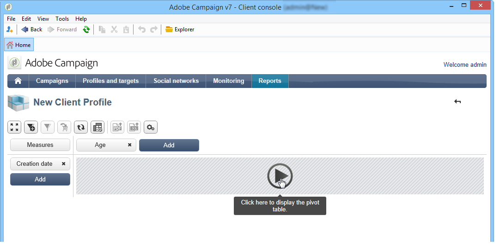

# Indicatoren maken{#creating-indicators}

Om een kubus functioneel te maken, moet u de relevante afmetingen en de maatregelen identificeren en hen creëren in de kubus.

Voer de volgende stappen uit om een kubus te maken:

1. Selecteer de werktabel. Zie [De werktabel selecteren](#selecting-the-work-table).
1. Definieer de afmetingen. Zie [Afmetingen definiëren](#defining-dimensions).
1. Bepaal maatregelen. Zie [Building indicators](#building-indicators).
1. Maak aggregaten (optioneel). Zie [aggregaten berekenen en gebruiken](../../reporting/using/concepts-and-methodology.md#calculating-and-using-aggregates).

In dit voorbeeld ziet u hoe u snel een eenvoudige kubus in een rapport kunt maken om de bijbehorende maatregelen te exporteren.

De implementatiestappen worden hieronder beschreven. In de andere secties van dit hoofdstuk vindt u uitgebreide opties en beschrijvingen.

## De werktabel selecteren {#selecting-the-work-table}

Als u een kubus wilt maken, klikt u op de knop **[!UICONTROL New]** boven de lijst met kubussen.

Selecteer het feitenschema, d.w.z. het schema dat de elementen bevat u wilt onderzoeken. In dit voorbeeld, gaan wij de **Ontvanger** lijst selecteren.

Klik **[!UICONTROL Save]** om de kubus tot stand te brengen: het zal op de lijst van Kubussen verschijnen en kan dan worden gevormd gebruikend de aangewezen lusjes.

Klik op de koppeling **[!UICONTROL Filter the source data...]** om de berekeningen van deze kubus toe te passen op een selectie gegevens in de database.

## Afmetingen {#defining-dimensions} definiëren

Dimension vallen samen met analysegassen die voor elke kubus zijn gedefinieerd op basis van het bijbehorende feitenschema. Dit zijn de dimensies die in de analyse worden onderzocht, zoals tijd (jaar, maand, datum...), een classificatie van producten of contracten (familie, referentie, enz.), een bevolkingssegment (per stad, leeftijdsgroep, status, enz.).

Deze analysegassen worden gedefinieerd op het tabblad **[!UICONTROL Dimension]** van de kubus.

Klik op de knop **[!UICONTROL Add]** om een nieuwe dimensie te maken en klik vervolgens in **[!UICONTROL Expression field]** op het pictogram **[!UICONTROL Edit expression]** om het veld te selecteren dat de betrokken gegevens bevat.

* Begin door de ontvanger **Leeftijd** te selecteren. Voor dit gebied, kunt u het binden aan groepspagina&#39;s bepalen en informatie het lezen gemakkelijker maken. We raden u aan binden te gebruiken wanneer er meerdere afzonderlijke waarden mogelijk zijn.

   Om dit te doen, controleer de **[!UICONTROL Enable binning]** optie. Bindingsmodi worden beschreven in [Gegevensbinding](../../reporting/using/concepts-and-methodology.md#data-binning).

   

* Voeg een **Datum** typeafmeting toe. Hier willen we datums weergeven waarop het ontvangende profiel is gemaakt

   Om dit te doen, klik **[!UICONTROL Add]** en selecteer **[!UICONTROL Creation date]** gebied in de ontvankelijke lijst.

   

   Het is mogelijk om de modus voor datumweergave te selecteren. Selecteer hiervoor de hiërarchie die u wilt gebruiken en de niveaus die u wilt genereren:

   

   In ons voorbeeld willen we alleen jaren, maanden en dagen weergeven omdat het niet mogelijk is om met weken en semesters/maanden tegelijk te werken: deze niveaus zijn niet compatibel .

* Een andere dimensie maken voor het analyseren van gegevens ten opzichte van de stad van de ontvanger

   Om dit te doen, voeg een nieuwe dimensie toe en selecteer de stad in de **[!UICONTROL Location]** knoop van het ontvankelijke schema.

   

   U kunt het binden toelaten om informatie het lezen gemakkelijker te maken en de waarden aan een opsomming te verbinden.

   

   Selecteer de opsomming in de vervolgkeuzelijst

   

   Alleen de waarden in de opsomming worden weergegeven. De overige worden gegroepeerd onder het label dat is gedefinieerd in het veld **[!UICONTROL Label of the other values]**.

   Voor meer op dit, verwijs naar [dynamisch het beheren van bins](../../reporting/using/concepts-and-methodology.md#dynamically-managing-bins).

## Bouwindicatoren {#building-indicators}

Wanneer de afmetingen zijn gedefinieerd, moet u een berekeningsmodus opgeven voor de waarden die in de cellen moeten worden weergegeven. Hiertoe maakt u de overeenkomende indicatoren op het tabblad **[!UICONTROL Measures]**: zoveel maatregelen te treffen als er kolommen in het rapport staan die de kubus zullen gebruiken.

Hiervoor voert u de volgende stappen uit:

1. Klik op de knop **[!UICONTROL Add]**.
1. Selecteer het type maatregel en de formule die u wilt toepassen. Hier willen we het aantal vrouwen bij de ontvangers tellen.

   Onze maatregel is gebaseerd op het feitenschema en gebruikt **[!UICONTROL Count]** exploitant.

   

   Met de koppeling **[!UICONTROL Filter the measure data...]** kunt u alleen vrouwen selecteren. Raadpleeg [Metingen definiëren](../../reporting/using/concepts-and-methodology.md#defining-measures) voor meer informatie over het definiëren van maatstaven en de beschikbare opties.

   

1. Voer het label van de maatregel in en sla deze op.

   

1. Sla de kubus op.

## Een rapport maken op basis van een kubus {#creating-a-report-based-on-a-cube}

Zodra de kubus wordt gevormd, kan het als malplaatje worden gebruikt voor het creëren van een nieuw rapport.

Dit doet u als volgt:

1. Klik op de knop **[!UICONTROL Create]** van het **[!UICONTROL Reports]** universum en selecteer de kubus die u zojuist hebt gemaakt.

   

1. Klik op de knop **[!UICONTROL Create]** om te bevestigen: dit zal u aan de rapportconfiguratie en het bekijken pagina brengen.

   Standaard worden de eerste twee beschikbare afmetingen aangeboden in lijnen en kolommen, maar er wordt geen waarde weergegeven in de tabel. Klik op het hoofdpictogram om de tabel te genereren:

   

1. U kunt de assen van de dimensie veranderen, hen schrappen, nieuwe maatregelen toevoegen, etc. Hier worden mogelijke bewerkingen beschreven: [Kubussen gebruiken om gegevens te verkennen](../../reporting/using/using-cubes-to-explore-data.md).

   Gebruik hiervoor de juiste pictogrammen.

   

