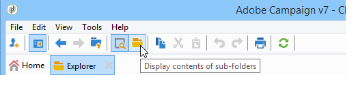

# Cumulatieve verslagen {#cumulative-reports}

U kunt gecumuleerde rapporten weergeven bij leveringen. Selecteer hiertoe de te vergelijken leveringen om de lijst met rapporten voor deze leveringen te verkrijgen.

Als u niet-aangrenzende leveringen in de lijst wilt selecteren, houdt u de CTRL-toets ingedrukt terwijl u een selectie maakt.

Als u leveringen wilt selecteren die zijn opgeslagen in een andere map, klikt u op **[!UICONTROL Display sub-levels]** (toegankelijk via de werkbalk). Deze worden vervolgens in dezelfde lijst weergegeven.

