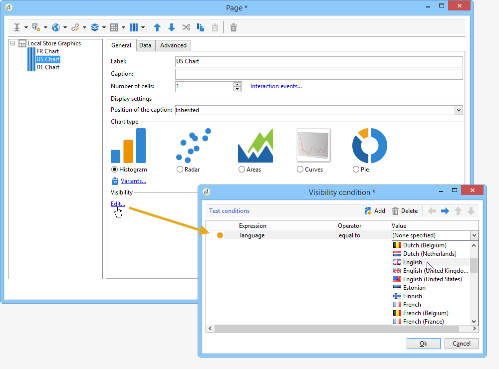

# Voorwaardelijke content definiëren{#defining-a-conditional-content}

U kunt de weergave van specifieke rapportitems of pagina&#39;s voorschrijven.

Pas de zichtbaarheidsinstellingen van bepaalde items aan om deze voorwaardelijk te maken. Raadpleeg de weergave [van](#conditioning-item-display)Conditioning-items voor meer informatie.

Gebruik een **[!UICONTROL Test]** tekstactiviteit om de weergave van een of meer pagina&#39;s voorwaardelijk te maken. For more on this, refer to [Conditioning page display](#conditioning-page-display).

## Weergave van items conditioneren {#conditioning-item-display}

Om de vertoning van een deel van een rapport voorwaardelijk te maken, moet u zijn zichtbaarheidsvoorwaarden bepalen: als deze niet worden ontmoet, zullen de punten niet worden getoond.

De zichtbaarheidsvoorwaarden kunnen afhankelijk zijn van de status van de operator, van de items die zijn geselecteerd of ingevoerd op de rapportpagina.

In [deze sectie](../../web/using/form-rendering.md#defining-fields-conditional-display)worden voorbeelden gegeven van de voorwaardelijke weergave van items op een pagina.

In het volgende voorbeeld hangt de weergavevoorwaarde af van de taal:

## Paginaweergave van conditionering {#conditioning-page-display}

In het diagram van een rapport kunt u met de **[!UICONTROL Test]** activiteit de volgorde van pagina&#39;s wijzigen, afhankelijk van een of meer voorwaarden.

Deze activiteit is gebaseerd op het volgende operationele beginsel:

1. Plaats een grafiek **[!UICONTROL Test]** in een grafiek en bewerk deze.
1. Klik op de **[!UICONTROL Add]** knop om de verschillende mogelijke gevallen te maken.

   

   Voor elk geval, wordt een outputovergang toegevoegd aan de **[!UICONTROL Test]** activiteit.

   

1. Selecteer **[!UICONTROL Enable default transition]** om een overgang toe te voegen, voor het geval dat aan één van de gevormde voorwaarden niet wordt voldaan.

   Raadpleeg [deze sectie](../../web/using/defining-web-forms-page-sequencing.md#conditional-page-display) voor meer informatie.

U kunt een **[!UICONTROL Test]** activiteit aan het begin van het diagram plaatsen om de weergave afhankelijk te maken van bijvoorbeeld context- of operatorprofiel.
