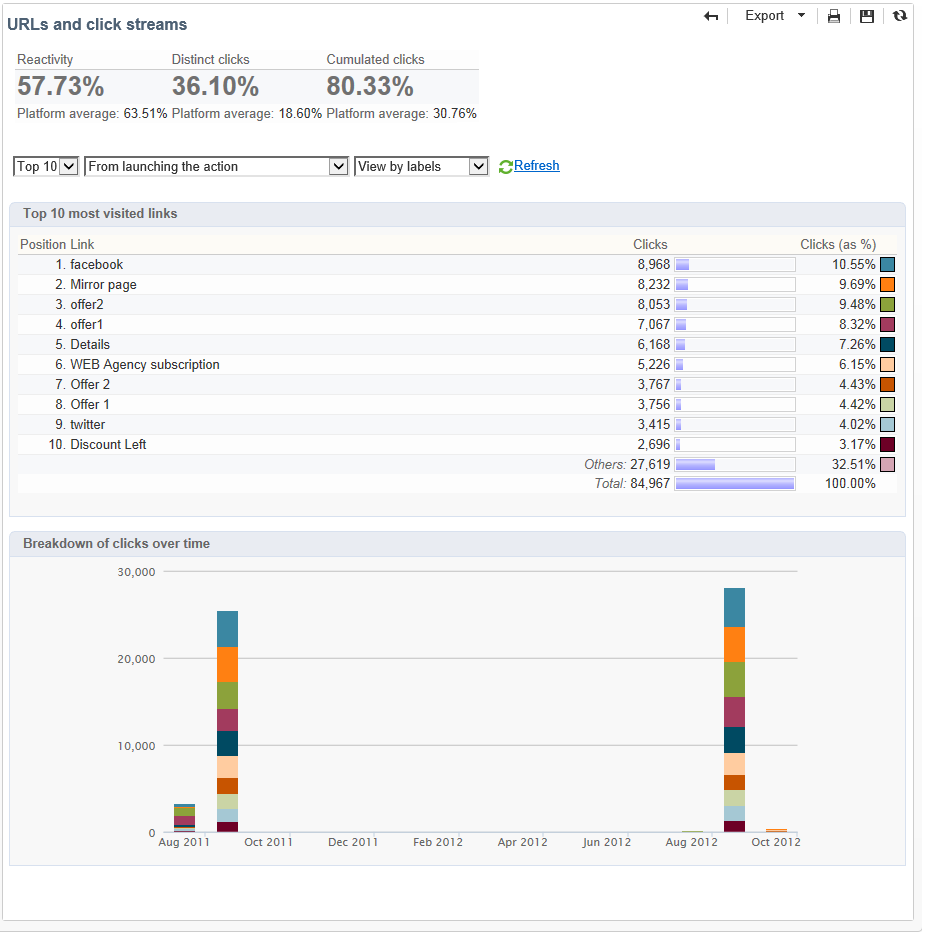

# Afleveringsrapporten {#delivery-reports}

U kunt de uitvoering van leveringen bijhouden via verschillende rapporten die toegankelijk zijn vanuit het leveringsoverzicht. Pas de volgende procedure toe om rapporten weer te geven:

1. Ga naar het **[!UICONTROL Campaigns]** universum en klik op de **[!UICONTROL Delivery]** koppeling om de lijst met leveringen weer te geven.
1. Klik op de naam van de levering die u wilt weergeven om de details weer te geven.

   

1. Selecteer het **[!UICONTROL Summary]** tabblad en klik op de **[!UICONTROL Reports]** koppeling om de specifieke rapporten voor de levering te openen.

   

   Standaard zijn de volgende rapporten beschikbaar:

   * **[!UICONTROL Delivery throughput]** : Raadpleeg de [leveringstijd](#delivery-throughput).
   * **[!UICONTROL Sharing to social networks]** : Zie [Delen naar sociale netwerken](#sharing-to-social-networks).
   * **[!UICONTROL Statistics on sharing activities]** : zie [Statistieken over het delen van activiteiten](#statistics-on-sharing-activities).
   * **[!UICONTROL Hot clicks]** : zie [Hete kliks](#hot-clicks).
   * **[!UICONTROL Tracking statistics]** : verwijzen naar [volgstatistieken](#tracking-statistics)
   * **[!UICONTROL URLs and click streams]** : verwijst naar [URLs en klikt stromen](#urls-and-click-streams).
   * **[!UICONTROL Tracking indicators]** : zie [Trackingindicatoren](#tracking-indicators).
   * **[!UICONTROL Non-deliverables and bounces]** : verwijzen naar [Niet te leveren items en stuitingen](#non-deliverables-and-bounces).
   * **[!UICONTROL User activities]** : zie [Gebruikersactiviteiten](#user-activities).
   * **[!UICONTROL Delivery summary]** : raadpleeg het overzicht [van de](#delivery-summary)levering.
   * **[!UICONTROL Subscription tracking]** : Raadpleeg [Abonnementsbeheer](#subscription-tracking).
   * **[!UICONTROL Delivery statistics]** : zie [Leveringsstatistieken](#delivery-statistics).
   * **[!UICONTROL Breakdown of opens]** : Zie [Uitsplitsing van openen](#breakdown-of-opens).

## Traceringsindicatoren {#tracking-indicators}

Dit rapport combineert de belangrijkste indicatoren voor het volgen van het gedrag van ontvangers bij het ontvangen van de levering. Het geeft toegang tot levering en ontvangststatistieken, open en klikthrough tarieven, geproduceerde klikstromen, Web het volgen en het delen van activiteiten aan sociale netwerken.

>[!NOTE]
>
>Waarden die worden berekend op basis van berichten die worden geopend, zijn altijd schattingen, vanwege de foutmarge die is gekoppeld aan e-mails in tekstindeling. In de **[!UICONTROL Distinct opens/Sum of opens for the population reached]** indicatoren wordt met deze foutenmarge rekening gehouden. Voor meer informatie over het volgen opent, verwijs naar het [Volgen opent](#tracking-opens-).

**[!UICONTROL 1. Delivery statistics]**

* **[!UICONTROL Messages to deliver]** : Totaal aantal berichten dat na leveringsanalyse moet worden bezorgd.
* **[!UICONTROL Success]** : Aantal berichten verwerkt.

**[!UICONTROL 2. Reception statistics]**

>[!NOTE]
>
>De bijbehorende percentages worden berekend op basis van het aantal berichten dat met succes is doorgestuurd.

* **[!UICONTROL Distinct opens for the population reached]** : Schatting van het aantal ontvangers voor wie het bericht bestemd is dat een bericht ten minste eenmaal heeft geopend. Er wordt rekening gehouden met klikken op abonnementkoppelingen en spiegelpagina&#39;s.
* **[!UICONTROL Sum of opens for the population reached]** : Schatting van het totale aantal openingen door de beoogde ontvangers.
* **[!UICONTROL Clicks on opt-out link]** :Aantal klikken op de verbinding van het unsubscription.
* **[!UICONTROL Clicks on the mirror page link]** : Aantal klikken op de verbinding aan de spiegelpagina. Om in aanmerking te worden genomen, moet de verbinding als dusdanig in de leveringstovenaar (bijgehouden URLs) worden bepaald. Zie deze [pagina](../../delivery/using/monitoring-a-delivery.md).
* **[!UICONTROL Estimation of forwards]** : Schatting van het aantal e-mails dat door de beoogde ontvangers is doorgestuurd. Deze waarde wordt berekend door het aantal verschillende personen en het aantal verschillende ontvangers af te trekken die in de e-mail hebben geklikt.

   >[!NOTE]
   >
   >Zie [Doelpersonen / ontvangers](#targeted-persons---recipients)voor meer informatie over het verschil tussen verschillende personen en beoogde ontvangers.

**[!UICONTROL 3. Open and click-through rate]**

Deze waardetabel toont de uitsplitsing van leveringen, opent, klikt en ruwe reactiviteit per domein van Internet. De volgende indicatoren worden gebruikt:

* **[!UICONTROL Sent]** : Het totale aantal berichten dat op dit domein wordt verzonden.
* **[!UICONTROL Complaints]** : Aantal berichten voor dit domein die als ongewenst door de ontvanger zijn gemeld. Het tarief wordt berekend gebaseerd op het totale aantal berichten die op dit domein worden verzonden.
* **[!UICONTROL Opens]** : Aantal verschillende beoogde ontvangers voor dit domein die een bericht minstens eenmaal hebben geopend. Het tarief wordt berekend gebaseerd op het totale aantal berichten die op dit domein worden verzonden.
* **[!UICONTROL Clicks]** : Aantal afzonderlijke beoogde ontvangers die minstens één keer op dezelfde levering hebben geklikt. Het tarief wordt berekend gebaseerd op het totale aantal berichten die op dit domein worden verzonden
* **[!UICONTROL Raw reactivity]** : Percentage van het aantal ontvangers dat ten minste één keer op een levering heeft geklikt in vergelijking met het aantal ontvangers dat een levering ten minste één keer heeft geopend.

>[!NOTE]
>
>De domeinnamen die in dit rapport worden weergegeven, worden gedefinieerd in de gespecificeerde lijst die op kubusniveau wordt gebruikt. Als u standaarddomeinen wilt wijzigen, toevoegen of verwijderen, bewerkt u de **[!UICONTROL Domains]** gespecificeerde lijst en wijzigt u waarden en aliassen. Zie [deze sectie](../../platform/using/managing-enumerations.md)voor meer informatie. De **[!UICONTROL Others]** categorie omvat domeinnamen die niet tot om het even welke waarde van de gespecificeerde lijst behoren.

**[!UICONTROL 4. Generated click streams]**

>[!NOTE]
>
>De bijbehorende percentages worden berekend op basis van het aantal berichten dat met succes is doorgestuurd.

* **[!UICONTROL Distinct clicks for the population reached]** : Aantal verschillende personen dat ten minste één keer in een levering heeft geklikt.
* **[!UICONTROL Cumulated clicks]** : Het totale aantal klikken door beoogde ontvangers, exclusief koppelingen zonder abonnement en spiegel.
* **[!UICONTROL Recipient clicks]** : Aantal afzonderlijke beoogde ontvangers die minstens één keer op dezelfde levering hebben geklikt.
* **[!UICONTROL Estimated recipient reactivity]** : Verhouding van het aantal ontvangers dat ten minste eenmaal in een levering heeft geklikt ten opzichte van het geschatte aantal ontvangers dat een levering ten minste eenmaal heeft geopend. Er wordt geen rekening gehouden met de klikken op de pagina-link Weigeren en de koppeling spiegelen.

**[!UICONTROL 5. Web tracking]**

* **[!UICONTROL Visited pages]** : Aantal bezochte webpagina&#39;s na berichtontvangst.
* **[!UICONTROL Transactions]** : Aantal aankopen na ontvangst van bericht.
* **[!UICONTROL Total amount]** : Totaal aantal aankopen na ontvangst van bericht.
* **[!UICONTROL Average transaction amount]** : Gemiddelde aankoop door verschillende afnemers van de levering.
* **[!UICONTROL Articles]** : Aantal artikelen dat door de ontvangers van de levering is aangeschaft.
* **[!UICONTROL Average count of articles per transaction]** : Gemiddeld aantal artikelen per aankoop door verschillende ontvangers.
* **[!UICONTROL Average amount per message]** : Gemiddelde hoeveelheid aankopen die per bericht wordt gegenereerd.

   >[!NOTE]
   >
   >Als u een bezochte pagina, transactie, hoeveelheid of artikel in aanmerking wilt nemen, moet een webtrackingtag in de bijbehorende webpagina worden ingevoegd. Webtracking-configuratie wordt in [deze sectie](../../configuration/using/about-web-tracking.md)weergegeven.

**[!UICONTROL 6. Sharing activities to email and social networks]**

Deze sectie toont het aantal berichten die op elk sociaal netwerk worden gedeeld. Raadpleeg [Delen naar sociale netwerken](#sharing-to-social-networks)voor meer informatie.

## URL&#39;s en klik op streams {#urls-and-click-streams}

Dit rapport bevat de lijst met bezochte pagina&#39;s na een levering.

U kunt de inhoud van dit rapport vormen door te selecteren: het scorebord dat moet worden weergegeven, het tijdfilter (sinds de actie wordt gestart, gedurende de eerste 6 uur na de start, enz.) en de weergavemodus voor gegevens (per label, per URL, per categorie - voor meer informatie hierover, raadpleegt u [deze pagina](../../delivery/using/monitoring-a-delivery.md)). Klik **[!UICONTROL Refresh]** om uw selectie te bevestigen.

De volgende tarieven worden getoond in de hogere sectie van het rapport:

* **[!UICONTROL Reactivity]** : Verhouding van het aantal ontvangers voor wie de levering is bedoeld en waarop op de levering is geklikt, in verhouding tot het geschatte aantal ontvangers voor wie de levering is geopend. Klikken op de opt-out-koppeling en op de spiegelpagina worden niet in aanmerking genomen.

   >[!NOTE]
   >
   >Voor meer informatie over het volgen opent, verwijs naar het [Volgen opent](#tracking-opens-).

* **[!UICONTROL Distinct clicks]** : Aantal verschillende personen dat ten minste één keer heeft geklikt (met uitzondering van de koppeling zonder abonnement en de spiegel) in een levering. De getoonde snelheid wordt berekend op basis van het aantal berichten dat met succes is afgeleverd.
* **[!UICONTROL Cumulated clicks]** : Het totale aantal klikken door beoogde ontvangers (exclusief koppeling zonder abonnement en spiegel). Het getoonde tarief wordt berekend gebaseerd op het aantal berichten met succes door:sturen.

**[!UICONTROL Platform average]** : Dit gemiddelde tarief, dat onder elk tarief wordt getoond (reactiviteit, verschillende kliks, en gecumuleerde kliks), wordt berekend voor leveringen die in de voorafgaande zes maanden werden verzonden. Alleen leveringen met dezelfde typologie en op hetzelfde kanaal worden in aanmerking genomen. Proefdrukken zijn uitgesloten.

De centrale tabel bevat de volgende informatie:

* **[!UICONTROL Clicks]** : Aantal gecumuleerde klikken, per verbinding.
* **[!UICONTROL Clicks (in %)]** : Uitsplitsing van het aantal klikken per link in verhouding tot het totale aantal gecumuleerde klikken.

**[!UICONTROL Breakdown of clicks in time]**

Dit diagram toont de uitsplitsing van gecumuleerde klikken per dag.

## Overzicht van levering {#delivery-summary}

Dit rapport bevat alle belangrijke informatie over de levering.

**[!UICONTROL Target population]**

Deze sectie heeft twee indicatoren:

* **[!UICONTROL Initial population]** :Het totale aantal ontvangers waarop de levering betrekking heeft.
* **[!UICONTROL Messages rejected by the rule]** : Aantal adressen genegeerd tijdens de analyse wanneer het toepassen van typologieregels: adres ontbreekt, in quarantaine geplaatst, op zwarte lijst gezet, enz. Raadpleeg deze [pagina](../../delivery/using/steps-validating-the-delivery.md#validation-process-with-typologies)voor meer informatie over typologische regels.

**[!UICONTROL Causes of exclusion]**

Het middelste diagram toont de uitsplitsing per regel van berichten die tijdens de analyse worden verworpen.

**[!UICONTROL Delivery statistics]**

Dit deel omvat de volgende indicatoren:

* **[!UICONTROL Messages to be delivered]** : Totaal aantal berichten dat na leveringsanalyse moet worden bezorgd.
* **[!UICONTROL Success]** :Aantal berichten dat is verwerkt. Het bijbehorende tarief is de verhouding met het aantal te leveren berichten.
* **[!UICONTROL Errors]** : Totaal aantal fouten gecumuleerd tijdens leveringen en automatische terugkerende verwerking. Het bijbehorende tarief is de verhouding met het aantal te leveren berichten.
* **[!UICONTROL New quarantines]** : Aantal adressen in quarantaine na een mislukte levering (onbekende gebruiker, ongeldig domein). Het bijbehorende tarief is de verhouding met het aantal te leveren berichten.

## Hot kliks {#hot-clicks}

Dit rapport toont de berichtinhoud (HTML en/of tekst) met, op elke verbinding, het percentage klikt op verbindingen. De belemmeringen van de verpersoonlijking unsubscription verbindingen, spiegelpaginakoppelingen en aanbiedingsverbindingen worden in de totale gecumuleerde kliks in aanmerking genomen maar niet getoond in het rapport.

>[!NOTE]
>
>Als uw levering voorstellen (Interactie) bevat, verschijnt een doos in het deel boven het rapport tonend het percentage van kliks op de aanbiedingen.

## Trackingstatistieken {#tracking-statistics}

Dit rapport bevat statistieken over openen, klikken en transacties.

Hiermee kunt u de marketingeffecten van de levering volgen. U kunt configureren hoe waarden worden weergegeven door de tijdschaal te wijzigen (1 uur, 3 uur of 24 uur, enz.). Klik **[!UICONTROL Refresh]** om uw selectie te bevestigen.

Dit rapport bevat een tabel met waarden en een Pareto-grafiek met de tijd die nodig is voor de levering om de maximale efficiëntie te bereiken. De volgende indicatoren worden gebruikt:

* **[!UICONTROL Opens]** : Schatting van de tijd die nodig is om een percentage van het totale aantal geopende berichten te bereiken. E-mails in tekstindeling worden niet in aanmerking genomen. Voor meer informatie over het volgen opent, verwijs naar het [Volgen opent](#tracking-opens-).
* **[!UICONTROL Clicks]** : Schatting van de tijd die nodig is om een percentage van het totale aantal geregistreerde klikken te bereiken. Klikken op de opt-out-koppeling en de spiegelpagina worden niet in aanmerking genomen.
* **[!UICONTROL Transactions]** : Tijd die nodig is om een percentage van het totale aantal transacties na ontvangst van berichten te bereiken. Om een transactie in aanmerking te nemen, moet een webtrackingtag van het transactietype in de overeenkomstige Web-pagina worden opgenomen. Webtracking-configuratie wordt in [deze sectie](../../configuration/using/about-web-tracking.md)weergegeven.
