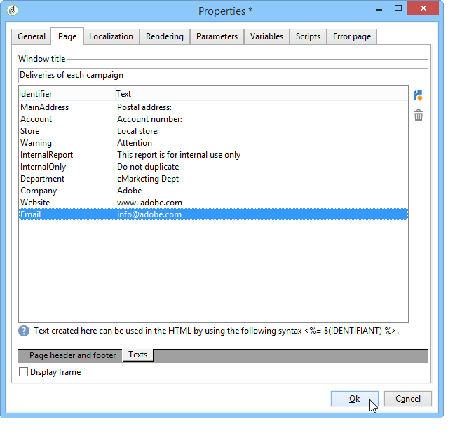

# Indeling van element{#element-layout}

Naast de verschillende hier beschreven grafieken: [Grafiektypen en -varianten](../../reporting/using/creating-a-chart.md#chart-types-and-variants), kunt u de weergave aanpassen en elementen toevoegen aan de rapportpagina(&#39;s).

U kunt containers gebruiken: Hiermee kunt u verschillende elementen van een pagina aan elkaar koppelen en de lay-out ervan in kolommen en/of cellen configureren. Hoe deze te gebruiken is gedetailleerd in [deze rubriek](../../web/using/defining-web-forms-layout.md#creating-containers).

U kunt de rapportlay-out bij de wortel van de boom vormen en het voor elke container overladen. Pagina&#39;s worden in kolommen gesorteerd. Containers worden ook in kolommen gesorteerd. Alleen de statische en grafische items worden in cellen gesorteerd.

## Opties voor elke pagina definiëren {#defining-the-options-for-each-page}

U kunt de opties op elke pagina van het rapport gebruiken.

Op het **[!UICONTROL General]** tabblad kunt u de titel van de pagina wijzigen en legendeposities configureren en bladeren tussen de rapportpagina&#39;s.

In het **[!UICONTROL Title]** veld kunt u het label aanpassen in de koptekst van de rapportpagina. De titel van het venster kan via het **[!UICONTROL Properties]** venster van het rapport worden gevormd. Zie Koptekst en voettekst [toevoegen voor meer informatie](#adding-a-header-and-a-footer).

De **[!UICONTROL Display settings]** opties laten u toe om de positie van de controletitel binnen een rapportpagina te selecteren en het aantal kolommen op de pagina te bepalen. Raadpleeg de sectie **Itemlayout** van [deze sectie](../../web/using/defining-web-forms-layout.md#positioning-the-fields-on-the-page)voor meer informatie over de paginalay-out.

Selecteer de verschillende opties in de **[!UICONTROL Browse]** sectie om het bladeren van één rapportpagina aan een andere toe te staan. Als de **[!UICONTROL Disable next page]** optie of de **[!UICONTROL Disable previous page]** optie wordt geselecteerd, verdwijnen de **[!UICONTROL Next]** en **[!UICONTROL Previous]** knopen van de rapportpagina.

## Een kop- en voettekst toevoegen {#adding-a-header-and-a-footer}

In het venster met rapporteigenschappen kunt u ook de lay-outelementen definiëren, zoals: de titel van het venster, de HTML-inhoud van de kop- en voetteksten.

Klik op de **[!UICONTROL Properties]** knop van het rapport om het eigenschappenvenster te openen.

Op het **[!UICONTROL Page]** tabblad kunt u de weergave aanpassen.

De inhoud die op dit lusje wordt gevormd zal op alle rapportpagina&#39;s zichtbaar zijn.

Op het **[!UICONTROL Texts]** subtabblad kunt u variabele inhoud definiëren: tijdens de vertaalcyclus zal hiermee rekening worden gehouden indien het verslag is opgesteld voor gebruik in verschillende talen .

Hiermee kunt u een lijst met tekstfragmenten maken en deze koppelen aan id&#39;s:

Dan neem deze herkenningstekens in de inhoud van HTML van het rapport op:

Wanneer het rapport wordt weergegeven, worden deze automatisch vervangen door de juiste inhoud.

Net als bij HTML-teksten kunt u met deze modus de teksten in het rapport centraliseren en de vertaling ervan beheren. De op dit tabblad gemaakte tekst wordt automatisch verzameld door het geïntegreerde vertaalgereedschap van Adobe Campaign.
