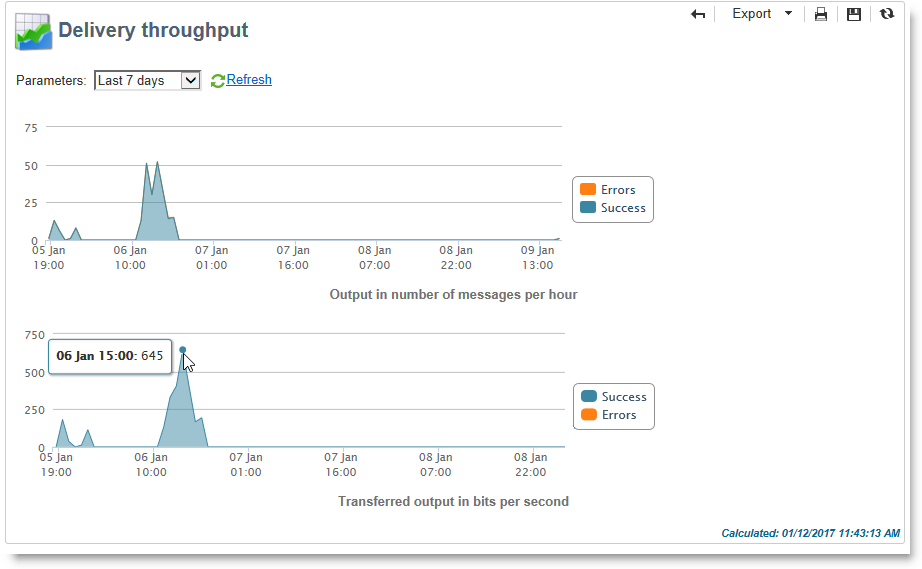
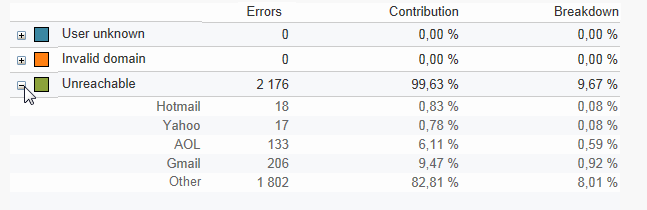
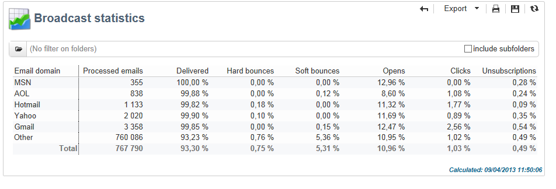

# Algemene rapporten {#global-reports}

Deze rapporten hebben betrekking op de activiteit van de gegevens in de gehele database. Ga naar het **[!UICONTROL Reports]** tabblad om het dashboard met rapporten weer te geven.

Klik op de naam van de rapporten om deze weer te geven. De volgende rapporten zijn standaard beschikbaar:

>[!CAUTION]
>
>In deze sectie worden alleen de rapporten weergegeven die betrekking hebben op leveringen.

* **[!UICONTROL Delivery throughput]** : Raadpleeg de [leveringstijd](#delivery-throughput).
* **[!UICONTROL Browsers]** : zie [Browsers](#browsers).
* **[!UICONTROL Sharing to social networks]** : Zie [Delen naar sociale netwerken](#sharing-to-social-networks).
* **[!UICONTROL Statistics on sharing activities]** : zie [Statistieken over het delen van activiteiten](#statistics-on-sharing-activities).
* **[!UICONTROL Operating systems]** : zie [Besturingssystemen](#operating-systems).
* **[!UICONTROL URLs and click streams]** : verwijst naar [URLs en klikt stromen](#urls-and-click-streams).
* **[!UICONTROL Tracking indicators]** : zie [Trackingindicatoren](#tracking-indicators).
* **[!UICONTROL Non-deliverables and bounces]** : verwijzen naar [Niet te leveren items en stuitingen](#non-deliverables-and-bounces).
* **[!UICONTROL User activities]** : zie [Gebruikersactiviteiten](#user-activities).
* **[!UICONTROL Subscription tracking]** : Raadpleeg [Abonnementsbeheer](#subscription-tracking).
* **[!UICONTROL Delivery summary]** : raadpleeg het overzicht [van de](#delivery-summary)levering.
* **[!UICONTROL Delivery statistics]** : zie [Leveringsstatistieken](#delivery-statistics).
* **[!UICONTROL Breakdown of opens]** : Zie [Uitsplitsing van openen](#breakdown-of-opens).

## Leveringsdoorvoer {#delivery-throughput}

Dit verslag bevat informatie over de leveringsproductie van het gehele platform voor een bepaalde periode. Om de snelheid te meten waarbij de berichten worden geleverd, zijn de criteria het aantal berichten die per uur worden verzonden en de grootte van de berichten (in beetjes per seconde). In het onderstaande voorbeeld ziet u in de eerste grafiek de geslaagde leveringen in blauw en het aantal onjuiste leveringen in oranje.

U kunt de weergegeven waarden configureren door de tijdschaal te wijzigen: Weergave van 1 uur, weergave van 3 uur, weergave van 24 uur, enz. Klik **[!UICONTROL Refresh]** om uw selectie te bevestigen.

## Gebruikersactiviteiten {#user-activities}

Dit rapport toont de uitsplitsing van opent, klikt en transacties per half uur, uur of dag, in de vorm van een grafiek.

De volgende opties zijn beschikbaar:

* **[!UICONTROL Opens]** : Het totale aantal geopende berichten. E-mails in tekstindeling worden niet in aanmerking genomen. Voor meer informatie over het volgen opent, verwijs naar het [Volgen opent](#tracking-opens-).
* **[!UICONTROL Clicks]** : Het totale aantal klikken op koppelingen in leveringen. Er wordt geen rekening gehouden met klikken op abonnementkoppelingen en spiegelpagina&#39;s.
* **[!UICONTROL Transactions]** : Het totale aantal transacties nadat een bericht is ontvangen. Om een transactie in aanmerking te nemen, moet een webtrackingtag van het transactietype in de overeenkomstige Web-pagina worden opgenomen. Webtracking-configuratie wordt in [deze sectie](../../configuration/using/about-web-tracking.md)weergegeven.

## Niet-te leveren producten en bedragen {#non-deliverables-and-bounces}

Dit verslag geeft een overzicht van de niet-te leveren posten en een uitsplitsing van de bedragen per internetdomein.

Het **[!UICONTROL Number of messages processed]** vertegenwoordigt het totale aantal berichten die door de leveringsserver worden verwerkt. Deze waarde is lager dan het aantal berichten dat moet worden afgeleverd wanneer bepaalde leveringen zijn gestopt of gepauzeerd (voordat deze door de server worden verwerkt).

**[!UICONTROL Breakdown of errors by type]**

>[!NOTE]
>
>De fouten die in dit rapport worden weergegeven, activeren het quarantaineproces. Raadpleeg [Quarantabeheer](../../delivery/using/understanding-quarantine-management.md)voor meer informatie over quarantainebeheer.

In het eerste deel van dit verslag wordt de uitsplitsing van niet-te leveren producten in de vorm van een tabel van waarden en een grafiek weergegeven.

Voor elk fouttype hebben we:

* het aantal foutberichten van dit type;
* het percentage berichten met dergelijke fouten in vergelijking met het totale aantal berichten met fouten;
* het percentage van foutenmeldingen van dit type vergeleken met het totale aantal verwerkte berichten.

De volgende indicatoren worden gebruikt:

* **[!UICONTROL User unknown]** : Fouttype dat tijdens de levering wordt gegenereerd om aan te geven dat het e-mailadres ongeldig is.
* **[!UICONTROL Invalid domain]** : Fouttype dat wordt gegenereerd bij het verzenden van een levering om aan te geven dat het domein van het e-mailadres onjuist is of niet bestaat.
* **[!UICONTROL Inbox full]** : Het type van fout na vijf leveringspogingen wordt geproduceerd om erop te wijzen dat de ontvangers inbox teveel berichten bevat.
* **[!UICONTROL Account disabled]** : Fouttype dat wordt gegenereerd bij het verzenden van een levering om aan te geven dat het adres niet langer bestaat.
* **[!UICONTROL Rejected]** : Het type van fout produceerde wanneer een adres door IAP (Internet Access Provider) wordt verworpen, bijvoorbeeld na de toepassing van een veiligheidsregel (anti-spamsoftware).
* **[!UICONTROL Unreachable]** : Fouttype dat optreedt in de tekenreeks voor berichtdistributie: incident op het SMTP relais, tijdelijk onbereikbaar domein, enz.
* **[!UICONTROL Not connected]** : Fouttype om aan te geven dat de mobiele telefoon van de ontvanger op het moment van verzending wordt uitgeschakeld of losgekoppeld van het netwerk.

   >[!NOTE]
   >
   >Deze indicator heeft alleen betrekking op leveringen op mobiele kanalen. Zie [deze sectie](../../delivery/using/sms-channel.md)voor meer informatie.

   U kunt elke regel van de waardetabel openen door op het symbool [+] te klikken. Voor elk fouttype kunt u de indeling van foutberichten per domein weergeven.

   

**[!UICONTROL Breakdown of errors per domain]**

In het tweede gedeelte van dit rapport wordt de uitsplitsing van fouten per internetdomein getoond in de vorm van een tabel met waarden en een grafiek.

Voor elke domeinnaam hebben we:

* het aantal berichten met fouten voor dit domein,
* het percentage berichten met fouten voor dit domein in vergelijking met het totale aantal berichten dat voor dit domein wordt verwerkt;
* het percentage foutberichten voor dit domein in vergelijking met het totale aantal foutberichten.

U kunt elke regel van de waardetabel openen door op het symbool [+] te klikken. Voor elk domeintype kunt u de indeling van foutberichten per fouttype weergeven.

>[!NOTE]
>
>De domeinnamen die in dit rapport worden weergegeven, worden op kubusniveau gedefinieerd. Als u deze waarden wilt wijzigen, bewerkt u de **[!UICONTROL Delivery logs (broadlogrcp)]** kubus. Zie [deze sectie](../../reporting/using/about-cubes.md)voor meer informatie. De **[!UICONTROL Others]** categorie bevat domeinnamen die niet tot een bepaalde klasse behoren.

## Browsers {#browsers}

Dit verslag geeft een overzicht van de internetbrowsers die door de ontvangers van de levering voor de betrokken periode zijn gebruikt.

>[!NOTE]
>
>De waarden in dit rapport zijn schattingen: alleen ontvangers die op een levering hebben geklikt , worden in aanmerking genomen .

**Algemene statistieken**

De algemene statistieken over browsergebruik worden gepresenteerd in de vorm van een tabel met waarden en een grafiek.

De volgende indicatoren worden gebruikt:

* **[!UICONTROL Visitors]** : Het totale aantal beoogde ontvangers (per internetbrowser) dat minstens één keer op een levering heeft geklikt.
* **[!UICONTROL Pages viewed]** : Het totale aantal klikken op koppelingen in een levering (per internetbrowser) voor alle leveringen.
* **[!UICONTROL Usage rate]** : Dit percentage is de uitsplitsing van bezoekers (per internetbrowser) in verhouding tot het totale aantal bezoekers.

**Statistieken per browser**

In de lijst van globale statistische waarden, kunt u elke browser naam klikken om hun gebruiksstatistieken te bekijken.

Statistieken worden gepresenteerd in de vorm van een curve, een grafiek en een tabel met waarden.

De **[!UICONTROL History]** curve geeft de aanwezigheidsgraad van deze browser per dag aan. De frequentie is de verhouding tussen het aantal bezoekers per dag (in deze browser) en het aantal bezoekers dat wordt gemeten op de dag met de hoogste aanwezigheidsgraad.

De **[!UICONTROL Breakdown per version]** grafiek geeft de uitsplitsing van bezoekers per versie weer in vergelijking met het totale aantal bezoekers (in deze browser).

In de waardetabel worden de volgende indicatoren gebruikt:

* **[!UICONTROL Global rate]** : Dit percentage geeft de uitsplitsing van bezoekers per versie weer ten opzichte van het totale aantal bezoekers (in alle browsers).
* **[!UICONTROL Relative rate]** : Dit percentage geeft de uitsplitsing van bezoekers per versie weer in vergelijking met het totale aantal bezoekers (in deze browser).

### Delen naar sociale netwerken {#sharing-to-social-networks}

Met virale marketing kunnen ontvangers gegevens delen met hun contactnetwerk: ze kunnen een koppeling naar hun profiel toevoegen (Facebook, Twitter, enz.) of stuur een bericht naar een vriend. Elk aandeel en elke toegang tot gedeelde informatie wordt gevolgd binnen de levering. Zie [deze rubriek](../../delivery/using/viral-and-social-marketing.md)voor meer informatie over het op de markt brengen van virussen.

Dit rapport toont de uitsplitsing van gedeelde en geopende berichten per sociaal netwerk (Facebook, Twitter, enz.) en/of per e-mail.

**[!UICONTROL Email delivery statistics]**

In de statistieken van de e-maillevering, worden twee waarden getoond:

* **[!UICONTROL Number of messages to be delivered]** : Het totale aantal berichten dat tijdens leveringsanalyse wordt verwerkt.
* **[!UICONTROL Number of successful deliveries]** :Aantal berichten dat is verwerkt.

**[!UICONTROL Sharing activities and mail open statistics]**

De centrale tabel toont de statistieken over e-mailaandelen en wordt geopend.

In de **[!UICONTROL Shares]** kolom, hebben wij de volgende indicatoren:

* **[!UICONTROL No. of sharing activities]** : Het totale aantal berichten dat op elk sociaal netwerk wordt gedeeld. Deze waarde is gelijk aan het totale aantal klikken op het pictogram van het overeenkomende **[!UICONTROL Links for sharing to social networks]** aanpassingsblok.
* **[!UICONTROL Breakdown]** : Dit percentage is de uitsplitsing van de aandelen per sociaal netwerk in verhouding tot het totale aantal aandelen.
* **[!UICONTROL Sharing rate]** : Dit percentage is de uitsplitsing van de aandelen per sociaal netwerk in verhouding tot het aantal te leveren berichten.

In de **[!UICONTROL Opens]** kolom, hebben wij de volgende indicatoren:

* **[!UICONTROL No. of opens]** : Het totale aantal berichten die werden geopend door mensen aan wie het bericht werd doorgestuurd (via het **[!UICONTROL Links for sharing to social networks]** verpersoonlijkingsblok). Deze waarde is gelijk aan het aantal keren dat de spiegelpagina is weergegeven. Opens door ontvangers van de levering worden niet in aanmerking genomen.
* **[!UICONTROL Breakdown]** : Dit percentage geeft de verdeling van de openingen per sociaal netwerk weer, in verhouding tot het totale aantal openingen.
* **[!UICONTROL Rate of opens]** : Dit percentage geeft de uitsplitsing weer van de beurzen per sociaal netwerk, in verhouding tot het totale aantal aandelen.

**[!UICONTROL Breakdown of sharing activities and opens]**

Deze sectie omvat twee grafieken die de indeling van de deelactiviteiten vertegenwoordigen en per sociaal netwerk worden geopend.

## Statistieken over de activiteiten voor het delen van diensten {#statistics-on-sharing-activities}

Dit rapport laat de evolutie zien van aandelen in sociale netwerken (Facebook, Twitter, e-mail, enz.) op tijd.

Zie [deze rubriek](../../delivery/using/viral-and-social-marketing.md)voor meer informatie over het op de markt brengen van virussen.

Statistieken worden gepresenteerd in de vorm van een tabel met waarden en een grafiek.

De volgende indicatoren worden gebruikt:

* **[!UICONTROL New contacts]** : Aantal nieuwe abonnementen na ontvangst van een bericht dat via e-mail wordt gedeeld. Deze waarde komt overeen met het aantal personen dat een bericht heeft ontvangen dat via e-mail is gedeeld, op het bericht heeft geklikt **[!UICONTROL Subscription link]** en het abonnementsformulier heeft ingevuld.
* **[!UICONTROL Opens]** : Het totale aantal berichten dat is geopend door de personen aan wie het bericht is overgedragen (via het **[!UICONTROL Link for sharing to social networks]** verpersoonlijkingsblok). Deze waarde is gelijk aan het aantal keren dat de spiegelpagina is weergegeven. Opens door ontvangers van de levering worden niet in aanmerking genomen.
* **[!UICONTROL Sharing activities]** : Het totale aantal berichten dat via sociale netwerken wordt gedeeld. Deze waarde komt overeen met het totale aantal klikken op het pictogram van het **[!UICONTROL Links for sharing to social networks]** aanpassingsblok.

## Besturingssystemen {#operating-systems}

Dit verslag geeft een overzicht van de exploitatiesystemen die door de ontvangers van de levering voor de betrokken periode worden gebruikt.

>[!NOTE]
>
>De waarden in dit rapport zijn schattingen: alleen ontvangers die op een levering hebben geklikt , worden in aanmerking genomen .

**Algemene statistieken**

De algemene gebruiksstatistieken van besturingssystemen worden gepresenteerd in de vorm van een tabel met waarden en een grafiek.

De volgende indicatoren worden gebruikt:

* **[!UICONTROL Visitors]** : Daggemiddelde van het totale aantal beoogde ontvangers (per besturingssysteem) die ten minste één keer op een levering hebben geklikt.
* **[!UICONTROL Pages viewed]** : Het dagelijkse gemiddelde van het totale aantal klikken op leveringsverbindingen (per werkend systeem) voor alle leveringen.
* **[!UICONTROL Rate of use]** : Dit percentage is de uitsplitsing van bezoekers (per besturingssysteem) in verhouding tot het totale aantal bezoekers.

**Statistieken per besturingssysteem**

In de lijst van globale statistiekwaarden, klik de naam van elk werkend systeem om de statistieken per werkend systeem te bekijken.

Statistieken worden gepresenteerd in de vorm van een curve, een grafiek en een tabel met waarden.

De **[!UICONTROL History]** curve geeft de gebruiksfrequentie van dit besturingssysteem per dag aan. Dit percentage is de verhouding tussen het aantal bezoekers per dag (op dit besturingssysteem) en het aantal bezoekers dat wordt gemeten op de dag met de hoogste aanwezigheid.

De **[!UICONTROL Breakdown by version]** grafiek geeft de uitsplitsing van bezoekers per versie weer in verhouding tot het totale aantal bezoekers op dit besturingssysteem.

In de waardetabel worden de volgende indicatoren gebruikt:

* **[!UICONTROL Global rate]** : Dit percentage geeft de uitsplitsing van bezoekers (per versie) weer in verhouding tot het totale aantal bezoekers in de besturingssystemen.
* **[!UICONTROL Relative rate]** : Dit percentage geeft de uitsplitsing van bezoekers (per versie) weer in verhouding tot het totale aantal bezoekers voor dit besturingssysteem.

## Abonnement bijhouden {#subscription-tracking}

Met dit rapport kunt u abonnementen op informatieservices controleren. Er worden abonnementen en afkortingen weergegeven.

Het kan voor een abonnement worden getoond door de knoop van de homepage of de ontdekkingsreiziger te klikken. **[!UICONTROL Profiles and targets > Services and subscriptions]** Selecteer het gewenste abonnement en klik op het **[!UICONTROL Reports]** tabblad. Het **[!UICONTROL Subscriptions tracking]** rapport is standaard beschikbaar. Het laat u de abonnement en unsubscription tendensen en het loyaliteitstarief over een periode zien. U kunt de representatie van deze gegevens configureren via de vervolgkeuzelijst. Klik **[!UICONTROL Refresh]** om de geselecteerde configuratie te bevestigen.

Raadpleeg [deze pagina](../../delivery/using/managing-subscriptions.md)voor meer informatie.

Het **[!UICONTROL Number subscribed to date]** geeft het totale aantal personen aan dat momenteel is geabonneerd.

**[!UICONTROL Overall evolution of subscriptions]**

In de waardetabel worden de volgende indicatoren gebruikt:

* **[!UICONTROL Subscribers]** : Totaal aantal abonnees voor de betrokken periode.
* **[!UICONTROL Subscriptions]** : Aantal abonnementen voor de betrokken periode.
* **[!UICONTROL Unsubscriptions]** : Aantal aflossingen voor de betrokken periode.
* **[!UICONTROL Evolution]** : Aantal aflossingen min het aantal abonnementen. Het tarief wordt berekend op basis van het totale aantal abonnees.
* **[!UICONTROL Loyalty]** : Loyalty van abonnees voor de betrokken periode.

**[!UICONTROL Subscription evolution curves]**

In deze grafiek wordt de ontwikkeling van de abonnementen en afboekingen voor de betrokken periode weergegeven.

## Leveringsstatistieken {#delivery-statistics}

Dit rapport toont de uitsplitsing naar internetdomein van alle verwerkte en verzonden berichten, van harde en zachte geluiden, opent, klikt en afmeldt.

De volgende indicatoren worden gebruikt:

* **[!UICONTROL Emails processed]** : Het totale aantal berichten dat door de leveringsserver wordt verwerkt.
* **[!UICONTROL Delivered]** : percentage van het aantal met succes verwerkte berichten in verhouding tot het totale aantal verwerkte berichten.
* **[!UICONTROL Hard bounces]** : percentage van het aantal &quot;harde&quot; grenzen in vergelijking met het totale aantal verwerkte berichten.
* **[!UICONTROL Soft bounces]** : percentage van het aantal &quot;zachte&quot; grenzen in vergelijking met het totale aantal verwerkte berichten.

   >[!NOTE]
   >
   >Raadpleeg [Quarantine-beheer](../../delivery/using/understanding-quarantine-management.md)voor meer informatie over harde en zachte grenzen.

* **[!UICONTROL Opens]** : percentage van het aantal beoogde ontvangers die een bericht ten minste eenmaal hebben geopend in vergelijking met het aantal berichten dat met succes is verwerkt.
* **[!UICONTROL Clicks]** : percentage van het aantal mensen die in een levering ten minste eenmaal klikte in vergelijking met het aantal berichten dat met succes is verwerkt.
* **[!UICONTROL Unsubscription]** : percentage van het aantal klikken op een koppeling voor het opzeggen van een abonnement in verhouding tot het aantal berichten dat met succes is verwerkt.

## Indeling van openen {#breakdown-of-opens}

In dit rapport wordt de uitsplitsing van de openingen per besturingssysteem, apparaat en browser voor de betrokken periode weergegeven. Voor elke categorie worden twee grafieken gebruikt. De eerste toont statistieken betreffende opent op een computer en mobiele apparaten. In het tweede voorbeeld worden alleen statistieken weergegeven over het openen op mobiele apparaten.

Het aantal openingen komt overeen met het totale aantal geopende berichten. E-mails met tekstopmaak worden niet geteld. Voor meer informatie over het Volgen opent opent, verwijs naar het [Volgen opent](#tracking-opens-) sectie.

>[!NOTE]
>
>Browsernamen en namen van besturingssystemen maken deel uit van de informatie die door de gebruikersagent van de browser is verzonden en waarnaar de nagel is geopend. Adobe Campagne leidt het type apparaat af op basis van de apparaatgegevens.