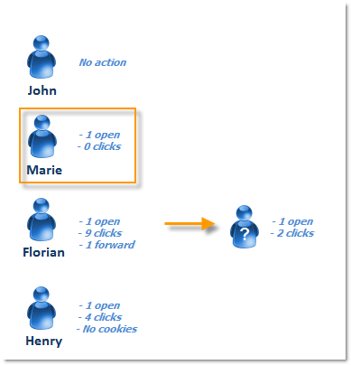

# Persoon/personen en ontvangers {#person-people-and-recipients}

Met dit voorbeeld krijgt u inzicht in het verschil tussen een persoon/persoon en een ontvanger in Adobe Campaign. Wij zullen een levering naar verscheidene mensen verzenden om het verschil tussen mensen en ontvangers te benadrukken terwijl het detailleren van de berekeningsmethode voor de volgende indicatoren:

* **[!UICONTROL Clicks]**
* **[!UICONTROL Distinct clicks for the population reached]**
* **[!UICONTROL Distinct opens for the population reached]**
* **[!UICONTROL Estimation of forwards]**
* **[!UICONTROL Raw reactivity]**

>[!NOTE]
>
>Deze indicatoren worden in het **[!UICONTROL Tracking indicators]** verslag gebruikt. Zie [Trackingindicatoren](../../reporting/using/delivery-reports.md#tracking-indicators)voor meer informatie.

Er worden drie koppelingen toegevoegd aan een levering. Het wordt verzonden naar 4 ontvangers:

* **[!UICONTROL John Davis]** : deze ontvanger opent het e-mailbericht niet (en klikt daarom niet op koppelingen).
* **[!UICONTROL Marie Stuart]** : Hiermee opent u het e-mailbericht, maar klikt u niet op koppelingen.
* **[!UICONTROL Florian David]** : Hiermee opent u het e-mailbericht en klikt u 9 keer op de koppelingen. Hij stuurt het e-mailbericht ook door naar iemand die het opent en tweemaal klikt.
* **[!UICONTROL Henry Macdonald]** : deze ontvanger heeft zijn internetbrowser geconfigureerd om cookies af te wijzen . Hij opent de e-mail en klikt vier keer op de koppelingen.

De volgende trackinglogboeken worden geretourneerd:

Om een duidelijker beeld te krijgen van hoe mensen en ontvangers worden geteld, gaan we de logboeken van elk profiel analyseren.

## Stap 1: John {#step-1--john}

**[!UICONTROL John Davis]** Hiermee opent u het e-mailbericht niet (en klikt u daarom niet op koppelingen).

Omdat John niet opende en niet klikte in de e-mail, verschijnt hij niet in de logboeken.

**Tussentijdse berekening:**

|  | Ontvangers waarop is geklikt | Personen die hebben geklikt | Ontvangers die geopend zijn |
|---|---|---|---|
| John | - | - | - |
| Tussentotaal | 0 | 0 | 0 |

## Stap 2: Marie {#step-2--marie}

**[!UICONTROL Marie Stuart]** Hiermee opent u het e-mailbericht, maar klikt u niet op koppelingen.

Marie&#39;s open wordt getoond in het volgende logboek:

Openen wordt toegewezen aan een ontvanger: Marie. Adobe Campaign voegt daarom een nieuwe ontvanger aan de telling toe.

**Tussentijdse berekening:**

|  | Ontvangers waarop is geklikt | Personen die hebben geklikt | Ontvangers die geopend zijn |
|---|---|---|---|
| John | - | - | - |
| Marie | - | - | +1 |
| Tussentotaal | 0 | 0 | 1 |

## Stap 3: Florian {#step-3--florian}

**[!UICONTROL Florian David]** Hiermee opent u het e-mailbericht en klikt u 9 keer op de koppelingen. Hij stuurt het e-mailbericht ook door naar iemand die het opent en tweemaal klikt.

De acties van Florian (open en 9 klikken) verschijnen in de volgende logboeken:

**Ontvangers**: de open en kliks worden toegewezen aan dezelfde ontvanger (Florian). Aangezien deze ontvanger afwijkt van de vorige (Marie), voegt Adobe Campaign een nieuwe ontvanger toe aan de telling.

Personen: Aangezien de browser van deze ontvanger cookies accepteert, kunnen we zien dat dezelfde id (UUID) is toegewezen aan alle kliklogboeken: **`fe37a503 [...]`**. In Adobe Campaign worden deze muisklikken correct herkend als behorend tot dezelfde persoon. Er wordt een nieuwe persoon toegevoegd aan de telling.

**Tussentijdse berekening:**

|  | Ontvangers waarop is geklikt | Personen die hebben geklikt | Ontvangers die geopend zijn |
|---|---|---|---|
| John | - | - | - |
| Marie | - | - | +1 |
| Florian | +1 | +1 | +1 |
| Tussentotaal | 1 | 1 | 2 |

De volgende logboeken vallen samen met de open en twee klikken die worden uitgevoerd door de persoon die Florian de e-mail heeft doorgestuurd naar:

**Ontvangers**: zijn open en kliks worden toegewezen aan de ontvanger die e-mail (Florian) door:sturen. Aangezien deze ontvanger reeds is geteld, blijft het aantal ontvangers gelijk.

**Personen**: met betrekking tot kliks, kunnen wij zien dat het zelfde herkenningsteken (UUID) aan alle logboeken wordt toegewezen: **`9ab648f9 [...]`**. Deze id is nog niet meegeteld. Er wordt dus een nieuwe persoon aan het tellen toegevoegd.

**Tussentijdse berekening:**

|  | Ontvangers waarop is geklikt | Personen die hebben geklikt | Ontvangers die geopend zijn |
|---|---|---|---|
| John | - | - | - |
| Marie | - | - | +1 |
| Florian | +1 | +1 | +1 |
| Onbekende persoon | - | +1 | - |
| Tussentotaal | 1 | 2 | 2 |

## Stap 4: Henry {#step-4--henry}

**[!UICONTROL Henry Macdonald]** heeft zijn internetbrowser geconfigureerd om cookies af te wijzen. Hij opent de e-mail en klikt vier keer op de koppelingen.

De open en 4 klikken die door Henry worden uitgevoerd verschijnen in de volgende logboeken:

**Ontvangers**: de open en kliks worden toegewezen aan dezelfde ontvanger (Henry). Aangezien deze ontvanger nog niet is meegeteld, voegt Adobe Campaign een ontvanger aan de telling toe.

**Personen**: Aangezien Henry&#39;s browser geen cookies accepteert, wordt voor elke klik een nieuwe id (UUID) gegenereerd. Elk van de vier klikken wordt geïnterpreteerd als afkomstig van een andere persoon. Aangezien deze id&#39;s nog niet zijn geteld, worden ze aan de telling toegevoegd.

**Tussentijdse berekening:**

|  | Ontvangers waarop is geklikt | Personen die hebben geklikt | Ontvangers die geopend zijn |
|---|---|---|---|
| John | - | - | - |
| Marie | - | - | +1 |
| Florian | +1 | +1 | +1 |
| Onbekende persoon | - | +1 | - |
| Henry | +1 | +4 | +1 |
| Tussentotaal | 2 | 6 | 3 |

## Samenvatting {#summary}

Op het niveau van levering, hebben wij de volgende resultaten:

* **[!UICONTROL Clicks]** (ontvangers die hebben geklikt): 2
* **[!UICONTROL Distinct clicks for the population reached]** (personen die hebben geklikt): 6
* **[!UICONTROL Distinct opens for the population reached]** (ontvangers die opende): 3

De ruwe reactiviteit en de raming van de forwards worden als volgt berekend:

* **[!UICONTROL Estimation of forwards]** = **B - A** (dus 6 - 2 = 4)
* **[!UICONTROL Raw reactivity]** = **A / C** (dus 2 / 3 = 66,67%)

>[!NOTE]
>
>In de volgende formules:
>
>* A vertegenwoordigt de **[!UICONTROL Clicks]** indicator (ontvangers die klikte).
>* B staat voor de **[!UICONTROL Distinct clicks for the population reached]** indicator (mensen die hebben geklikt).
>* C staat voor de **[!UICONTROL Distinct opens for the population reached]** indicator (ontvangers die geopend zijn).