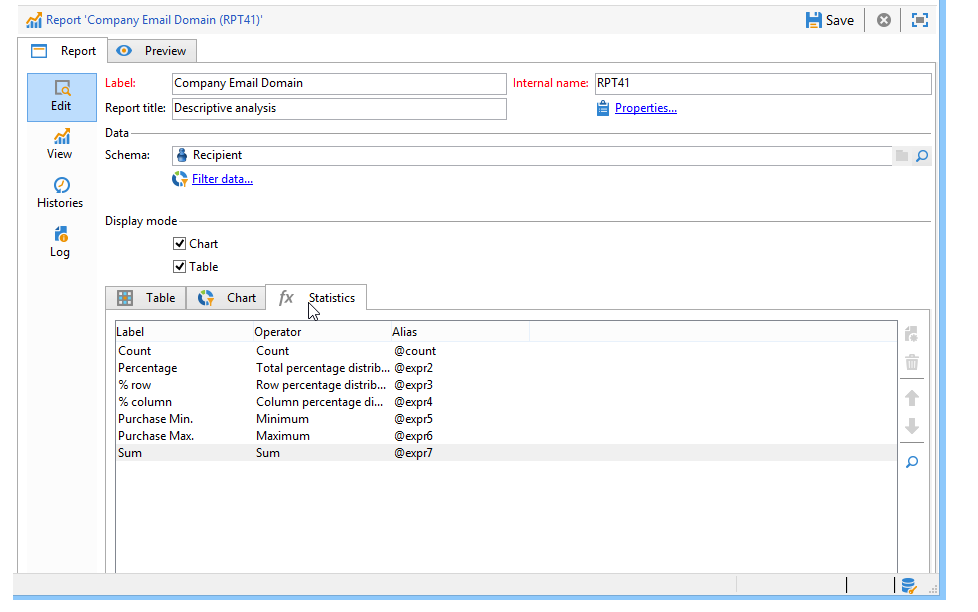
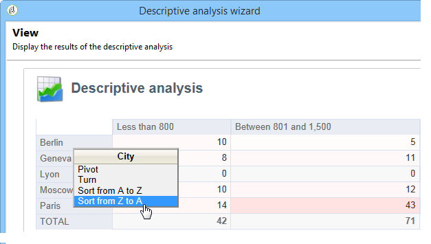
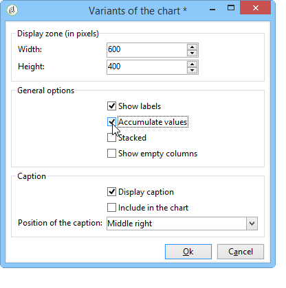

# Een analyserapport gebruiken{#processing-a-report}

## Een analyserapport opslaan {#saving-an-analysis-report}

Als u de juiste rechten hebt, kunt u een analyserapport opslaan dat met een sjabloon is gemaakt of dit exporteren in de indeling Excel, PDF of OpenOffice.

Om uw rapport te bewaren, klik **[!UICONTROL Save]** en geef uw rapport een etiket.

Selecteer **[!UICONTROL Also save data]** als u een geschiedenis van uw rapport wilt tot stand brengen en de waarden van het rapport op het tijdstip van sparen wilt zien. Raadpleeg [Analyserapporten archiveren](#archiving-analysis-reports) voor meer informatie hierover.

Met de optie **[!UICONTROL Share this report]** hebben andere operatoren toegang tot het rapport.

Zodra het is bewaard, kan dit rapport worden opnieuw gebruikt om andere analyserapporten te produceren:

Als u wijzigingen in dit rapport wilt aanbrengen, bewerkt u het knooppunt **[!UICONTROL Administration > Configuration > Adobe Campaign tree reports]** van de Adobe Campaign-structuur (of de eerste map van het type &#39;Reports&#39; waarvoor de operator bewerkingsrechten heeft). Voor meer op dit, verwijs naar [Vormend de lay-out van een beschrijvend analyserapport](#configuring-the-layout-of-a-descriptive-analysis-report).

## Extra instellingen voor analyserapport {#analysis-report-additional-settings}

Nadat u een beschrijvend analyserapport hebt opgeslagen, kunt u de eigenschappen ervan bewerken en aanvullende opties openen.

Deze opties zijn het zelfde als standaardrapporten en zijn gedetailleerd in [deze pagina](../../reporting/using/properties-of-the-report.md).

## Het vormen van de lay-out van een beschrijvend analyserapport {#configuring-the-layout-of-a-descriptive-analysis-report}

U kunt de weergave en lay-out van uw gegevens aanpassen in de grafieken en tabellen van de beschrijvende analyse. Alle opties zijn toegankelijk via de Adobe Campaign-structuur, op het tabblad **[!UICONTROL Edit]** van elk rapport.

### Weergavemodus van analyserapport {#analysis-report-display-mode}

Wanneer u een rapport gebruikend het **[!UICONTROL qualitative distribution]** malplaatje creeert, worden de lijst en grafiekvertoningswijzen door gebrek geselecteerd. Als u slechts één weergavemodus wilt, schakelt u het desbetreffende selectievakje uit. Dit betekent dat alleen de tab van de geselecteerde weergavemodus beschikbaar is.

Om het schema van het rapport te veranderen, klik **[!UICONTROL Select the link]** en selecteer een andere lijst van het gegevensbestand.

### Weergave-instellingen {#analysis-report-display-settings} van analyserapport

Het is mogelijk om statistieken en subtotalen te verbergen of te tonen evenals de richtlijn van uw statistieken te kiezen.

Wanneer u statistieken creeert kunt u hun etiket personaliseren.

Hun naam zal in het rapport worden getoond.

Als u echter de controle van het label en de optie voor het subtotaal weergeven ongedaan maakt, zijn deze niet zichtbaar in het rapport. De naam wordt als knopinfo weergegeven wanneer u de cursor op een cel van de tabel plaatst.

De statistieken worden standaard online weergegeven. Als u de richting wilt wijzigen, selecteert u de gewenste optie in de vervolgkeuzelijst.

In het volgende voorbeeld worden de statistieken weergegeven in kolommen.

### Gegevensindeling van analyserapport {#analysis-report-data-layout}

U kunt de gegevenslay-out rechtstreeks in de beschrijvende analystabel aanpassen. Klik hiertoe met de rechtermuisknop op de variabele waarmee u wilt werken. Selecteer de beschikbare opties in het keuzemenu:

* **[!UICONTROL Pivot]** om de as van de variabele te wijzigen.
* **[!UICONTROL Up]** /  **[!UICONTROL Down]** om de variabelen in regels om te wisselen.
* **[!UICONTROL Move to the right]** /  **[!UICONTROL Move to the left]** om de variabelen in kolommen te wisselen.
* **[!UICONTROL Turn]** om de assen van variabelen om te keren.
* **[!UICONTROL Sort from A to Z]** als u de variabelewaarden laag tot hoog wilt sorteren.
* **[!UICONTROL Sort from Z to A]** als u de waarden van de variabele hoog naar laag wilt sorteren.

   

Als u wilt terugkeren naar de oorspronkelijke weergave, vernieuwt u de weergave.

### Opties {#analysis-report-chart-options} in het analyserapport

Het is mogelijk om de weergave van gegevens in het diagram aan te passen. Om dit te doen, klik **[!UICONTROL Variables...]** verbinding beschikbaar tijdens het de selectiestadium van het grafiektype.

De volgende opties zijn beschikbaar:

* In de bovenste sectie van het venster kunt u het weergavegebied van het diagram wijzigen.
* Standaard worden labels weergegeven in het diagram. U kunt deze verbergen door de optie **[!UICONTROL Show values]** uit te schakelen.
* Met de optie **[!UICONTROL Accumulate values]** kunt u waarden van de ene reeks toevoegen aan de andere.
* U kunt beslissen of u de legenda van het diagram wilt weergeven: om het te verbergen, uncheck de aangewezen optie. Standaard wordt de legenda buiten het diagram in de rechterbovenhoek weergegeven.

   De legenda kan ook boven op het diagram worden weergegeven om op weergaveruimte te besparen. Selecteer de optie **[!UICONTROL Include in the chart]** om dit te doen

   Selecteer de verticale en horizontale uitlijning in de vervolgkeuzelijst **[!UICONTROL Caption position]**.

   

## Een analyserapport exporteren {#exporting-an-analysis-report}

Als u gegevens uit een analyserapport wilt exporteren, klikt u op de vervolgkeuzelijst en selecteert u de gewenste uitvoerindeling.

Raadpleeg [deze pagina](../../reporting/using/actions-on-reports.md) voor meer informatie.

## Bestaande rapporten en analyses opnieuw gebruiken {#re-using-existing-reports-and-analyses}

U kunt beschrijvende analyserapporten over gegevens maken met bestaande rapporten die al in Adobe Campaign zijn opgeslagen. Deze modus is mogelijk wanneer analyses zijn opgeslagen of wanneer rapporten zijn gemaakt en geconfigureerd voor toegang via de wizard voor beschrijvende analyse.

Als u wilt weten hoe u beschrijvende analyses kunt opslaan, raadpleegt u [Een analyserapport opslaan](#saving-an-analysis-report).

Als u beschrijvende analyserapporten wilt maken, moet de wizard voor beschrijvende analyse worden uitgevoerd via een workflowovergang of via het menu **[!UICONTROL Tools > Descriptive analysis]**.

1. Selecteer **[!UICONTROL Existing analyses and reports]** en klik op **[!UICONTROL Next]**.
1. Hiermee hebt u toegang tot de lijst met beschikbare rapporten. Selecteer het rapport dat u wilt genereren.

   

## Analyserapporten voor archivering {#archiving-analysis-reports}

Wanneer u een beschrijvende analyse creeert die op een bestaande analyse wordt gebaseerd, kunt u archieven tot stand brengen om gegevens op te slaan en rapportresultaten te vergelijken.

Voer de volgende stappen uit om een historie te maken:

1. Open een bestaande analyse of maak een nieuwe beschrijvende analysewizard.
1. Klik in de pagina met rapportweergave op de knop om een geschiedenis in de werkbalk te maken en bevestig vervolgens zoals hieronder wordt weergegeven:

   

1. Met de knop Archieftoegang geeft u vorige analyses weer.

   

