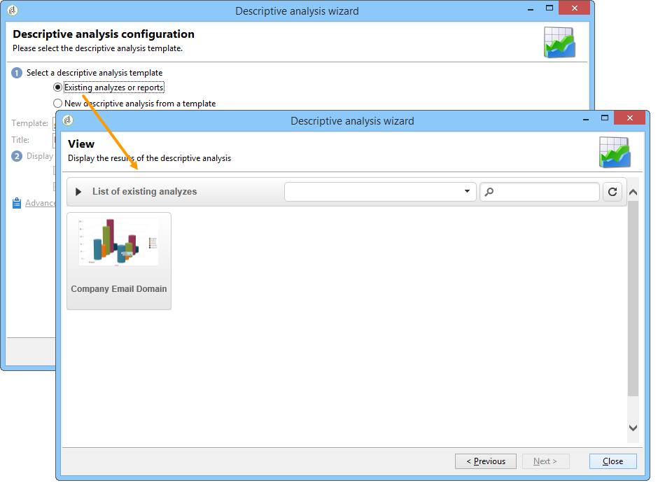

# Uw analyserapport beheren en configureren {#processing-a-report}

## Een analyserapport opslaan {#saving-an-analysis-report}

Als u de aangewezen rechten hebt, kunt u een analyserapport bewaren dat van een malplaatje wordt gecreeerd of het uitvoeren in Excel, PDF, of formaat OpenOffice.

Als u uw rapport wilt opslaan, klikt u op **[!UICONTROL Save]** en geeft u het rapport een label.

Selecteer **[!UICONTROL Also save data]** als u een historie van uw rapport wilt maken en de waarden van het rapport wilt zien op het moment van opslaan. Voor meer op dit, verwijs naar [ de analyserapporten van het Archief ](#archiving-analysis-reports).

Met de optie **[!UICONTROL Share this report]** hebben andere operatoren toegang tot het rapport.

Zodra het is bewaard, kan dit rapport worden opnieuw gebruikt om andere analyserapporten te produceren:

Als u wijzigingen in dit rapport wilt aanbrengen, bewerkt u het knooppunt **[!UICONTROL Administration > Configuration > Adobe Campaign tree reports]** van de Adobe Campaign-structuur (of de eerste map van het type &#39;Reports&#39; waarvoor de operator bewerkingsrechten heeft). Voor meer op dit, verwijs naar [ vorm de lay-out van een beschrijvend analyserapport ](#configuring-the-layout-of-a-descriptive-analysis-report).

## Aanvullende instellingen voor analyserapport {#analysis-report-additional-settings}

Nadat u een beschrijvend analyserapport hebt opgeslagen, kunt u de eigenschappen van het rapport bewerken en aanvullende opties openen.

Deze opties zijn het zelfde als standaardrapporten en in [ gedetailleerd deze pagina ](../../reporting/using/properties-of-the-report.md).

## De lay-out van een beschrijvend analyserapport configureren {#configuring-the-layout-of-a-descriptive-analysis-report}

U kunt de weergave en lay-out van uw gegevens aanpassen in de grafieken en tabellen van de beschrijvende analyse. Alle opties zijn toegankelijk via de Adobe Campaign-structuur, op het tabblad **[!UICONTROL Edit]** van elk rapport.

### Weergavemodus van analyserapport {#analysis-report-display-mode}

Wanneer u een rapport maakt met de sjabloon **[!UICONTROL qualitative distribution]** , zijn de weergavemodi voor tabellen en grafieken standaard geselecteerd. Als u slechts één weergavemodus wilt, schakelt u het desbetreffende selectievakje uit. Dit betekent dat alleen de tab van de geselecteerde weergavemodus beschikbaar is.

Als u het schema van het rapport wilt wijzigen, klikt u op **[!UICONTROL Select the link]** en selecteert u een andere tabel in de database.

### Weergaveinstellingen van analyserapport {#analysis-report-display-settings}

Het is mogelijk om statistieken en subtotalen te verbergen of te tonen evenals de richtlijn van uw statistieken te kiezen.

Wanneer u statistieken creeert kunt u hun etiket personaliseren.

Hun naam zal in het rapport worden getoond.

Als u echter de controle van het label en de optie voor het subtotaal weergeven ongedaan maakt, zijn deze niet zichtbaar in het rapport. De naam wordt als knopinfo weergegeven wanneer u de muisaanwijzer op een cel van de tabel plaatst.

De statistieken worden standaard online weergegeven. Als u de richting wilt wijzigen, selecteert u de gewenste optie in de vervolgkeuzelijst.

In het volgende voorbeeld worden de statistieken weergegeven in kolommen.

### Gegevensindeling van analyserapport {#analysis-report-data-layout}

U kunt de gegevenslay-out rechtstreeks in de beschrijvende analystabel aanpassen. Klik hiertoe met de rechtermuisknop op de variabele waarmee u wilt werken. Selecteer de beschikbare opties in het keuzemenu:

* **[!UICONTROL Pivot]** om de as van de variabele te wijzigen.
* **[!UICONTROL Up]** / **[!UICONTROL Down]** om de variabelen in regels te wisselen.
* **[!UICONTROL Move to the right]** / **[!UICONTROL Move to the left]** om de variabelen in kolommen te wisselen.
* **[!UICONTROL Turn]** gebruiken om de assen van variabelen om te keren.
* **[!UICONTROL Sort from A to Z]** om de variabelewaarden laag tot hoog te sorteren.
* **[!UICONTROL Sort from Z to A]** als u de variabelewaarden hoog naar laag wilt sorteren.

  

Als u wilt terugkeren naar de oorspronkelijke weergave, vernieuwt u de weergave.

### Opties in het overzichtsrapport {#analysis-report-chart-options}

Het is mogelijk om de weergave van gegevens in het diagram aan te passen. Klik hiertoe op de koppeling **[!UICONTROL Variables...]** die beschikbaar is in het selectiestadium van het diagramtype.

De volgende opties zijn beschikbaar:

* In de bovenste sectie van het venster kunt u het weergavegebied van het diagram wijzigen.
* Standaard worden labels weergegeven in het diagram. U kunt ze verbergen door de optie **[!UICONTROL Show values]** uit te schakelen.
* Met de optie **[!UICONTROL Accumulate values]** kunt u waarden van de ene reeks naar de andere optellen.
* U kunt beslissen of u de diagramlegenda wilt weergeven: als u deze wilt verbergen, schakelt u de desbetreffende optie uit. Standaard wordt de legenda buiten het diagram in de rechterbovenhoek weergegeven.

  De legenda kan ook boven op het diagram worden weergegeven om op weergaveruimte te besparen. Selecteer de optie om dit te doen **[!UICONTROL Include in the chart]**

  Selecteer de verticale en horizontale uitlijning in de vervolgkeuzelijst **[!UICONTROL Caption position]** .

  

## Een analyserapport exporteren {#exporting-an-analysis-report}

Als u gegevens uit een analyserapport wilt exporteren, klikt u op de vervolgkeuzelijst en selecteert u de gewenste uitvoerindeling.

Raadpleeg [deze pagina](../../reporting/using/actions-on-reports.md) voor meer informatie.

## Bestaande rapporten en analyses opnieuw gebruiken {#re-using-existing-reports-and-analyses}

U kunt beschrijvende analyserapporten over gegevens maken aan de hand van bestaande rapporten die al in Adobe Campaign zijn opgeslagen. Deze modus is mogelijk wanneer analyses zijn opgeslagen of wanneer rapporten zijn gemaakt en geconfigureerd voor toegang via de beschrijvende analyseassistent.

Om te weten te komen hoe te om beschrijvende analyses te bewaren, verwijs naar [ het Opslaan van een analyserapport ](#saving-an-analysis-report).

Als u beschrijvende analyserapporten wilt maken, moet de beschrijvende analyseassistent worden uitgevoerd via een workflowovergang of via het menu **[!UICONTROL Tools > Descriptive analysis]** .

1. Selecteer **[!UICONTROL Existing analyses and reports]** en klik op **[!UICONTROL Next]**.
1. Hiermee hebt u toegang tot de lijst met beschikbare rapporten. Selecteer het rapport dat u wilt genereren.

   

## Analyserapporten archiveren {#archiving-analysis-reports}

Wanneer u een beschrijvende analyse creeert die op een bestaande analyse wordt gebaseerd, kunt u archieven tot stand brengen om gegevens op te slaan en rapportresultaten te vergelijken.

Voer de volgende stappen uit om een historie te maken:

1. Open een bestaande analyse of maak een nieuwe beschrijvende analyseassistent.
1. Klik in de pagina met rapportweergave op de knop om een geschiedenis in de werkbalk te maken en bevestig vervolgens zoals hieronder wordt weergegeven:

   

1. Met de knop Archieftoegang geeft u vorige analyses weer.

   
