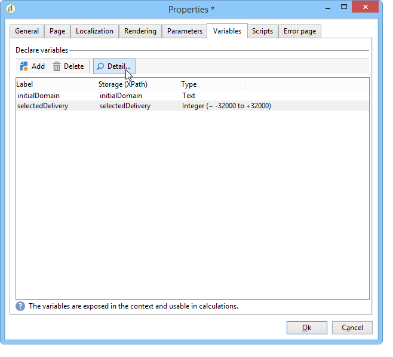

# Eigenschappen van het rapport{#properties-of-the-report}

## Overzicht {#overview}

U kunt volledig uw rapport personaliseren en vormen om uw behoeften aan te passen. Hiervoor bewerkt u de eigenschappen. De eigenschappen van het rapport worden betreden via de knoop van het Bezit die boven de grafiek van de activiteitenopeenvolging wordt gevonden.

## Algemene eigenschappen {#overall-properties}

Op het **[!UICONTROL General]** tabblad kunt u het label en het schema weergeven of wijzigen waarop het rapport betrekking heeft. Deze elementen zijn ingegaan tijdens rapportverwezenlijking.

We raden u niet aan het volgende te wijzigen **[!UICONTROL Internal name]** : dit wordt gebruikt in de rapporttoegang URL.

Het rapportmalplaatje wordt geselecteerd tijdens rapportverwezenlijking en kan niet later worden veranderd.

Als u de tabel wilt wijzigen waarop het rapport betrekking heeft, klikt u op het **[!UICONTROL Select link]** pictogram rechts van het **[!UICONTROL Document type]** veld. Klik op het **[!UICONTROL Magnifier]** pictogram om de beschikbare velden in de geselecteerde tabel weer te geven.

## Toegankelijkheid rapporteren {#report-accessibility}

Een rapport kan tot voorbij de console van de Campagne van Adobe, bijvoorbeeld via browser van het Web worden betreden. In dit geval, kan het noodzakelijk zijn om het controle van de rapporttoegang zoals hieronder getoond te vormen.

Het algemene beginsel is als volgt:

* De **[!UICONTROL Anonymous access]** optie laat onbeperkte toegang tot het rapport toe. Er is echter geen manipulatie mogelijk.

   De rechten van de standaardrapportoperator (&#39;webapp&#39;) worden gebruikt om rapportelementen weer te geven.

* De **[!UICONTROL Access control]** optie stelt Adobe Campagnebeheerders in staat om het te openen zodra zij het programma worden geopend.
* Met de **[!UICONTROL Specific account]** optie kunt u het rapport uitvoeren met de rechten van de operator geselecteerd in het **[!UICONTROL Operator]** veld.

Eigenschappen voor webformulieren worden in [deze pagina](../../web/using/about-web-forms.md)nader beschreven.

## De lokalisatie van rapporten beheren {#managing-report-localization}

U kunt de talen vormen waarin u het rapport wilt worden vertaald. Klik hiertoe op het **[!UICONTROL Localization]** tabblad.

De bewerkingstaal is de taal waarin u schrijft. Wanneer u een taal toevoegt, wordt het subtabblad weergegeven in de pagina voor het bewerken van rapporten.

>[!NOTE]
>
>Raadpleeg voor meer informatie de desbetreffende sectie van [deze sectie](../../web/using/translating-a-web-form.md).

## HTML-rendering aanpassen {#personalizing-html-rendering}

Op het **[!UICONTROL Rendering]** tabblad kunt u de weergavemodus voor de pagina aanpassen. U kunt selecteren:

* De engine voor het renderen van grafieken: Adobe Campaign beschikt over twee verschillende modi voor het genereren van diagramrendering. De renderingengine is standaard HTML 5. Indien nodig kunt u Flash-rendering selecteren.
* Het navigatietype in het rapport: via knoppen of koppelingen.
* De standaardpositie van labels voor rapportelementen. Deze positie kan voor elk element worden overbelast.
* De sjabloon of het thema dat wordt gebruikt voor het genereren van rapportpagina&#39;s.

Eigenschappen voor webformulieren worden in [deze pagina](../../web/using/about-web-forms.md)nader beschreven.

## Aanvullende instellingen definiëren {#defining-additional-settings}

Op het **[!UICONTROL Settings]** tabblad kunt u aanvullende instellingen voor het rapport maken: deze montages zullen in URL tijdens de vraag worden overgegaan.

Eigenschappen voor webformulieren worden in [deze pagina](../../web/using/about-web-forms.md)nader beschreven.

>[!CAUTION]
>
>Om veiligheidsredenen moeten deze parameters met grote voorzichtigheid worden gebruikt.

Een nieuwe instelling maken:

1. Klik op de **[!UICONTROL Add]** knop en voer de naam van de instelling in.

   

1. Geef indien nodig op of de instelling verplicht is.
1. Selecteer het type instelling dat u wilt maken: **[!UICONTROL Filter]** of **[!UICONTROL Variable]**.

   Met de **[!UICONTROL Filter entities]** optie kunt u een veld van de database als parameter gebruiken.

   

   De gegevens worden direct op het niveau van de entiteit teruggevorderd: **ctx/ontvanger/@account**.

   Met de **[!UICONTROL Variable]** optie kunt u een variabele maken of selecteren die als parameter van de URL wordt doorgegeven en die in de filters kan worden gebruikt.

## Variabelen toevoegen {#adding-variables}

Het **[!UICONTROL Variables]** lusje bevat de lijst van variabelen die in het rapport worden gevormd. Deze variabelen worden in de context van het verslag weergegeven en kunnen in berekeningen worden gebruikt.

Klik op de **[!UICONTROL Add]** knop om een nieuwe variabele te maken.

Als u de definitie van een variabele wilt weergeven, selecteert u de variabele en klikt u op de **[!UICONTROL Detail...]** knop.

## Verwijzen naar scripts {#referencing-scripts}

Op het **[!UICONTROL Scripts]** tabblad kunt u verwijzen naar JavaScript-codes die aan de client- en/of serverzijde worden uitgevoerd wanneer de rapportpagina wordt opgevraagd.

Voor een normale uitvoering op de client moeten de scripts waarnaar wordt verwezen, in JavaScript zijn geschreven en compatibel zijn met de meeste browsers. Zie [deze sectie](../../web/using/web-forms-answers.md)voor meer informatie.

## De foutpagina aanpassen {#personalizing-the-error-page}

Het **[!UICONTROL Error page]** lusje laat u het bericht vormen dat in het geval van een fout in de rapportvertoning zal verschijnen.

U kunt teksten bepalen en hen verbinden met specifieke herkenningstekens om rapportlocalisatie te beheren. Zie Koptekst en voettekst [toevoegen voor meer informatie](../../reporting/using/element-layout.md#adding-a-header-and-a-footer).

