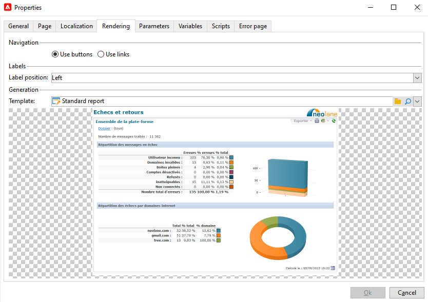

# Eigenschappen van het rapport{#properties-of-the-report}

U kunt volledig uw rapport personaliseren en vormen om uw behoeften aan te passen. Hiervoor bewerkt u de eigenschappen. Rapporteigenschappen zijn toegankelijk via de **[!UICONTROL Properties]** boven het diagram met de activiteitsvolgorde.

Algemene eigenschappen worden hieronder beschreven. Geavanceerde mogelijkheden geconfigureerd in het dialoogvenster **[!UICONTROL Parameters]**, **[!UICONTROL Variables]** en **[!UICONTROL Scripts]** tabs worden beschreven [in deze sectie](../../reporting/using/advanced-functionalities.md).

## Algemene eigenschappen {#overall-properties}

In de **[!UICONTROL General]** van de rapporteigenschappen kunt u de hieronder vermelde instellingen bewerken:

* Het label en de interne naam van het rapport. De **[!UICONTROL Internal name]** wordt gebruikt in het rapport definitieve URL. Het mag niet worden gewijzigd na de opstelling van het verslag.

* Het verslag **Map** is geselecteerd tijdens het maken van rapporten. De beste manier is om een speciale map voor aangepaste rapporten te maken, zodat deze niet worden gemengd met [ingebouwde rapporten](../../reporting/using/about-campaign-built-in-reports.md).

* De **Opslag** wordt geselecteerd wanneer het creëren van het rapport. Om de gegevenslijst van het rapport te veranderen, klik **[!UICONTROL Select link]** pictogram rechts van **[!UICONTROL Document type]** veld.

   

* De **Toegangsbeheer** parameters. Deze instellingen worden hieronder beschreven.

## Toegang tot het rapport beheren {#report-accessibility}

Een rapport kan in de console van Adobe Campaign of met Webbrowser worden betreden. In dit geval, kan het noodzakelijk zijn om het controle van de rapporttoegang zoals hieronder getoond te vormen.

Mogelijke opties zijn:

* **[!UICONTROL Anonymous access]**: deze optie maakt onbeperkte toegang tot het rapport mogelijk . Er is echter geen manipulatie mogelijk.

   Machtigingen van de technische operator &#39;webapp&#39; worden gebruikt om rapportelementen weer te geven. Meer informatie [in deze sectie](../../platform/using/access-management-operators.md).

* **[!UICONTROL Access control]**: met deze optie kunnen Adobe Campaign-operatoren de toepassing openen nadat ze zijn aangemeld.
* **[!UICONTROL Specific account]**: Met deze optie kunt u het rapport uitvoeren met de rechten van de operator die u hebt geselecteerd in het dialoogvenster **[!UICONTROL Operator]** veld.

## De lokalisatie van rapporten beheren {#managing-report-localization}

U kunt de talen vormen waarin u het rapport wilt worden vertaald. Om dit te doen, klik **[!UICONTROL Localization]** tab.

De bewerkingstaal is de taal waarin u schrijft. Wanneer u een taal toevoegt, wordt het subtabblad weergegeven in de pagina voor het bewerken van rapporten.

>[!NOTE]
>
>Raadpleeg voor meer informatie over lokalisatie van webpagina&#39;s in Campaign de [deze sectie](../../web/using/translating-a-web-form.md).

## HTML renderen aanpassen {#personalizing-html-rendering}

In de **[!UICONTROL Rendering]** kunt u de weergavemodus voor de pagina aanpassen. U kunt selecteren:

* Het navigatietype in het rapport: via knoppen of koppelingen.
* De standaardpositie van labels voor rapportelementen. Deze positie kan voor elk element worden overbelast.
* De sjabloon of het thema dat wordt gebruikt voor het genereren van rapportpagina&#39;s.

## De foutpagina aanpassen {#personalizing-the-error-page}

De **[!UICONTROL Error page]** het lusje laat u het bericht vormen dat in het geval van een fout in de rapportvertoning zal verschijnen.

U kunt teksten bepalen en hen verbinden met specifieke herkenningstekens om rapportlocalisatie te beheren. Raadpleeg voor meer informatie hierover [Een kop- en voettekst toevoegen](../../reporting/using/element-layout.md#adding-a-header-and-a-footer).

