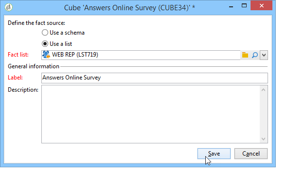

# Hoofdlettergebruik: een rapport weergeven over antwoorden op een online enquête{#use-case-displaying-report-on-answers-to-an-online-survey}

Antwoorden op Adobe Campaign-enquêtes kunnen worden verzameld en geanalyseerd met behulp van speciale rapporten.

In het volgende voorbeeld willen we antwoorden verzamelen op een online enquête en deze weergeven in een draaientabel

Voer de volgende stappen uit:

1. Een workflow maken om antwoorden op de enquête te herstellen en deze op te slaan in een lijst.
1. Een kubus maken met de gegevens in de lijst.
1. Een rapport maken met de draaitabel en de indeling van de antwoorden weergeven.

Voordat u met dit gebruiksgeval begint, hebt u toegang nodig tot een enquête en een reeks antwoorden die u kunt analyseren.

>[!NOTE]
>
>Dit gebruiksgeval mag alleen worden geïmplementeerd als u het **Beoordelingsmanager** -optie. Controleer hiervoor uw licentieovereenkomst.

## Stap 1 - Het creëren van de gegevensinzameling en de opslagwerkschema {#step-1---creating-the-data-collection-and-storage-workflow}

Voer de volgende stappen uit om de antwoorden op de enquête te verzamelen:

1. Een workflow maken en een **[!UICONTROL Answers to a survey]** activiteit. Raadpleeg voor meer informatie over het gebruik van deze activiteit [deze sectie](../../surveys/using/publish-track-and-use-collected-data.md#using-the-collected-data).
1. Bewerk de activiteit en selecteer de enquête waarvan u de antwoorden wilt analyseren.
1. De optie **[!UICONTROL Select all the answer data]** om alle informatie te verzamelen.

   

1. Selecteer de kolommen die u wilt extraheren (in dit geval: selecteren: alle gearchiveerde velden. Dit zijn de velden die de antwoorden bevatten.

   

1. Zodra het vakje van de antwoordinzameling wordt gevormd, plaats a **[!UICONTROL List update]** type activiteit om de gegevens op te slaan.

   

   Geef in deze activiteit de lijst op die moet worden bijgewerkt en schakel de **[!UICONTROL Purge and re-use the list if it exists (otherwise add to the list)]** optie: antwoorden worden toegevoegd aan de bestaande tabel. Met deze optie kunt u verwijzen naar de lijst in een kubus. Het schema dat aan de lijst wordt gekoppeld, wordt niet opnieuw gegenereerd voor elke update. Dit garandeert de integriteit van de kubus die deze lijst gebruikt.

   

1. Start de workflow om de configuratie ervan te bevestigen.

   

   De gespecificeerde lijst wordt gecreeerd en omvat het schema van de antwoorden aan het onderzoek.

1. Voeg een planner toe om de dagelijkse inzameling van antwoorden en de lijstupdate te automatiseren.

   De **[!UICONTROL List update]** en **[!UICONTROL Scheduler]** de activiteiten worden nader omschreven in .

## Stap 2 - De kubus, de maatregelen en de indicatoren ervan maken {#step-2---creating-the-cube--its-measures-and-its-indicators}

U kunt dan de kubus tot stand brengen en zijn maatregelen vormen: zij zullen worden gebruikt om de indicatoren tot stand te brengen die in het rapport zullen worden getoond. Raadpleeg voor meer informatie over het maken en configureren van kubussen [Kubussen](../../reporting/using/ac-cubes.md).

In dit voorbeeld is de kubus gebaseerd op de gegevens in de lijst die worden gevoed door de eerder gemaakte workflow.

Definieer de afmetingen en de maatregelen die in het rapport moeten worden weergegeven. Hier willen we de contractdatum en het land van de geënquêteerde weergeven.

De **[!UICONTROL Preview]** kunt u de rendering van het rapport beheren.

## Stap 3 - het creëren van het rapport en het vormen van de gegevenslay-out binnen de lijst {#step-3---creating-the-report-and-configuring-the-data-layout-within-the-table}

U kunt dan een rapport creëren dat op deze kubus wordt gebaseerd en de gegevens en de informatie verwerken.

Pas de informatie aan om weer te geven op basis van uw behoeften.

