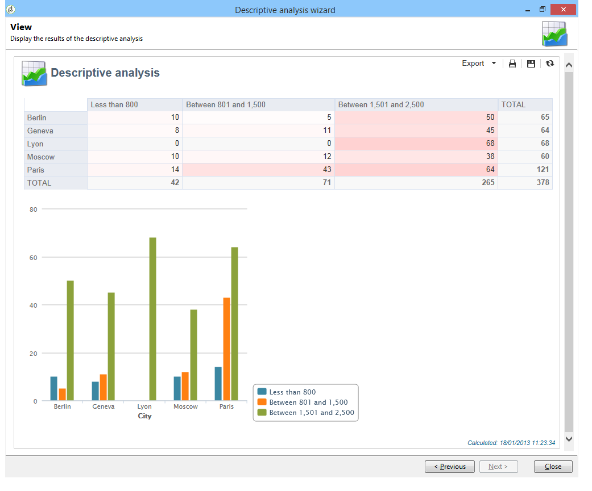
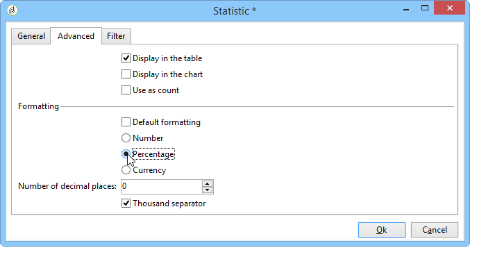

# Gebruiksscenario’s{#use-cases}

## Een populatie analyseren {#analyzing-a-population}

In het volgende voorbeeld kunt u de doelgroep van een reeks nieuwsbrieven verkennen met behulp van de beschrijvende analysewizard.

De stappen van de implementatie worden hieronder beschreven, terwijl een uitvoerige lijst van opties en beschrijvingen in de andere secties van dit hoofdstuk beschikbaar is.

### Identificatie van de te analyseren populatie {#identifying-the-population-to-analyze}

In dit voorbeeld, willen wij de doelbevolking van de leveringen onderzoeken inbegrepen in de **omslag Newsletters**.

U doet dit door de desbetreffende leveringen te selecteren, vervolgens met de rechtermuisknop te klikken en **[!UICONTROL Action > Explore the target...]** te selecteren.


### Een type analyse selecteren {#selecting-a-type-of-analysis}

In de eerste stap van de medewerker, kunt u het beschrijvende analysemalplaatje selecteren aan gebruik. Adobe Campaign biedt standaard twee sjablonen: **[!UICONTROL Qualitative distribution]** en **[!UICONTROL Quantitative distribution]**. Voor meer op dit verwijs naar [het Vormen van het kwalitatieve distributiemalplaatje](../../reporting/using/using-the-descriptive-analysis-wizard.md#configuring-the-qualitative-distribution-template) sectie. De verschillende weergaven worden weergegeven in de sectie [Informatie over beschrijvende analyse](../../reporting/using/about-descriptive-analysis.md).

In dit voorbeeld selecteert u de sjabloon **[!UICONTROL Qualitative distribution]** en kiest u een weergave met een grafiek en tabel (array). Geef het rapport een naam (&quot;Beschrijvende analyse&quot;) en klik **[!UICONTROL Next]**.


### Variabelen selecteren om {#selecting-the-variables-to-display} weer te geven

In de volgende stap kunt u de gegevens selecteren die in de tabel moeten worden weergegeven.

Klik op de koppeling **[!UICONTROL Add...]** om de variabele te selecteren die de gegevens bevat die moeten worden weergegeven. Hier willen we de steden van onze ontvangers op één lijn weergeven:


In de kolommen wordt het aantal aankopen per bedrijf weergegeven. In dit voorbeeld worden bedragen samengevoegd in het veld **Wekopties**.

Hier, willen wij resultaat binden bepalen om hun vertoning te verduidelijken. Hiervoor selecteert u de bindingsoptie **[!UICONTROL Manual]** en stelt u de berekeningsklassen in voor de segmenten die u wilt weergeven:


Klik vervolgens op **[!UICONTROL Ok]** om de configuratie goed te keuren.

Nadat de lijnen en kolommen zijn gedefinieerd, kunt u deze wijzigen, verplaatsen of verwijderen met de werkbalk.


### De weergave-indeling {#defining-the-display-format} definiëren

In de volgende stap van de wizard kunt u het type diagram selecteren dat u wilt genereren.

Kies in dit geval het histogram.


Mogelijke configuraties van de verschillende grafiek worden gedetailleerd in [de sectie van het het rapportdiagram van de Analyse opties](../../reporting/using/processing-a-report.md#analysis-report-chart-options).

### De statistiek configureren om {#configuring-the-statistic-to-calculate} te berekenen

Geef vervolgens de berekeningen op die op de verzamelde gegevens moeten worden toegepast. Standaard worden de waarden door de wizard Omschrijvende analyse een eenvoudige telling uitgevoerd.

In dit venster kunt u de lijst met statistieken definiëren die moeten worden berekend.


Als u een nieuwe statistiek wilt maken, klikt u op de knop **[!UICONTROL Add]**. Raadpleeg [Berekening van statistieken](../../reporting/using/using-the-descriptive-analysis-wizard.md#statistics-calculation) voor meer informatie hierover.

### Het rapport {#viewing-and-using-the-report} weergeven en gebruiken

De laatste stap van de tovenaar toont de lijst en de grafiek.

U kunt gegevens opslaan, exporteren of afdrukken met de werkbalk boven de tabel. Voor meer op dit, verwijs naar [Verwerking een rapport](../../reporting/using/processing-a-report.md).



## Kwalitatieve gegevensanalyse {#qualitative-data-analysis}

### Voorbeeld van een diagramweergave {#example-of-a-chart-display}

**Doel**: een analyseverslag opstellen over de locatie van de vooruitzichten of afnemers.

1. Open de beschrijvende analysewizard en selecteer alleen **[!UICONTROL Chart]**.

   

   Klik **[!UICONTROL Next]** om deze stap goed te keuren.

1. Selecteer vervolgens de optie **[!UICONTROL 2 variables]** en geef op dat de **[!UICONTROL First variable (abscissa)]** verwijst naar de status van de ontvanger (vooruitzichten/klanten) en de tweede variabele naar het land.
1. Selecteer **[!UICONTROL Cylinders]** als een type.

   

1. Klik **[!UICONTROL Next]** en verlaat de standaard **[!UICONTROL Simple count]** statistiek.
1. Klik **[!UICONTROL Next]** om het rapport te tonen.

   

   Houd de muisaanwijzer boven een bar om het exacte aantal klanten of de vooruitzichten voor dit land te zien.

1. De weergave van een van de landen op basis van de legenda in- of uitschakelen.

   

### Voorbeeld van een tabelweergave {#example-of-a-table-display}

**Doel**: analyse van de e-maildomeinen van het bedrijf.

1. Open de beschrijvende analysewizard en selecteer alleen de weergavemodus **[!UICONTROL Array]**.

   

   Klik op de knop **[!UICONTROL Next]** om deze stap goed te keuren.

1. Selecteer de variabele **[!UICONTROL Company]** als een kolom en de variabele **[!UICONTROL Email domain]** als een rij.
1. Houd de optie **[!UICONTROL By rows]** voor statistische oriëntatie: de statistische berekening wordt rechts van de variabele **[!UICONTROL Email domain]** weergegeven.

   

   Klik **[!UICONTROL Next]** om deze stap goed te keuren.

1. Voer vervolgens de te berekenen statistieken in: de standaardtelling houden en een nieuwe statistiek creëren. Om dit te doen, klik **[!UICONTROL Add]** en selecteer **[!UICONTROL Total percentage distribution]** als exploitant.

   

1. Voer een label voor de statistiek in, zodat er geen leeg veld wordt weergegeven wanneer het rapport wordt weergegeven.

   

1. Klik **[!UICONTROL Next]** om het rapport te tonen.

   

1. Zodra het analyserapport is geproduceerd, kunt u de vertoning aanpassen om uw behoeften aan te passen zonder de configuratie te veranderen. U kunt bijvoorbeeld tussen de assen schakelen: Klik met de rechtermuisknop op de domeinnamen en selecteer **[!UICONTROL Turn]** in het snelmenu.

   

   In de tabel worden de gegevens als volgt weergegeven:

   

## Kwantitatieve gegevensanalyse {#quantitative-data-analysis}

**Doel**: het opstellen van een kwantitatief analyseverslag over de pensioengerechtigde leeftijd

1. Open de beschrijvende analysewizard en selecteer **[!UICONTROL Quantitative distribution]** in de vervolgkeuzelijst.

   

   Klik op de knop **[!UICONTROL Next]** om deze stap goed te keuren.

1. Selecteer de variabele **[!UICONTROL Age]** en voer het label ervan in. Geef op of het een geheel getal is en klik op **[!UICONTROL Next]**.

   

1. Verwijder de **[!UICONTROL Deciles]**-, **[!UICONTROL Distribution]**- en **[!UICONTROL Sum]**-statistieken: ze zijn hier niet nodig .

   

1. Klik **[!UICONTROL Next]** om het rapport te tonen.

   

## Een overgangsdoel analyseren in een workflow {#analyzing-a-transition-target-in-a-workflow}

**Doel**: rapporten te genereren over de populatie van een doelworkflow

1. Open de gewenste doelworkflow.
1. Klik met de rechtermuisknop op een overgang die naar de tabel met ontvangers verwijst.
1. Selecteer **[!UICONTROL Analyze target]** in het drop-down menu om het beschrijvende analysevenster te openen.

   

1. Op dit punt kunt u de optie **[!UICONTROL Existing analyses and reports]** selecteren en rapporten gebruiken die eerder zijn gemaakt (zie [Bestaande rapporten en analyses opnieuw gebruiken](../../reporting/using/processing-a-report.md#re-using-existing-reports-and-analyses)), of een nieuwe beschrijvende analyse maken. Laat de optie **[!UICONTROL New descriptive analysis from a template]** standaard geselecteerd om dit te doen.

   De rest van de configuratie is hetzelfde als voor alle beschrijvende analyses.

### Aanbevelingen voor doelanalyse {#target-analyze-recommendations}

De analyse van een populatie in een workflow vereist dat de populatie nog steeds aanwezig is in de overgang. Als de workflow wordt gestart, kan het resultaat met betrekking tot de bevolking uit de overgang worden verwijderd. Als u een analyse wilt uitvoeren, kunt u:

* Maak de overgang van zijn bestemmingsactiviteit los en begin het werkschema om het actief te maken. Start de wizard op de gebruikelijke manier wanneer de overgang begint te knipperen.

   

* Wijzig de eigenschappen van de workflow door de optie **[!UICONTROL Keep the result of interim populations between two executions]** te selecteren. Hiermee kunt u een analyse van de overgang van uw keuze starten, zelfs als de workflow is voltooid.

   

   Als de populatie uit de overgang is gewist, wordt u in een foutbericht gevraagd de desbetreffende optie te selecteren voordat u de wizard voor beschrijvende analyse start.

   

>[!CAUTION]
>
>De optie **[!UICONTROL Keep the result of interim populations between two executions]** mag alleen worden gebruikt in ontwikkelingsfasen, maar nooit voor een productieomgeving.\
>De tussentijdse populaties worden automatisch leeggemaakt zodra de bewaartermijn is bereikt. Deze deadline wordt opgegeven in de eigenschappen van de workflow **[!UICONTROL Execution]** tabblad.

## Logbestanden voor het bijhouden van ontvangers analyseren {#analyzing-recipient-tracking-logs}

De beschrijvende analysetovenaar kan rapporten over andere het werklijsten produceren. Dit betekent dat u leveringslogboeken kunt analyseren door een specifiek rapport te creëren.

In dit voorbeeld, willen wij het reactiviteitstarief van nieuwsbrieven ontvangers analyseren.

Hiervoor voert u de volgende stappen uit:

1. Open de beschrijvende analysewizard via het menu **[!UICONTROL Tools > Descriptive analysis]** en wijzig de standaardwerktabel. Selecteer **[!UICONTROL Recipient tracking log]** en voeg een filter toe om Proefdrukken uit te sluiten en nieuwsbrieven op te nemen.

   

   Selecteer een tabelweergave en klik op **[!UICONTROL Next]**.

1. Geef in het volgende venster op dat de analyse betrekking heeft op leveringen.

   

   Hier, zullen de leveringsetiketten in de eerste kolom worden getoond.

1. Schrap de standaardtelling en creeer drie statistieken om de statistieken te vormen die in de lijst moeten worden getoond.

   In de tabel ziet u voor elke nieuwsbrief het volgende: het aantal wordt geopend, het aantal klikken, het reactiviteitspercentage (als percentage).

1. Voeg een statistiek toe voor het tellen van het aantal klikken: Hiermee definieert u het relevante filter op het tabblad **[!UICONTROL Filter]**.

   

1. Klik vervolgens op het tabblad **[!UICONTROL General]** om de naam van het label en de alias van de statistiek te wijzigen:

   

1. Voeg een tweede statistiek toe voor het tellen van het aantal openingen:

   

1. Klik vervolgens op het tabblad **[!UICONTROL General]** om de naam van het label voor statistische gegevens en de bijbehorende alias te wijzigen:

   

1. Voeg de derde statistiek toe en selecteer de operator **[!UICONTROL Calculated field]** om de reactiviteitssnelheid te meten.

   

   Ga naar het **[!UICONTROL User function]** gebied en ga de volgende formule in:

   ```
   @clic / @open * 100
   ```

   Pas het statistische label aan zoals hieronder aangegeven:

   

   Geef ten slotte op of de waarden als een percentage worden weergegeven: U doet dit door de optie **[!UICONTROL Default formatting]** op het tabblad **[!UICONTROL Advanced]** uit te schakelen en **[!UICONTROL Percentage]** zonder decimaalteken te selecteren.

   

1. Klik **[!UICONTROL Next]** om het rapport te tonen.

   

## Logboeken van leveringsuitsluitingen analyseren {#analyzing-delivery-exclusion-logs}

Als de analyse betrekking heeft op een levering, kunt u de uitgesloten populatie analyseren. Selecteer hiertoe de te analyseren leveringen en klik met de rechtermuisknop om het menu **[!UICONTROL Action > Explore exclusions]** te openen.


Dit zal u aan de beschrijvende analysetovenaar nemen en de analyse zal de ontvankelijke uitsluitingslogboeken betreffen.

U kunt bijvoorbeeld de domeinen van alle uitgesloten adressen weergeven en deze sorteren op uitsluitingsdatum.


Dit zou het volgende type van rapport produceren:


