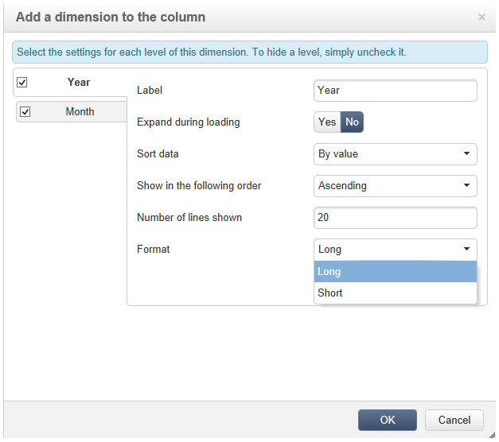

# Kubussen gebruiken om gegevens te verkennen{#using-cubes-to-explore-data}

Met Marketing Analytics kunt u gemakkelijker rapporten maken en gegevens in de database identificeren en selecteren via kubussen. Hierdoor kunt u:

* Maak rapporten op basis van kubussen. Het proces wordt hier nader beschreven: Het [onderzoeken van de gegevens in een rapport](#exploring-the-data-in-a-report).
* Verzamel de gegevens in het gegevensbestand en groepeer het in lijsten, bijvoorbeeld om doelstellingen en leveringen te identificeren en te bouwen. Zie [Een doelpopulatie](#building-a-target-population)opbouwen voor meer informatie hierover.
* Voeg een draaitabel in een rapport in en verwijs naar een bestaande kubus in het rapport. Voor meer op dit, verwijs naar het [Invoegen van een spillijst in een rapport](#inserting-a-pivot-table-into-a-report).

>[!NOTE]
>
>Marketing Analytics is nodig om kubussen te maken of te wijzigen. Raadpleeg [Over kubussen](../../reporting/using/about-cubes.md)voor meer informatie.

## De gegevens in een rapport verkennen {#exploring-the-data-in-a-report}

### Stap 1 - het Creëren van een rapport dat op een kubus wordt gebaseerd {#step-1---creating-a-report-based-on-a-cube}

Als u een rapport wilt maken op basis van een kubus, klikt u op de **[!UICONTROL Create]** knop in het **[!UICONTROL Reports]** universum en selecteert u de kubus die u wilt gebruiken.

Het proces wordt hier nader beschreven: Een rapport [maken op basis van een kubus](../../reporting/using/creating-indicators.md#creating-a-report-based-on-a-cube).

### Stap 2 - Lijnen en kolommen selecteren {#step-2---selecting-lines-and-columns}

In de standaardweergave worden de eerste twee afmetingen van de kubus (in dit geval leeftijd en stad) weergegeven.

Met de **[!UICONTROL Add]** knoppen op elke as kunt u dimensies toevoegen.

1. Selecteer de afmetingen die u wilt weergeven in de lijnen en kolommen van de tabel. U doet dit door de beschikbare afmetingen te slepen en neer te zetten, zoals hieronder wordt weergegeven:
1. Selecteer in de lijst de afmetingen die u aan de tabel wilt toevoegen:

   

1. Selecteer vervolgens de parameters van deze dimensie.

   

   De parameters zijn afhankelijk van het gegevenstype van de geselecteerde dimensie.

   Voor datums kunnen bijvoorbeeld verschillende niveaus beschikbaar zijn. Raadpleeg [Weergavemaatregelen](../../reporting/using/concepts-and-methodology.md#displaying-measures)voor meer informatie hierover.

   In dit geval worden de volgende opties aangeboden:

   

   U kunt:

   * Gegevens uitbreiden tijdens laden: de waarden zullen door gebrek worden getoond telkens als het rapport wordt bijgewerkt (standaardwaarde: neen).
   * Het totaal aan het einde van de regel weergeven: wanneer de gegevens in kolommen worden weergegeven, kunt u het totaal aan het einde van de regel weergeven met een extra optie: er wordt een kolom aan de tabel toegevoegd (standaardwaarde): ja).
   * Een sortering toepassen: de waarden van de kolom kunnen worden gesorteerd op waarde, label of op basis van een maat (standaardwaarde: op waarde).
   * Geef de waarden weer in oplopende (a-z, 0-9) of aflopende (z-a, 9-0) volgorde.
   * Het aantal kolommen wijzigen dat bij het laden moet worden weergegeven (standaard: 200).

1. Klik **[!UICONTROL Ok]** om te bevestigen: de dimensie wordt toegevoegd aan de bestaande afmetingen.

   De gele banner boven de tabel geeft aan dat u wijzigingen hebt aangebracht: Klik op de **[!UICONTROL Save]** knop om de bestanden op te slaan.

   

### Stap 3 - Het vormen van de maatregelen om te tonen {#step-3---configuring-the-measures-to-display}

Wanneer de lijnen en kolommen op hun plaats zijn, wijs op de maatregelen u evenals hun vertoningswijze wilt tonen.

Standaard wordt slechts één maat weergegeven. Om maatregelen toe te voegen of te vormen:

1. Klik op de **[!UICONTROL Measures]** knop.

   

1. Met de **[!UICONTROL Use a measure]** knop kunt u een van de bestaande maatregelen selecteren.

   

   Selecteer de informatie die u wilt weergeven en het type opmaak. De lijst met opties is afhankelijk van het type maatregel dat is geconfigureerd.

   

   De algemene maatconfiguratie is ook beschikbaar via het **[!UICONTROL Edit the configuration of the pivot table]** pictogram in de koptekst.

   

   Vervolgens kunt u kiezen of u maatlabels wilt weergeven of niet. Voor meer op dit, verwijs naar het [Vormen van de vertoning](../../reporting/using/concepts-and-methodology.md#configuring-the-display).

1. Het is mogelijk om nieuwe maatregelen te bouwen gebruikend bestaande. Om dit te doen, klik **[!UICONTROL Create a measure]** en vorm het.

   

   De volgende soorten maatregelen zijn beschikbaar:

   * Combinatie van maatregelen: met dit type maatregel kunt u de nieuwe maatregel bouwen met behulp van bestaande maatregelen :

      De beschikbare operatoren zijn: som, verschil, vermenigvuldiging en frequentie.

   * Verhouding: met dit type maatregel kunt u het aantal records berekenen dat voor een bepaalde dimensie wordt gemeten. U kunt de evenredigheid berekenen op basis van een dimensie of subdimensie.
   * Variatie: met deze maatregel kunt u de variatie in waarden van een niveau berekenen.
   * Standaardafwijking: met dit type meting kunt u afwijkingen binnen elke groep cellen berekenen in vergelijking met het gemiddelde van de waarden . U kunt bijvoorbeeld het aankoopvolume voor alle bestaande segmenten vergelijken.
   De gecreëerde maatregel wordt toegevoegd aan het rapport.

   

   Nadat u een maatregel hebt gemaakt, kunt u deze bewerken en zo nodig de configuratie ervan wijzigen. Klik hiertoe op de **[!UICONTROL Measures]** knop en ga naar het tabblad van de maatregel die u wilt bewerken.

   Klik vervolgens **[!UICONTROL Edit the dynamic measure]** om het instellingenmenu te openen.

## Bouwen aan een doelpopulatie {#building-a-target-population}

De rapporten bouwen gebruikend kubussen laten u toe om gegevens van de lijst te verzamelen en het te bewaren in een lijst.

U doet dit door ze aan een winkelwagentje toe te voegen en de inhoud ervan te verwerken.

Als u een populatie in een lijst wilt groeperen, voert u de volgende stappen uit:

1. Klik op de cellen die de te verzamelen populatie bevatten om deze te selecteren en klik vervolgens op het **[!UICONTROL Add to cart]** pictogram.

   

   Om dit zo vaak nodig te doen om diverse profielen te verzamelen

1. Klik op de **[!UICONTROL Show cart]** knop om de inhoud weer te geven voordat u het exporteren uitvoert.

   

1. Met de **[!UICONTROL Export]** knop kunt u de items in het winkelwagentje groeperen in een lijst.

   U moet de naam van de lijst opgeven en het type export dat u wilt uitvoeren.

   

   Klik **[!UICONTROL Start]** om het exporteren uit te voeren.

1. Zodra de uitvoer volledig is, bevestigt een bericht zijn uitvoering en het aantal verslagen die zijn verwerkt.

   

   U kunt de inhoud van het winkelwagentje opslaan of leeg maken.

   De relevante lijst is toegankelijk via het **[!UICONTROL Profiles and targets]** universum.

   

## Een draaitabel invoegen in een rapport {#inserting-a-pivot-table-into-a-report}

Voer de volgende stappen uit om een tabel te maken en de gegevens in een kubus te verkennen:

1. Maak een nieuw rapport met één pagina en voeg er een draaitabel in. Raadpleeg [deze pagina](../../reporting/using/creating-a-table.md#creating-a-breakdown-or-pivot-table)voor meer informatie.

   

1. Selecteer op het **[!UICONTROL Data]** tabblad van de pagina een kubus om de afmetingen in de kubus te verwerken en berekende metingen weer te geven.

   

   Dit laat u het rapport bouwen dat moet worden getoond. Raadpleeg voor meer informatie [Stap 2 - Lijnen en kolommen](#step-2---selecting-lines-and-columns)selecteren.

