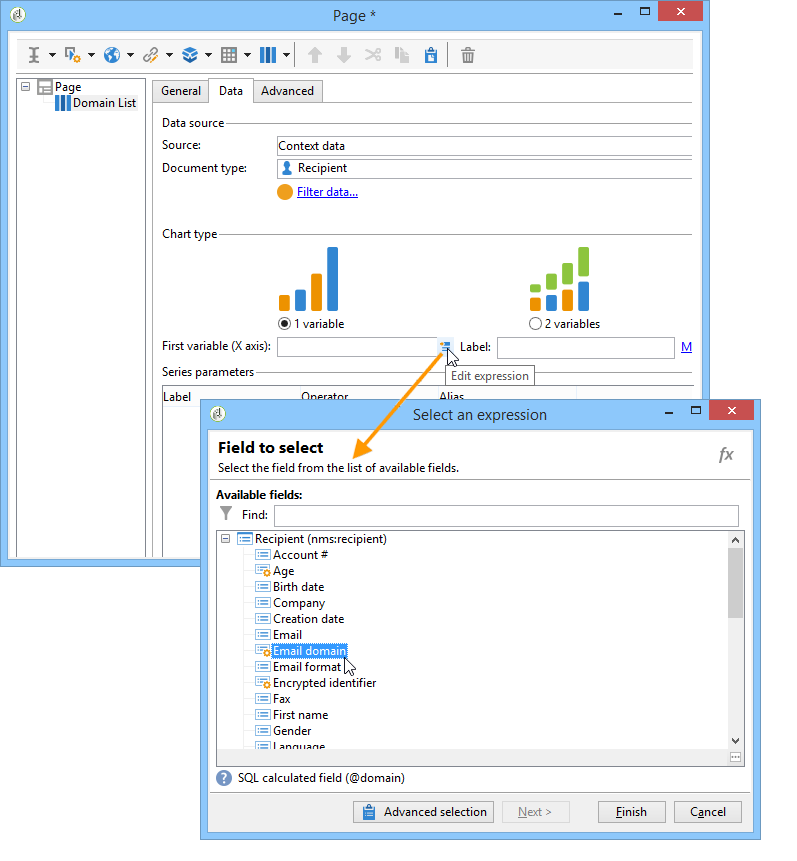

# De context gebruiken{#using-the-context}

Wanneer u gegevens wilt vertegenwoordigen in de vorm van **[!UICONTROL tables]** of **[!UICONTROL charts]**, kan het uit twee bronnen worden genomen: een nieuwe vraag (verwijs naar het [bepalen van een directe filter op gegevens](#defining-a-direct-filter-on-data)) of de rapportcontext (verwijs naar het [Gebruiken van contextgegevens](#using-context-data)).

## Een rechtstreeks filter op gegevens definiëren {#defining-a-direct-filter-on-data}

### Gegevens filteren {#filtering-data}

Het gebruiken van een **[!UICONTROL Query]** typeactiviteit is niet verplicht wanneer het bouwen van een rapport. De gegevens kunnen direct in de lijsten en grafieken worden gefiltreerd die omhoog het rapport maken.

Dit laat u toe om de gegevens aan vertoning in het rapport direct via de **[!UICONTROL Page]** activiteit van het rapport te selecteren.

Klik hiertoe op de **[!UICONTROL Filter data...]** koppeling op het **[!UICONTROL Data]** tabblad: met deze koppeling hebt u toegang tot de expressies-editor om een query te definiëren voor de gegevens die moeten worden geanalyseerd.

### Voorbeeld: gebruik een filter in een grafiek {#example--use-a-filter-in-a-chart}

In het volgende voorbeeld willen we dat in het diagram alleen de ontvangende profielen worden weergegeven die in Frankrijk wonen en die in het jaar een aankoop hebben gedaan.

Als u dit filter wilt definiëren, plaatst u een pagina in het diagram en bewerkt u deze. Klik op de **[!UICONTROL Filter data]** koppeling en maak het filter dat overeenkomt met de gegevens die u wilt weergeven. Raadpleeg [deze sectie](../../platform/using/about-queries-in-campaign.md)voor meer informatie over het maken van query&#39;s in Adobe Campaign.

Hier, willen wij de verdeling door stad van geselecteerde ontvangers tonen.

De rendering ziet er als volgt uit:

### Voorbeeld: een filter in een draaientabel gebruiken {#example--use-a-filter-in-a-pivot-table}

In dit voorbeeld kunt u met het filter alleen niet-Parisiaanse klanten in de draaitabel weergeven, zonder dat u daarvoor een andere query hoeft te gebruiken.

Voer de volgende stappen uit:

1. Plaats een pagina in het diagram en bewerk deze.
1. Maak een draaitabel.
1. Ga naar het **[!UICONTROL Data]** tabblad en selecteer de kubus die u wilt gebruiken.
1. Klik op de **[!UICONTROL Filter data...]** koppeling en definieer de volgende query om Adobe uit de lijst met bedrijven te verwijderen.

   

Slechts zullen de ontvangers die de het filtreren criteria voldoen in het rapport verschijnen.

## Contextgegevens gebruiken {#using-context-data}

Om gegevens in de vorm van een **[!UICONTROL table]** of een **[!UICONTROL chart]** te vertegenwoordigen, kunnen de gegevens uit de rapportcontext komen.

Op de pagina die de tabel of het diagram bevat, kunt u met het **[!UICONTROL Data]** tabblad de gegevensbron selecteren.

* Met de **[!UICONTROL New query]** optie kunt u een query voor het verzamelen van gegevens maken. Raadpleeg voor meer informatie [Een rechtstreeks filter op gegevens](#defining-a-direct-filter-on-data)definiëren.
* Met de **[!UICONTROL Context data]** optie kunt u de invoergegevens gebruiken: de context van het rapport valt samen met de informatie in de binnenkomende overgang van de pagina die de grafiek of de tabel bevat. Deze context kan bijvoorbeeld gegevens bevatten die zijn verzameld via een **[!UICONTROL Query]** activiteit die vóór de **[!UICONTROL Page]** activiteit is geplaatst en waarvoor u de tabel en de velden waarop het rapport betrekking heeft, moet opgeven.

Bijvoorbeeld, in een vraagvakje, bouw de volgende vraag voor de ontvangers:

Geef vervolgens de bron van de gegevens in uw rapport op, in dit geval: **[!UICONTROL Data from the context]**.

De gegevenslocatie wordt automatisch afgeleid. Indien nodig kunt u het gegevenspad forceren.

Wanneer u de gegevens selecteert waarop de statistieken betrekking hebben, komen de beschikbare velden overeen met de gegevens die in de query zijn opgegeven.

