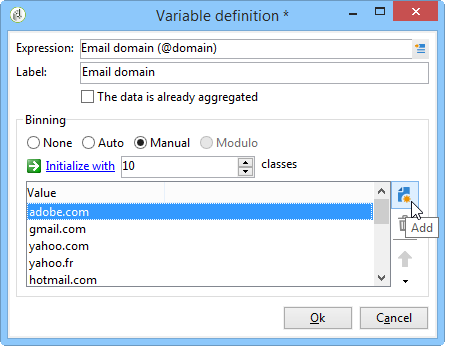
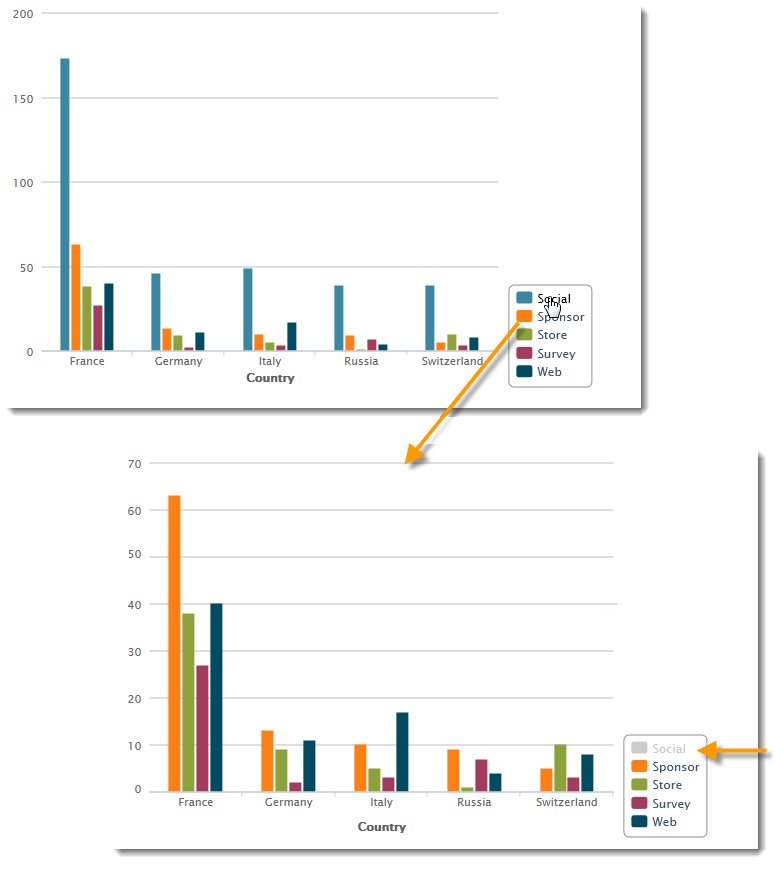

# De wizard voor beschrijvende analyse gebruiken{#using-the-descriptive-analysis-wizard}

Als u een beschrijvend analyserapport wilt maken, gebruikt u de toegewezen wizard. De configuratie is afhankelijk van de te analyseren gegevens en van de gewenste rendering.

## Gegevens in de database {#analyzing-data-in-the-database} analyseren

De beschrijvende analysewizard kan worden gestart via het menu **[!UICONTROL Tools > Descriptive analysis]**: in dit geval heeft de analyse standaard betrekking op ontvangers (**nms:ontvanger**). Het is van toepassing op alle gegevens in de Adobe Campaign-database.

Als u een andere tabel dan de standaardontvangers wilt analyseren (**nms:ontvanger**), klikt u op de koppeling **[!UICONTROL Advanced settings...]** in de laatste fase van de wizard en selecteert u de tabel die overeenkomt met uw instellingen, in dit geval **cus:individual**:

Als u statistieken over een deel van de gegevens wilt produceren, kunt u een filter bepalen: Klik hiertoe op de koppeling **[!UICONTROL Advanced settings...]** en definieer het filter dat u wilt toepassen, zoals hieronder wordt weergegeven:

De analyse zal alleen betrekking hebben op ontvangers van databanken van 16 jaar en ouder die in Londen wonen.

## Een gegevensset {#analyzing-a-set-of-data} analyseren

U kunt de beschrijvende analysewizard gebruiken via een andere context: een lijst, een workflowovergang, een of meer leveringen, een selectie van ontvangers, enz.

Het is toegankelijk via verscheidene knopen van de boom van Adobe Campaign die aan de ontvankelijke lijst richten.

Open de beschrijvende analysewizard door items te selecteren en met de rechtermuisknop te klikken. Alleen de geselecteerde gegevens worden geanalyseerd.

* Voor een reeks **ontvangers**, selecteer de ontvangers die moeten worden geanalyseerd, dan klik met de rechtermuisknop en selecteer **[!UICONTROL Actions > Explore...]**, zoals hierboven getoond. Als een filter wordt toegepast op de lijst met ontvangers, wordt alleen de inhoud geanalyseerd.

   Als u alle ontvangers in de map of het huidige filter wilt selecteren, gebruikt u de sneltoets CTRL+A. Dit betekent dat zelfs ontvangers die niet worden weergegeven, worden geselecteerd.

   Een voorbeeld van de beschrijvende analyse van ontvangers vindt u in: [Kwalitatieve gegevensanalyse](../../reporting/using/use-cases.md#qualitative-data-analysis).

* Plaats de cursor in de context van een **workflow** op een overgang die naar de tabel met ontvangers wijst, klik met de rechtermuisknop en selecteer **[!UICONTROL Analyze target]**. Raadpleeg voor meer informatie het voorbeeld in [Een overgangsdoel analyseren in een workflow](../../reporting/using/use-cases.md#analyzing-a-transition-target-in-a-workflow).
* Voor **lists**, selecteer één of meerdere lijsten en pas het zelfde proces toe zoals voor ontvangers.
* Selecteer in de context van een **levering** de leveringen waarvan u het doel wilt analyseren, klik met de rechtermuisknop en selecteer **[!UICONTROL Actions > Explore the target]**, zoals hieronder wordt getoond:

   

   Hier worden voorbeelden gegeven van beschrijvende analyses voor leveringen: [Een populatie analyseren](../../reporting/using/use-cases.md#analyzing-a-population) en hier: [Logbestanden voor het bijhouden van ontvangers analyseren](../../reporting/using/use-cases.md#analyzing-recipient-tracking-logs).

## Het vormen van het kwalitatieve verdelingsmalplaatje {#configuring-the-qualitative-distribution-template}

Met de sjabloon **[!UICONTROL Qualitative distribution]** kunt u statistieken maken over alle typen gegevens (bijvoorbeeld bedrijfsnaam, e-maildomein).

De opties van de configuratie beschikbaar voor een rapport dat via het **[!UICONTROL Qualitative distribution]** malplaatje wordt gecreeerd zijn gedetailleerd in [Het tonen van gegevens in de lijst](#displaying-data-in-the-table). Een volledig voorbeeld wordt gedetailleerd in [Analyseert een populatie](../../reporting/using/use-cases.md#analyzing-a-population).

Wanneer u de beschrijvende analysewizard gebruikt om uw gegevens te analyseren, zijn de beschikbare opties afhankelijk van de gekozen instellingen. Deze worden hieronder beschreven.

### Gegevensbinding {#data-binning}

Wanneer u de variabelen selecteert die u wilt weergeven, kunt u gegevensbinding definiëren, met andere woorden groepscriteria voor de geselecteerde gegevens configureren.

>[!NOTE]
>
>Wanneer het veld waarop de berekening betrekking heeft, wordt berekend met een aggregaat, controleert u **[!UICONTROL The data is already aggregated]** om de prestaties te verbeteren.

De opties zijn afhankelijk van de inhoud van het veld:

* **[!UICONTROL None]** : Met deze optie kunt u alle waarden weergeven die beschikbaar zijn voor de variabele, zonder dat u een binding hoeft te maken.

   >[!CAUTION]
   >
   >Deze optie dient met voorzichtigheid te worden gebruikt: het kan een grote invloed hebben op het rapport en op de prestaties van de machine .

* **[!UICONTROL Auto]** : met deze optie kunt u de meest gebruikte waarden weergeven. Ze worden automatisch berekend en elk vertegenwoordigen een percentage van de variabelen in verhouding tot het aantal vakken. Voor numerieke waarden genereert Adobe Campaign automatisch een klasse waarin de gegevens worden gesorteerd.
* **[!UICONTROL Manual]** : deze optie werkt net als de  **[!UICONTROL Auto]** optie, maar u kunt deze waarden handmatig instellen. Klik hiertoe op de knop **[!UICONTROL Add]** rechts van de waardetabel.

   Waarden kunnen automatisch door Adobe Campaign worden geïnitialiseerd voordat ze worden aangepast: om dit te doen, ga het aantal banden in u wilt produceren en de **[!UICONTROL Initialize with]** verbinding, zoals hieronder getoond klikken:

   

   Pas vervolgens de inhoud aan uw wensen aan:

   

   Afhankelijk van het gewenste precisieniveau kunnen velden met datums worden gegroepeerd op tijd, dag, maand, jaar, enzovoort.

   

* **[!UICONTROL Modulo]** : Hiermee kunt u groepen waarden maken in het geval van numerieke waarden. Met een modulo met een waarde van 10 kunt u bijvoorbeeld een interval maken van waarden die tien voor tien veranderen.

   

   In dit voorbeeld kunt u de uitsplitsing van ontvangers per leeftijdsgroep bekijken.

   

### Gegevens in de tabel {#displaying-data-in-the-table} weergeven

Gebruik de werkbalk om de weergave van variabelen in de tabel aan te passen: Verwijder een kolom, geef gegevens in lijnen eerder dan kolommen weer, verplaats een kolom naar links of rechts, bekijk of wijzig de waardeberekening.

In het bovenste gedeelte van het venster kunt u de weergave-instellingen selecteren.

U kunt de naam van de statistieken en de subtotalen weergeven of verbergen en de richting van de statistieken kiezen. Voor meer op dit, verwijs naar [de montages van de het rapportvertoning van de Analyse](../../reporting/using/processing-a-report.md#analysis-report-display-settings).

### Gegevens weergeven in het diagram {#displaying-data-in-the-chart}

In de eerste stap van de beschrijvende analysewizard kunt u ervoor kiezen de gegevens alleen in diagramvorm weer te geven, zonder een tabel. In dit geval moet variabele selectie plaatsvinden tijdens het configureren van de afbeelding. U moet eerst het aantal variabelen selecteren dat u wilt weergeven en de velden in de desbetreffende database selecteren.

Selecteer vervolgens het gewenste diagramtype.

>[!NOTE]
>
>U kunt de variabelen in een grafiek en een lijst tezelfdertijd tonen. Om dit te doen, ga de variabelen in het **[!UICONTROL Table configuration]** venster in. Klik **[!UICONTROL Next]** en selecteer het type van grafiek in het venster van de grafiekconfiguratie. Als de subafmetingen in de lijst worden bepaald, worden zij niet getoond in de grafiek.

Klik op de koppeling **[!UICONTROL Variants]** om de diagrameigenschappen te wijzigen.

Welke opties worden aangeboden, is afhankelijk van het geselecteerde diagramtype. Raadpleeg [deze sectie](../../reporting/using/creating-a-chart.md#chart-types-and-variants) voor meer informatie.

### Berekening van statistieken {#statistics-calculation}

De beschrijvende analysetovenaar laat u verscheidene types van statistieken over de gegevens berekenen. Door gebrek, slechts wordt één eenvoudige telling gevormd.

Klik op **[!UICONTROL Add]** om een nieuwe statistiek te maken.

De volgende bewerkingen zijn mogelijk:

* **[!UICONTROL Count]** alle niet-null-waarden van het veld te tellen, met inbegrip van dubbele waarden (van het geaggregeerde veld);
* **[!UICONTROL Average]** het gemiddelde van de waarden in een numeriek veld te berekenen;
* **[!UICONTROL Minimum]** het minimum van de waarden in een numeriek veld te berekenen;
* **[!UICONTROL Maximum]** het maximum van de waarden in een numeriek veld te berekenen;
* **[!UICONTROL Sum]** de som van de waarden in een numeriek veld te berekenen;
* **[!UICONTROL Standard deviation]** om te berekenen hoe de geretourneerde waarden rond het gemiddelde zijn verspreid;
* **[!UICONTROL Row percentage distribution]** de verhouding tussen de waarde in een kolom en de waarde in een rij berekenen (alleen beschikbaar voor tabellen);
* **[!UICONTROL Column percentage distribution]** de verhouding tussen de waarde in een rij en de waarde in een kolom berekenen (alleen beschikbaar voor tabellen);
* **[!UICONTROL Total percentage distribution]** de verdeling van de begunstigden waarop de waarden betrekking hebben, te berekenen;

   

* **[!UICONTROL Calculated field]** om een gepersonaliseerde exploitant (beschikbaar voor lijsten slechts) tot stand te brengen. In het veld **[!UICONTROL User function]** kunt u de berekening invoeren die op de gegevens moet worden toegepast.

   Voorbeeld: Berekening van het gemiddelde aankoopbedrag per klant op basis van land en herkomst

   

   Als u de bovenstaande gegevens in een tabel wilt weergeven, moet u een berekend veld maken voor het opslaan van het gemiddelde aankoopbedrag per klant.

   Dit doet u als volgt:

   1. Bereken het aankooptotaal.

      

   1. Deze statistiek wordt niet weergegeven in de tabel. U moet **[!UICONTROL Display in the table]** optie van **[!UICONTROL Advanced]** tabel uncheck.

      

   1. Maak een nieuwe **[!UICONTROL Calculated field]**-typestatistiek en voer in het veld **[!UICONTROL User function]** de volgende formule in: **@aankopen/@count**.

      

### Het rapport {#displaying-the-report} weergeven

De laatste stap van de tovenaar laat u het rapport, d.w.z. de lijst of de grafiek tonen aangezien zij zijn gevormd.

Als het rapport een tabel bevat, wordt de cel met het rekenresultaat gekleurd. Hoe hoger het resultaat, hoe sterker de kleur.

Het is mogelijk om de indeling van de resultaten te wijzigen. Klik hiertoe met de rechtermuisknop op de betreffende variabele en selecteer de invoer in het snelmenu.

Wanneer het rapport een grafiek omvat, laten de etiketten van de legenda u de getoonde informatie filtreren: Klik op een label om de weergave in het diagram in of uit te schakelen.

## De kwantitatieve distributiesjabloon {#configuring-the-quantitative-distribution-template} configureren

Om een beschrijvende analyse te produceren zelf, selecteer **Nieuwe beschrijvende analyse van een malplaatje** optie als het niet door gebrek wordt geplaatst.

De sjabloon **[!UICONTROL Quantitative distribution]** waarmee u statistieken kunt genereren over gegevens die kunnen worden gemeten of geteld (bijvoorbeeld factuurbedrag, leeftijd van ontvangers).

De configuratiewijze van een analyserapport dat via het **[!UICONTROL Quantitative distribution]** malplaatje wordt gecreeerd is gedetailleerd in een implementatievoorbeeld [Kwantitatieve gegevensanalyse](../../reporting/using/use-cases.md#quantitative-data-analysis).

De opties die beschikbaar zijn wanneer u de wizard voor beschrijvende analyse gebruikt om een kwantitatief rapport te maken, worden hieronder beschreven.

Selecteer eerst de variabele waarop de berekeningen betrekking hebben:

Adobe Campaign biedt standaard een reeks statistieken die voor de geselecteerde gegevens moeten worden berekend. U kunt deze lijst wijzigen, er statistieken aan toevoegen of verwijderen, afhankelijk van uw behoeften.

De volgende bewerkingen zijn mogelijk:

* **[!UICONTROL Count]** alle niet-null-waarden van het veld te tellen, met inbegrip van dubbele waarden (van het geaggregeerde veld);
* **[!UICONTROL Average]** het gemiddelde van de waarden in een numeriek veld te berekenen;
* **[!UICONTROL Minimum]** het minimum van de waarden in een numeriek veld te berekenen;
* **[!UICONTROL Maximum]** om het maximum van de waarden in een numeriek veld te berekenen.
* **[!UICONTROL Sum]** de som van de waarden in een numeriek veld te berekenen;
* **[!UICONTROL Standard deviation]** om te berekenen hoe de teruggekeerde waarden rond het gemiddelde worden verdeeld.
* **[!UICONTROL Number of missing values]** om het aantal numerieke velden zonder gedefinieerde waarden te berekenen.
* **[!UICONTROL Decile distribution]** om de geretourneerde waarden zo te verdelen dat elke waarde een tiende van de waarden in een numeriek veld vertegenwoordigt.
* **[!UICONTROL Custom distribution]** om de teruggekeerde waarden te verdelen die op user-defined drempels worden gebaseerd.

   Met de knop **[!UICONTROL Detail...]** kunt u een statistiek bewerken en, indien nodig, de berekening of weergave aanpassen:

   

   De laatste stap van de tovenaar toont het kwantitatieve analyserapport.

   

   Om veranderingen in het rapport aan te brengen, verwijs naar [Verwerking een rapport](../../reporting/using/processing-a-report.md).

