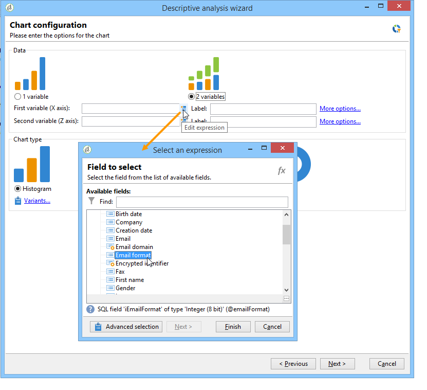
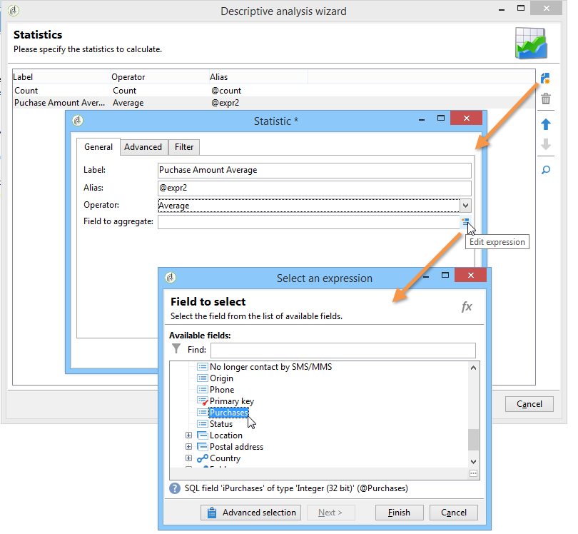

# De beschrijvende analyseassistent gebruiken{#using-the-descriptive-analysis-wizard}

Om een beschrijvend analyserapport tot stand te brengen, gebruik de specifieke medewerker. De configuratie is afhankelijk van de te analyseren gegevens en van de gewenste rendering.

## Gegevens in de database analyseren {#analyzing-data-in-the-database}

De beschrijvende analysemedewerker kan via het **[!UICONTROL Tools > Descriptive analysis]** menu worden gelanceerd: in dit geval, heeft de analyse ontvangers door gebrek (**nms:ontvanger**). Het is van toepassing op alle gegevens in de Adobe Campaign-database.

Om een lijst buiten de standaardontvangers te analyseren één (**nms:ontvanger**), klik de **[!UICONTROL Advanced settings...]** verbinding in het laatste stadium van de medewerker en selecteer de lijst die uw montages aanpast, in dit geval **focus:individu**:

Als u statistieken wilt produceren over een deel van de gegevens, kunt u een filter definiëren: hiervoor klikt u op de koppeling **[!UICONTROL Advanced settings...]** en definieert u het filter dat u wilt toepassen, zoals hieronder wordt weergegeven:

De analyse zal alleen betrekking hebben op ontvangers van databanken van 16 jaar en ouder die in Londen wonen.

## Een set gegevens analyseren {#analyzing-a-set-of-data}

U kunt de beschrijvende analyseassistent gebruiken via een andere context: een lijst, een workflowovergang, een of meer leveringen, een selectie van ontvangers, enz.

Het is toegankelijk via verscheidene knopen van de boom van Adobe Campaign die aan de ontvankelijke lijst richten.

Open de beschrijvende analyseassistent door items te selecteren en met de rechtermuisknop te klikken. Alleen de geselecteerde gegevens worden geanalyseerd.

* Voor een reeks van **ontvangers**, selecteer de te analyseren ontvangers, dan met de rechtermuisknop aan te klikken en te selecteren **[!UICONTROL Actions > Explore...]**, zoals hierboven getoond. Als een filter wordt toegepast op de lijst met ontvangers, wordt alleen de inhoud geanalyseerd.

  Als u alle ontvangers in de map of het huidige filter wilt selecteren, gebruikt u de sneltoets CTRL+A. Dit betekent dat zelfs ontvangers die niet worden weergegeven, worden geselecteerd.

  Voor een voorbeeld van de beschrijvende analyse van ontvangers, verwijs naar: [ de Kwalitatieve gegevensanalyse ](../../reporting/using/use-cases.md#qualitative-data-analysis).

* In de context van a **werkschema**, plaats de curseur op een overgang die naar de lijst van ontvangers richt, klik met de rechtermuisknop aan en selecteer **[!UICONTROL Analyze target]**. Voor meer op dit, verwijs naar het voorbeeld in [ een overgangsdoel in een werkschema ](../../reporting/using/use-cases.md#analyzing-a-transition-target-in-a-workflow) analyseren.
* Voor **lijsten**, selecteer één of meerdere lijsten en pas het zelfde proces zoals voor ontvangers toe.
* In de context van a **levering**, selecteer de leveringen het waarvan doel u wilt analyseren, met de rechtermuisknop aanklikken en selecteren **[!UICONTROL Actions > Explore the target]**, zoals hieronder getoond:

  

  De voorbeelden van beschrijvende analyses voor leveringen worden hier verstrekt: [ analyseren een bevolking ](../../reporting/using/use-cases.md#analyzing-a-population) en hier: [ analyseren ontvankelijke volgende logboeken ](../../reporting/using/use-cases.md#analyzing-recipient-tracking-logs).

## De sjabloon voor kwalitatieve distributie configureren {#configuring-the-qualitative-distribution-template}

Met de sjabloon **[!UICONTROL Qualitative distribution]** kunt u statistieken maken over alle typen gegevens (bijvoorbeeld de bedrijfsnaam, het e-maildomein).

De opties van de configuratie beschikbaar voor een rapport dat via het **[!UICONTROL Qualitative distribution]** malplaatje wordt gecreeerd zijn gedetailleerd in [ gegevens van de Vertoning in de lijst ](#displaying-data-in-the-table). Een volledig voorbeeld wordt gedetailleerd in [ analyseert een bevolking ](../../reporting/using/use-cases.md#analyzing-a-population).

Wanneer u de beschrijvende analyseassistent gebruikt om uw gegevens te analyseren, zijn de beschikbare opties afhankelijk van de gekozen instellingen. Deze worden hieronder beschreven.

### Gegevensbinding {#data-binning}

Wanneer u de variabelen selecteert die u wilt weergeven, kunt u gegevensbinding definiëren, met andere woorden groepscriteria voor de geselecteerde gegevens configureren.

>[!NOTE]
>
>Wanneer het veld waarop de berekening betrekking heeft, wordt berekend met een aggregaat, controleert u **[!UICONTROL The data is already aggregated]** om de prestaties te verbeteren.

De opties zijn afhankelijk van de inhoud van het veld:

* **[!UICONTROL None]** : met deze optie kunt u alle waarden weergeven die beschikbaar zijn voor de variabele, zonder dat u een binding hoeft te maken.

  >[!CAUTION]
  >
  >Deze optie moet met de nodige voorzichtigheid worden gebruikt: zij kan een grote invloed hebben op het rapport en op de prestaties van de machine.

* **[!UICONTROL Auto]** : met deze optie kunt u de meest gebruikte waarden weergeven. Ze worden automatisch berekend en elk vertegenwoordigen een percentage van de variabelen in verhouding tot het aantal vakken. Voor numerieke waarden genereert Adobe Campaign automatisch een klasse waarin de gegevens worden gesorteerd.
* **[!UICONTROL Manual]** : deze optie werkt zoals de optie **[!UICONTROL Auto]** , maar u kunt deze waarden handmatig instellen. Klik hiertoe op de knop **[!UICONTROL Add]** rechts van de waardetabel.

  Waarden kunnen automatisch door Adobe Campaign worden geïnitialiseerd voordat ze worden aangepast: voer hiervoor het aantal vakken in dat u wilt genereren en klik op de koppeling **[!UICONTROL Initialize with]** , zoals hieronder wordt weergegeven:

  

  Pas vervolgens de inhoud aan uw wensen aan:

  

  Afhankelijk van het gewenste precisieniveau kunnen velden met datums worden gegroepeerd op tijd, dag, maand, jaar, enzovoort.

  

* **[!UICONTROL Modulo]** : hiermee kunt u groepen waarden maken in het geval van numerieke waarden. Met een modulo met een waarde van 10 kunt u bijvoorbeeld een interval maken van waarden die tien voor tien veranderen.

  

  In dit voorbeeld kunt u de uitsplitsing van ontvangers per leeftijdsgroep bekijken.

  

### Gegevens in de tabel weergeven {#displaying-data-in-the-table}

Gebruik de werkbalk om de weergave van variabelen in de tabel aan te passen: verwijder een kolom, geef gegevens weer in regels in plaats van kolommen, verplaats een kolom naar links of rechts, bekijk of wijzig de waardeberekening.

In het bovenste gedeelte van het venster kunt u de weergave-instellingen selecteren.

U kunt de naam van de statistieken en de subtotalen weergeven of verbergen en de richting van de statistieken kiezen. Voor meer op dit, verwijs naar [ montages van de het rapportvertoning van de Analyse ](../../reporting/using/processing-a-report.md#analysis-report-display-settings).

### Gegevens weergeven in het diagram {#displaying-data-in-the-chart}

In de eerste stap van de beschrijvende-analyseassistent kunt u ervoor kiezen de gegevens alleen in diagramvorm weer te geven, zonder een tabel. In dit geval moet variabele selectie plaatsvinden tijdens het configureren van de afbeelding. U moet eerst het aantal variabelen selecteren dat u wilt weergeven en de velden in de desbetreffende database selecteren.

Selecteer vervolgens het gewenste diagramtype.

>[!NOTE]
>
>U kunt de variabelen in een grafiek en een lijst tezelfdertijd tonen. Voer hiertoe de variabelen in het **[!UICONTROL Table configuration]** -venster in. Klik **[!UICONTROL Next]** en selecteer het type van grafiek in het venster van de grafiekconfiguratie. Als de subafmetingen in de lijst worden bepaald, worden zij niet getoond in de grafiek.

Klik op de koppeling **[!UICONTROL Variants]** om de eigenschappen van het diagram te wijzigen.

Welke opties worden aangeboden, is afhankelijk van het geselecteerde diagramtype. Raadpleeg [deze sectie](../../reporting/using/creating-a-chart.md#chart-types-and-variants) voor meer informatie.

### Berekening van statistieken {#statistics-calculation}

Met de beschrijvende analyseassistent kunt u verschillende typen statistieken over de gegevens berekenen. Door gebrek, slechts wordt één eenvoudige telling gevormd.

Klik op **[!UICONTROL Add]** om een nieuwe statistiek te maken.

De volgende bewerkingen zijn mogelijk:

* **[!UICONTROL Count]** alle waarden te tellen die niet gelijk zijn aan null van het veld dat moet worden samengevoegd, inclusief dubbele waarden (van het geaggregeerde veld);
* **[!UICONTROL Average]** om het gemiddelde van de waarden in een numeriek veld te berekenen,
* **[!UICONTROL Minimum]** om de minimale waarden in een numeriek veld te berekenen,
* **[!UICONTROL Maximum]** om het maximum van de waarden in een numeriek veld te berekenen,
* **[!UICONTROL Sum]** om de som van de waarden in een numeriek veld te berekenen,
* **[!UICONTROL Standard deviation]** om te berekenen hoe de geretourneerde waarden worden verspreid rond het gemiddelde,
* **[!UICONTROL Row percentage distribution]** om de verhouding van de waarde in een kolom en de waarde in een rij te berekenen (alleen beschikbaar voor tabellen),
* **[!UICONTROL Column percentage distribution]** om de verhouding tussen de waarde in een rij en de waarde in een kolom te berekenen (alleen beschikbaar voor tabellen),
* **[!UICONTROL Total percentage distribution]** om de verdeling van de ontvangers waarop de waarden betrekking hebben, te berekenen;

  

* **[!UICONTROL Calculated field]** om een gepersonaliseerde operator te maken (alleen beschikbaar voor tabellen). In het veld **[!UICONTROL User function]** kunt u de berekening invoeren die op de gegevens moet worden toegepast.

  Voorbeeld: het gemiddelde aankoopbedrag per klant berekenen op basis van land en herkomst

  

  Als u de bovenstaande gegevens in een tabel wilt weergeven, moet u een berekend veld maken voor het opslaan van het gemiddelde aankoopbedrag per klant.

  Dit doet u als volgt:

   1. Bereken het aankooptotaal.

      

   1. Deze statistiek wordt niet weergegeven in de tabel. U moet de optie **[!UICONTROL Display in the table]** van het tabblad **[!UICONTROL Advanced]** uitschakelen.

      

   1. Maak een nieuwe tekststatistiek van het type **[!UICONTROL Calculated field]** en voer in het veld **[!UICONTROL User function]** de volgende formule in: **@purchase/@count** .

      

### Het rapport weergeven {#displaying-the-report}

De laatste stap van de medewerker laat u het rapport tonen, d.w.z. de lijst of de grafiek aangezien zij zijn gevormd.

Als het rapport een tabel bevat, wordt de cel met het rekenresultaat gekleurd. Hoe hoger het resultaat, hoe sterker de kleur.

Het is mogelijk om de indeling van de resultaten te wijzigen. Klik hiertoe met de rechtermuisknop op de betreffende variabele en selecteer de invoer in het snelmenu.

Wanneer het rapport een grafiek omvat, laten de etiketten van de legenda u de getoonde informatie filtreren: klik een etiket om vertoning in de grafiek toe te laten/onbruikbaar te maken.

## De kwantitatieve distributiesjabloon configureren {#configuring-the-quantitative-distribution-template}

Om een beschrijvende analyse zelf te produceren, selecteer de **Nieuwe beschrijvende analyse van een malplaatje** optie als het niet door gebrek wordt geplaatst.

De sjabloon **[!UICONTROL Quantitative distribution]** waarmee u statistieken kunt genereren over gegevens die kunnen worden gemeten of geteld (bijvoorbeeld factuurbedrag, leeftijd van ontvangers).

De configuratiewijze van een analyserapport dat via het **[!UICONTROL Quantitative distribution]** malplaatje wordt gecreeerd is gedetailleerd in een 1} Kwantitatieve gegevensanalyse van een implementatievoorbeeld ](../../reporting/using/use-cases.md#quantitative-data-analysis).[

De opties die beschikbaar zijn wanneer u de beschrijvende analyseassistent gebruikt om een kwantitatief rapport te maken, worden hieronder beschreven.

Selecteer eerst de variabele waarop de berekeningen betrekking hebben:

Adobe Campaign biedt standaard een reeks statistieken die voor de geselecteerde gegevens moeten worden berekend. U kunt deze lijst wijzigen, er statistieken aan toevoegen of verwijderen, afhankelijk van uw behoeften.

De volgende bewerkingen zijn mogelijk:

* **[!UICONTROL Count]** alle waarden te tellen die niet gelijk zijn aan null van het veld dat moet worden samengevoegd, inclusief dubbele waarden (van het geaggregeerde veld);
* **[!UICONTROL Average]** om het gemiddelde van de waarden in een numeriek veld te berekenen,
* **[!UICONTROL Minimum]** om de minimale waarden in een numeriek veld te berekenen,
* **[!UICONTROL Maximum]** om het maximum van de waarden in een numeriek veld te berekenen.
* **[!UICONTROL Sum]** om de som van de waarden in een numeriek veld te berekenen,
* **[!UICONTROL Standard deviation]** om te berekenen hoe de geretourneerde waarden worden verdeeld rond het gemiddelde.
* **[!UICONTROL Number of missing values]** om het aantal numerieke velden zonder gedefinieerde waarden te berekenen.
* **[!UICONTROL Decile distribution]** gebruiken om de geretourneerde waarden zo te verdelen dat elke waarde een tiende van de waarden in een numeriek veld vertegenwoordigt.
* **[!UICONTROL Custom distribution]** om de geretourneerde waarden te verdelen op basis van door de gebruiker gedefinieerde drempelwaarden.

  Met de knop **[!UICONTROL Detail...]** kunt u een statistiek bewerken en, indien nodig, de berekening of weergave aanpassen:

  

  De laatste stap van de assistent toont het kwantitatieve analyserapport.

  

  Om veranderingen in het rapport aan te brengen, verwijs naar [ Proces een rapport ](../../reporting/using/processing-a-report.md).
