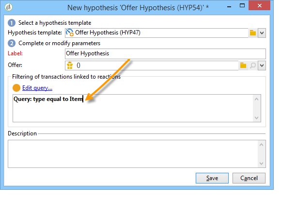
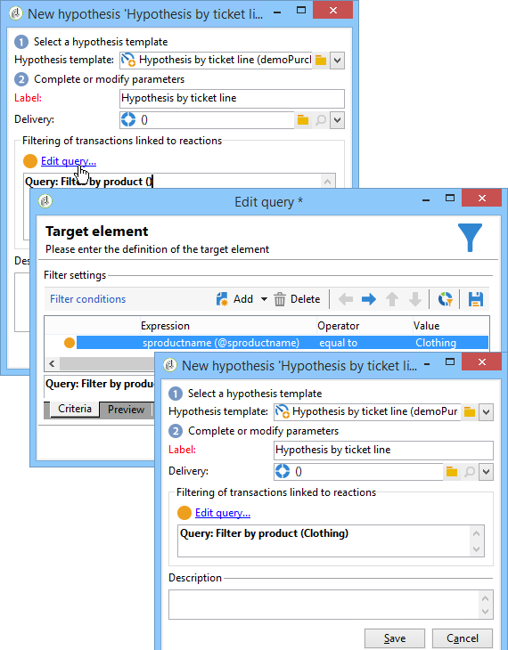

# Hypothesen maken{#creating-hypotheses}

Er zijn verschillende mogelijkheden om hypothesen te creëren/te koppelen aan een campagneaanbod of levering:

* Via de **[!UICONTROL Measurement hypotheses]** door een nieuwe hypothese te maken op basis van een bestaande sjabloon en deze te koppelen aan een bestaande levering.
* Via de **[!UICONTROL Edit]** > **[!UICONTROL Measurement]** in een campagne.
* Via de **[!UICONTROL Measurement]** optie van een levering die van een campagne wordt gecreeerd.

Hypothesen kunnen pas worden berekend nadat de marketingcampagne is gestart en de ontvangers de levering hebben ontvangen. Indien de hypothese gebaseerd is op een aanbod-voorstel, moet deze ten minste worden gepresenteerd en nog steeds actief zijn. Aanbieding en leveringshypothesen worden gecreëerd via de **[!UICONTROL Measurement hypotheses]** en zijn gebaseerd op een hypothesesjabloon. Het is echter mogelijk om voor het begin van de campagne rechtstreeks naar een hypothese te verwijzen in de uitvoering of de campagne. In dit geval worden de hypothesen automatisch berekend wanneer de marketingcampagne wordt gestart, op basis van de instellingen voor de uitvoering. [Meer informatie](hypothesis-templates.md#hypothesis-template-execution-settings)

## Een hypothese maken tijdens een levering {#creating-a-hypothesis-on-the-fly-on-a-delivery}

Als u een hypothese over een bestaande levering wilt maken, past u het volgende proces toe:

>[!NOTE]
>
>Deze bewerking is alleen mogelijk voor in behandeling zijnde leveringen.

1. Ga in de Adobe Campaign-boom naar **[!UICONTROL Campaign management > Measurement hypotheses]**.
1. Klik op de knop **[!UICONTROL New]** of klikt u met de rechtermuisknop op de lijst met hypothesen en selecteert u **[!UICONTROL New]** in de vervolgkeuzelijst.

   

1. Selecteer een eerder gemaakte sjabloon in het hypothesevenster. [Meer informatie](hypothesis-templates.md)

   

   De hypothesecontext zoals deze in het geselecteerde model is gedefinieerd, wordt weergegeven in het venster.

   >[!NOTE]
   >
   >De instellingen die in de sjabloon zijn gedefinieerd en in deze stap niet zichtbaar zijn, blijven ook in het geheugen staan en worden opnieuw toegewezen aan de hypothese die wordt uitgevoerd.

   

1. Selecteer de levering waarvoor u een hypothese wilt maken.

   

1. U kunt uw hypothese aanpassen door het **[!UICONTROL General]**, **[!UICONTROL Transactions]** en **[!UICONTROL Scope]** tabs. [Meer informatie](hypothesis-templates.md#creating-a-hypothesis-model)
1. Begin de hypothese door te klikken **[!UICONTROL Start]**.

   Er wordt automatisch een workflow gemaakt om de meting uit te voeren. De naam wordt automatisch bepaald afhankelijk van de hypotheseconfiguratie.

   >[!CAUTION]
   >
   >U kunt dit openen als u **[!UICONTROL Keep execution workflow]** doos.\
   >Deze optie moet alleen worden geactiveerd voor foutopsporingsdoeleinden, in het geval van een fout tijdens het uitvoeren van de hypothese. Werkstromen die automatisch worden gegenereerd, worden opgeslagen in de **[!UICONTROL Administration]** > **[!UICONTROL Production]** > **[!UICONTROL Objects created automatically]** > **[!UICONTROL Campaign workflows]** in de Adobe Campaign Explorer.
   > 
   >Bovendien mogen automatisch gegenereerde workflows niet worden gewijzigd. Eventuele wijzigingen zouden elders niet in aanmerking worden genomen voor latere berekeningen.
   >
   >Als u deze optie hebt ingeschakeld, verwijdert u de workflow nadat deze is uitgevoerd.

   

   Zodra de berekening is voltooid, worden de meetindicatoren automatisch bijgewerkt.

   

1. Wijzig zo nodig de instellingen en start de hypothese opnieuw.

## Verwijzing naar een hypothese in een campagnelevering {#referencing-a-hypothesis-in-a-campaign-delivery}

U kunt in een marketingcampagne naar een hypothese verwijzen voordat deze wordt gestart. In dit geval wordt de hypothese automatisch gestart zodra de levering is verzonden, op basis van de uitvoeringsinstellingen die in de hypothesesjabloon zijn gedefinieerd. Als u een hypothese wilt maken in een levering, past u het volgende proces toe:

1. Afhankelijk van uw behoeften kunt u een of meer **[!UICONTROL Delivery]** tekstsjablonen, zoals beschreven in [deze sectie](hypothesis-templates.md#creating-a-hypothesis-model)
1. Maak een marketingcampagne en maak doelgerichte workflows.
1. Klik in het leveringsvenster op de knop **[!UICONTROL Delivery measurement]** pictogram.
1. Selecteer het hypothesemalplaatje (de vraag die in het model wordt gevormd wordt getoond in het hypothesevenster).

   De hypothese wordt automatisch berekend zodra de campagne is voltooid, op basis van de data die in het model zijn geconfigureerd. [Meer informatie](hypothesis-templates.md#hypothesis-template-execution-settings)

   

## Een standaardhypothese toevoegen aan leveringen voor een campagne {#adding-a-default-hypothesis-to-deliveries-for-a-campaign}

U kunt rechtstreeks verwijzen naar een hypothese op campagnereniveau. In dit geval zal de hypothese automatisch worden gekoppeld aan alle leveringen die in de campagne worden gemaakt. Dit doet u als volgt:

1. Ga naar de **[!UICONTROL Edit]** tabblad van de campagne.
1. Klik in de sectie Metingen op de knop **[!UICONTROL Default hypotheses]** tab.

   

1. Klikken **[!UICONTROL Add]** en selecteer een hypothesesjabloon.

   

   In elke nieuwe levering voor de campagne wordt nu standaard verwezen naar een hypothese op basis van deze sjabloon.

   

De resultaten van de hypothese kunnen worden bekeken in het **[!UICONTROL General]** en **[!UICONTROL Reactions]** tabs van de hypothese. [Meer informatie](hypothesis-tracking.md)

Voor meer informatie kunt u ook naar [dit voorbeeld](#example--creating-a-hypothesis-linked-to-a-delivery).

## Een hypothese op een aanbod maken {#creating-a-hypothesis-on-an-offer}

Het creëren van een hypothese over een aanbiedingsvoorstel is vergelijkbaar met het creëren van een hypothese over de levering tijdens de vlucht. De hypothese kan worden uitgevoerd zolang het aanbod actief is. De berekeningsperiode is gebaseerd op de datum van het voorstel. Wanneer de hypothese u een ontvanger aan een aankoop laat verbinden, kan de status van het aanbiedingsvoorstel waarschijnlijk worden goedgekeurd automatisch worden veranderd. [Meer informatie](hypothesis-templates.md#transactions)

1. Een of meer maken **[!UICONTROL Offer]** typemodellen als beschreven in [deze sectie](hypothesis-templates.md#creating-a-hypothesis-model).
1. Ga naar de **[!UICONTROL Campaign management > Measurement hypotheses]** knooppunt.
1. Een **[!UICONTROL Offers]** type hypothese door het eerder gemaakte model te selecteren.

   

   De query die in het model is gemaakt, wordt in het venster weergegeven.

   

1. Kies het aanbod waarvoor u een hypothese wilt maken.

   

1. Verfijn indien nodig de query.
1. Klikken **[!UICONTROL Start]** om de hypothese te laten doorlopen.
1. De resultaten van de hypothese kunnen in het **[!UICONTROL General]** en **[!UICONTROL Reactions]** tabs. [Meer informatie](hypothesis-tracking.md)

   In de **[!UICONTROL Measurement]** tab.

   

   Als de **[!UICONTROL Update offer proposition status]** in het hypothesesjabloon is de status van het voorstel automatisch gewijzigd, waardoor feedback wordt gegeven over de impact van de campagne (zie voor meer informatie [Transacties](hypothesis-templates.md#transactions)).

## Voorbeeld: een hypothese maken die gekoppeld is aan een levering {#example--creating-a-hypothesis-linked-to-a-delivery}

In dit voorbeeld willen we een hypothese creëren die gekoppeld is aan een levering. Deze hypothese zal gebaseerd zijn op het eerder gemaakte model. [Meer informatie](hypothesis-templates.md#example--creating-a-hypothesis-template-on-a-delivery)

Vervolgens wordt de query die van het model is overgenomen, verfijnd en wordt een hypothese gemaakt voor een specifiek artikel van de aankooptabel.

1. Maak een campagne en een levering. [Meer informatie](../../campaign/using/setting-up-marketing-campaigns.md#creating-a-campaign)

   In ons voorbeeld, zullen wij een directe posttype levering gebruiken.

1. Vorm een zaadadres: het eerder gecreeerde hypothesemalplaatje werd gevormd om een controlegroep in de reactieresultaten rekening te houden.

   

   >[!NOTE]
   >
   >Raadpleeg [deze sectie](../../campaign/using/marketing-campaign-deliveries.md#defining-a-control-group) voor meer informatie.

1. Open de **[!UICONTROL Direct mail delivery]** en klik op de knop **[!UICONTROL Delivery measurement]** pictogram, klik vervolgens op **[!UICONTROL Add]**.

   

1. Kies de eerder gemaakte hypothesesjabloon in de vervolgkeuzelijst.

   

   De query die in het model wordt gemaakt, wordt weergegeven.

   

1. Klikken **[!UICONTROL Edit query...]** en verfijnen door het product in te voeren waarop de hypothese betrekking heeft.

   

   U kunt controleren of de hypothese verband houdt met de bevalling in de **[!UICONTROL Edit]** > **[!UICONTROL Measurement]** tabblad van de campagne.

   

1. Start de doelworkflow en voer de vereiste controles uit totdat de campagne is voltooid. [Meer informatie](../../campaign/using/marketing-campaign-deliveries.md#starting-a-delivery)

   

1. Ga in de Adobe Campaign-boom naar de **[!UICONTROL Campaign management > Measurement hypotheses]** knoop om de indicatoren te controleren die door de hypothese worden berekend.

   
