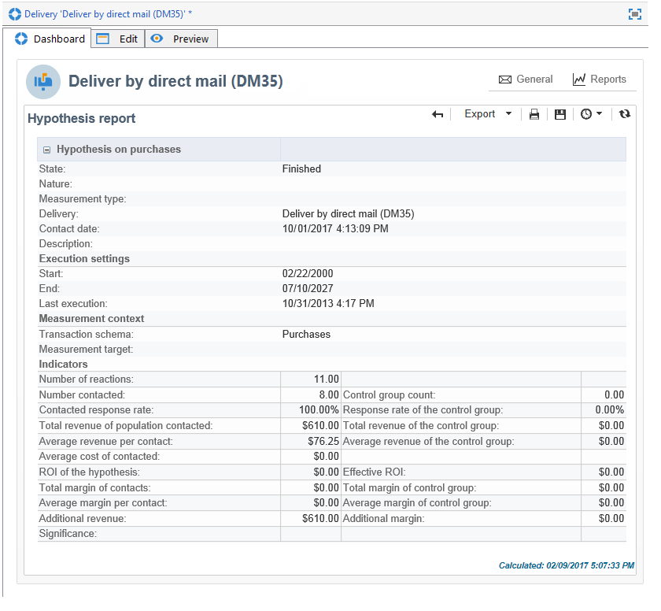

# Tracking van hypothesen{#hypothesis-tracking}

Het resultaat van hypotheseberekeningen is beschikbaar op verschillende niveaus van het Adobe Campaign-platform: indicatoren die worden berekend op basis van hypothesen en de reacties op de doelpopulaties zijn zichtbaar op basis van de werkelijke hypothese en in de hypotheseverslagen die beschikbaar zijn via campagnes en leveringen.

## Hypothetische resultaten {#hypothesis-results}

### Indicatoren {#indicators}

Zodra de hypothese is berekend, worden verschillende meetindicatoren automatisch bijgewerkt. Deze zijn beschikbaar in het dialoogvenster **[!UICONTROL General]** tabblad van de hypothese.

Deze indicatoren zijn:

* **Aantal respondenten**: aantal gecontacteerde personen die overeenkomen met de hypothese.
* **Behandelde responspercentage**: aantal geënquêteerde contactpersonen / totaal aantal personen dat tijdens de levering is gecontacteerd.
* **Aantal respondentcontrolegroepcontactpersonen**: aantal controlegroepen dat overeenkomt met de hypothese.
* **Responspercentage van de controlegroep**: aantal geënquêteerde controlegroepen / totaal aantal leveringscontrolegroepen.
* **Aantal reacties**: aantal records in de tabel die de relatie tussen personen, de hypothese en de transactietabel bevat.

Voor de volledige lijst van indicatoren, klik **[!UICONTROL Display the list]** koppeling:

De indicatoren geven de volgende informatie:

* **Totale gecontacteerde inkomsten van de bevolking**: totale bedragen over het aantal gecontacteerde personen.
* **Totale inkomsten van de controlegroep**: totale bedragen over het aantal controlegroepen.
* **Gemiddelde omzet per contactpersoon**: totale bedragen / gecontacteerd.
* **Gemiddelde inkomsten van de controlegroep**: totale bedragen / controlegroep.
* **Totale marge per contactpersoon**: totale marge over gecontacteerd.
* **Totale marge van de controlegroep**: totale marge over controlegroep.
* **Gemiddelde marge per contact**: totale marge / gecontacteerd.
* **Gemiddelde marge van controlegroepen**: totale marges/controlegroep.
* **Aanvullende inkomsten**: (Gemiddelde inkomsten van gecontacteerde-gemiddelde inkomsten van de controlegroep)&#42;Aantal contactpersonen
* **Aanvullende marge**: (Gemiddelde marge van de gecontacteerde-gemiddelde marge van de controlegroep) / aantal gecontacteerde personen
* **Gemiddelde kosten per contactpersoon**: berekende leveringskosten / Aantal contacten.
* **ROI**: berekende kosten van de levering / totale marge per contactpersoon
* **Effectieve ROI**: berekende leveringskosten / extra marge.
* **Significantie**: bevat waarden 0 tot en met 3, afhankelijk van de campagnesignificantie.

### Reacties {#reactions}

U kunt de reacties van de ontvangers op de hypothesen bekijken via de **[!UICONTROL Reactions]** tab.

1. Als de hypotheseberekening is voltooid, gaat u naar **[!UICONTROL Campaign management > Measurement hypotheses]** knooppunt van de boomstructuur Adobe Campaign.
1. Selecteer de gewenste hypothese en klik op **[!UICONTROL Reactions]** tabblad om de lijst weer te geven met ontvangers die na de marketingcampagne iets kunnen kopen.

   

## Rapporten {#reports}

De **[!UICONTROL Hypothesis report]** Hiermee kunt u de resultaten bekijken van de hypotheses die zijn uitgevoerd voor campagnes en leveringen. Dit verslag bevat de indicatoren die door de hypothese zijn berekend (zie voor meer informatie hierover [Indicatoren](#indicators)).

* **Op campagnereniveau**: klik op de knop **[!UICONTROL Reports]** koppeling van de desbetreffende campagne en selecteer de **[!UICONTROL Hypothesis report]**. Dit verslag bevat de lijst van de campagneleveringen en de hypothesen die voor elke levering zijn berekend.

  

* **Op leveringsniveau**: voor toegang tot het rapport opent u de desbetreffende levering. Klik op de knop **[!UICONTROL Reports]** in de **[!UICONTROL Summary]** en selecteert u de **[!UICONTROL Hypothesis report]**. Indien voor dezelfde levering meerdere hypothesen zijn berekend, bevat het verslag alle hypothesen.

  
