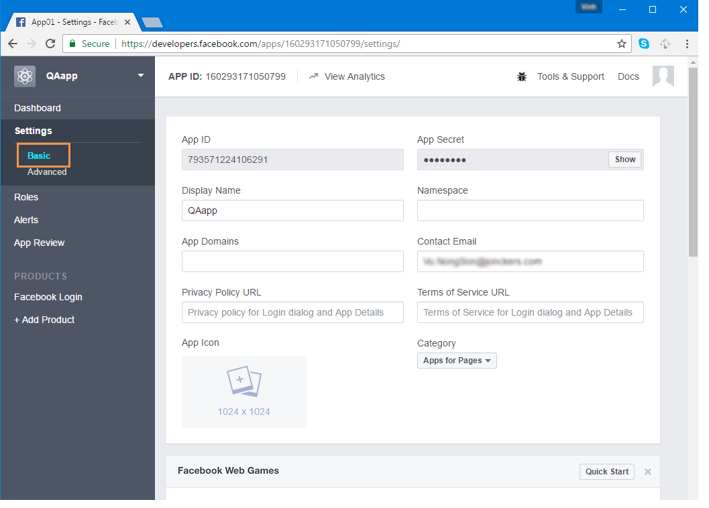
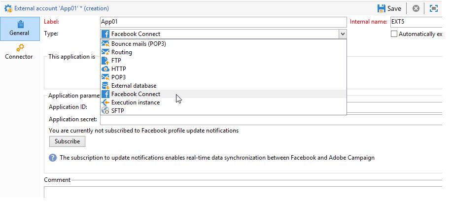
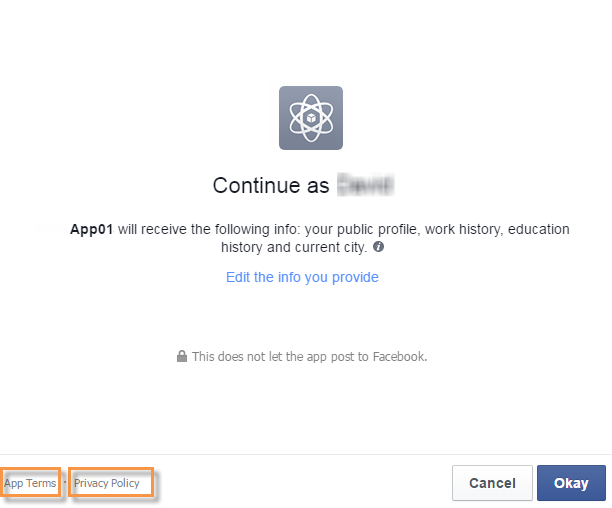
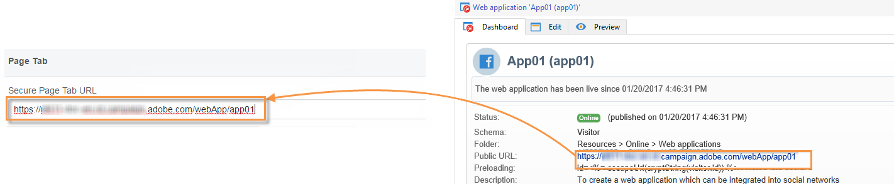

# Een Facebook-toepassing maken{#creating-a-facebook-application}

Dankzij webtoepassingen kunt u met Social Marketing gepersonaliseerde inhoud weergeven in uw Facebook-toepassingen, waardoor het eenvoudiger wordt om vooruitzichten te krijgen via dit sociale netwerk. Raadpleeg [Voorbeelden van Facebook-apps](../../social/using/examples-of-facebook-apps.md)voor meer voorbeelden van Facebook-webtoepassingen.

>[!NOTE]
>
>Het is ook mogelijk Adobe Campaign te integreren met een Facebook-toepassing die door een partner is ontwikkeld. In dit geval hoeft u de webtoepassing Adobe Campagne niet te gebruiken om Facebook-profielen aan te schaffen. Voor meer op dit, verwijs naar het [Vormen van externe rekeningen](#configuring-external-accounts).

Pas de volgende configuratiestappen toe:

1. Maak een of meer Facebook-toepassingen. Raadpleeg voor meer informatie: Een Facebook-toepassing [maken](../../social/using/publishing-on-facebook-walls.md#creating-a-facebook-application).
1. Voer de **[!UICONTROL terms of service]** en de **[!UICONTROL Privacy policy]** koppelingen in die moeten worden weergegeven op het scherm voor het aanvragen van bevoegdheden op Facebook. Raadpleeg voor meer informatie: Het [ingaan van de Termijnen van de Dienst en de beleidsverbindingen](#entering-the-terms-of-service-and-privacy-policy-links)van de Privacy.
1. Maak voor elke Facebook-toepassing een **[!UICONTROL Facebook Connect]** type extern account. Raadpleeg voor meer informatie: Externe accounts [configureren](#configuring-external-accounts).
1. Maak voor elke Facebook-toepassing een Facebook-webtoepassing in Adobe Campaign. Raadpleeg voor meer informatie: Een webtoepassing [van het type Facebook](#creating-a-facebook-type-web-application)maken.
1. Configureer uw Facebook-toepassingen zodat deze als tabbladen op uw Facebook-pagina worden weergegeven. Raadpleeg voor meer informatie: Facebook-tabs [configureren](#configuring-facebook-tabs).

## Externe accounts configureren {#configuring-external-accounts}

Voor elke Facebook-toepassing moet u een **[!UICONTROL Facebook Connect]** type extern account maken.

Voor deze stap hebt u toegang nodig tot zowel uw Adobe Campaign-console als een internetbrowser die u hebt aangemeld bij de Facebook-account die u gebruikt voor paginabeheer:

* **Facebook**: Selecteer de eerder gemaakte toepassing ( [https://developers.facebook.com/apps](https://developers.facebook.com/apps)) en selecteer het tabblad **[!UICONTROL Settings]** > **[!UICONTROL Basic]** .

   

   >[!NOTE]
   >
   >Als de **[!UICONTROL Facebook Web Games]** sectie niet verschijnt, klik de **[!UICONTROL Add Platform]** knoop, bij de bodem van de pagina, en selecteer **[!UICONTROL Facebook Web Games]**.

* **Adobe-campagne**: Ga naar de **[!UICONTROL Administration > Platform > External accounts]** knoop van de boom en klik **[!UICONTROL New]**.

   

1. Voer een label en een interne naam in en selecteer het **[!UICONTROL Facebook Connect]** type.

   

1. Selecteer een hostingmodus voor de toepassing: **[!UICONTROL hosted by a partner]** of **[!UICONTROL hosted by this instance]**.

   

   **Toepassing die door een partner wordt ontvangen**

   Het is mogelijk Adobe Campaign te integreren met een Facebook-toepassing die door een partner is ontwikkeld. In dit geval hoeft u de webtoepassingen van Adobe Campagne niet te gebruiken om Facebook-profielen aan te schaffen. Wanneer de Facebook-gebruiker de toepassing installeert, wordt een toets (toegangstoken) gegenereerd. De partner stuurt dit toegangstoken door naar Adobe Campaign door een webservice op te roepen. Adobe Campaign gebruikt deze token vervolgens om u aan te melden bij de Facebook-database en de gegevens te verzamelen die de gebruiker via de toepassing deelt.

   >[!NOTE]
   >
   >De parameters van de webservice worden beschreven in het WSDL-bestand dat hier beschikbaar is: **`https://<Instance name>/nl/jsp/schemawsdl.jsp?schema=nms:visitor`**

   Als u de toepassing van derden wilt integreren in de Adobe-campagne, moet u de inhoud van de velden **[!UICONTROL App ID]** en **[!UICONTROL App Secret]** Facebook kopiëren en deze in de **[!UICONTROL Application ID]** en **[!UICONTROL Application secret]** velden van de console plakken.

   

   **Toepassing die door deze instantie wordt gehost**

   Als u de toepassing op deze instantie wilt hosten (als u geen externe toepassing hebt), moet u de webtoepassingen van Adobe Campagne gebruiken om Facebook-profielen aan te schaffen. Raadpleeg [Voorbeelden van Facebook-apps](../../social/using/examples-of-facebook-apps.md)voor meer informatie.

   Kopieer in de Adobe Campaign-console het adres in het **[!UICONTROL Secure Canvas URL]** veld en plak het in het **[!UICONTROL Facebook Web games (https)]** veld op Facebook (in de **[!UICONTROL Facebook Web Games]** sectie).

   

   >[!IMPORTANT]
   >
   >U mag in geen geval de onveilige URL gebruiken.

   Kopieer op Facebook de inhoud van de velden **[!UICONTROL App ID]** en **[!UICONTROL App Secret]** velden en plak deze in de console in de **[!UICONTROL Application ID]** **[!UICONTROL Application secret]** velden en in de console.

   

1. Klik op Facebook op de **[!UICONTROL Save Changes]** knop onder aan de pagina.
1. Klik in de Adobe Campaign-console op de **[!UICONTROL Subscribe]** knop om Adobe Campaign in staat te stellen de gegevens in real-time te herstellen telkens wanneer een ventilator via deze toepassing incheckt. Raadpleeg voor meer informatie: [Voorbeelden van Facebook-apps](../../social/using/examples-of-facebook-apps.md).

   

## De koppelingen voor service- en privacybeleid invoeren {#entering-the-terms-of-service-and-privacy-policy-links}

We raden u ten zeerste aan de **[!UICONTROL Terms of service]** en de **[!UICONTROL Privacy policy]** koppelingen toe te voegen, zodat deze worden weergegeven op het scherm voor het aanvragen van bevoegdheden op Facebook.

De configuratiestadia zijn als volgt:

1. Voer het volgende adres in: [https://developers.facebook.com/apps](https://developers.facebook.com/apps), selecteert u vervolgens de Facebook-toepassing.
1. Selecteer het **[!UICONTROL Settings > Basic]** tabblad en voer de **[!UICONTROL Privacy Policy URL]** en de **[!UICONTROL Terms of Service URL]** velden in.

   

## Webtoepassingen van het type Facebook maken {#creating-a-facebook-type-web-application}

Met de Adobe Campagne Facebook-toepassing kunt u gepersonaliseerde inhoud weergeven in uw Facebook-toepassing. Voor elke Facebook-toepassing moet u een webtoepassing maken in Adobe Campaign. Ga als volgt te werk om een Facebook-webtoepassing te maken:

1. Ga naar het **[!UICONTROL Social networks]** universum, klik op de **[!UICONTROL Applications]** link, dan op de **[!UICONTROL Create]** knop.

   

1. Selecteer een Facebook-webtoepassingssjabloon in de lijst en voer het label in.

   

   >[!NOTE]
   >
   >Er worden standaard vier sjablonen voor Facebook-webtoepassingen aangeboden:
   >
   >* **[!UICONTROL New Facebook application]**: Selecteer deze sjabloon als u vanuit een lege toepassing wilt starten.
   >* **[!UICONTROL Pre-entered form]**: Een Facebook-toepassing met een formulier en een knop voor aanmelding bij Facebook waarmee gebruikers de velden van het formulier kunnen automatisch kunnen invullen met behulp van de gegevens uit hun profiel. Hierdoor kunnen gebruikers het formulier sneller invullen en kunnen merken informatie van betere kwaliteit verkrijgen.
   >* **[!UICONTROL "Canvas page" competition]**: De toepassing van Facebook die over het scherm voor een betere visuele ervaring voor de gebruikers wordt getoond.
   >* **[!UICONTROL "Page Tab" competition]**: De Facebook-toepassing is volledig geïntegreerd in de tabbladen van de merkpagina&#39;s.

1. Voer in het **[!UICONTROL Application]** veld de externe account in die is gekoppeld aan de Facebook-toepassing. Raadpleeg voor meer informatie: Externe accounts [configureren](#configuring-external-accounts).

   

1. Selecteer het **[!UICONTROL Edit]** tabblad en bewerk de webtoepassing. Raadpleeg voor meer informatie: [Voorbeelden van Facebook-apps](../../social/using/examples-of-facebook-apps.md).

   

1. Nadat de webtoepassing is voltooid, selecteert u het **[!UICONTROL Dashboard]** tabblad en klikt u **[!UICONTROL Publish]** om online te publiceren.

   

## Facebook-tabbladen configureren {#configuring-facebook-tabs}

U kunt uw Facebook-toepassingen configureren om als tabbladen op uw Facebook-pagina te worden weergegeven. Hiervoor voert u de volgende stappen uit:

1. Selecteer de Facebook-toepassing ([https://developers.facebook.com/apps](https://developers.facebook.com/apps)) en selecteer het **[!UICONTROL Settings > Basic]** tabblad.

   

1. Klik onder aan de pagina op de **[!UICONTROL Add Platform]** knop en selecteer **[!UICONTROL Page Tab]**.

   

1. Voer in het **[!UICONTROL Page Tab Name]** veld van de **[!UICONTROL Page Tab]** sectie het label in zoals u het wilt weergeven op de Facebook-pagina.

   

1. Voer in het **[!UICONTROL Secure Page Tab URL]** veld de openbare URL van de webtoepassing in, die toegankelijk is via het **[!UICONTROL Dashboard]** tabblad van de webtoepassing. Raadpleeg Webtoepassingen van het type Facebook [maken voor meer informatie over het maken van webtoepassingen](#creating-a-facebook-type-web-application)van het type Facebook.

   

1. Klik op de koppeling in **[!UICONTROL Dashboard]** **[!UICONTROL Add a page tab]** de webtoepassing.

   

1. Selecteer de Facebook-pagina waaraan u het tabblad wilt toevoegen en klik op **[!UICONTROL Add Page Tab]**.

   

