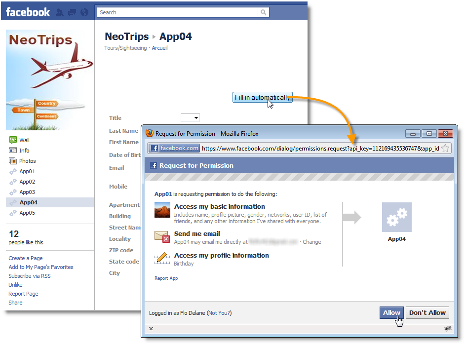
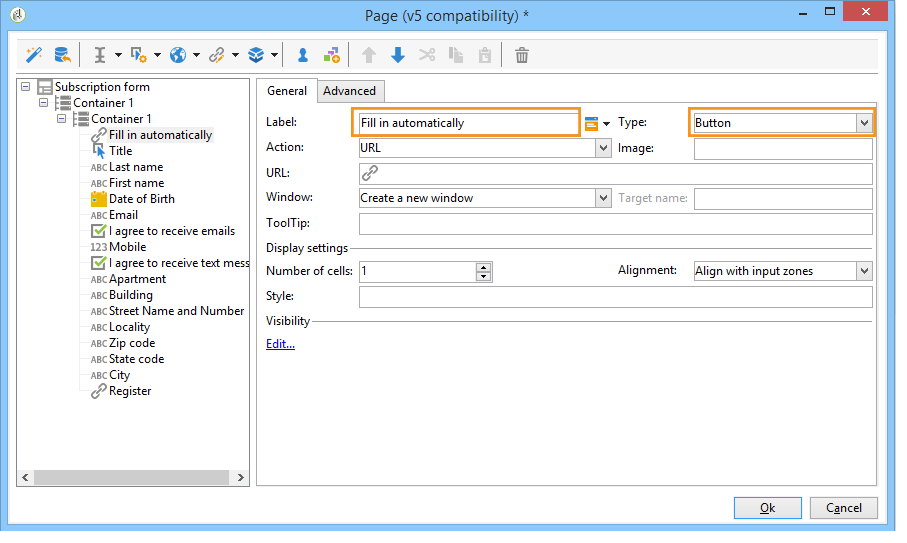

# Voorbeelden van Facebook-apps{#examples-of-facebook-apps}

Wanneer een gebruiker op de tab van een Facebook-toepassing klikt, wordt deze weergegeven in een ruimte van 810 pixels breed. Adobe Campaign gebruikt een Facebook-webtoepassing waarmee u de inhoud die in de Facebook-toepassing wordt weergegeven, kunt definiëren en aanpassen, zodat het gemakkelijker wordt om profielen aan te schaffen.

>[!NOTE]
>
>Het is ook mogelijk om Adobe Campaign te integreren met een Facebook-toepassing die door een partner is ontwikkeld. In dit geval hoeft u de Adobe Campaign-webtoepassing niet te gebruiken voor het aanschaffen van Facebook-profielen. Raadpleeg voor meer informatie hierover [Externe accounts configureren](../../social/using/creating-a-facebook-application.md#configuring-external-accounts).

>[!IMPORTANT]
>
>Volg de configuratiestappen die worden beschreven in [Facebook-toepassingen maken](../../social/using/creating-a-facebook-application.md).

>[!NOTE]
>
>In deze sectie worden de elementen beschreven die zijn gekoppeld aan webtoepassingen van het type Facebook. Alle elementen die worden gedeeld met standaard webtoepassingen worden beschreven in [deze sectie](../../web/using/about-web-applications.md).

Hier worden de volgende voorbeelden gegeven van Facebook-webtoepassingen:

* Een Facebook-toepassing maken in 7 stappen. Zie [Snel starten: facebook-toepassingen maken in 7 stappen](#quick-start--creating-a-facebook-application-in-7-steps).
* Instellingen doorsturen naar een Facebook-toepassing. Zie [Hoe kan ik instellingen doorsturen naar een Facebook-toepassing?](#how-to-forward-settings-to-a-facebook-application-).
* Hoe verkrijgt u ventilatorgegevens. Zie [Hoe verkrijgt u ventilatorgegevens?](#how-to-acquire-fan-data-).

>[!IMPORTANT]
>
>Deze eenvoudige gebruiksgevallen worden als voorbeelden gegeven om de functionaliteit van webtoepassingen van het type Facebook te illustreren.

## Aanbevelingen {#recommendations}

De volgende beperkingen houden rechtstreeks verband met Facebook:

* U moet al uw webtoepassingen maken in HTTPS.
* Een Facebook-toepassing die via een tab wordt weergegeven, heeft een breedte van 810 pixels.

## Snel starten: facebook-toepassingen maken in 7 stappen {#quick-start--creating-a-facebook-application-in-7-steps}

In dit voorbeeld wordt stapsgewijs uitgelegd hoe u een Adobe Campaign-toepassing die in Facebook is gemaakt, kunt weergeven. In dit geval, willen wij een toepassing tot stand brengen die u laat tonen **Welkom** bericht wanneer de gebruiker op het tabblad van de toepassing klikt (**App01**).

Voer de volgende stappen uit om deze toepassing te maken:

1. Een toepassing maken op Facebook ( [https://developers.facebook.com/apps](https://developers.facebook.com/apps)).

   

1. Een **[!UICONTROL Facebook Connect]** Typ een externe account en voer de parameters van de Facebook-toepassing in. Raadpleeg voor meer informatie: [Externe accounts configureren](../../social/using/creating-a-facebook-application.md#configuring-external-accounts).

   

1. Voer de **[!UICONTROL Terms of service]** en **[!UICONTROL Privacy policy]** koppelingen die moeten worden weergegeven op het scherm voor Facebook-machtigingsaanvragen. Raadpleeg voor meer informatie: [De koppelingen voor service- en privacybeleid invoeren](../../social/using/creating-a-facebook-application.md#entering-the-terms-of-service-and-privacy-policy-links).

   

1. Maak een Facebook-webtoepassing in Adobe Campaign. Raadpleeg voor meer informatie: [Een Facebook-webtoepassing maken](../../social/using/creating-a-facebook-application.md#creating-a-facebook-type-web-application).

   

1. Bewerk uw webtoepassing. In dit voorbeeld hebben we een **[!UICONTROL Page]** activiteit en een titel voor het bepaald.

   

1. Implementeer uw toepassing.

   

1. Configureer uw Facebook-toepassing zodat deze als een tab op uw Facebook-pagina wordt weergegeven. Raadpleeg voor meer informatie: [Facebook-tabbladen configureren](../../social/using/creating-a-facebook-application.md#configuring-facebook-tabs).

   

Controleer of het tabblad van het dialoogvenster **App01** wordt weergegeven op uw Facebook-pagina. Als u erop klikt, wordt een **Welkom** bericht.

## Hoe kan ik instellingen doorsturen naar een Facebook-toepassing? {#how-to-forward-settings-to-a-facebook-application-}

>[!IMPORTANT]
>
>Voldoe aan de configuratiestappen die in [Facebook-toepassingen maken](../../social/using/creating-a-facebook-application.md).

In voorbeeld 1 hebben we de weergave van de Facebook-pagina aangepast aan de waarde in het dialoogvenster **[!UICONTROL Fan of the page]** veld. Het is ook mogelijk de **[!UICONTROL Application settings]** veld. Met dit veld kunt u gegevens herstellen die zijn opgeslagen in een koppeling die door Adobe Campaign via Facebook is gegenereerd.

Laten we het voorbeeld nemen van een bedrijf dat besluit een e-mailcampagne te verzenden. Bij de levering wijst een koppeling naar de Facebook-toepassing. Deze link is gepersonaliseerd dankzij de **[!UICONTROL app_data]** parameter toegevoegd aan het einde van de URL. De waarde van deze parameter zou een indicator kunnen zijn die op klantenbelangrijkheid wijst. In ons voorbeeld, de waarden van **[!UICONTROL app_data]** parameter are **[!UICONTROL big]** (belangrijke klant) en **[!UICONTROL small]** (minder belangrijke klant).

Zodra het wordt gepersonaliseerd, kijkt URL als dit:

* `http://<path of the Facebook application>&app_data=big` (voor een belangrijke klant)
* `http://<path of the Facebook application>&app_data=small` (voor een minder belangrijke klant)

De waarde van de **[!UICONTROL Application parameters]** wordt verzameld, zodat Adobe Campaign de toepassingsweergave op basis van deze parameter kan aanpassen.

Als de gebruiker een significante klant is (de waarde van **[!UICONTROL app_data]** parameter is **[!UICONTROL big]**), wordt de volgende afbeelding weergegeven:

Als de gebruiker een minder significante klant is (de waarde van **[!UICONTROL app_data]** parameter is **[!UICONTROL small]**), wordt de volgende afbeelding weergegeven:

Voor het opnieuw maken van dit gebruiksgeval hebben we een webtoepassing gemaakt die bestaat uit de volgende elementen:

* A **[!UICONTROL Test]** op basis van de **[!UICONTROL Application parameter]** veld.
* twee pagina&#39;s die de afbeeldingen bevatten die moeten worden weergegeven op basis van de waarde van de **[!UICONTROL Application parameter]** veld.

## Hoe verkrijgt u ventilatorgegevens? {#how-to-acquire-fan-data-}

>[!IMPORTANT]
>
>Voldoe aan de configuratiestappen die in [Facebook-toepassingen maken](../../social/using/creating-a-facebook-application.md).

In dit voorbeeld ziet u hoe u contact opneemt met Facebook-gebruikers en hen aanbiedt hun profielgegevens te delen. Laten we het voorbeeld nemen van een bedrijf dat vooruitzichten wil verwerven en een wedstrijd organiseert op zijn Facebook-pagina om ze aan te trekken.

Wanneer een gebruiker op de knop **[!UICONTROL App03]** tab , we vragen ze of ze aan de wedstrijd willen deelnemen .

Als zij besluiten aan de wedstrijd deel te nemen, bieden wij hun aan hun profielinformatie te delen.

Als ze hun gegevens willen delen, wordt het volgende scherm weergegeven.

Voor het samenstellen van dit gebruiksgeval hebben we een webtoepassing gemaakt die de volgende elementen bevat:

* een **[!UICONTROL Test]**-activiteit
* drie pagina&#39;s
* een **[!UICONTROL Access control]** activiteit
* een **[!UICONTROL Pre-loading]**-activiteit
* een **[!UICONTROL Save]**-activiteit
* een **[!UICONTROL End]** activiteit

### Testactiviteit {#test-activity}

De **[!UICONTROL Test]** de activiteit is gebaseerd op de **[!UICONTROL ID]** en **[!UICONTROL Application parameters]** veld.

Het bestaat uit drie bijkantoren:

* **[!UICONTROL identifier (UID) is empty]** : de identificatiecode wordt alleen door Facebook doorgestuurd als de gebruiker al heeft ingestemd met het delen van zijn gegevens. De eerste vertakking van de **[!UICONTROL Test]** Met activiteit kunt u de wedstrijd alleen beschikbaar maken voor gebruikers die nog nooit zijn ingegaan, dat wil zeggen gebruikers met een lege id.
* **[!UICONTROL application parameter equals 'thanks']** : om een weergavefout te verplaatsen die is gekoppeld aan Facebook, wijst de eindpagina van de webtoepassing naar de URL van de Facebook-toepassing die door de **[!UICONTROL app_data]** wordt toegevoegd aan het gebruik van de **[!UICONTROL thanks]** waarde (zie voor meer informatie hierover: [Eindactiviteit](#end-activity)). De tweede vertakking laat u weten of de gebruiker uit **[!UICONTROL End]** de activiteit van de eerste tak (en is net ingegaan op de wedstrijd) om een dankbetuiging te tonen. Raadpleeg voor meer informatie over het gebruik van aanvullende URL-parameters: [Hoe kan ik instellingen doorsturen naar een Facebook-toepassing?](#how-to-forward-settings-to-a-facebook-application-).
* **[!UICONTROL Default branch]** : als de gebruiker al op een vorige datum tot de wedstrijd is toegetreden (id reeds ingevoerd) (toepassingsparameter anders dan **[!UICONTROL thanks]**), wordt een pagina weergegeven waarop staat dat ze al zijn ingevoerd.

### Mededingingspagina {#competition-page}

Als u de weergavefout wilt negeren die is gekoppeld aan Facebook, moet u ook **[!UICONTROL Parent window]** of **[!UICONTROL In the top window]** in de **[!UICONTROL Window]** veld van de pagina Mededinging.

### Toegangscontroleactiviteit {#access-control-activity}

De **[!UICONTROL Access control]** Met activiteit kunt u de pagina voor Facebook-machtigingsaanvragen weergeven wanneer de gebruiker aan de wedstrijd deelneemt. Als zij ermee instemmen hun informatie te delen, wordt deze tijdens het vooraf laden teruggewonnen. Raadpleeg voor meer informatie: [Voorladen](#pre-loading-activity).

Als u eerder een externe account hebt ingevoerd bij het maken van de webtoepassing (zie [Een Facebook-webtoepassing maken](../../social/using/creating-a-facebook-application.md#creating-a-facebook-type-web-application)) hoeft u de activiteit niet te bewerken. Indien niet, ga naar **[!UICONTROL Application]** en selecteer de externe account die aan de Facebook-toepassing is gekoppeld.

### Voorladen {#pre-loading-activity}

Selecteer de gegevensbron die moet worden gebruikt voor het vooraf laden:

* **[!UICONTROL Marketing database]** : Met deze optie kunt u gegevens vooraf laden via de Adobe Campaign-database.
* **[!UICONTROL Facebook]** : Met deze optie kunt u gegevens vooraf laden met Facebook.

**Marketing Database**

Met deze optie kunt u de gegevens herstellen van een profiel dat bestaat in de tabel met bezoekers. De verificatie wordt uitgevoerd op basis van de externe Facebook-id die wordt hersteld wanneer de gebruiker op het tabblad Facebook-toepassing klikt. Als u een formulier toevoegt na de **[!UICONTROL Pre-loading]** activiteit, worden de gebieden die informatie in het gegevensbestand bevatten vooraf geladen.

>[!NOTE]
>
>Voor meer informatie over het vooraf laden van gegevens via de Adobe Campaign-database raadpleegt u [deze sectie](../../web/using/publishing-a-web-form.md#pre-loading-the-form-data).

**Facebook**

Met deze optie kunt u de Facebook-profielgegevens definiëren die u wilt verzamelen, met inbegrip van de gegevens die de gebruiker heeft willen delen, om deze op te slaan.

De **[!UICONTROL Database information]** Met deze optie kunt u de volgende gegevens verzamelen:

* **[!UICONTROL External ID]**: gebruikersnaam
* **[!UICONTROL Gender]**: geslacht van de gebruiker
* **[!UICONTROL Verified]** : in dit veld wordt aangegeven of de gebruiker een geverifieerde Facebook-account heeft.
* **[!UICONTROL Full name]**: volledige naam van gebruiker
* **[!UICONTROL First name]**: voornaam van gebruiker
* **[!UICONTROL Last name]**: achternaam van gebruiker
* **[!UICONTROL Language]**: taal van de gebruiker

U kunt ook besluiten om de profielfoto, de lijst met vrienden, e-mailadres, geboortedatum, interesses en locatie te verzamelen door de juiste vakjes in te schakelen.

Voordat u klikt **[!UICONTROL Ok]**, controleert u de **[!UICONTROL I agree to comply with Facebook conditions of use]** doos.

>[!NOTE]
>
>Als u een of meer vakken in het dialoogvenster **[!UICONTROL Private information]** op het scherm Facebook-machtigingsaanvraag automatisch de toegangsaanvraag voor deze gegevens wordt weergegeven.
>
>Als u de geselecteerde gegevens wilt verzamelen, moet de gebruiker ermee instemmen deze te delen.
>
>Als u beide typen voorladen (via Adobe Campaign en via Facebook) wilt gebruiken, voegt u twee vooraf geladen vakken achter elkaar toe.

### Activiteit opslaan {#save-activity}

De **[!UICONTROL Save]** Met deze activiteit kunt u de informatie opslaan die tijdens de vorige fasen is verzameld in de tabel met bezoekers.

Als het profiel al in de bezoekerslijst bestaat, worden hun gegevens bijgewerkt met de nieuwe verzamelde gegevens.

Als het profiel niet bestaat in de database en het e-mailadres van de Facebook-gebruiker is verzameld, wordt een bezoeker gemaakt in de tabel met bezoekers.

1. In de **[!UICONTROL Visitor creation folder]** selecteert u de map waarin het profiel wordt gemaakt. In het geval van een Facebook-webtoepassing is de standaardmap voor het maken van bestanden **[!UICONTROL Visitors]**.
1. In de **[!UICONTROL Reconciliation mode]** in het veld selecteert u de afstemmingsmodus die u wilt gebruiken:

   * **[!UICONTROL Automatic]** : De afstemming vindt plaats op basis van e-mail, achternaam, voornaam en geboortedatum.
   * **[!UICONTROL Manual]** : Selecteer een of meer afstemmingssleutels.
   * **[!UICONTROL None]** : Er vindt geen verzoening plaats.

1. In de **[!UICONTROL Mapping]** selecteert u het schema waarop u de afstemming wilt uitvoeren.

   >[!IMPORTANT]
   >
   >Zorg ervoor dat de velden van het dialoogvenster **[!UICONTROL Social networks]** worden correct ingevoerd in de leveringstoewijzing. Leveringstoewijzingen zijn toegankelijk via de **[!UICONTROL Administration > Campaign management > Target mappings]** knooppunt.

1. U kunt een zoekmap selecteren voor afstemming en een map maken voor nieuwe profielen. Als de velden leeg zijn, worden profielen gezocht naar en gemaakt in de standaardmap van het toewijzingsschema.

### Eindactiviteit {#end-activity}

Als u de weergavefout wilt negeren die is gekoppeld aan Facebook, moet u de optie **[!UICONTROL Use an external URL]** en voert u de URL van de Facebook-toepassing in, gevolgd door de **[!UICONTROL app_data]** en een waarde. Deze waarde wordt gebruikt in het dialoogvenster **[!UICONTROL Test]** activiteit om te ontdekken of de gebruiker of niet enkel de concurrentie is binnengekomen, en om een dank u bericht te tonen indien van toepassing. Raadpleeg voor meer informatie: [Testactiviteit](#test-activity).

In ons voorbeeld wordt de waarde gebruikt: **dank**.

### Scherm Details van een bezoeker {#details-screen-of-a-visitor}

Net als voor Twitter-volgers (zie: [Exploitatiebeginsel](../../social/using/publishing-on-twitter.md#operating-principle)), herstelde Facebook-profielen worden opgeslagen in de tabel met bezoekers. Ga naar de **[!UICONTROL Profiles and Targets > Visitors]** knooppunt.

Elk perspectief van Facebook dat ermee instemt om hun profielinformatie te delen, wordt toegevoegd aan de lijst van bezoekers. Als de **[!UICONTROL Friends]** is ingeschakeld in het dialoogvenster **[!UICONTROL Pre-load]** activiteit (zie: [Voorladen](#pre-loading-activity)), worden ook vrienden toegevoegd.

In de **[!UICONTROL Summary]** in het detailvenster van de bezoeker zijn er twee mogelijke statussen voor de **[!UICONTROL New Contact]** indicator:

Als een groen vinkje wordt weergegeven, betekent dit dat de bezoeker zich niet heeft aangesloten bij ontvangers. In dit geval wordt een nieuw profiel gemaakt in de lijst met ontvangers.

Een rood kruis betekent dat de bezoeker in overeenstemming is gebracht met een ontvanger. U kunt op de zoomfactor rechts van het dialoogvenster **[!UICONTROL Recipient]** veld om de overeenkomende ontvanger weer te geven.

Ga naar het detailvenster van een ontvanger om de overeenkomende bezoeker, indien van toepassing, weer te geven. Selecteer **[!UICONTROL Others]** en dubbelklikt u op de naam van de bezoeker in het dialoogvenster **[!UICONTROL Web identities]** sectie.

De **[!UICONTROL Activities]** het scherm van de detailpagina van een bezoeker bevat de volgende informatie:

* Ventilatoractiviteiten van het type &quot;Open Graph&quot;: muziek, video&#39;s die worden afgespeeld, artikelen die worden gelezen en gelezen en waarop de geïnstalleerde toepassingen zijn gebaseerd (Deezer, Spotify, Dailymotion, Yahoo News, enz.)

   

* &quot;Likes&quot; en opmerkingen toegevoegd door de ventilator na leveringen verzonden door Adobe Campaign
* pagina&#39;s die door de ventilator worden gevonden
* inchecken door de ventilator

   

   >[!NOTE]
   >
   >Als u wilt dat Adobe Campaign incheckt door een ventilator, klikt u op de knop **[!UICONTROL Subscribe]** knoop op het scherm van de de dienstconfiguratie. Raadpleeg voor meer informatie hierover [Externe accounts configureren](../../social/using/creating-a-facebook-application.md#configuring-external-accounts).

## Een formulier vooraf laden met Facebook-profielgegevens {#how-to-pre-load-the-fields-of-a-form-using-facebook-profile-data}

De **[!UICONTROL Social Marketing]** kunt u ook een knop toevoegen aan een formulier, zodat u velden vooraf kunt laden met Facebook-profielgegevens. Deze optie is beschikbaar in alle webtoepassingssjablonen (**[!UICONTROL Page]** type activiteiten) wordt nader beschreven in [deze sectie](../../web/using/static-elements-in-a-web-form.md#inserting-html-content).

>[!NOTE]
>
>Voordat u deze functie gaat gebruiken, moet u eerst een Facebook-toepassing en een **[!UICONTROL Facebook Connect]** type external account. Raadpleeg voor meer informatie hierover [Externe accounts configureren](../../social/using/creating-a-facebook-application.md#configuring-external-accounts).

**De velden van het formulier vooraf laden met gegevens uit het Facebook-profiel**

U maakt een webformulier en neemt elementen op waarmee de gebruiker geen interactie heeft op de pagina&#39;s van het formulier. Dit zijn statische elementen, zoals afbeeldingen, HTML-inhoud, een horizontale balk of een hypertekstkoppeling. Meer informatie over statische elementen in een webformulier in [deze pagina](../../web/using/static-elements-in-a-web-form.md).

Wanneer u een statisch element invoegt, wordt **[!UICONTROL Preload with Facebook]** Met deze optie kunt u een knop in een formulier invoegen om velden vooraf te laden met Facebook-profielgegevens.

Wanneer een gebruiker op de knop **[!UICONTROL Fill in automatically]** wordt het Facebook-venster voor toestemming geopend.

>[!NOTE]
>
>U kunt de lijst met uitgebreide rechten wijzigen wanneer u de externe account configureert. Als er geen uitgebreide rechten zijn geconfigureerd, stuurt Facebook de basisprofielgegevens standaard door.\
>De lijst met uitgebreide rechten en de bijbehorende syntaxis weergeven [Raadpleeg de documentatie bij Facebook](https://developers.facebook.com/docs/reference/api/permissions).

Als de gebruiker ermee instemt om zijn gegevens te delen, worden de velden van het formulier vooraf geladen.

Voor dit gebruiksgeval, hebben wij een toepassing van het Web gecreeerd die uit de volgende elementen wordt samengesteld:

* een pagina met het formulier
* een **[!UICONTROL Record]**-activiteit
* een **[!UICONTROL End]** activiteit

Voer de volgende stappen uit om een knop voor vooraf laden toe te voegen:

1. Maak een formulier.

   

1. Ga naar hetzelfde niveau als de velden in het formulier en voeg een koppeling toe.

   

1. Voer het label in en selecteer het **[!UICONTROL Button]** type.

   

1. Ga naar de **[!UICONTROL Action]** veld en selecteer **[!UICONTROL Preload with Facebook]**.

   

1. Ga naar de **[!UICONTROL Application]** en selecteer de **[!UICONTROL Facebook Connect]** Typ een externe account die u eerder hebt gemaakt. Raadpleeg [deze pagina](../../social/using/creating-a-facebook-application.md#configuring-external-accounts) voor meer informatie.

   

